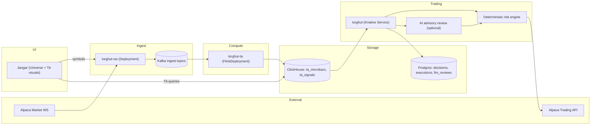

# Torghut Autonomous Trading System (AI-Assisted) - Production Design

## Status
- Version: `v1`
- Last updated: **2026-02-08**
- Source of truth (deployed config): `argocd/applications/torghut/**`

## Purpose
Merge the Torghut v1 design set into a single, execution-oriented design document that is:
- comprehensive enough for implementation and safe extension,
- explicit enough for operations automation (AgentRuns),
- consistent with current code and GitOps manifests.

## Non-negotiable invariants
- Paper is default: `TRADING_MODE=paper`, `TRADING_LIVE_ENABLED=false`.
- Live trading requires explicit enablement and audited change control.
- AI is advisory and must not bypass deterministic gates.
- Alpaca market-data WS has a single-connection constraint per account; `torghut-ws` must remain single active.

## System overview (what runs in production)
Torghut is a streaming market-data and technical-analysis (TA) pipeline with an optional trading loop:
1) `torghut-ws` (Kotlin) connects to Alpaca market-data WebSocket, normalizes/envelopes messages, and publishes to Kafka.
2) `torghut-ta` (Flink) consumes ingest topics, computes microbars and indicators, and writes results to ClickHouse (authoritative TA store).
3) `torghut` (FastAPI, Knative) periodically reads signals from ClickHouse, makes deterministic strategy decisions, optionally requests AI review, applies deterministic risk gates, submits orders to Alpaca (paper/live gated), and persists decisions/executions to Postgres.
4) Jangar provides symbol universe and TA visualization APIs (queries ClickHouse directly).

## Repo map (code + manifests)
- GitOps: `argocd/applications/torghut/**`
- Forwarder: `services/dorvud/websockets/`
- TA job: `services/dorvud/technical-analysis-flink/`
- Trading service: `services/torghut/`
- Jangar Torghut APIs: `services/jangar/src/routes/api/torghut/**`
- Design set index (still useful): `docs/torghut/design-system/README.md`

## Architecture

## Deployed resources (names you can automate against)
Namespace: `torghut`.

- Forwarder:
  - `Deployment/torghut-ws`
  - Probes: `GET /healthz` (liveness), `GET /readyz` (readiness), port `8080`
  - Config: `ConfigMap/torghut-ws-config` (`argocd/applications/torghut/ws/configmap.yaml`)
- TA:
  - `FlinkDeployment/torghut-ta` (primary)
  - Config: `ConfigMap/torghut-ta-config` (`argocd/applications/torghut/ta/configmap.yaml`)
  - Checkpoints/savepoints: configured in `argocd/applications/torghut/ta/flinkdeployment.yaml`
- ClickHouse:
  - `ClickHouseInstallation/torghut-clickhouse`
  - `Service/torghut-clickhouse` ports `8123`/`9000`
  - Auth secret: `Secret/torghut-clickhouse-auth`
- Postgres:
  - `Cluster/torghut-db` (CNPG)
  - App secret: `Secret/torghut-db-app` (DSN under `uri`)
- Trading service:
  - `Service/torghut` (Knative)
  - Probes: `GET /healthz` (liveness/readiness), port `8181`
  - Operational endpoints: `/trading/status`, `/trading/health`, `/trading/decisions`, `/trading/executions`
- Strategy catalog:
  - `ConfigMap/torghut-strategy-config` (mounted into the Knative service at `/etc/torghut/strategies.yaml`)

## Data contracts
Canonical topic and schema reference: `docs/torghut/topics-and-schemas.md`.

Minimum correctness constraints:
- Kafka message key is `symbol` to preserve per-symbol ordering guarantees.
- TA outputs written to ClickHouse are the authoritative signal source for both trading decisions and visualization.
- ClickHouse sink is at-least-once: schema and query patterns must tolerate duplicates (replacing/last-write-wins semantics).

## Component design details (merged)

### WS forwarder (`torghut-ws`)
Code pointers:
- `services/dorvud/websockets/src/main/kotlin/ai/proompteng/dorvud/ws/ForwarderApp.kt`
- `services/dorvud/websockets/src/main/kotlin/ai/proompteng/dorvud/ws/ForwarderConfig.kt`
- `services/dorvud/websockets/src/main/kotlin/ai/proompteng/dorvud/ws/HealthServer.kt`

Readiness definition (what `/readyz` means):
- WS session is authenticated and subscribed (`authOk && subscribedOk`).
- Kafka is reachable (metadata for all configured topics succeeds).
- If trade-updates stream is enabled, it must also be healthy.

As deployed config is in:
- `argocd/applications/torghut/ws/configmap.yaml`
- `argocd/applications/torghut/ws/deployment.yaml`

Failure classification for automation:
- Alpaca 406: usually indicates a second WS connection; recovery is a restart with replicas forced to 1.
- Alpaca 401/403: credential issue; recovery is SealedSecret rotation + restart.
- Kafka SASL/ACL: broker auth issue; recovery is secret/ACL fix + restart.

### Flink TA job (`torghut-ta`)
Code pointers:
- Job entry class: `ai.proompteng.dorvud.ta.flink.FlinkTechnicalAnalysisJobKt`
- Build: `services/dorvud/technical-analysis-flink/` (`uberJar` task in gradle)
- DDL: `services/dorvud/technical-analysis-flink/src/main/resources/ta-schema.sql`

As deployed config is in:
- `argocd/applications/torghut/ta/configmap.yaml` (`TA_*`)
- `argocd/applications/torghut/ta/flinkdeployment.yaml` (Flink + secrets + checkpoint config)

Delivery semantics:
- Kafka is configured with `TA_KAFKA_DELIVERY_GUARANTEE=EXACTLY_ONCE`.
- ClickHouse writes are at-least-once; design assumes duplicates are tolerable.

Known production failure: ClickHouse disk pressure causing JDBC failures and TA job failure.

### ClickHouse (authoritative TA store)
As deployed:
- `Service/torghut-clickhouse` provides HTTP at `8123`.
- User `torghut` password comes from `Secret/torghut-clickhouse-auth`.

Operationally relevant facts:
- PVC sizing is currently small enough to fill (20Gi per replica).
- Keeper metadata loss can flip replicated tables to read-only, requiring `SYSTEM RESTORE REPLICA`.

### Trading service (`torghut`, Knative)
Code pointers:
- API + health: `services/torghut/app/main.py`
- Settings surface area: `services/torghut/app/config.py`
- Trading loop: `services/torghut/app/trading/scheduler.py`
- Risk: `services/torghut/app/trading/risk.py`

Critical env vars (current):
- Safety gates: `TRADING_ENABLED`, `TRADING_MODE`, `TRADING_LIVE_ENABLED`
- Signals: `TRADING_SIGNAL_TABLE`, `TRADING_SIGNAL_LOOKBACK_MINUTES`, `TRADING_SIGNAL_SCHEMA` (supported by code)
- Universe: `TRADING_UNIVERSE_SOURCE`, `TRADING_STATIC_SYMBOLS`, `JANGAR_SYMBOLS_URL`
- ClickHouse dependency checks: `TA_CLICKHOUSE_URL`, `TA_CLICKHOUSE_USERNAME`, `TA_CLICKHOUSE_PASSWORD`, `TA_CLICKHOUSE_CONN_TIMEOUT_SECONDS`
- AI controls: `LLM_ENABLED`, `LLM_SHADOW_MODE`, `LLM_FAIL_MODE`, `LLM_CIRCUIT_*`, `LLM_ADJUSTMENT_ALLOWED`
  `LLM_FAIL_MODE_ENFORCEMENT`, `LLM_FAIL_OPEN_LIVE_APPROVED`

Dependency checks in code:
- `/trading/health` checks Postgres always, and checks ClickHouse + Alpaca only when `TRADING_ENABLED=true`.
- ClickHouse check uses `TA_CLICKHOUSE_URL` and ClickHouse `X-ClickHouse-User`/`X-ClickHouse-Key` headers.

### AI layer (advisory)
Design intent:
- AI can veto or suggest bounded adjustments (if explicitly enabled), but deterministic gates always decide.
- Shadow-first evaluation is the safe default (`LLM_ENABLED=true`, `LLM_SHADOW_MODE=true`).

Controls (from `services/torghut/app/config.py`):
- Circuit breaker: `LLM_CIRCUIT_MAX_ERRORS`, `LLM_CIRCUIT_WINDOW_SECONDS`, `LLM_CIRCUIT_COOLDOWN_SECONDS`
- Failure mode: `LLM_FAIL_MODE` (`veto` vs `pass_through`)
- Live fail-open approval: `LLM_FAIL_OPEN_LIVE_APPROVED` must be true before any live effective fail mode can be
  `pass_through`
- Adjustment allowed: `LLM_ADJUSTMENT_ALLOWED` (default false)
- Policy resolution telemetry: `/trading/status` and `/metrics` expose explicit runtime classification
  (`compliant`, `intentional_exception`, `violation`) for fail-mode posture auditability.
- Stage progression throughput guard: promotion prerequisites require real signal/decision/trade throughput and reject
  no-signal windows (`no_signal_window_detected`) so rollout cannot advance on empty evidence windows.

## Operations as design (automation-ready procedures)
These are part of the production design because they define how the system is safely operated under failure.

Gated actuation runner: use the GitOps-first, confirmation-gated procedures in
`docs/torghut/design-system/v1/operations-actuation-runner.md` for any state-changing automation.

### Procedure: Torghut health report (read-only)
Goal: produce a single report with forwarder, TA, ClickHouse, and trading-service status.

Inputs:
- `namespace=torghut`
- `wsDeployment=torghut-ws`
- `flinkDeployment=torghut-ta`
- `clickhouseService=torghut-clickhouse`
- `cnpgCluster=torghut-db`

Steps:
1) Forwarder:
   - `kubectl -n torghut get deploy/torghut-ws`
   - `kubectl -n torghut get pods -l app=torghut-ws`
   - `kubectl -n torghut logs deploy/torghut-ws --tail=200`
2) TA:
   - `kubectl -n torghut get flinkdeployment/torghut-ta -o yaml`
3) ClickHouse:
   - `kubectl -n torghut get svc/torghut-clickhouse`
4) Postgres:
   - `kubectl -n torghut get cluster.postgresql.cnpg.io/torghut-db`
5) Trading service:
   - `kubectl -n torghut get ksvc torghut`

Outputs:
- A short classification: `healthy | degraded | down`, plus top error cause and the next procedure to run.

### Procedure: Pause trading (GitOps-first)
Goal: stop order submission when data freshness is uncertain.

Steps:
1) Edit `argocd/applications/torghut/knative-service.yaml`:
   - set `TRADING_ENABLED=false` (keep `TRADING_LIVE_ENABLED=false`).
2) Argo sync and verify `ksvc/torghut` stays Ready.

### Procedure: Restart forwarder (`torghut-ws`)
Goal: recover from Alpaca 406, auth failures after rotation, or Kafka connectivity after fixes.

Steps:
1) Ensure `replicas: 1` in `argocd/applications/torghut/ws/deployment.yaml`.
2) GitOps-first restart:
   - bump `kubectl.kubernetes.io/restartedAt` annotation in `argocd/applications/torghut/ws/deployment.yaml`
3) Verify:
   - pod Ready
   - `/readyz` returns 200 (in-cluster probe or port-forward)

### Procedure: Suspend/resume TA (`torghut-ta`)
Goal: stop write pressure during ClickHouse incidents; resume when fixed.

Suspend:
- GitOps-first: set `spec.job.state: suspended` in `argocd/applications/torghut/ta/flinkdeployment.yaml`.

Resume:
- GitOps-first: set `spec.job.state: running` and bump `spec.restartNonce` to force a restart if needed.

Verification:
- `kubectl -n torghut get flinkdeployment torghut-ta`
- ClickHouse `max(event_ts)` advances once running.

### Procedure: TA replay from scratch (destructive)
This is intentionally not “one button”. It deletes Kafka topics and Flink state.

Source procedure: `argocd/applications/torghut/README.md` → **“TA replay workflow (canonical)”** (Mode 2).

Hard requirements:
- trading paused (`TRADING_ENABLED=false`)
- explicit human approval and a recorded reason (ticket/incident)
- confirmed Kafka and MinIO pod names for the current cluster

## AgentRuns integration model (how to make this executable)
AgentRuns primitives live in `charts/agents/crds/agents.proompteng.ai_agentruns.yaml` and docs in `docs/agents/**`.

Recommended automation split:
- Read-only diagnostics: `vcsPolicy.mode=none` (no repo access required) or `read-only` if you need to read repo state.
- Actuation: GitOps PRs with `vcsPolicy.mode=read-write`, then Argo reconcile.

Minimal templates and contracts: see `v1/agentruns-handoff.md`.

## References (deep dives)
This merged doc is the entrypoint; deeper detail remains in the component and policy docs:
- `v1/overview.md`
- `v1/architecture-and-context.md`
- `v1/component-ws-forwarder.md`
- `v1/component-flink-ta-job.md`
- `v1/component-trading-loop.md`
- `v1/ai-layer-overview.md`
- `v1/operations-ta-replay-and-recovery.md`
- `v1/operations-ws-connection-limit-and-auth.md`
- `v1/operations-clickhouse-replica-and-keeper.md`
- `v1/operations-knative-revision-failures.md`
