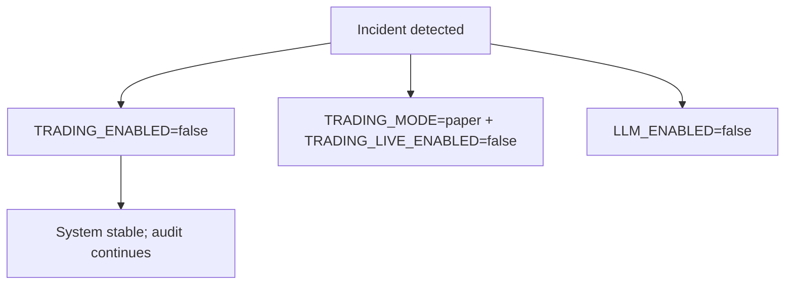

# Trading Safety Kill Switches

## Status
- Version: `v1`
- Last updated: **2026-02-08**
- Source of truth (config): `argocd/applications/torghut/**`

## Purpose
Document the explicit kill switches that allow oncall to rapidly reduce risk during incidents, including:
- stopping trading,
- forcing paper-only mode,
- disabling AI advisory,
- and reducing blast radius while maintaining auditability.

## Non-goals
- “Secret” or undocumented kill switches.
- Using AI as a kill switch.

## Terminology
- **Kill switch:** Deterministic setting that stops risky behavior immediately.
- **Degrade mode:** Keep system running but disable risky operations (e.g., trading).

## Current kill switches (pointers)
- Env settings contract: `services/torghut/app/config.py`
- Deployed values: `argocd/applications/torghut/knative-service.yaml`

## Kill switch model

## Primary switches (v1)
| Switch | Effect | When to use |
| --- | --- | --- |
| `TRADING_ENABLED=false` | stops decision execution loop | any uncertainty about signal correctness or broker state |
| `TRADING_MODE=paper` | forces paper context | default; always during initial rollout |
| `TRADING_LIVE_ENABLED=false` | blocks live mode even if mis-set | safety backstop |
| `LLM_ENABLED=false` | disables AI advisory calls | LLM outages, cost spikes, or suspicious behavior |
| `LLM_SHADOW_MODE=true` | log reviews but do not veto/adjust | evaluation without impact |

## Operational workflow (GitOps)
1) Make kill-switch changes via PR (preferred) or emergency GitOps procedure.
2) Sync ArgoCD.
3) Verify `/trading/status` and audit tables reflect new state.

## Failure modes and recovery
| Failure | Symptoms | Detection | Recovery |
| --- | --- | --- | --- |
| Kill switch not applied | trading continues during incident | audit shows new executions | confirm Argo sync; verify env vars in pod; roll back revision |

## Security considerations
- Kill switches are security controls; restrict who can change them.
- Ensure toggles are audited (Git history + runtime status).

## Decisions (ADRs)
### ADR-35-1: Trading kill switches are configuration-only (no code deploy required)
- **Decision:** All kill switches are controlled through environment/config in GitOps.
- **Rationale:** Fast incident response without rebuilds.
- **Consequences:** Requires careful config review and drift detection.

