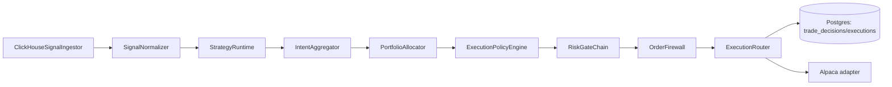

# Flexible Strategy Engine Architecture

## Objective
Replace single-rule signal decisioning with a modular multi-strategy engine that is deterministic, testable,
portfolio-aware, and safe for production promotion.

## Scope
In scope:
- strategy evaluation runtime design,
- strategy intent and portfolio intent contracts,
- orchestration integration with existing scheduler/executor/risk/firewall path,
- failure isolation and observability.

Out of scope:
- broker-specific API details (covered in execution doc),
- ML model training pipelines (covered in backtesting/research docs).

## Current Integration Points
- Orchestrator entrypoint: `services/torghut/app/trading/scheduler.py`
- Existing decision logic: `services/torghut/app/trading/decisions.py`
- Existing features boundary: `services/torghut/app/trading/features.py`
- Strategy config reload: `services/torghut/app/strategies/catalog.py`
- Persistence: `services/torghut/app/models/entities.py`

## Target Runtime Topology

## Components and Contracts

### `SignalNormalizer`
Responsibilities:
- convert raw `SignalEnvelope` into canonical `FeatureVectorV3`,
- enforce feature schema version,
- attach deterministic normalization metadata.

### `StrategyRegistry`
Responsibilities:
- load enabled strategy plugins by `strategy_type` + `version`,
- validate plugin params,
- manage per-plugin warmup and circuit-breaker state.

### `StrategyRuntime`
Responsibilities:
- evaluate all enabled strategies per event,
- emit zero or more `StrategyIntent` objects,
- isolate plugin errors so one strategy failure does not halt cycle.

### `IntentAggregator`
Responsibilities:
- aggregate potentially conflicting intents by symbol/horizon,
- apply precedence and tie-break policy,
- emit normalized symbol-level intent stream.

### `PortfolioAllocator`
Responsibilities:
- map symbol-level intents to account-aware exposure targets,
- apply regime and capacity multipliers,
- emit `PortfolioIntent` traces.

### `RiskGateChain`
Responsibilities:
- preserve deterministic hard guardrails,
- reject/clip intents that violate risk constraints,
- record rejection reasons for postmortem.

### `ExecutionRouter`
Responsibilities:
- map risk-approved intent to broker-neutral `OrderIntent`,
- call active adapter,
- preserve idempotency hash and audit metadata.

## Core Data Contracts

### `StrategyDefinition`
Required fields:
- `strategy_id`
- `strategy_type`
- `version`
- `params`
- `feature_requirements`
- `risk_profile`
- `execution_profile`
- `enabled`

### `StrategyIntent`
Required fields:
- `strategy_id`
- `symbol`
- `direction`
- `confidence`
- `target_notional`
- `horizon`
- `explain`
- `feature_snapshot_hash`

### `PortfolioIntent`
Required fields:
- `symbol`
- `net_target_qty`
- `allocator_trace`
- `regime_label`
- `capacity_bucket`

## Determinism and Reproducibility Rules
- Strategy plugins cannot perform network calls during `on_event`.
- Strategy evaluation uses only declared required features.
- Exact strategy version and parameter hash must be persisted per decision.
- Same event and config replay must reproduce same intent vector.

## Failure Isolation Model
- Plugin runtime exceptions increment plugin error counters and mark strategy as degraded.
- Degraded plugin can be auto-disabled by circuit threshold.
- Scheduler continues with healthy strategies and commits ingest cursor.
- Re-enable requires explicit config update or cooldown expiry.

## Observability and SLO Targets
Metrics:
- `strategy_events_total{strategy_id}`
- `strategy_intents_total{strategy_id}`
- `strategy_errors_total{strategy_id}`
- `strategy_latency_ms{strategy_id}`
- `intent_conflict_total`
- `allocator_reject_total{reason}`

SLO targets:
- p99 strategy evaluation latency < 50ms per symbol batch.
- plugin error ratio < 1% over 15m window.
- no unhandled exception escapes from StrategyRuntime.

## Migration Plan
Phase 1:
- wrap current MACD/RSI logic as `legacy_macd_rsi@1.0.0` plugin.

Phase 2:
- introduce registry + runtime + aggregator with feature-flag fallback to legacy engine.

Phase 3:
- introduce portfolio allocator and regime multipliers.

Phase 4:
- remove hardcoded rule branch from legacy decision engine.

## Acceptance Criteria
- at least 3 strategies run concurrently without scheduler code changes.
- turning a strategy on/off requires only config update.
- runtime supports rollback by pinning older plugin version.
- replay harness reproduces identical intent outputs for fixed fixture input.

## AgentRun Handoff Bundle
- `ImplementationSpec`: `torghut-v3-strategy-runtime-impl-v1`.
- Required keys:
  - `repository`
  - `base`
  - `head`
  - `designDoc`
  - `torghutNamespace`
  - `strategyConfigPath`
- Execution plan:
  - add runtime modules,
  - wire scheduler integration behind feature flag,
  - add tests and metrics,
  - open PR with migration notes.
- Expected artifacts:
  - code changes under `services/torghut/app/trading/**`,
  - tests under `services/torghut/tests/**`,
  - updated strategy config examples under `argocd/applications/torghut/**`.
- Exit criteria:
  - CI green,
  - deterministic replay test pass,
  - fallback to legacy plugin validated.
