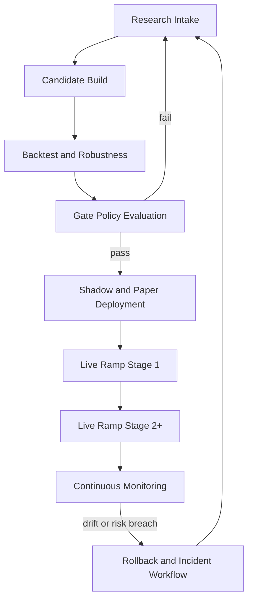

# 01. Autonomous Pipeline DAG Spec

## Objective
Specify the end-to-end executable DAG for autonomous Torghut quant operations, including LLM-assisted steps and
hard deterministic control points.

## In Scope
- stage definitions and stage contracts,
- promotion and rollback branches,
- deterministic checkpoints and failure branches,
- implementation ownership mapping.

## DAG Stages

## Stage Contracts
### Research Intake
Inputs:
- strategy thesis,
- data universe,
- feature hypotheses,
- prior run evidence.

Outputs:
- candidate spec with rationale and expected regime behavior.

### Candidate Build
Inputs:
- candidate spec,
- strategy SDK contract.

Outputs:
- strategy plugin code,
- config entry,
- unit tests,
- parameter schema.

### Backtest and Robustness
Inputs:
- plugin + config,
- versioned dataset snapshot,
- cost model version.

Outputs:
- walk-forward metrics,
- stress metrics,
- reproducibility artifact set.

### Gate Policy Evaluation
Inputs:
- metrics artifacts,
- gate threshold config.

Outputs:
- pass/fail decision,
- machine-readable gate report.

### Shadow and Paper Deployment
Inputs:
- approved candidate,
- deployment config and risk budgets.

Outputs:
- shadow/paper performance,
- TCA metrics,
- drift diagnostics.

### Live Ramp and Continuous Monitoring
Inputs:
- paper-stability evidence,
- live ramp policy.

Outputs:
- staged notional changes,
- compliance evidence,
- incident triggers when needed.

## LLM Integration Boundaries
Allowed:
- summarize experiment evidence,
- propose parameter deltas,
- review decision rationale,
- generate runbook actions for operator approval.

Not allowed:
- direct order submission authority,
- bypass of risk gates,
- ungated live promotion.

## Deterministic Checkpoints
- data schema validation before strategy eval,
- risk guardrail pass before execution routing,
- idempotency hash check before order submission,
- promotion gate pass before stage advancement.

## Agent Implementation Scope (Significant)
Workstream A: DAG control plane
- define stage state machine and transitions in pipeline config.

Workstream B: validation runner
- implement stage precondition/postcondition validators.

Workstream C: branch handlers
- implement fail branch routing, incident branch, and rollback branch.

Workstream D: CI verification
- add DAG dry-run tests and regression checks for transition integrity.

Owned areas:
- `services/torghut/scripts/**`
- `services/torghut/app/trading/**`
- `docs/torghut/design-system/v3/full-loop/**`
- `argocd/applications/torghut/**` (for stage activation flags)

Minimum deliverables:
- executable DAG config,
- stage validator CLI,
- transition test suite,
- operational runbook.

## AgentRun Handoff Bundle
- `ImplementationSpec`: `torghut-v3-loop-dag-impl-v1`.
- Required keys:
  - `repository`
  - `base`
  - `head`
  - `designDoc`
  - `pipelineConfigPath`
  - `artifactPath`
- Expected artifacts:
  - DAG config definition,
  - stage-level validation scripts,
  - CI checks for stage contract completeness.
- Exit criteria:
  - dry run of full DAG succeeds on paper path,
  - gate-fail branch behavior verified,
  - rollback branch validation succeeds.
