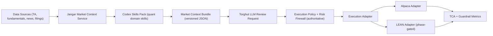

# Jangar Market-Intelligence and LEAN Integration Plan

## Status

- Version: `v1`
- Date: `2026-02-12`
- Maturity: `proposed implementation plan`

## Audit Update (2026-02-26)

- This document's runtime baseline section is historical (`2026-02-12`) and no longer reflects current production state.
- Jangar market-context endpoints are now implemented under `services/jangar/src/routes/api/torghut/market-context/**`.
- LEAN is integrated as a Torghut runtime execution adapter path (`services/torghut/app/trading/execution_adapters.py`,
  `/trading/lean/*` endpoints in `services/torghut/app/main.py`).
- Treat earlier TLS-blocker and "no unified endpoint / no LEAN runtime integration" statements as superseded snapshot notes.

## Objective

Define a production-safe plan to:

- upgrade Jangar's agent environment with market-aware skills (market conditions, news, research, fundamentals, technicals),
- feed that context into Torghut's bounded LLM advisory path,
- integrate LEAN into Torghut as an execution-capable framework without violating existing deterministic risk authority.

Detailed endpoint/loop contract:

- `docs/torghut/design-system/v3/jangar-bespoke-decision-endpoint-and-intraday-loop-design.md`
  Detailed control-plane quant metrics contract:
- `docs/agents/designs/jangar-quant-performance-control-plane.md`

## Current State Baseline (2026-02-12 UTC)

### Live Kubernetes state

- Namespaces `jangar`, `torghut`, and `agents` are active.
- `ksvc/torghut` is ready on revision `torghut-00062`.
- `deployment/jangar` is healthy at `1/1` and running image:
  - `registry.ide-newton.ts.net/lab/jangar:7d5e1219@sha256:efaed2a618759b5307d8006f3c7a954dfdf4e7e46d4eecd040810f18c9e5d8e2`
- `deployment/agents` and `deployment/agents-controllers` are running in namespace `agents`.

### Verified data posture (CNPG + ClickHouse)

From CNPG (`torghut-db`) sampled on `2026-02-12`:

- `trade_decisions_total=2852` (`rejected=2364`, `filled=379`).
- `executions_total=484` (`filled_total=379`).
- `position_snapshots_total=3932`, latest snapshot at `2026-02-11T21:59:28Z`.

From ClickHouse sampled on `2026-02-12`:

- `ta_signals` latest event `2026-02-11T21:58:42Z` with `rows_24h=50450`.
- `ta_microbars` latest `window_end=2026-02-11T21:58:42Z` with `rows_24h=47217`.

### Torghut runtime posture

From live `/trading/status` on `2026-02-12`:

- `mode=paper`, `TRADING_LIVE_ENABLED=false`.
- `TRADING_ENABLED=true`, `TRADING_KILL_SWITCH_ENABLED=false`.
- LLM path enabled in shadow mode (`LLM_SHADOW_MODE=true`).
- Current counters (snapshot):
  - `llm_requests_total=261`
  - `llm_approve_total=254`
  - `llm_veto_total=5`
  - `llm_error_total=2`

### Observed integration blocker

- Jangar Torghut trading endpoints returned `self signed certificate in certificate chain`:
  - `/api/torghut/trading/strategies`
  - `/api/torghut/trading/summary`
    This indicates a Torghut DB TLS trust-chain issue in the current Jangar runtime path and must be resolved before
    market-intel context and quant control-plane dashboards can be considered reliable.

### Evidence collection playbook

- `docs/agents/designs/jangar-torghut-live-analysis-playbook.md`

### Jangar skill/environment posture

- Jangar runtime image already copies repo skills via:
  - `services/jangar/Dockerfile` (`COPY skills/ /root/.codex/skills/`).
- Current `skills/` set is platform/ops focused only:
  - `ansible`, `deployment`, `github`, `kubernetes`, `memories`, `temporal`, etc.
- No dedicated quant skill packs for:
  - market context synthesis,
  - structured news ingestion,
  - fundamentals scoring,
  - technical regime synthesis.

### Data/API surface posture

- Jangar currently exposes Torghut APIs for:
  - symbols (`/api/torghut/symbols`),
  - TA (`/api/torghut/ta/*`),
  - trading summaries (`/api/torghut/trading/*`).
- No unified endpoint yet for a single "decision-time market context bundle".
- Torghut LLM request schema currently has minimal market context:
  - `symbol`, `as_of`, `price`, `spread`, `source`
  - (`services/torghut/app/trading/llm/schema.py`).

### LEAN posture in current design docs

- Existing v3 docs classify LEAN as "benchmark standard" and research lane:
  - `docs/torghut/design-system/v3/oss-library-standard-and-selection.md`
  - `docs/torghut/design-system/v3/backtesting-walkforward-and-research-ledger.md`
- LEAN is not yet integrated as a Torghut runtime execution adapter.

## Gap Analysis

1. Decision context gap:

- LLM advisory path lacks structured, freshness-checked fundamentals/news context.

2. Skills gap:

- Jangar has no domain-specific quant skill contracts to normalize market intelligence.

3. Integration gap:

- No Torghut-to-Jangar contract for "market intelligence snapshot by symbol/time".

4. Execution gap:

- LEAN is documented as benchmark/research, not wired into live Torghut execution contracts.

5. Governance gap:

- No explicit promotion gate that validates "LEAN execution parity vs Torghut native adapter".

## Design Principles

- Deterministic risk and execution firewall remain final authority.
- LLM remains bounded advisory unless explicit gate approvals are satisfied.
- Every decision-time context payload must be versioned, timestamped, and freshness-scored.
- LEAN integration is staged: benchmark -> paper execution -> controlled live canary.
- GitOps-first rollout for all runtime changes.

## Target Architecture



## Workstream 0: Integration trust-chain hardening (prerequisite)

### Why this is first

Current Jangar Torghut trading endpoints fail with TLS chain validation error, so downstream control-plane and
market-intel correctness cannot be trusted until fixed.

### Owned code/config areas

- `argocd/applications/jangar/deployment.yaml`
- `services/jangar/src/server/torghut-trading-db.ts`

### Deliverables

- define and enforce `TORGHUT_DB_DSN` TLS contract (CA trust + SSL mode),
- restore stable `GET /api/torghut/trading/strategies` and `GET /api/torghut/trading/summary`,
- add regression check in Jangar startup/readiness diagnostics.

## Workstream A: Jangar Quant Skill Pack

### Planned skills (new)

- `skills/market-context/SKILL.md`
  - Builds a normalized context bundle for one symbol/time horizon.
- `skills/news-sentiment/SKILL.md`
  - Extracts and scores structured news with source attribution.
- `skills/fundamentals/SKILL.md`
  - Produces normalized fundamentals factors and change deltas.
- `skills/technicals-regime/SKILL.md`
  - Summarizes trend/volatility/liquidity regime from TA series.
- `skills/research-brief/SKILL.md`
  - Produces concise research context with citations and uncertainty.

### Skill output contract (minimum)

Each skill must emit machine-readable JSON with:

- `context_version`
- `as_of_utc`
- `symbol`
- `freshness_seconds`
- `source_count`
- `quality_score` (`0-1`)
- `payload` (domain-specific keys)
- `citations` (URL + published timestamp when available)

### Freshness targets

- Technical/price context: <= 60 seconds stale.
- News context: <= 5 minutes stale.
- Fundamentals context: <= 24 hours stale (or explicit next filing date).
- Any stale/missing domain must be marked and carried into risk flags.

## Workstream B: Jangar Market Context Service

### New API contracts (planned)

- `GET /api/torghut/market-context?symbol=...`
  - Returns merged bundle (technicals + fundamentals + news + regime + quality).
- `GET /api/torghut/market-context/health`
  - Freshness and source-availability diagnostics by domain.

### Owned code/config areas

- `services/jangar/src/server/torghut-market-context.ts` (new)
- `services/jangar/src/routes/api/torghut/market-context.ts` (new)
- `services/jangar/src/routes/api/torghut/market-context/health.ts` (new)
- `argocd/applications/jangar/deployment.yaml` (provider creds/feature flags)
- `services/jangar/src/server/migrations/*` (optional cache/index tables)

### Environment changes (planned)

- Add explicit flags in `argocd/applications/jangar/deployment.yaml`:
  - `JANGAR_MARKET_CONTEXT_ENABLED=true`
  - `JANGAR_MARKET_CONTEXT_CACHE_SECONDS=60`
  - `JANGAR_MARKET_CONTEXT_MAX_STALENESS_SECONDS=300`
- Add secret references for external data providers (no plaintext tokens).

## Workstream C: Torghut LLM Context Upgrade

### Planned Torghut code changes

- Extend LLM schema:
  - `services/torghut/app/trading/llm/schema.py`
  - add nested `market_context` blocks for technicals/fundamentals/news.
- Scheduler integration:
  - `services/torghut/app/trading/scheduler.py`
  - fetch context bundle from Jangar before LLM review.
- Settings:
  - `services/torghut/app/config.py`
  - add typed env vars for context endpoint and stale-data policy.
- Guardrails:
  - `services/torghut/app/trading/llm/guardrails.py`
  - enforce fail-closed or shadow-only behavior when context quality is below threshold.

### Policy behavior

- If market context is unavailable or stale:
  - keep deterministic strategy/risk path active,
  - force LLM shadow or skip depending on configured fail mode,
  - increment guardrail counters with explicit reason labels.

## Workstream D: LEAN Integration for Execution

## Decision

Adopt a staged hybrid model:

- keep existing Torghut execution path as primary during migration,
- introduce a LEAN-backed execution adapter for paper first,
- promote to live only after parity and TCA gates pass.

This preserves current safety invariants while enabling LEAN execution semantics where beneficial.

### Why this is feasible

LEAN is open-source (Apache-2.0), supports local/live deploy workflows, and supports multiple broker integrations.
Primary references:

- [LEAN GitHub repository](https://github.com/QuantConnect/Lean)
- [LEAN engine docs](https://www.quantconnect.com/docs/v2/lean-engine)
- [LEAN supported brokerages](https://www.quantconnect.com/docs/v2/lean-cli/live-trading/brokerages)
- [Alpaca brokerage in LEAN](https://www.quantconnect.com/docs/v2/cloud-platform/live-trading/brokerages/alpaca)

### Planned adapter model

- Introduce `LeanExecutionAdapter` under Torghut execution abstraction:
  - submit/cancel/replace/status against a LEAN runner service.
- Keep `AlpacaExecutionAdapter` and route per policy flag.
- Add parity checker:
  - same `OrderIntent` replayed against both adapters in paper to measure drift.

### Owned code/config areas

- `services/torghut/app/trading/execution_policy.py` (adapter selection hooks)
- `services/torghut/app/trading/reconcile.py` (LEAN status reconciliation path)
- `argocd/applications/torghut/` (LEAN runner deployment/service, feature flags)
- `docs/torghut/design-system/v3/execution-tca-and-broker-abstraction.md` (contract update)

## Phased Rollout Plan

### Phase 0: Baseline hardening (now)

- Capture and freeze baseline metrics for LLM, execution, and rejection reasons.
- Add regression test fixtures for current request/response contracts.
- Fix Torghut DB TLS trust-chain path in Jangar (`self signed certificate` blocker).
  Exit criteria:
- baseline dashboards and metrics snapshots committed as artifacts.
- Jangar trading summary endpoints healthy from in-cluster path.

### Phase 1: Skill pack + context API

- Add new skills and market context API in Jangar.
- Validate freshness/quality scoring and citation outputs.
  Exit criteria:
- API contract tests pass,
- stale-data behavior verified.

### Phase 2: Torghut context consumption (shadow)

- Torghut consumes context bundle in LLM request building.
- LLM remains shadow-only.
  Exit criteria:
- no increase in rejection errors from schema/validation failures,
- guardrail metrics stable for 7 consecutive days.

### Phase 3: LEAN adapter in paper mode

- Deploy LEAN runner and wire `LeanExecutionAdapter`.
- Run parity testing vs Alpaca adapter on same intents.
  Exit criteria:
- parity pass thresholds met,
- no idempotency regressions,
- TCA within allowed drift budget.

### Phase 4: Controlled live canary

- Enable LEAN adapter for a narrow symbol/account subset.
- Keep immediate rollback path to native adapter.
  Exit criteria:
- canary SLOs green for agreed window,
- explicit approval token and governance sign-off.

## Risk Register

- Data quality risk:
  - Mitigation: freshness and quality scoring in every context payload.
- Hallucinated/unverified news synthesis:
  - Mitigation: citation-required outputs + source whitelist policy.
- LEAN operational complexity:
  - Mitigation: paper-only parity phase and strict rollback toggles.
- Policy bypass risk:
  - Mitigation: risk engine and firewall remain authoritative submit gate.

## Verification and Rollback

### Verification commands (representative)

```bash
kubectl get ksvc -n torghut torghut
kubectl get deploy -n jangar jangar
kubectl get deploy -n torghut torghut-llm-guardrails-exporter
kubectl logs -n torghut deploy/torghut --tail=200
kubectl logs -n jangar deploy/jangar --tail=200
```

### Rollback controls

- Disable new context path in Torghut:
  - `TRADING_MARKET_CONTEXT_ENABLED=false` (planned env)
- Disable LEAN adapter routing:
  - `TRADING_EXECUTION_ADAPTER=alpaca` (planned env)
- Revert GitOps manifests in:
  - `argocd/applications/jangar/`
  - `argocd/applications/torghut/`

## AgentRun Handoff Bundle

- `ImplementationSpec`: `torghut-v3-jangar-market-intel-lean-impl-v1`
- Required keys:
  - `repository`
  - `base`
  - `head`
  - `jangarNamespace`
  - `torghutNamespace`
  - `gitopsPath`
  - `designDoc`
- Expected artifacts:
  - skill pack files under `skills/`,
  - Jangar market-context API endpoints + tests,
  - Torghut LLM context contract update + tests,
  - LEAN adapter scaffold + parity test report.
- Exit criteria:
  - Phase 1-3 exit criteria complete in paper/shadow,
  - no deterministic risk-control regressions,
  - rollback path verified by rehearsal.
