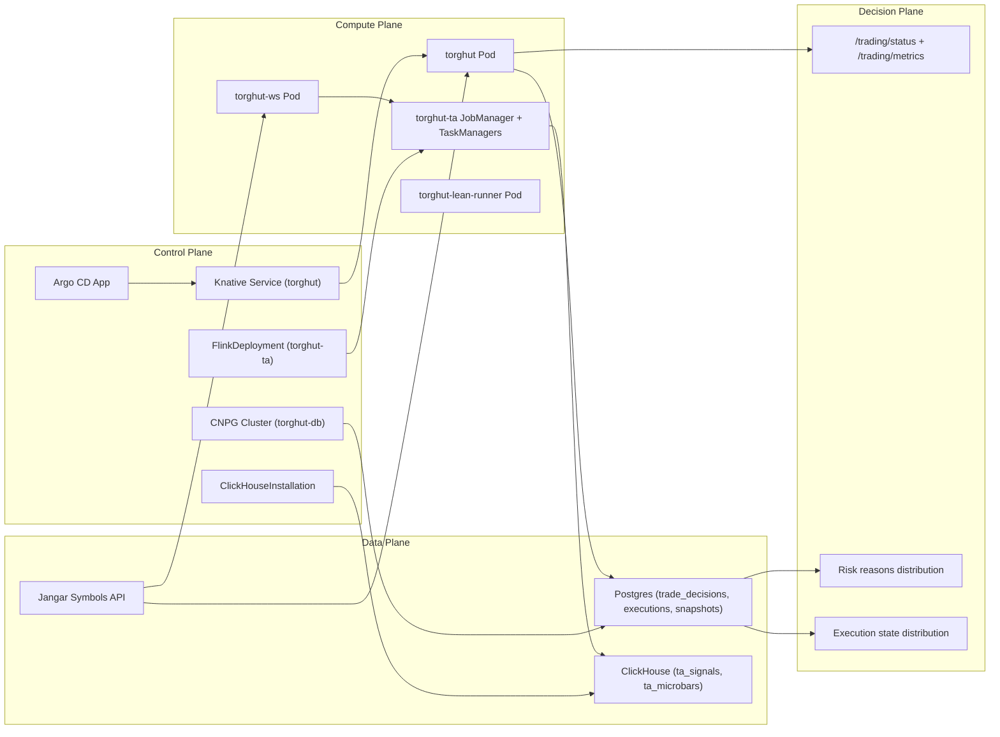
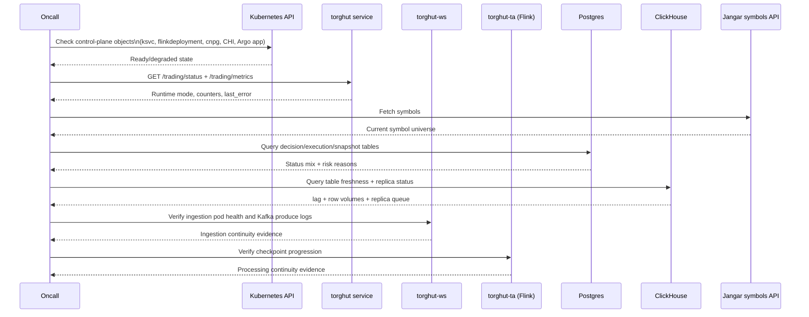
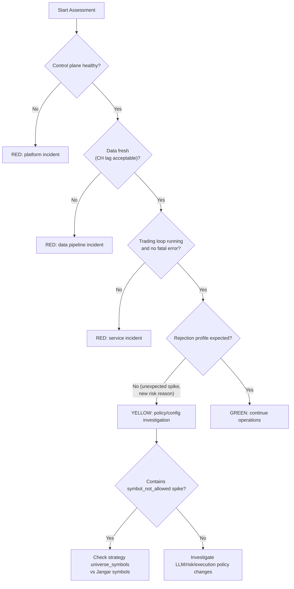

# Torghut System Snapshot Design (Human Review)

## Purpose
Define what a "system snapshot" means for Torghut, how to interpret it, and how to use it for operational decisions.

This document is the design contract behind:
- `current-state-snapshot-2026-02-12.md`
- `system-state-assessment-runbook.md`

## Design Goals
- Single-page operational truth for current state.
- Clear separation between observed facts and interpretation.
- Fast triage path from symptom to affected layer.
- Human-review friendly structure with diagrams and explicit probes.

## Snapshot Model
The snapshot is a four-plane model:
- Control plane: orchestration and rollout state.
- Compute plane: workload readiness and revisions.
- Data plane: storage health, freshness, and throughput.
- Decision plane: trading loop behavior and rejection composition.

## Assessment Workflow Design
The workflow is intentionally staged so failures are localized quickly.

## State Classification Logic

## Data Contract for a Snapshot Artifact
Each snapshot should capture:
- Metadata:
  - capture window (UTC),
  - operator identity,
  - command bundle version.
- Control plane facts:
  - ksvc revision + readiness,
  - Argo sync/health,
  - Flink/CNPG/ClickHouse operator status.
- Compute plane facts:
  - pod/deployment readiness and restart counts.
- Data plane facts:
  - Postgres table counts and recent status distribution,
  - ClickHouse row counts, freshness lag, and replica health.
- Decision plane facts:
  - `/trading/status` runtime posture,
  - top rejection reasons,
  - universe consistency verification.

## Interpretation Rules
- Snapshot facts are time-bound and must include exact UTC timestamps.
- Any inferred conclusion must be explicitly labeled as interpretation.
- If control plane availability is intermittent, confidence in all concurrent probes is reduced and must be noted.

## Review Checklist
- Are all four planes represented?
- Are timestamps explicit and recent?
- Are probe commands reproducible?
- Is drift called out (`OutOfSync`, manual patch risk)?
- Are next actions mapped to concrete owners?

## Relationship to Existing v1/v3 Docs
- v1 docs remain source of truth for component-level recovery runbooks.
- This v3 design defines the operational "snapshot grammar" used to summarize current state quickly for human reviewers.

