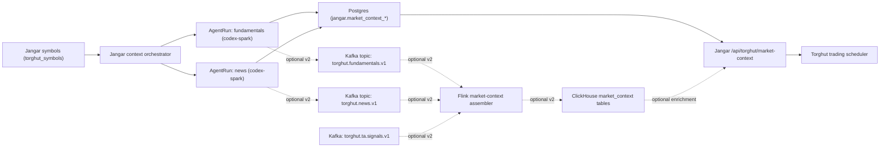

# Torghut Fundamentals + News via Codex Agent Provider (`gpt-5.3-codex-spark`)

## Status

- Date: `2026-02-26`
- Maturity: `production design + rollout plan`
- Scope: replace unconfigured fundamentals/news providers with in-cluster Codex AgentRuns using `gpt-5.3-codex-spark`, with a core HTTP integration path first and optional streaming/analytics expansion

## Objective

Deliver production-grade fundamentals and news context for Torghut by:

1. generating domain context with Codex agents (Spark model),
2. materializing authoritative latest-state in Jangar Postgres for deterministic reads,
3. preserving the existing Torghut consumption contract (`GET /api/torghut/market-context` via Jangar),
4. optionally adding Kafka/Flink/ClickHouse for replay, scale, and analytics after v1 stability.

## Verified Current State (Live Audit, 2026-02-26)

### 1. Torghut consumes Jangar market context, not direct fundamentals/news services

- Torghut runtime points to:
  - `TRADING_MARKET_CONTEXT_URL=http://jangar.jangar.svc.cluster.local/api/torghut/market-context/`
  - `TRADING_MARKET_CONTEXT_REQUIRED=true`
  - `TRADING_MARKET_CONTEXT_FAIL_MODE=shadow_only`
  - `LLM_MODEL=gpt-5.3-codex-spark`
- Verified from live `ksvc/torghut` env.

### 2. Jangar market-context is currently degraded due missing fundamentals/news configuration

- `GET /api/torghut/market-context/health?symbol=NVDA` from the live Jangar pod reports:
  - `overallState: degraded`
  - `providerHealth[].configured=false` for `fundamentals` and `news`
  - `technicals` and `regime` state `ok` (ClickHouse ingest healthy)
- Current URL env vars are optional secret refs:
  - `JANGAR_MARKET_CONTEXT_FUNDAMENTALS_URL` <- `secret/jangar-market-context-providers:fundamentals_url`
  - `JANGAR_MARKET_CONTEXT_NEWS_URL` <- `secret/jangar-market-context-providers:news_url`

### 3. Agent provider exists, but default model is not Spark

- Live `AgentProvider/codex` writes `/root/.codex/config.toml` with:
  - `model = "gpt-5.3-codex"`
- Therefore fundamentals/news AgentRuns need a new provider (or equivalent model override path) to guarantee Spark.

### 4. ClickHouse dataplane is healthy and fresh for TA, but has no fundamentals/news tables

- `torghut.ta_signals` latest lag observed: ~`2s` (healthy).
- Existing user tables in DB `torghut`: `ta_microbars`, `ta_signals`.
- No dedicated fundamentals/news context tables currently exist.

### 5. Kafka and Flink are healthy and ready for extension

- Kafka (Strimzi) topics are healthy for Torghut TA/trading pipelines.
- No existing `torghut.fundamentals.*` or `torghut.news.*` topics.
- Flink `torghut-ta` is `RUNNING`; checkpoints are completing and externalized to S3.
- Flink can be extended via a separate low-risk job instead of modifying TA core path first.

### 6. Postgres has no current fundamentals/news market-context state store

- `torghut` Postgres has trading/whitepaper tables; no fundamentals/news context tables.
- `jangar` Postgres has control-plane schemas and `torghut_symbols`, but no context-domain tables.

## Non-Negotiable Invariants

- Paper/shadow-first; deterministic gates remain final authority.
- Market-context contract version remains `torghut.market-context.v1`.
- Fundamentals/news generation failures must degrade context, not silently pass as healthy.
- No direct, ad-hoc cluster mutations in steady-state operation; GitOps is primary path.
- Agent model for fundamentals/news must be pinned to `gpt-5.3-codex-spark`.

## Implementation Profiles

### Core v1 (required)

- Torghut <-> Jangar remains HTTP (`TRADING_MARKET_CONTEXT_URL`).
- Jangar orchestrates Codex AgentRuns and stores latest fundamentals/news in Postgres.
- No Kafka/Flink/ClickHouse dependency for correctness.

### Stream v2 (optional)

- Add Kafka event streams, Flink stateful assembly, and ClickHouse analytical materialization.
- Use only after Core v1 is stable and SLO-compliant.

## Target Architecture



## Integration Design by System

### Kubernetes (`kubectl` / GitOps)

Add resources under `argocd/applications/agents` and `argocd/applications/torghut`:

1. `AgentProvider/codex-spark`
   - clone of current `codex` provider with `model = "gpt-5.3-codex-spark"`.
2. `Agent/codex-fundamentals-agent` and `Agent/codex-news-agent`
   - `providerRef.name: codex-spark`
   - dedicated system prompts and secret bindings.
3. `ImplementationSpec` pair:
   - `torghut-fundamentals-context-v1`
   - `torghut-news-context-v1`
4. Jangar deployment env extensions:
   - scheduler cadence knobs
   - control-plane feature flag `JANGAR_MARKET_CONTEXT_AGENTS_ENABLED`.
5. Optional Stream v2 env (disabled by default):
   - Kafka producer settings (bootstrap, auth secret refs, topic names)
   - stream publish toggle and batch/timeout controls.

### Postgres

Use `jangar` DB for operational truth and idempotency:

1. `torghut_control_plane.market_context_domain_runs`
   - run lifecycle, agentrun name/uid, symbol, domain, status, timing, failure reason.
2. `torghut_control_plane.market_context_domain_latest`
   - one latest row per (`symbol`, `domain`) with normalized payload and quality/freshness fields.
3. Optional Stream v2: `torghut_control_plane.market_context_publish_offsets`
   - exactly-once Kafka publish checkpointing/idempotency keys.

Why Jangar DB:

- aligns with existing agent/control-plane ownership,
- gives deterministic low-latency reads for the market-context API,
- keeps Torghut integration independent of stream processors.

### Kafka

Not required for Core v1.

Optional Stream v2 topics in `argocd/applications/kafka/torghut-topics.yaml`:

1. `torghut.fundamentals.v1`
2. `torghut.news.v1`
3. `torghut.market-context.status.v1` (optional compacted status stream)

Suggested config:

- `partitions: 3` (match symbol parallelism)
- `replicas: 3`
- `compression.type: lz4`
- `cleanup.policy: delete` for domain event topics
- `cleanup.policy: compact,delete` for status topic

Create a dedicated `KafkaUser` (least privilege), for example `jangar-market-context`.

### Flink

Not required for Core v1.

Optional Stream v2 introduces a separate job (`torghut-market-context-flink`) rather than changing `torghut-ta`:

Inputs:

- `torghut.fundamentals.v1`
- `torghut.news.v1`
- `torghut.ta.signals.v1` (optional join for technical/regime coherence signal)

Responsibilities:

- event-time freshness computation,
- latest-by-symbol/domain consolidation,
- optional quality smoothing and missing-data alarms,
- sink to ClickHouse `market_context_*` tables with exactly-once semantics.

This keeps TA job blast radius low while allowing stateful stream assembly when needed.

### ClickHouse

Not required for Core v1.

Optional Stream v2 adds tables in `torghut` DB:

1. `market_context_domain_events`
   - append log of normalized fundamentals/news events.
2. `market_context_latest`
   - replacing table keyed by (`symbol`, `domain`) with latest enriched view.

Jangar endpoint read path:

- primary: Postgres `market_context_domain_latest` (authoritative control-plane state),
- optional enrichment: ClickHouse `market_context_latest` for analytics/freshness overlays.

## Contract Design

### Agent output artifact (both domains)

Each run must emit JSON:

```json
{
  "contextVersion": "torghut.market-context.v1",
  "domain": "fundamentals",
  "symbol": "NVDA",
  "asOfUtc": "2026-02-26T19:40:00Z",
  "sourceCount": 6,
  "qualityScore": 0.82,
  "payload": {},
  "citations": [
    { "source": "sec", "publishedAt": "2026-02-25T21:00:00Z", "url": "https://..." }
  ],
  "riskFlags": []
}
```

Notes:

- `domain` is `fundamentals` or `news`.
- `qualityScore` must be clamped to `[0,1]`.
- invalid/missing timestamps are rejected as failed runs.

### AgentRun parameter contract

Required keys:

- `symbol`
- `asOfUtc`
- `domain`
- `artifactPath`
- `qualityPolicyRef`
- `citationPolicyRef`

### Jangar market-context endpoint compatibility

No contract break for Torghut:

- keep `GET /api/torghut/market-context/` response shape unchanged,
- keep `GET /api/torghut/market-context/health` semantics unchanged (`ok|degraded|down`),
- map missing domains to existing `*_missing` risk flags.

## Operational Flow

1. Scheduler picks active symbols from `torghut_symbols` (equity/crypto class aware).
2. Jangar submits two AgentRuns per symbol cadence:
   - fundamentals (slower cadence, e.g. 15m-60m),
   - news (faster cadence, e.g. 30s-120s).
3. On completion, Jangar validates artifact JSON and upserts Postgres latest rows.
4. Jangar serves fundamentals/news domains directly from Postgres in `/api/torghut/market-context`.
5. Torghut continues to consume that API without contract change.
6. Optional Stream v2: publish to Kafka -> process in Flink -> materialize to ClickHouse.

## Observability, SLOs, and Alerts

### SLOs

- `fundamentals` freshness p95 <= `24h` (or filing-event aware equivalent).
- `news` freshness p95 <= `300s`.
- AgentRun success rate >= `99%` per rolling hour.
- Optional Stream v2: end-to-end publish lag (AgentRun completion -> Kafka -> ClickHouse latest) p95 <= `30s`.

### Metrics to add

- Jangar:
  - `jangar_market_context_agentrun_submitted_total{domain}`
  - `jangar_market_context_agentrun_failed_total{domain,reason}`
  - `jangar_market_context_domain_freshness_seconds{domain,symbol}`
- Optional Stream v2:
  - `jangar_market_context_kafka_publish_latency_seconds`
  - Flink watermark lag / checkpoint failure counters
  - ClickHouse lag for `market_context_domain_events` and `market_context_latest`.

### Alert examples

- `news` stale > `600s` for > `5m` -> warning.
- `fundamentals` stale > `36h` -> warning.
- any domain `error` state ratio > `10%` over `10m` -> critical.

## Security and Policy

- Use dedicated SecretBinding for new agents (`codex-fundamentals-secrets`, `codex-news-secrets`).
- Restrict allowed secrets to minimal set (`codex-auth`, optional provider/API keys).
- Add explicit approval policy labels for any write-capable AgentRun flows.
- Keep `vcsPolicy.mode=none` for pure data-context runs (no PR needed).

## Rollout Plan (Production Quality)

### Phase 0: Bootstrap (no traffic impact)

1. Add `codex-spark` AgentProvider and new agents/specs.
2. Add Postgres schema + migrations.
3. Deploy Jangar scheduler code behind disabled feature flag.

Exit gates:

- CRDs Ready in `agents` namespace.
- Migration applied cleanly.

### Phase 1: Core v1 canary and cutover

1. Enable AgentRuns for a 3-symbol canary (`NVDA`, `MSFT`, `AAPL`).
2. Keep legacy URL provider mode as fallback for one release.
3. Compare quality/freshness against manual samples.
4. Validate Torghut market-context behavior in shadow mode.

Exit gates:

- >= `99%` successful runs for 24h.
- No malformed artifacts.
- Jangar health `overallState=ok` for active symbols,
- no increase in `market_context_domain_error`.

### Phase 2: Scale-out

1. Expand to full symbol universe.
2. Tune cadence and concurrency.
3. Remove legacy external URL configuration once stable.

### Phase 3 (Optional): Stream v2 integration

1. Add Kafka topics and KafkaUser.
2. Enable Kafka publish for canary symbols.
3. Enable `torghut-market-context-flink` canary job.
4. Add ClickHouse materialized/latest tables for analytics.

Exit gates:

- checkpoint health stable,
- no sustained consumer lag alarms,
- ClickHouse freshness meets Stream v2 SLO.

## Rollback Plan

- Toggle `JANGAR_MARKET_CONTEXT_AGENTS_ENABLED=false`.
- Re-enable legacy URL provider mode (`JANGAR_MARKET_CONTEXT_FUNDAMENTALS_URL`, `...NEWS_URL`) if required.
- Optional Stream v2 rollback: pause Flink context job and disable Kafka publish.
- Maintain Torghut deterministic trading path unchanged.

## Validation Commands (Runbook Snippets)

Kubernetes:

```bash
kubectl -n agents get agentprovider,agent,implementationspec
kubectl -n jangar get deploy jangar -o yaml | rg JANGAR_MARKET_CONTEXT
kubectl -n torghut get ksvc torghut -o yaml | rg TRADING_MARKET_CONTEXT
```

Postgres:

```bash
kubectl cnpg psql -n jangar jangar-db -- jangar -c \
  "select table_schema, table_name from information_schema.tables where table_schema='torghut_control_plane';"
```

Optional Stream v2 only - Kafka:

```bash
kubectl -n kafka get kafkatopic | rg 'torghut.(fundamentals|news|market-context)'
kubectl -n kafka get kafkauser jangar-market-context -o yaml
```

Optional Stream v2 only - Flink:

```bash
kubectl -n torghut get flinkdeployment
kubectl -n torghut port-forward svc/torghut-market-context-rest 18082:8081
curl -s http://127.0.0.1:18082/jobs/overview
```

Optional Stream v2 only - ClickHouse:

```bash
# Use torghut-clickhouse auth secret + clickhouse-client in pod
SELECT max(event_ts), count() FROM torghut.market_context_domain_events;
SELECT symbol, domain, asOfUtc FROM torghut.market_context_latest ORDER BY asOfUtc DESC LIMIT 50;
```

## Acceptance Criteria

- Torghut market-context no longer reports `fundamentals_missing`/`news_missing` due unconfigured providers for active symbols.
- Agent model pin for fundamentals/news is provably `gpt-5.3-codex-spark`.
- Core v1 pipeline (AgentRun -> Postgres -> Jangar API -> Torghut) is observable and meets SLOs.
- Optional Stream v2, if enabled, meets stream SLOs and does not regress Core v1 behavior.
- Runbooks and rollback are validated in staging before production promotion.
