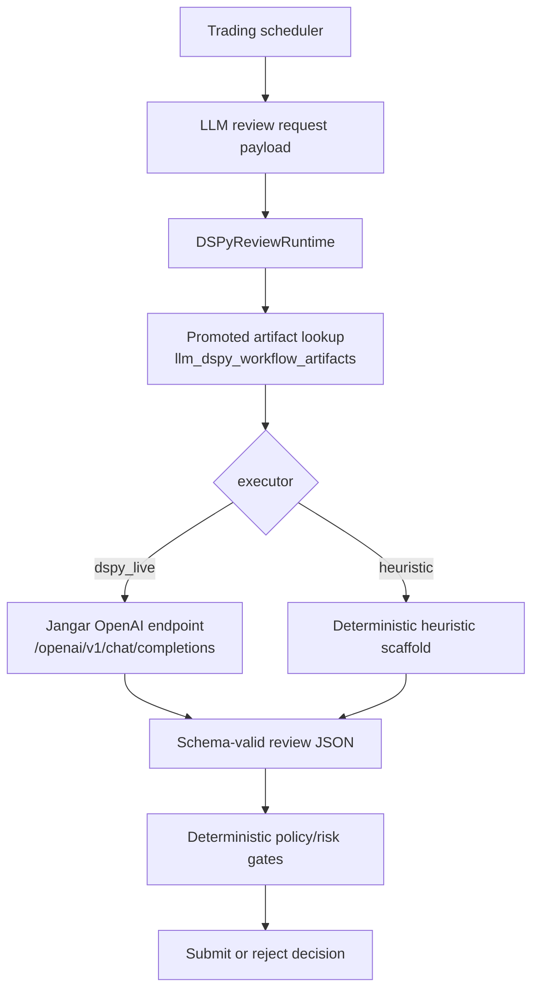

# Torghut DSPy over Jangar OpenAI Endpoint: Full Production Rollout

## Status

- Date: `2026-02-27`
- Maturity: `production design + implementation plan`
- Scope: finalize DSPy runtime as the only LLM review path, route DSPy live inference through Jangar OpenAI-compatible completions (`gpt-5.3-codex-spark`), and remove legacy runtime LLM call paths without feature-flag gating

## Objective

Complete the DSPy rollout so Torghut trading review is production-operational with:

1. DSPy runtime as the only LLM execution path for trade review.
2. DSPy live model calls routed through Jangar OpenAI-compatible endpoint.
3. Auto dataset-build, compile/tune, eval, and promote cycles through AgentRuns.
4. No runtime feature-flag gating branch for legacy-vs-DSPy behavior.

## Verified Current State (2026-02-27)

### 1. Dual-path review runtime still exists

- DSPy runtime path exists: `services/torghut/app/trading/llm/dspy_programs/runtime.py`.
- Legacy runtime LLM path still exists and is reachable as fallback:
  - `services/torghut/app/trading/llm/review_engine.py`
  - `services/torghut/app/trading/llm/client.py`

### 2. Current live DSPy artifact is bootstrap heuristic

- Live `LLM_DSPY_ARTIFACT_HASH` is `df087a5e643d6478b1ebe51bf44ad2d0e2228825c1c0a8e9dc345729d6a3bbff`.
- This equals `DSPyReviewRuntime.bootstrap_artifact_hash()` in runtime code.
- Result: live "DSPy active" posture does not imply tuned `dspy_live` executor.

### 3. Jangar is already configured as review gateway for legacy path

- Torghut runtime env includes:
  - `JANGAR_BASE_URL=http://jangar.jangar.svc.cluster.local`
  - `LLM_PROVIDER=jangar`
  - `LLM_MODEL=gpt-5.3-codex-spark`
- Legacy review path calls Jangar `POST /openai/v1/chat/completions`.

### 4. DSPy workflow persistence and lane contracts exist

- Artifact lineage table exists: `llm_dspy_workflow_artifacts`.
- Workflow lane scaffolding exists in:
  - `services/torghut/app/trading/llm/dspy_compile/workflow.py`
  - `argocd/applications/agents/torghut-agentruns.yaml`

## Non-Negotiable Invariants

- `paper` remains the default trading mode.
- Deterministic risk and execution policy gates remain final authority.
- DSPy output is advisory and cannot bypass deterministic controls.
- Promotion decisions require reproducible artifact and eval evidence.
- Rollback must be possible by revision/image/artifact re-pin without downtime windows.

## Target Architecture

### Runtime decision path

1. Scheduler builds review request payload.
2. Review engine calls DSPy runtime only.
3. DSPy runtime resolves validated artifact manifest.
4. `dspy_live` executor uses Jangar OpenAI-compatible endpoint with spark model.
5. Runtime errors/timeouts use deterministic local fallback response (no legacy network LLM call path).

## Runtime API and Configuration Contract

### Required runtime contract

- `JANGAR_BASE_URL`
- `LLM_MODEL` (pinned to `gpt-5.3-codex-spark`)
- `LLM_DSPY_ARTIFACT_HASH`
- `LLM_DSPY_PROGRAM_NAME`
- `LLM_DSPY_SIGNATURE_VERSION`
- `LLM_DSPY_TIMEOUT_SECONDS`
- `LLM_DSPY_COMPILE_METRICS_POLICY_REF`
- `LLM_DSPY_SECRET_BINDING_REF`
- `LLM_DSPY_AGENTRUN_TTL_SECONDS`

`JANGAR_API_KEY` remains optional and is not required by this rollout contract.

### Deprecated in runtime decision path

- `LLM_PROVIDER`
- `LLM_SELF_HOSTED_BASE_URL`
- `LLM_SELF_HOSTED_MODEL`
- `LLM_SELF_HOSTED_API_KEY`
- `LLM_ENABLED`
- `LLM_DSPY_RUNTIME_MODE`

## AgentRun Lane Contract (DSPy Lifecycle)

Required implementation specs:

1. `torghut-dspy-dataset-build-v1`
2. `torghut-dspy-compile-mipro-v1`
3. `torghut-dspy-eval-v1`
4. `torghut-dspy-gepa-experiment-v1` (optional experimental lane)
5. `torghut-dspy-promote-artifact-v1`

Promotion gate policy (minimum):

1. schema validity >= `99.5%`
2. reproducible artifact hash
3. gate compatibility = `pass`
4. deterministic gate bypass count = `0`
5. post-promotion runtime timeout/fallback <= `5%` in initial observation window

## Implementation Plan

### Phase 1: Remove legacy runtime LLM path

Owned files:

- `services/torghut/app/trading/llm/review_engine.py`
- `services/torghut/app/trading/llm/client.py`
- `services/torghut/app/trading/llm/dspy_programs/runtime.py`
- `services/torghut/app/config.py`

Work:

1. remove legacy `LLMClient` invocation branches from runtime decision flow.
2. make DSPy runtime invocation mandatory for reviewed decisions.
3. keep deterministic local fallback response object for runtime failures.
4. route `dspy_live` LM transport to Jangar endpoint contract.

### Phase 2: Auto tune + eval + promote hardening

Owned files:

- `services/torghut/app/trading/llm/dspy_compile/workflow.py`
- `argocd/applications/agents/torghut-agentruns.yaml`
- `config/trading/llm/dspy-metrics.yaml`

Work:

1. enforce MIPROv2 as default compile/tune optimizer lane.
2. require eval gate pass before promotion write.
3. schedule periodic runs (for example every 6h) and trigger on drift/fallback anomalies.
4. persist full lineage payloads in `llm_dspy_workflow_artifacts`.

### Phase 3: GitOps contract cleanup

Owned files:

- `argocd/applications/torghut/knative-service.yaml`
- related configmaps/secrets env references

Work:

1. remove deprecated runtime env knobs from service manifests.
2. pin active artifact to first passing `dspy_live` promoted artifact.
3. keep Jangar endpoint and spark model pin explicit.

### Phase 4: Production traffic rollout

Work:

1. deploy as new Knative revision.
2. validate at low traffic split.
3. shift to 100% after SLO checks.
4. maintain instant rollback via revision rollback and artifact re-pin.

## Test and Verification Plan

### Unit and integration

1. runtime uses DSPy path only; legacy client branch removed.
2. `dspy_live` path emits Jangar-compatible request shape and handles SSE/content parsing behavior via DSPy LM stack.
3. runtime exceptions produce deterministic fallback output with metadata annotation.
4. failed eval blocks promote lane.

### Live smoke

1. new `llm_decision_reviews` rows show DSPy model lineage.
2. no new rows indicate legacy runtime model branch usage.
3. non-zero DSPy review volume on live signal flow.
4. no regression in deterministic gate rejection behavior.

### CI gates

For `services/torghut` changes, require local success before PR merge:

1. `uv sync --frozen --extra dev`
2. `uv run --frozen pyright --project pyrightconfig.json`
3. `uv run --frozen pyright --project pyrightconfig.alpha.json`
4. `uv run --frozen pyright --project pyrightconfig.scripts.json`

## Observability and Alerting

Required dashboards/alerts:

1. DSPy runtime call volume, timeout rate, failure rate, fallback rate.
2. artifact hash currently active vs last promoted hash.
3. eval gate pass/fail over time.
4. market-context quality/freshness and LLM block reasons.
5. deterministic gate outcomes to verify no control bypass.

## Risk Register

1. Jangar OpenAI-compat mismatch with DSPy LM transport.
   - Mitigation: transport contract tests against Jangar endpoint before rollout.
2. optimizer overfit and unstable promotion cycles.
   - Mitigation: rolling holdout windows, reproducibility hash enforcement, and strict eval gates.
3. runtime latency spikes from DSPy live calls.
   - Mitigation: bounded timeout and deterministic local fallback.

## Rollback Strategy

1. shift Knative traffic back to prior stable revision.
2. re-pin prior promoted artifact hash in GitOps.
3. validate trading loop and gate metrics post-rollback.
4. publish incident note with trigger, impact, and corrective action.

## Exit Criteria (Full Rollout Complete)

1. DSPy-only runtime path deployed and stable.
2. legacy runtime LLM call path removed from review engine.
3. Jangar endpoint + spark model confirmed for `dspy_live` runtime inference.
4. at least one successful dataset-build -> compile/tune -> eval -> promote cycle completed in production.
5. GitOps manifests reflect deployed runtime behavior without drift.

## References

- Existing DSPy adoption baseline:
  - `docs/torghut/design-system/v5/12-dspy-framework-adoption-for-quant-llm-autonomous-trading-2026-02-25.md`
- Existing fundamentals/news Spark pipeline baseline:
  - `docs/torghut/design-system/v5/13-fundamentals-news-codex-spark-agent-pipeline-2026-02-26.md`
- Runtime code anchors:
  - `services/torghut/app/trading/llm/review_engine.py`
  - `services/torghut/app/trading/llm/client.py`
  - `services/torghut/app/trading/llm/dspy_programs/runtime.py`
  - `services/torghut/app/trading/llm/dspy_compile/workflow.py`
- DSPy docs:
  - [Language Models](https://dspy.ai/learn/programming/language_models/)
  - [Modules](https://dspy.ai/learn/programming/modules/)
  - [Optimizers](https://dspy.ai/learn/optimization/optimizers/)
  - [Evaluate](https://dspy.ai/api/evaluation/Evaluate/)
  - [MIPROv2](https://dspy.ai/api/optimizers/MIPROv2/)
  - [Saving and Loading](https://dspy.ai/tutorials/saving/)
