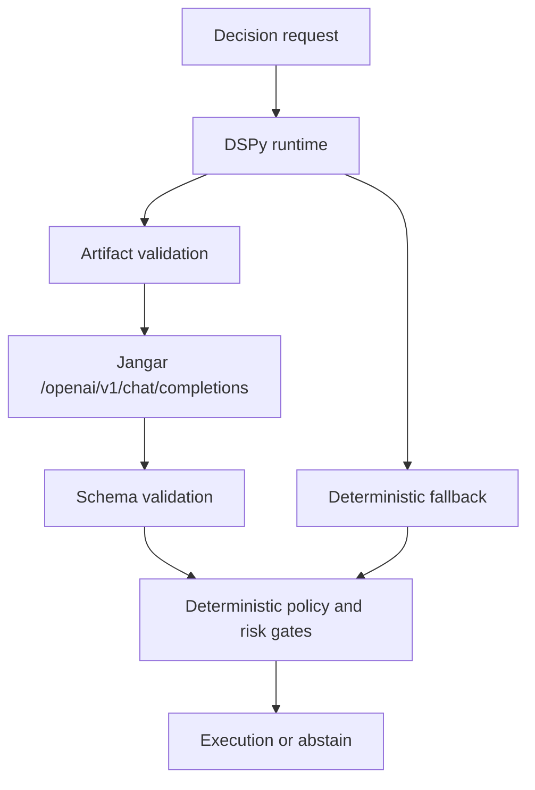

# DSPy LLM Decision Layer over Jangar

## Status

- Doc: `v6/03`
- Date: `2026-02-27`
- Maturity: `production design`
- Scope: production LLM decision architecture using DSPy programs, Jangar OpenAI-compatible inference, and deterministic safety integration

## Objective

Standardize all live Torghut LLM decision reasoning on:

1. DSPy program runtime with versioned artifacts,
2. Jangar OpenAI-compatible endpoint transport,
3. spark model pinning for live inference,
4. deterministic fallback when DSPy runtime fails.

## Non-Negotiable Rules

- No legacy runtime network LLM path remains in the final decision flow.
- No feature-flag branch that can bypass DSPy in normal operation.
- DSPy output is advisory only and must pass deterministic controls.
- Every LLM decision row must carry program/artifact lineage.

## Serving Path

## Program Topology

Suggested DSPy modules:

1. `SignalSynthesisModule`
2. `CounterThesisModule`
3. `RiskCriticModule`
4. `DecisionSchemaModule`

Final output schema (simplified):

- `intent`
- `confidence`
- `rationale`
- `riskFlags`
- `abstainReason`
- `citations`

## Runtime Triggering

DSPy advisory is called when:

1. slow-path trigger conditions are met, or
2. configured policy requires LLM critique for specific strategy classes.

For fast-path-only decisions, the system may skip LLM invocation but still emits explicit metadata (`llmSkipped=true`, reason).

## Configuration Contract

Required runtime env:

- `JANGAR_BASE_URL`
- `LLM_MODEL=gpt-5.3-codex-spark`
- `LLM_DSPY_ARTIFACT_HASH`
- `LLM_DSPY_PROGRAM_NAME`
- `LLM_DSPY_SIGNATURE_VERSION`
- `LLM_DSPY_TIMEOUT_SECONDS`
- `LLM_DSPY_COMPILE_METRICS_POLICY_REF`
- `LLM_DSPY_SECRET_BINDING_REF`
- `LLM_DSPY_AGENTRUN_TTL_SECONDS`

`JANGAR_API_KEY` stays optional and is not a required production contract item.

## Compile/Eval/Promote Lifecycle

Required lanes:

1. `torghut-dspy-dataset-build-v1`
2. `torghut-dspy-compile-mipro-v1`
3. `torghut-dspy-eval-v1`
4. `torghut-dspy-promote-artifact-v1`

Optional lane:

- `torghut-dspy-gepa-experiment-v1`

Promotion criteria minimums:

1. schema validity `>= 99.5%`
2. reproducible artifact hash
3. deterministic compatibility `pass`
4. timeout plus fallback rate within target budget

## Required Code Integration Anchors

- `services/torghut/app/trading/llm/dspy_programs/runtime.py`
- `services/torghut/app/trading/llm/review_engine.py`
- `services/torghut/app/trading/llm/dspy_compile/workflow.py`
- `argocd/applications/torghut/knative-service.yaml`
- `argocd/applications/agents/torghut-agentruns.yaml`

## Test Plan

1. Unit tests for artifact and schema validation failure paths.
2. Integration tests for Jangar OpenAI request/response compatibility.
3. Runtime fallback tests for timeout, parsing, and invalid output.
4. End-to-end workflow test from dataset build to promote.

## Exit Criteria

1. Live runtime uses DSPy and Jangar endpoint for all LLM decision calls.
2. No legacy runtime network LLM call path remains reachable.
3. At least one successful compile/eval/promote cycle is persisted with lineage.
4. Fallback safety is proven and alerting is active.
