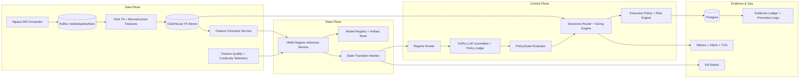

# HMM Regime-State + Autonomous LLM Control Plane Design (2026 Production Pack)

## Status

- Version: `v6.8`
- Date: `2026-02-28`
- Maturity: `production design`
- Scope: end-to-end market-state inference, routing, and LLM advisory orchestration for Torghut autonomous trading

## Objective

Deliver a production-grade, risk-first system where a Hidden Markov Model (HMM) regime layer is the **primary state signal** for:

- strategy routing,
- capital allocation behavior,
- confidence-aware fallback.

LLM systems are advisory, replayable, and policy-gated. Execution authority remains with deterministic risk controls.

This design extends the current Torghut architecture with a dedicated market-state control plane that can be promoted without touching the broker interface or data-plane fundamentals.

## Design principles for 2025-2026 deployment patterns

1. **State-first reasoning**: modern quant stacks increasingly combine probabilistic regime inference with model committees, not a single monolithic model.
2. **Confidence-aware abstention**: production systems in 2026 must degrade to conservative postures when posterior uncertainty rises.
3. **Contamination-safe learning**: no forward-looking leakage or test contamination in HMM training and evaluation gates.
4. **Deterministic finality**: LLM outputs are suggestions with bounded schema; deterministic gates decide final action.
5. **Evidence-first governance**: every autonomous stage change requires immutable artifacts, hashes, and gate receipts.
6. **Fail-fast kill behavior**: any instability in state inference or policy execution triggers automatic downgrade before hard failures.

## 2025-2026 trend drivers that should shape this design

- EU AI governance is entering enforcement maturity for high-risk systems in 2025-2026, with traceability and documentation obligations becoming central.
- OCC model governance guidance is now explicitly emphasizing proportional, auditable model risk controls across deployment stages.
- Financial research output in 2025/2026 continues to expand regime-switching methods for volatility and liquidity state segmentation under structural breaks.
- Frontier model providers are emphasizing stronger agentic workflows and long-context control primitives, increasing feasibility of deterministic policy-gated committee reviews.
- Production safety patterns now trend toward confidence-aware degradation, immutable audit bundles, and committee-style overrides over single-pass LLM decisions.

## Current deep-integration state (code-grounded)

### 1) Regime signal exists before HMM, already threaded end-to-end

- `services/torghut/app/trading/features.py` emits `route_regime_label` in `map_feature_values_v3()`.
- `_route_regime_label()` in the same module resolves explicit payload labels (`regime_label`) with deterministic MACD fallback.
- `_resolve_signal_regime(signal)` in `services/torghut/app/trading/scheduler.py` reads:
  - `payload["regime_label"]`,
  - `payload["regime"]["label"]`,
  and passes the result into allocator allocation calls.

### 2) Forecast routing already regime-keyed

- `services/torghut/app/trading/forecasting.py` (`ForecastRouterV5.route_and_forecast`) resolves regime from feature vectors (`_resolve_regime`) and builds route keys like `symbol|horizon|regime`.
- Router fallback behavior and calibration gating already exist:
  - regime-based route resolution,
  - calibration threshold checks,
  - deterministic baseline fallback on failure.
- The forecast payload and audit are already emitted as deterministic JSON and persisted as decision params via `StrategyDecision.params`.

### 3) Regime-conditioned capital envelope already in allocator

- `services/torghut/app/trading/scheduler._process_batch_signals()` resolves regime and calls `allocator.allocate(..., regime_label=...)`.
- `services/torghut/app/trading/portfolio.py` already defines:
  - `AllocationConfig.regime_budget_multipliers`,
  - `AllocationConfig.regime_capacity_multipliers`,
  - `_allocation_result()` storing `allocator` metadata including `regime_label`, multipliers, and cap decisions.
- `PortfolioSizer` consumes allocator output and applies multiplier-aware notional scaling.

### 4) Execution/adaptive policy already regime aware

- `services/torghut/app/trading/scheduler._evaluate_execution_policy_outcome()` passes decision regime into `derive_adaptive_execution_policy()`.
- `services/torghut/app/trading/tca.py` computes adaptive execution profiles by `(symbol, regime_label)` and emits `AdaptiveExecutionPolicyDecision`.
- `services/torghut/app/trading/execution_policy.py` stores adaptive metadata in decision params and applies it during execution checks.
- `services/torghut/app/trading/risk.py` consumes strategy/risk reasons plus allocator metadata before final approval.

### 5) LLM/advisory governance already has guardrails

- `services/torghut/app/trading/scheduler.py` already implements:
  - LLM guardrails,
  - market-context gating,
  - committee-based verdict collection,
  - token/gate/reason persistence.
- `services/torghut/app/trading/market_context.py` already has regime-related context/risk flags (`regime`, `regime_error`, `regime_source_error`).
- `services/torghut/app/trading/decisions.py` already pushes forecast and runtime metadata into `params` for later gates.

### 6) Existing deterministic regime classifier exists for offline/evaluation

- `services/torghut/app/trading/regime.py` already classifies volatility/trend/liquidity as deterministic labels (`RegimeLabel.label()`), which can seed transition priors and A/B baselines for HMM migration.

### Missing production gap relative to this design

- No dedicated inference service with posterior + entropy outputs exists today.
- No contract for online transition shock events (`entropy`, `predicted_next`, `guardrail`) in decision params.
- No model registry/artifact metadata currently injected into live decisions for rollback reproducibility.
- No dedicated persistence schema for HMM lineage, transition drift, and posterior confidence continuity.

## Normative implementation contract (must/should)

### Canonical HMM context object (`hmm_regime_context_v1`)

All runtime components (`features`, `forecasting`, `decisions`, `scheduler`, `llm/schema`) MUST treat the following object as canonical:

```json
{
  "schema_version": "hmm_regime_context_v1",
  "regime_id": "R2",
  "posterior": {
    "R1": "0.02",
    "R2": "0.69",
    "R3": "0.21",
    "R4": "0.07",
    "R5": "0.01"
  },
  "entropy": "1.23",
  "entropy_band": "medium",
  "predicted_next": "R3",
  "transition_shock": false,
  "duration_ms": 14,
  "artifact": {
    "model_id": "hmm-regime-v1.2.0",
    "feature_schema": "hmm-v1-feature-schema",
    "training_run_id": "trn_2026-02-26T00-00-00Z"
  },
  "guardrail": {
    "stale": false,
    "fallback_to_defensive": false,
    "reason": null
  }
}
```

Contract rules:

- `posterior` keys MUST be stable state IDs (`R1..Rn`); values MUST be decimal strings in persisted payloads.
- `entropy_band` MUST be one of `low|medium|high`.
- `transition_shock` MUST default to `false` when absent.
- `guardrail.reason` MUST be non-empty when `fallback_to_defensive=true`.
- Unknown fields MUST be ignored by readers.
- Missing object MUST be treated as `schema_version=unknown` and legacy deterministic regime fallback.

### Field-level requirements by module

- `services/torghut/app/trading/features.py`:
  - MUST emit: `hmm_state_posterior`, `hmm_entropy`, `hmm_entropy_band`, `hmm_regime_id`, `hmm_guardrail`.
  - MUST keep `route_regime_label` deterministic with precedence:
    1. HMM `regime_id`
    2. explicit `regime_label`
    3. MACD fallback.
- `services/torghut/app/trading/forecasting.py`:
  - MUST include in contract/audit:
    - `regime_id`, `regime_entropy_band`, `regime_entropy`, `regime_predicted_next`.
    - `regime_inference_version` derived from artifact (`model_id`).
- `services/torghut/app/trading/decisions.py`:
  - MUST attach canonical object under `params.regime_hmm`.
  - SHOULD expose compact denormalized fields for compatibility (`regime_label`, `route_regime_label`).
- `services/torghut/app/trading/scheduler.py`:
  - MUST resolve regime with precedence:
    1. `allocator.regime_label`
    2. `params.regime_hmm.regime_id`
    3. legacy `regime_label` / `regime.label`.
  - MUST record HMM telemetry counters even when falling back.
- `services/torghut/app/trading/llm/schema.py`:
  - MUST add optional compact context block (`regime_hmm`) with `regime_id`, `entropy_band`, `predicted_next`, `artifact_version`, `guardrail_reason`.
  - MUST remain strict (`extra="forbid"`) at top-level request schema.

## End-to-end architecture



## System state model

### State definitions (starter set)

Define a compact, interpretable state set for the first production release:

- `R1`: low-volatility, range-bound
- `R2`: low-volatility, trend persistence
- `R3`: risk-on breakout
- `R4`: high-volatility, structural stress
- `R5`: liquidity-breakdown / adverse microstructure regime

States can be extended to 7-8 buckets after one quarter of production run-in.

### Features in HMM observation vector

- short-horizon realized volatility (intraday and 24h spans),
- spread-normalized order-book imbalance proxy,
- return autocorrelation regime features,
- realized-to-implied signal gap (where available),
- feature continuity score and stale-rate for data sources,
- macro event distance feature (time-to-event windows),
- news/fundamentals freshness scalar (if the news path is enabled),
- execution pressure and queue stress from current and recent fills.

### Inference contract

`GET /v1/regime/state` (internal service contract) returns:

```json
{
  "symbol": "NVDA",
  "asOfUtc": "2026-02-28T00:00:00Z",
  "posterior": {
    "R1": 0.02,
    "R2": 0.69,
    "R3": 0.21,
    "R4": 0.07,
    "R5": 0.01
  },
  "predicted_next": "R3",
  "entropy": 1.23,
  "duration_ms": 14,
  "artifact": {
    "modelId": "hmm-regime-v1.2.0",
    "featureSchema": "hmm-v1-feature-schema",
    "trainingRunId": "trn_2026-02-26T00-00-00Z"
  },
  "guardrail": {
    "stale": false,
    "fallbackToDefensive": false,
    "reason": null
  }
}
```

### Entropy/uncertainty gates

- `entropy` thresholding triggers fallback posture:
  - normal: proceed with weighted routing;
  - medium: reduce non-defensive allocations and lower participation;
  - high: force defensive posture and disable aggressive actions for symbol scope.

- transition probability spike (high probability of stress transition) also forces defensive posture until state stabilizes.

Normative thresholds (initial production defaults):

- `entropy_medium`: `0.90`
- `entropy_high`: `1.35`
- `transition_shock_probability`: `>= 0.45` to `R4|R5` within next step
- If `guardrail.stale=true` for 2 consecutive windows, force deterministic defensive fallback.

## Regime router behavior

For each symbol decision cycle:

1. Pull latest posterior and transition risk from HMM.
2. Map posterior to intent weights (trend/reversal/defensive experts).
3. Apply capital-envelope cap for regime class (`R5` strongest cap reduction).
4. Emit a structured policy context bundle to LLM/DSPy advisory.
5. Feed LLM output into `PolicyGuard` + deterministic risk gating.
6. Persist evidence for every rejected, degraded, or changed action.

Fallback order:

1. invalid inference response → last-known-good state + deterministic conservative limits;
2. repeated invalid/incomplete → hard defensive posture;
3. regime service unavailable → safe-disable routing and preserve non-autonomous deterministic baseline;
4. emergency kill signal → block all non-emergency strategy lanes.

### Stage-specific failure policy matrix

| Condition | Shadow | Paper | Live |
|---|---|---|---|
| Regime service unavailable | Continue, mark `hmm_unavailable` | Continue with deterministic conservative limits | Fail closed for new risk-increasing entries; allow only risk-reducing exits |
| HMM payload schema invalid | Continue, record schema error | Continue deterministic fallback | Deterministic fallback + page on-call; block autonomous promotion |
| `guardrail.stale=true` | Advisory degrade only | Degrade allocations and participation | Degrade + disable aggressive actions for affected symbol set |
| `entropy_band=high` | Advisory `degrade` | Degrade and cap budgets | Defensive posture; no aggressive entries |
| Transition shock trigger | Advisory only | Defensive policy overlay | Defensive overlay + execution throttling |

Mandatory policy behavior:

- Live mode MUST be fail-closed for any contract violation that prevents deterministic risk evaluation.
- Shadow mode MUST never alter broker-facing execution behavior.
- Paper/live promotion MUST be denied when `hmm_unavailable_ratio` exceeds SLO over the promotion window.

## HMM training, validation, and promotion

### Artifact artifacts (required fields)

- `model_version`, `train_window`, `features_commit`, `schema_version`, `seed`,
- transition matrix snapshot (`A`), emission parametrization,
- calibration data (`Brier` / reliability plots),
- out-of-sample robustness summary,
- contamination guards (calendar split map + embargo rules),
- replay hash bundle for inference drift checks.

### Promotion pipeline

1. Offline training job creates candidate artifact under `artifacts/regime-hmm/`.
2. Offline evaluator computes:
   - walk-forward regime holdout score,
   - regime occupancy drift against canonical baseline,
   - adverse-event stability (transition shock sensitivity),
   - decision-level PnL regression and slippage compatibility.
3. Gate policy check must pass thresholds before artifact enters shadow lane.
4. Shadow lane uses artifact read-only for recommendation-only scoring.
5. Full promotion requires: replay reproducibility, no critical gate fails, and human/automation threshold policy pass.

### Promotion gates (recommended initial values)

- HMM posterior Brier score: pass target `<= 0.22`,
- transition-stability: daily regime-switch rate within expected envelope,
- feature continuity miss ratio for live window: `< 0.5%`,
- out-of-sample forward score improvement vs prior state model: `>= 5%`,
- policy fail-rate increase in shadow lane: `< 1.0%`.

## LLM advisory stack integration

### Interface shape

LLM receives only deterministic context:

- regime posterior + entropy + transition risk,
- symbol features summary,
- current inventory and risk budget,
- recent execution friction indicators,
- strategy intent alternatives from deterministic router.

LLM must return machine-parseable JSON only, aligned to strict schema and versioned prompt contracts:

- `approve`
- `defer`
- `adjust`
- `degrade`

No free-form order intent, no raw text to execution.

### Multi-agent committee pattern

Use 3-tier decisioning where one lane is dominant and two lanes are challengers:

- `planner`: proposes best-fit strategy adjustments;
- `risk_critic`: identifies fragility edges and overextension;
- `policy_judge`: validates schema/compliance boundaries.

`policy_judge` has tie-break power and can deny candidate actions even when planner and risk_critic agree.

### Governance behavior

- Each response is persisted with:
  - model ID, prompt version, token usage,
  - parsed JSON and validation result,
  - reject reasons and post-validate action.
- DSPy compile/eval artifacts remain source of truth when enabled.
- If confidence is below threshold or output invalid: deterministic fallback path only.

## Risk governance and kill switch

### Mandatory pre-trade controls

- Per-symbol gross cap.
- Per-strategy max participation cap.
- Portfolio drawdown stop and time-boxed recovery.
- Venue/time session caps.
- No-trade override during low-confidence regime windows.
- Idempotency check + order replay de-duplication in Postgres.

### Post-trade controls

- TCA outlier alerts (slippage and shortfall).
- Fill-to-intent mismatch tracking.
- Regime-conditioned exit audit (did execution match intended regime constraints?).
- Automatic throttle when realized slippage crosses confidence-adjusted budget.

### Kill switch matrix

- severity-1 trigger: broker/API risk, evidence corruption, repeated gate bypass attempts, regime-service meltdown.
- severity-2 trigger: persistent stale feature streams, drift alarm, repeated LLM schema invalidations.
- severity-3 trigger: localized symbol instability, microstructure anomaly.

Each trigger maps to:

- symbol scope,
- action (`DEGRADE`, `HOLD_RAMP`, `STOP`),
- minimum escalation cooldown,
- automatic evidence checkpoint.

## Data contracts (new/extended)

- `services/torghut/app/trading/regime.py`:
  - preserve deterministic fallback labels for migration compatibility.
- `services/torghut/app/trading/features.py`:
  - add HMM payload enrichment to `map_feature_values_v3()` and feature vectors:
    - `hmm_state_posterior`,
    - `hmm_entropy`,
    - `hmm_entropy_band`,
    - `hmm_regime_id`,
    - `hmm_guardrail`.
- `services/torghut/app/trading/forecasting.py`:
  - pass regime posterior state into router resolution and route key derivation.
  - optionally persist `regime_entropy_band` and `regime_inference_version` in contract/audit records.
- `services/torghut/app/trading/scheduler.py`:
  - attach HMM metadata into decision params at allocation/runtime junction.
  - record HMM-aware gate outcomes in existing metrics counters and in decision audit rows.
- `services/torghut/app/trading/portfolio.py`:
  - keep regime multipliers in `AllocationConfig` and persist source/multiplier effect in `allocator` payload (already partially implemented).
- `services/torghut/app/trading/tca.py`:
  - maintain regime-keyed adaptive policy rows and expose regime-conditioned execution metadata through `AdaptiveExecutionPolicyDecision`.
- `services/torghut/app/trading/llm/schema.py`:
  - extend LLM request context with compact regime-confidence payload (`posterior`, `entropy`, `predicted_next`, `artifact_version`) while preserving strict schemas.
- `services/torghut/app/trading/market_context.py`:
  - align regime domain stale/error flags with HMM guardrail outcome.
- `services/torghut/app/trading/autonomy/`:
  - include transition and inference evidence in `evidence_continuity` artifacts and promotion review.

### Suggested new files

- `services/torghut/app/trading/regime_hmm.py`
- `services/torghut/app/trading/llm/regime_context.py`
- `services/torghut/scripts/train_hmm_regime.py`
- `services/torghut/scripts/evaluate_hmm_regime.py`
- `services/torghut/scripts/promote_hmm_regime.py`
- `services/torghut/config/regime-hmm/` (schema, thresholds, profile overrides)

## Observability and SLOs

- `torghut_regime_inference_latency_ms` p95 <= 40 ms in hot path.
- `torghut_regime_entropy` alert if > configured `entropy_degrade` for 2 windows.
- `torghut_regime_service_stale_ratio` alert if stale feature ratio > 0.5%.
- `torghut_router_fallback_rate` alert if > 5% of cycles in one hour.
- `torghut_llm_schema_invalid_ratio` alert if > 0.2% over 15m.
- `torghut_promotion_gate_fail_rate` alert if critical gate fails on repeat artifact.

Dashboard slices:

- regime distribution by symbol and strategy,
- transition shock heatmap,
- posterior entropy by session and venue,
- action adjustments by regime label,
- governance outcome rate (`approve`, `defer`, `degrade`, `veto`).

### Ownership and alert actions

| Signal | Owner | Warn | Page | Automatic action |
|---|---|---|---|---|
| `torghut_regime_inference_latency_ms` p95 | Trading platform on-call | >40ms for 10m | >80ms for 5m | Switch to deterministic conservative routing |
| `torghut_regime_service_stale_ratio` | Market-state service on-call | >0.5% for 15m | >1.0% for 10m | Force `guardrail.fallback_to_defensive=true` |
| `torghut_router_fallback_rate` | Strategy runtime on-call | >5% for 30m | >10% for 15m | Freeze promotions; keep current production artifact |
| `torghut_llm_schema_invalid_ratio` | LLM control-plane on-call | >0.2% for 15m | >0.5% for 10m | Force deterministic veto/degrade path |
| `torghut_promotion_gate_fail_rate` | Autonomy governance on-call | any critical fail in 24h | repeated critical fail | Auto-deny promotion + require manual review |

## Rollout plan

### Phase 0: dry-run and calibration (2-3 weeks)

- Implement HMM service and registry in shadow-only mode:
  - `services/torghut/app/trading/regime_hmm.py`
  - `services/torghut/config/regime-hmm/`
  - offline scripts under `services/torghut/scripts/`.
- Add non-invasive inference hooks behind flags in:
  - `services/torghut/app/trading/features.py`,
  - `services/torghut/app/trading/forecasting.py`,
  - `services/torghut/app/trading/llm/schema.py`.
- No execution behavior changes in this phase; validate continuity and schema compatibility only.
- Add replayable artifact IDs to decision params in a shadow branch.

### Phase 1: paper + shadow (2-4 weeks)

- Run HMM-assisted recommendations against historical and live paper flows.
- Compare paper router outcomes against static deterministic baseline on route keys:
  - `symbol|timeframe|regime`
  - forecast fallback rates and calibration deltas.
- Extend observability:
  - add HMM-specific counters/histograms in existing scheduler metric payloads,
  - verify deterministic fallback on malformed/missing posterior.
- Keep LLM policy unchanged or keep shadow-only review mode.
- Exit criteria:
  - HMM contract parse success `>= 99.9%`.
  - Fallback due to schema mismatch `< 0.1%`.
  - No unclassified regime payloads in persisted decision params.

### Phase 2: constrained live (3-4 weeks)

- Limit to symbol subset + reduced budgets.
- Enforce high-entropy and transition-spike conservative gates with hard defense defaults.
- Inject posterior-aware posture in:
  - allocator and sizer multipliers,
  - adaptive execution profiles.
- Enable governance evidence package per promotion and per day for auto-review with rollback scripts.
- Exit criteria:
  - zero unhandled live gate failures,
  - live fallback policy behavior verified in drill scenarios,
  - all live decisions include contract version + artifact version.

### Phase 3: staged expansion (ongoing)

- Increase symbol breadth and strategy diversity.
- Add multi-account portfolio coupling.
- Enable adaptive exposure budgets with portfolio-level regime overlays.
- Add regime drift-triggered retraining cadences and archive/rehearse rollback drills.

### Phase 4: continual improvement

- scheduled retrains,
- drift-based retrain triggers,
- periodic hard rollback rehearsal,
- annual architecture and policy revalidation against latest regulator/alignment guidance.

## Compatibility and migration

### Backward compatibility policy

- No immediate DB schema migration is required for first deployment.
- Canonical HMM object MUST be persisted inside `StrategyDecision.params.regime_hmm`.
- Existing readers MUST continue to work when `regime_hmm` is absent.
- New readers MUST tolerate legacy-only payloads (`regime_label`, `regime.label`) indefinitely.

### Historical/replay compatibility

- Replay jobs MUST coalesce regime source in this order:
  1. `params.regime_hmm.regime_id`
  2. `params.allocator.regime_label`
  3. `params.regime_label`
  4. `params.regime.label`.
- Forecast and allocator dashboards MUST treat missing HMM fields as `unknown` instead of dropping rows.
- Backfill SHOULD be optional; if run, it MUST annotate `backfilled=true` and preserve original payload hash lineage.

### Versioning rules

- `hmm_regime_context_v1` is append-only for optional fields.
- Any required-field or semantic breaking change MUST increment schema major (`v2`) and run dual-read before cutover.
- Promotion pipeline MUST pin `(model_id, feature_schema, contract_schema_version)` as a single immutable tuple.

## Readiness and completion criteria

- full observability package is live, and alert runbooks are validated by drill,
- deterministic controls block all execution when HMM confidence conditions are outside bounds (`abstain`/`fail` path),
- shadow and live mode evidence are complete for each decision lifecycle (`forecast`, `allocator`, `execution_policy`, `risk`, `llm_review`),
- kill-switch coverage meets severity matrix with tested drill evidence,
- artifact manifest/lineage is auditable for at least one promoted and one rejected candidate,
- at least one full walk-forward and one historical simulation proving no regression in risk metrics at same exposure,
- zero live gate bypasses in final rollout (all override events are explicit and post-audited).

## Security and compliance checklist

- model and prompt versions immutable and versioned,
- prompt templates and schemas are reviewed before rollout,
- secrets scoped to service identity and rotated,
- all LLM/LLM-like outputs remain machine-parseable (no free-form execution text),
- promotion approvals and override actions are auditable and time-limited,
- no bypass for deterministic gates in live mode.

## Compliance control map (implementation binding)

| Obligation | Control | Evidence artifact | Retention | Owner |
|---|---|---|---|---|
| Traceability of automated decision support | Persist request/response + regime context + hashes | Decision audit row + evidence ledger bundle | 7 years | Torghut platform |
| Model risk governance | Gate-based artifact promotion with signed approvals | Promotion gate report + approver identity + artifact manifest | 7 years | Quant research + risk |
| Runtime safety and fallback proof | Drill-tested failover/kill-switch playbooks | Incident drill logs + runbook checklist results | 3 years | SRE + trading ops |
| Policy-bounded AI behavior | Strict schema validation and deterministic post-validation | LLM validation logs + policy resolution payloads | 3 years | LLM control-plane |
| Override accountability | Time-limited explicit overrides only | Override ticket + actor + expiration + reason | 7 years | Trading governance |

## Mapping to existing production docs

- Design pack entrypoint: `docs/torghut/design-system/v6/index.md`
- Governance/process runbook: `docs/torghut/design-system/v3/04-agentrun-orchestration-playbook.md`
- DSPy runtime rollout: `docs/torghut/design-system/v6/03-dspy-llm-decision-layer-over-jangar.md`
- Autonomy policy gates: `docs/torghut/design-system/v3/02-gate-policy-matrix.md`
- Existing operational runbooks under `docs/torghut/design-system/v1/`.

## 2025-2026 trend references used in this design

- EU AI Act implementation timeline and high-risk obligations: [Digital Strategy – AI Act](https://digital-strategy.ec.europa.eu/en/policies/regulatory-framework-ai)
- EU AI Act implementation schedule details: [AI Act service desk timeline](https://ai-act-service-desk.ec.europa.eu/en/ai-act/eu-ai-act-implementation-timeline)
- OCC model risk tailoring guidance (October 2025): [Model Risk Management: Clarification for Community Banks](https://www.occ.treas.gov/news-issuances/bulletins/2025/bulletin-2025-26.html)
- FCA safe AI testing in markets (December 2025): [FCA helps firms to test AI safely](https://www.fca.org.uk/news/press-releases/fca-helps-firms-test-ai-safely)
- Regime-switching/HMM finance research trend (2025): [On the robustness of HMM mixture models with covariate-dependent transitions](https://arxiv.org/abs/2504.21669)
- Volatility regime-forecasting with regime-switching methods (2025): [Improving S&P 500 Volatility Forecasting through Regime-Switching Methods](https://arxiv.org/abs/2510.03236)

This document is the canonical design reference for introducing an HMM-first regime control plane into autonomous Torghut trading while preserving deterministic safety and auditable promotion workflows.
