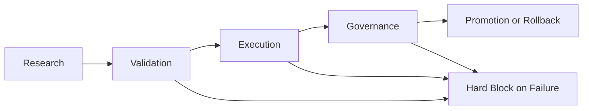

# Profitability Operating System: Research -> Validation -> Execution -> Governance

## Status

- Doc: `v6/08`
- Date: `2026-03-01`
- Maturity: `production design`
- Scope: canonical end-to-end operating system for profitable autonomous quant + LLM trading in Torghut
- Implementation status: `Planned`
- Evidence:
  - `docs/torghut/design-system/v6/08-profitability-research-validation-execution-governance-system.md` (design-level contract)
- Rollout gap: Torghut currently has strong partial controls, but does not yet enforce one canonical stage-gated profitability contract across research, validation, execution, and governance.

## Objective

Profitability must be treated as a system property, not a model property.

This design defines the required operating contract so no strategy, router, or LLM artifact can be promoted unless it passes:

1. research quality controls,
2. contamination-safe validation controls,
3. execution realism controls,
4. governance and rollback controls.

## Core Principle

No artifact is "profitable" by claim. It is only "promotion eligible" when all four stages pass in one immutable evidence bundle.

## Canonical Stage Model

Stage outputs are immutable inputs for subsequent stages. Missing evidence in any stage is a hard fail.

## Canonical Manifest Contract

Every candidate must produce:

`<artifact_path>/profitability/profitability-stage-manifest-v1.json`

Required top-level fields:

- `schema_version` = `profitability-stage-manifest-v1`
- `candidate_id`
- `strategy_family`
- `llm_artifact_ref` (nullable for deterministic-only candidates)
- `router_artifact_ref`
- `run_context`
  - `repository`
  - `base`
  - `head`
  - `artifact_path`
  - `run_id`
- `stages`
  - `research`
  - `validation`
  - `execution`
  - `governance`
- `overall_status` (`pass|fail`)
- `failure_reasons` (non-empty when fail)
- `rollback_contract_ref`
- `created_at_utc`
- `content_hash`

Each stage object must include:

- `status` (`pass|fail`)
- `checks` (machine-readable list)
- `artifacts` (paths + hashes)
- `owner`
- `completed_at_utc`

## Stage Contracts

### Stage 1: Research

Required checks:

1. hypothesis card exists with explicit economic mechanism.
2. target market, horizon, turnover, and capacity assumptions are explicit.
3. data lineage sources and legal/use constraints are declared.
4. baseline definitions are declared before model work starts.

Required artifacts:

- `hypothesis-card.json`
- `research-plan.json`
- `data-lineage-intent.json`
- `baseline-definition.json`

Hard fail conditions:

- no falsifiable hypothesis,
- no baseline declaration,
- missing source lineage intent.

### Stage 2: Validation

Required checks:

1. strict forward-only train/validation/test ordering.
2. embargo and purged split controls are enforced.
3. contamination and leakage checks pass.
4. benchmark parity suite is complete.
5. statistical overfit controls pass.

Required artifacts:

- `dataset_manifest.json`
- `split_manifest.json`
- `contamination_check_report.json`
- `benchmark_parity_report.json`
- `statistical_validity_report.json`
- `metrics_report.json`

Minimum statistical controls:

- Probability of Backtest Overfitting (PBO),
- Deflated Sharpe Ratio (DSR),
- selection-bias adjusted confidence intervals.

Hard fail conditions:

- any contamination check failure,
- missing benchmark coverage,
- PBO above configured threshold,
- DSR below configured threshold.

### Stage 3: Execution

Required checks:

1. after-cost metrics include spread, slippage, fees, and partial-fill realism.
2. queue-position and latency budgets are modeled for the candidate regime.
3. simulated-vs-paper divergence is within policy budget.
4. execution safety degrades fail-closed when data quality drops.

Required artifacts:

- `execution_cost_model.json`
- `paper_fill_replay_report.json`
- `tca_divergence_report.json`
- `execution_guardrail_report.json`

Hard fail conditions:

- positive backtest edge becomes non-positive after realistic costs,
- divergence breach without approved mitigation,
- missing execution fallback proof.

### Stage 4: Governance

Required checks:

1. deterministic gate compatibility is `pass`.
2. promotion decision is fully attributable to artifact hashes.
3. rollback rehearsal evidence exists.
4. drift monitors and oncall mappings are configured.

Required artifacts:

- `promotion_gate_decision.json`
- `lineage_bundle.json`
- `rollback_rehearsal_report.json`
- `drift_monitor_contract.json`

Hard fail conditions:

- any gate bypass,
- missing rollback evidence,
- missing incident ownership mapping.

## Promotion Decision Rule

Promotion eligibility:

`eligible = research.pass AND validation.pass AND execution.pass AND governance.pass`

Additional rule:

- live promotion also requires a passing paper-canary window with non-empty decision and fill evidence.

## Runtime Monitoring Contract

Mandatory live monitors after promotion:

1. live-vs-validation Sharpe drift,
2. drawdown drift,
3. slippage drift,
4. fallback-rate drift,
5. regime-coverage drift,
6. LLM abstain and timeout drift.

Any red breach triggers:

1. promotion queue hold,
2. constrained notional mode,
3. rollback if breach persists beyond policy window.

## Owned Code and Config Areas

- `services/torghut/app/trading/evaluation.py`
- `services/torghut/app/trading/autonomy/gates.py`
- `services/torghut/app/trading/autonomy/policy_checks.py`
- `services/torghut/app/trading/scheduler.py`
- `services/torghut/app/trading/tca.py`
- `services/torghut/scripts/run_autonomous_lane.py`
- `docs/torghut/design-system/v3/full-loop/10-audit-compliance-evidence-spec.md`
- `docs/torghut/design-system/v3/full-loop/13-research-ledger-promotion-evidence-spec.md`
- `argocd/applications/torghut/autonomy-gate-policy-configmap.yaml`

## AgentRun Lane Contract

Required ImplementationSpecs:

1. `torghut-v6-profitability-research-package-v1`
2. `torghut-v6-profitability-validation-gates-v1`
3. `torghut-v6-profitability-execution-reality-v1`
4. `torghut-v6-profitability-governance-closeout-v1`

Required parameters (string typed):

- `repository`
- `base`
- `head`
- `designDoc`
- `artifactPath`
- `candidateId`
- `strategyFamily`
- `evaluationWindow`
- `gatePolicyRef`

AgentRun requirements:

- use `implementationSpecRef` rather than inline prompt for production lanes,
- set top-level `ttlSecondsAfterFinished`,
- set `vcsRef` and `vcsPolicy.mode=read-write` for code-changing runs,
- fail closed on missing required stage artifacts.

## Verification Plan

1. Unit tests for stage-manifest schema validation and hard-fail paths.
2. Integration tests for end-to-end stage progression with seeded datasets.
3. Replay test ensuring bitwise-stable artifacts for fixed inputs.
4. Governance test proving rollback is triggered for simulated drift breach.

## Rollback Plan

1. freeze new promotions,
2. revert to prior approved candidate artifact set,
3. force deterministic fallback policy,
4. publish incident bundle with all failed stage checks.

## Exit Criteria

1. all autonomous promotions emit `profitability-stage-manifest-v1.json`.
2. no promotion can pass without all four stage statuses set to `pass`.
3. one candidate is promoted end-to-end with complete replayable evidence.
4. drift-triggered rollback is validated in paper and constrained live canary.

## Research References

- Probability of Backtest Overfitting (SSRN): https://papers.ssrn.com/sol3/papers.cfm?abstract_id=2326253
- Deflated Sharpe Ratio (SSRN): https://papers.ssrn.com/sol3/papers.cfm?abstract_id=2460551
- Qlib (arXiv): https://arxiv.org/abs/2009.11189
- DSPy (arXiv): https://arxiv.org/abs/2310.03714
