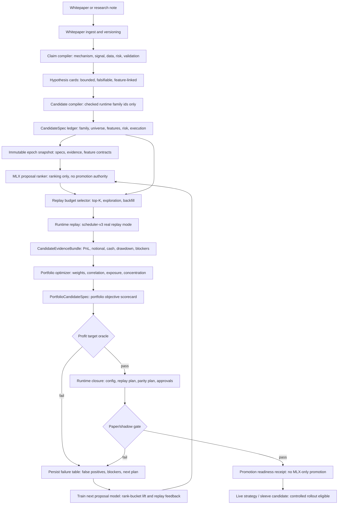
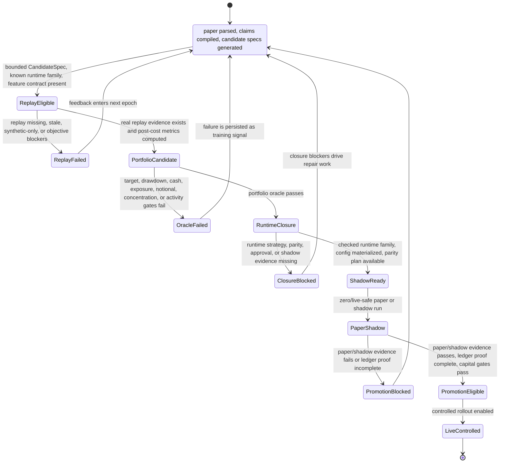
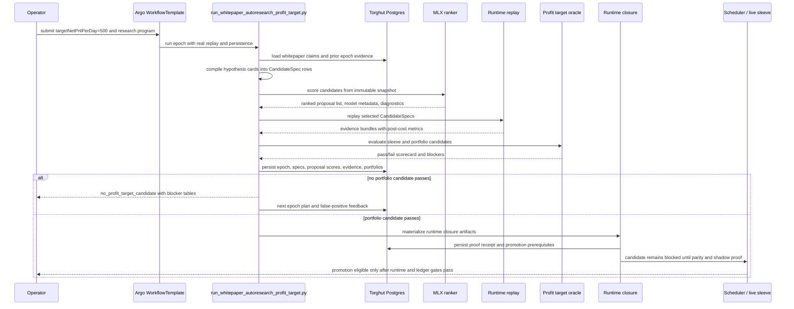

# 214. Torghut Current Whitepaper to Profitable Strategy Workflow (2026-05-16)

## Source Implementation Audit (2026-07-04)

- Source baseline inspected: `6473f3ee7 ci(arc): fit ten lab runners per node (#11877)`.
- Implementation status: Partially implemented: whitepaper ingestion, claim compilation, dispatch, finalization, and Jangar library/API surfaces exist.
- Matched implementation area: Whitepaper/autoresearch workflow.
- Current source evidence:
  - `services/torghut/app/api/whitepaper.py`
  - `services/torghut/app/whitepapers/workflow`
  - `services/torghut/scripts/run_whitepaper_autoresearch_profit_target.py`
  - `services/jangar/src/routes/api/whitepapers/index.ts`
  - `services/jangar/src/routes/library/whitepapers/index.tsx`
- Design drift note: Old workflow-template assumptions are stale; current authority is service-owned workflow plus Jangar routes.


## End-to-End Flow



## Promotion State Machine



## Operator Sequence



## Workflow Stages

### 1. Whitepaper ingestion

Whitepapers are input material, not authority. The system records the paper source, version, claims,
and relations. The useful output is a typed claim graph: signal mechanism, data requirements, market
condition, validation requirement, and failure modes.

Primary surfaces:

- `services/torghut/app/whitepapers/workflow.py`
- `services/torghut/app/whitepapers/claim_compiler.py`
- `services/torghut/scripts/compile_whitepaper_claims.py`

### 2. Hypothesis cards

Claims become bounded hypothesis cards. A card must say what market behavior is being tested, what
features it needs, which runtime family can express it, and what would falsify it. A vague paper
summary is not allowed to become a live sleeve.

Primary surfaces:

- `services/torghut/app/trading/discovery/hypothesis_cards.py`
- `services/torghut/app/trading/discovery/whitepaper_candidate_compiler.py`

### 3. Candidate specs

Hypothesis cards compile into `CandidateSpec` objects. This is the first hard anti-cheat boundary.
Specs must map to checked-in runtime family ids and bounded parameters. The workflow should not
generate arbitrary live code and then call it a strategy.

A candidate spec carries:

- family id and template id
- universe and symbol filters
- feature requirements
- risk profile
- execution profile
- objective policy
- provenance back to paper claims and epoch inputs

Primary surfaces:

- `services/torghut/app/trading/discovery/candidate_specs.py`
- `services/torghut/app/trading/discovery/family_templates.py`
- `services/torghut/app/trading/strategy_specs.py`

### 4. MLX proposal ranking

MLX is used to spend replay budget better. It can rank, cluster, or learn proposal priors over prior
candidate outcomes. It does not approve anything. It does not replace replay. It does not write live
runtime configuration.

The accepted MLX contract is:

- input is an immutable epoch snapshot
- output is proposal scores and diagnostics
- authority is limited to replay selection
- replay outcomes become the training labels for the next epoch

Primary surfaces:

- `services/torghut/app/trading/discovery/mlx_snapshot.py`
- `services/torghut/app/trading/discovery/mlx_features.py`
- `services/torghut/app/trading/discovery/mlx_proposal_models.py`
- `services/torghut/scripts/train_mlx_autoresearch_ranker.py`

### 5. Replay and evidence bundles

Selected candidates run through replay. For promotion-relevant evidence, synthetic replay is not
enough. The replay must produce post-cost metrics with enough data quality to support the objective.

The evidence bundle must include:

- post-cost net PnL
- active-day and positive-day ratios
- daily notional
- cash and gross exposure
- drawdown and worst-day loss
- concentration and best-day share
- executable replay status
- blockers when any gate fails

Primary surfaces:

- `services/torghut/app/trading/discovery/evidence_bundles.py`
- `services/torghut/app/trading/discovery/autoresearch.py`
- `services/torghut/scripts/run_whitepaper_autoresearch_profit_target.py`

### 6. Portfolio optimization

The target is portfolio-level profitability. A single sleeve does not need to be profitable every day,
and a down day is allowed if portfolio-level loss, drawdown, cash, exposure, concentration, and
notional gates remain inside policy.

The current `$500/day` program should be interpreted as:

- target average post-cost net PnL per active day: `500`
- bounded daily loss floor, not no-loss days
- bounded maximum drawdown
- nonnegative cash
- gross exposure at or below policy
- enough daily notional to make the result executable
- enough active and positive days to avoid one lucky spike
- no best-day concentration masquerading as durable edge

Primary surfaces:

- `services/torghut/app/trading/discovery/portfolio_optimizer.py`
- `services/torghut/app/trading/discovery/portfolio_candidates.py`
- `services/torghut/app/trading/discovery/profit_target_oracle.py`
- `services/torghut/config/trading/research-programs/portfolio-profit-autoresearch-500-v1.yaml`

### 7. Profit target oracle

The oracle turns metrics into a hard pass/fail scorecard. It is not trying to make the run look good.
It is there to prevent false positives from becoming capital decisions.

Typical rejection reasons include:

- portfolio net PnL below target
- cash below zero
- gross exposure above limit
- drawdown too large
- worst day too large
- best-day share too concentrated
- active-day ratio too low
- positive-day ratio too low
- daily notional too low
- executable replay missing
- runtime closure proof missing

### 8. Runtime closure

Passing replay is still not live readiness. Runtime closure proves the portfolio can be represented
by actual runtime configuration and scheduler behavior.

Runtime closure must produce:

- candidate runtime config or configmap
- sleeve materialization plan
- replay plan and parity expectations
- approval prerequisites
- shadow or paper-run prerequisites
- proof receipt
- promotion blockers when any artifact is missing

Primary surfaces:

- `services/torghut/app/trading/discovery/runtime_closure.py`
- `services/torghut/app/trading/discovery/promotion_contract.py`
- `services/torghut/app/trading/scheduler/runtime.py`
- `services/torghut/app/trading/research_sleeves.py`

### 9. Paper, shadow, and live promotion

The candidate remains blocked until scheduler parity, approval policy, and paper or shadow evidence
pass. Only then can it become a live sleeve candidate. The live sleeve is still controlled rollout,
not a blanket permission to spend capital.

Promotion authority must come from:

- replay evidence
- portfolio oracle pass
- runtime closure pass
- scheduler parity pass
- paper or shadow pass
- ledger proof and freshness
- capital and risk gates

## What Is Not Allowed

- No generated free-form live strategy code.
- No synthetic replay as production proof.
- No MLX-only promotion.
- No target leakage from future evidence into candidate construction.
- No hardcoded pass for a `$500` target.
- No "strict every day profitable" harness when the objective is portfolio-level profitability.
- No ignoring cash, exposure, notional, or drawdown to make PnL look good.
- No claiming live profitability from service readiness alone.

## Current Operator Commands

Typical local verification before promoting changes to this workflow:

```bash
cd services/torghut
uv sync --frozen --extra dev
uv run --frozen ruff check scripts/run_whitepaper_autoresearch_profit_target.py tests/test_run_whitepaper_autoresearch_profit_target.py tests/test_strategy_autoresearch.py tests/test_profit_target_oracle.py
uv run --frozen pytest tests/test_run_whitepaper_autoresearch_profit_target.py tests/test_strategy_autoresearch.py tests/test_profit_target_oracle.py -q
uv run --frozen pyright --project pyrightconfig.json
uv run --frozen pyright --project pyrightconfig.alpha.json
uv run --frozen pyright --project pyrightconfig.scripts.json
```

Typical live evidence checks:

```bash
kubectl -n torghut get ksvc torghut torghut-sim
kubectl -n torghut get workflowtemplate torghut-whitepaper-autoresearch-profit-target -o yaml
kubectl cnpg psql -n torghut torghut-db -- -c "select run_id, status, target_net_pnl_per_day, runtime_closure_status, promotion_status from autoresearch_epochs order by created_at desc limit 10;"
```

Service readiness is only a prerequisite. Profitability requires the epoch tables and proof receipts
to show a passing portfolio candidate and promotion-ready runtime evidence.

## Short Version

Whitepaper claims propose hypotheses. Hypotheses compile into checked strategy specs. MLX ranks the
specs to allocate replay budget. Runtime replay produces evidence. The portfolio optimizer combines
sleeves. The oracle rejects anything that fails post-cost PnL, drawdown, cash, exposure, notional, or
concentration gates. Runtime closure proves the candidate can actually run. Paper or shadow evidence
proves it behaves outside offline replay. Only then can a sleeve become live-eligible.
