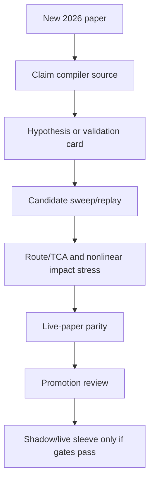

# Torghut Recent Whitepaper Refresh - 2026-05-18

## Purpose

The $500/day portfolio-profit program should not keep recycling stale paper
inputs. This refresh adds newer 2026 microstructure and execution papers to the
checked-in research source surface while preserving the no-cheating promotion
bar: a paper can create a hypothesis or validation gate, but it cannot promote a
candidate without executable replay, route/TCA, live-paper parity, and ledger
evidence.

## Added papers

| Source | Date | Torghut use |
| --- | --- | --- |
| [Early Detection of Latent Microstructure Regimes in Limit Order Books](https://arxiv.org/abs/2604.20949) | 2026-04-22 | Adds latent build-up regime channels as veto/early-warning features around continuation entries. |
| [Explainable Patterns in Cryptocurrency Microstructure](https://arxiv.org/abs/2602.00776) | 2026-01-31 | Adds portable LOB feature-library evidence, with maker/taker adverse-selection stress as a required validation split. |
| [A unified theory of order flow, market impact, and volatility](https://arxiv.org/abs/2601.23172) | 2026-02-02 | Couples persistent-flow continuation hypotheses to nonlinear impact and volatility stress. |
| [Learning Market Making with Closing Auctions](https://arxiv.org/abs/2601.17247) | 2026-01-24 | Keeps close-flatten and late-day execution separate from generic terminal inventory penalties. |
| [The Rise of Algorithmic Retail Option Traders](https://papers.ssrn.com/sol3/papers.cfm?abstract_id=6480379) | 2026-04-17 | Adds clock-time option-flow stress slices around hour and half-hour 0DTE flow bursts. |
| [Learning from the Book: AI Evidence on Short-Run Market Efficiency](https://papers.ssrn.com/sol3/papers.cfm?abstract_id=6608199) | 2026-05-01 | Adds full-depth book imbalance/slope features with algo-activity, tight-spread, and high-volume decay stress. |
| [Decomposing High-Frequency Order Flow](https://papers.ssrn.com/sol3/papers.cfm?abstract_id=6535019) | 2026-04-20 | Adds common-factor-neutral order-flow slices so symbol candidates cannot confuse market-wide flow with symbol alpha. |
| [Intraday Price Asymmetry and Next-Day Intraday Returns in the S&P 500](https://papers.ssrn.com/sol3/papers.cfm?abstract_id=6074846) | 2026-02-02 | Adds range-asymmetry reversal risk features and separate volatility-stress validation for long and short legs. |
| [Market Depth and Execution Delays](https://papers.ssrn.com/sol3/papers.cfm?abstract_id=6440898) | 2026-05-15 | Adds delay-adjusted depth and route-latency stress so apparent quote liquidity cannot pass as fillability. |
| [Assessing the Impact of the Order Book with a Hawkes Process in a Random Environment](https://papers.ssrn.com/sol3/papers.cfm?abstract_id=5170318) | 2026-05-12 | Adds session-specific order-arrival clustering and order-book impact gates for opening, main-session, and close windows. |
| [Payment for Order Flow, Demystified: How Your Free Trade Actually Works](https://papers.ssrn.com/sol3/papers.cfm?abstract_id=6704839) | 2026-05-04 | Adds broker-routing and price-improvement checks as route/TCA blockers before live promotion. |
| [Modelling Crypto Asset Order-Flow Imbalance as an Additive and Multiplicative Process](https://papers.ssrn.com/sol3/papers.cfm?abstract_id=6688399) | 2026-05-01 | Adds additive/multiplicative OFI regime pressure features and tighter exposure validation for concentrated flow states. |

## Program impact

The additions affect research input and validation, not live promotion:

The strongest practical change is stricter execution realism. The newer sources
push Torghut away from raw OHLCV, raw imbalance, or clock-time continuation
shortcuts and toward explicit stress slices:

- latent-regime coverage before trusting continuation entries;
- maker/taker fill-model separation before treating microstructure alpha as executable;
- nonlinear impact curves for high-turnover candidates;
- close-auction and close-flatten evidence for late-day sleeves;
- option-flow clock-time slices so mechanical 0DTE bursts do not masquerade as persistent equity alpha.
- common-factor-neutral OFI slices so market-wide order-flow pressure does not get misread as symbol-specific alpha;
- algo-intensity, tight-spread, and high-volume decay stress for full-depth order-book features.
- delay-adjusted market-depth stress so stale or slow routes cannot be counted as executable liquidity;
- session-specific Hawkes/order-arrival clustering so opening and close impact are not pooled with ordinary mid-session flow;
- broker-route/PFOF execution-quality checks so paper fills cannot ignore adverse routing economics;
- additive/multiplicative OFI regime gates so self-amplifying pressure tightens exposure and drawdown constraints.

## Files updated

- `services/torghut/config/trading/research-programs/portfolio-profit-autoresearch-500-v1.yaml`
- `services/torghut/config/trading/research-sources/300-daily-profit-2025-2026.jsonl`
- `services/torghut/tests/test_run_whitepaper_autoresearch_profit_target.py`
- `services/torghut/tests/test_strategy_autoresearch.py`
