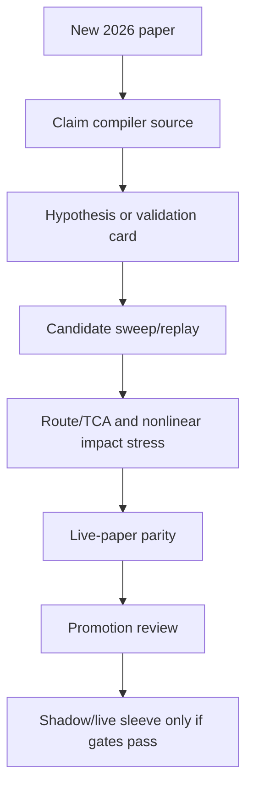

# Torghut Recent Whitepaper Refresh - 2026-05-18

## Source Implementation Audit (2026-07-04)

- Source baseline inspected: `6473f3ee7 ci(arc): fit ten lab runners per node (#11877)`.
- Implementation status: Partially implemented: whitepaper ingestion, claim compilation, dispatch, finalization, and Jangar library/API surfaces exist.
- Matched implementation area: Whitepaper/autoresearch workflow.
- Current source evidence:
  - `services/torghut/app/api/whitepaper.py`
  - `services/torghut/app/whitepapers/workflow`
  - `services/torghut/scripts/run_whitepaper_autoresearch_profit_target.py`
  - `services/jangar/src/routes/api/whitepapers/index.ts`
  - `services/jangar/src/routes/library/whitepapers/index.tsx`
- Design drift note: Old workflow-template assumptions are stale; current authority is service-owned workflow plus Jangar routes.

## Purpose

The $500/day portfolio-profit program should not keep recycling stale paper
inputs. This refresh adds newer 2026 microstructure and execution papers to the
checked-in research source surface while preserving the no-cheating promotion
bar: a paper can create a hypothesis or validation gate, but it cannot promote a
candidate without executable replay, route/TCA, live-paper parity, and ledger
evidence.

## Added papers

| Source | Date | Torghut use |
| --- | --- | --- |
| [Early Detection of Latent Microstructure Regimes in Limit Order Books](https://arxiv.org/abs/2604.20949) | 2026-04-22 | Adds latent build-up regime channels as veto/early-warning features around continuation entries. |
| [Explainable Patterns in Cryptocurrency Microstructure](https://arxiv.org/abs/2602.00776) | 2026-01-31 | Adds portable LOB feature-library evidence, with maker/taker adverse-selection stress as a required validation split. |
| [A unified theory of order flow, market impact, and volatility](https://arxiv.org/abs/2601.23172) | 2026-02-02 | Couples persistent-flow continuation hypotheses to nonlinear impact and volatility stress. |
| [Learning Market Making with Closing Auctions](https://arxiv.org/abs/2601.17247) | 2026-01-24 | Keeps close-flatten and late-day execution separate from generic terminal inventory penalties. |
| [The Rise of Algorithmic Retail Option Traders](https://papers.ssrn.com/sol3/papers.cfm?abstract_id=6480379) | 2026-04-17 | Adds clock-time option-flow stress slices around hour and half-hour 0DTE flow bursts. |
| [Learning from the Book: AI Evidence on Short-Run Market Efficiency](https://papers.ssrn.com/sol3/papers.cfm?abstract_id=6608199) | 2026-05-01 | Adds full-depth book imbalance/slope features with algo-activity, tight-spread, and high-volume decay stress. |
| [Decomposing High-Frequency Order Flow](https://papers.ssrn.com/sol3/papers.cfm?abstract_id=6535019) | 2026-04-20 | Adds common-factor-neutral order-flow slices so symbol candidates cannot confuse market-wide flow with symbol alpha. |
| [Intraday Price Asymmetry and Next-Day Intraday Returns in the S&P 500](https://papers.ssrn.com/sol3/papers.cfm?abstract_id=6074846) | 2026-02-02 | Adds range-asymmetry reversal risk features and separate volatility-stress validation for long and short legs. |
| [Market Depth and Execution Delays](https://papers.ssrn.com/sol3/papers.cfm?abstract_id=6440898) | 2026-05-15 | Adds delay-adjusted depth and route-latency stress so apparent quote liquidity cannot pass as fillability. |
| [Assessing the Impact of the Order Book with a Hawkes Process in a Random Environment](https://papers.ssrn.com/sol3/papers.cfm?abstract_id=5170318) | 2026-05-12 | Adds session-specific order-arrival clustering and order-book impact gates for opening, main-session, and close windows. |
| [Payment for Order Flow, Demystified: How Your Free Trade Actually Works](https://papers.ssrn.com/sol3/papers.cfm?abstract_id=6704839) | 2026-05-04 | Adds broker-routing and price-improvement checks as route/TCA blockers before live promotion. |
| [Modelling Crypto Asset Order-Flow Imbalance as an Additive and Multiplicative Process](https://papers.ssrn.com/sol3/papers.cfm?abstract_id=6688399) | 2026-05-01 | Adds additive/multiplicative OFI regime pressure features and tighter exposure validation for concentrated flow states. |
| [RED-2400: A Public Benchmark of Algorithmically-Rejected Trading Events with Outcome Labels](https://arxiv.org/abs/2605.12151) | 2026-05-12 | Adds rejected-event outcome labels so skipped-signal logs can calibrate vetoes against missed post-cost opportunities. |
| [The Privacy Subsidy: Kyle's Lambda under Noise-Perturbed Order-Flow Observation](https://arxiv.org/abs/2605.15746) | 2026-05-15 | Adds order-flow attribution-noise stress so OFI features cannot assume clean flow observation. |
| [Measuring Bubbles via Put-Call Disparity](https://papers.ssrn.com/sol3/papers.cfm?abstract_id=6754305) | 2026-05-16 | Adds option-implied bubble-state gates with bootstrap and thin-quote stress before sizing changes. |
| [The Anatomy of a Decentralized Prediction Market](https://papers.ssrn.com/sol3/papers.cfm?abstract_id=6658364) | 2026-05-14 | Adds effective-spread, archive-delay, depth-shape, and wash-activity quality gates for event-linked order-book evidence. |
| [Levering Up! Short-Horizon Option Availability and the Gamification of the Stock Market](https://papers.ssrn.com/sol3/papers.cfm?abstract_id=6703098) | 2026-05-03 | Adds weekly-option availability and gamma-exposure stress slices for equity sleeves exposed to short-horizon option flow. |
| [ForesightFlow: Real-Time Detection of Informed Trading in Decentralized Prediction Markets](https://papers.ssrn.com/sol3/papers.cfm?abstract_id=6687441) | 2026-05-01 | Adds VPIN, Kyle-lambda, hazard-rate, and informed-flow toxicity vetoes before routeable entries. |
| [Bridging Microstructure and Macro](https://papers.ssrn.com/sol3/papers.cfm?abstract_id=6700018) | 2026-05-03 | Adds low-confidence VPIN/Hawkes/Hurst regime routing as validation context, not standalone alpha. |
| [Extended State-dependent Hawkes Process for Limit Order Books](https://arxiv.org/abs/2604.23961) | 2026-04-27 | Adds state-dependent LOB event intensity and volatility-signature replay requirements. |
| [Model Predictive Control For Trade Execution](https://arxiv.org/abs/2603.28898) | 2026-03-30 | Adds dynamic execution schedule controls only after route/TCA, latency, and impact stress validate them. |
| [Bridging the Reality Gap in Limit Order Book Simulation](https://arxiv.org/abs/2603.24137) | 2026-03-25 | Adds simulation-to-live parity gates so synthetic LOB fillability cannot count as promotion proof by itself. |

## Program impact

The additions affect research input and validation, not live promotion:

The strongest practical change is stricter execution realism. The newer sources
push Torghut away from raw OHLCV, raw imbalance, or clock-time continuation
shortcuts and toward explicit stress slices:

- latent-regime coverage before trusting continuation entries;
- maker/taker fill-model separation before treating microstructure alpha as executable;
- nonlinear impact curves for high-turnover candidates;
- close-auction and close-flatten evidence for late-day sleeves;
- option-flow clock-time slices so mechanical 0DTE bursts do not masquerade as persistent equity alpha.
- common-factor-neutral OFI slices so market-wide order-flow pressure does not get misread as symbol-specific alpha;
- algo-intensity, tight-spread, and high-volume decay stress for full-depth order-book features.
- delay-adjusted market-depth stress so stale or slow routes cannot be counted as executable liquidity;
- session-specific Hawkes/order-arrival clustering so opening and close impact are not pooled with ordinary mid-session flow;
- broker-route/PFOF execution-quality checks so paper fills cannot ignore adverse routing economics;
- additive/multiplicative OFI regime gates so self-amplifying pressure tightens exposure and drawdown constraints.
- rejected-event outcome learning so skipped signals become counterfactual proof data instead of dead logs;
- order-flow attribution-noise stress so noisy or partially private flow does not overstate executable alpha;
- option-implied bubble-state gates so put-call disparity can adjust risk only after thin-quote and bootstrap stress;
- event-linked book-quality gates so ingestion delay, effective spread, and wash activity block unreliable microstructure evidence;
- weekly-option gamma-flow slices so short-horizon option availability is separated from ordinary equity continuation;
- informed-flow toxicity vetoes using VPIN, Kyle-lambda, hazard-rate, and route/TCA validation;
- low-confidence micro/macro routing context from VPIN/Hawkes/Hurst claims, treated as validation evidence only.
- state-dependent Hawkes/volatility-signature replay before order-arrival clustering influences entry timing;
- dynamic execution schedule controls that must beat static execution after latency, spread, and impact stress;
- simulation-to-live LOB parity gates before synthetic fillability affects paper or live capital.

## Runtime seed follow-up

The checked-in JSONL source catalog was already broader than the runtime
`--seed-recent-whitepapers` path. The follow-up runtime seed refresh adds
directly compiled `RECENT_WHITEPAPER_SEEDS` for:

- [Structural Limits of OHLCV-Based Intraday Signals in MNQ Futures](https://arxiv.org/abs/2605.04004)
  - keeps OHLCV-only intraday candidates behind walk-forward, trade-count, post-cost, and multi-year stability gates.
- [Risk-Sensitive Specialist Routing for Volatility Forecasting](https://arxiv.org/abs/2604.10402)
  - adds state-dependent volatility specialist routing and underprediction-loss gates.
- [Taming the Black Swan](https://arxiv.org/abs/2604.09060)
  - adds momentum crash gating through volatility-adjusted momentum and structural diversification controls.
- [Realistic Market Impact Modeling for Reinforcement Learning Trading Environments](https://arxiv.org/abs/2603.29086)
  - makes nonlinear market impact, route TCA, and turnover stress first-class ranking inputs.
- [FactorEngine](https://arxiv.org/abs/2603.16365)
  - pushes factor mining toward executable, auditable programs with logic revision separated from parameter optimization.
- [QuantaAlpha](https://arxiv.org/abs/2602.07085)
  - treats alpha-search trajectories, semantic consistency, and cross-market transfer as replayable evidence.
- [Measuring Bubbles via Put-Call Disparity](https://papers.ssrn.com/sol3/papers.cfm?abstract_id=6754305)
  - adds put-call disparity, option-flow, and thin-quote stress as risk-state evidence only.
- [The Anatomy of a Decentralized Prediction Market](https://papers.ssrn.com/sol3/papers.cfm?abstract_id=6658364)
  - adds order-book archive quality, ingestion delay, and wash-activity validation for event-linked microstructure claims.
- [Levering Up!](https://papers.ssrn.com/sol3/papers.cfm?abstract_id=6703098)
  - adds weekly-option availability and gamma-exposure stress for equity sleeves around short-horizon option flow.
- [ForesightFlow](https://papers.ssrn.com/sol3/papers.cfm?abstract_id=6687441)
  - adds VPIN, Kyle-lambda, hazard-rate, and informed-flow toxicity gating before routeable entries.
- [Bridging Microstructure and Macro](https://papers.ssrn.com/sol3/papers.cfm?abstract_id=6700018)
  - adds low-confidence VPIN/Hawkes/Hurst regime context for validation slices, not direct promotion.

The follow-up compile smoke produced `24` seed sources, `55` claims, `20` claim
relations, and `24` hypothesis cards from the runtime seed path.

## Files updated

- `services/torghut/config/trading/research-programs/portfolio-profit-autoresearch-500-v1.yaml`
- `services/torghut/config/trading/research-sources/300-daily-profit-2025-2026.jsonl`
- `services/torghut/app/whitepapers/claim_compiler.py`
- `services/torghut/tests/test_whitepaper_claim_compiler.py`
- `services/torghut/tests/test_run_whitepaper_autoresearch_profit_target.py`
- `services/torghut/tests/test_strategy_autoresearch.py`
