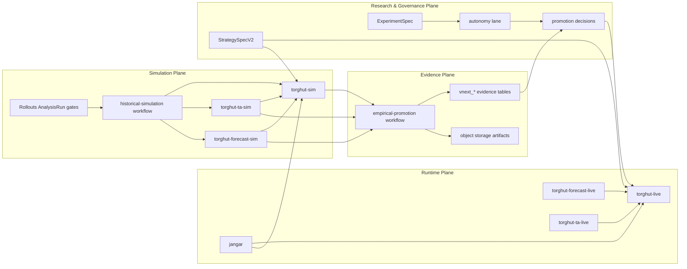

# 31. Proven Autonomous Quant LLM Torghut Trading System (2026-03-07)

## Status

- Date: `2026-03-07`
- Maturity: `target-state architecture + cutover design`
- Scope: `services/torghut/**`, `services/jangar/**`, `argocd/applications/**`, simulation/evidence/control-plane topology
- Primary objective: define the clean end-state architecture for a truthful, empirically validated, autonomous quant trading system where LLMs increase research and control quality without becoming a source of synthetic trading authority.

## Executive Summary

Torghut already has the bones of a serious trading control system:

- deterministic scheduler, risk, and execution-policy enforcement,
- typed persistence and rollback surfaces,
- strong fail-closed promotion posture,
- a simulation/evidence lane that is now materially real,
- Jangar-backed dependency and market-context surfaces,
- LLM/DSPy guardrails that are safer than most production “AI trading” systems.

The system still falls short of the architecture implied by the phrase “proven autonomous quant LLM trading system” for
one reason:

the environment and evidence planes are still more fragile than the runtime control plane.

The correct end-state is not:

- “LLM trades directly”
- “simulation passes because we relaxed rules”
- “promotion succeeds because artifacts exist”

The correct end-state is:

1. deterministic runtime and capital protection remain final authority,
2. simulation is a first-class mirrored environment, not a patched runtime mode,
3. every promotable artifact carries truthful lineage and maturity,
4. paper promotion depends on replay-backed, calibrated evidence,
5. live promotion depends on observed post-cost behavior over time,
6. LLM autonomy is strongest in research, critique, synthesis, and governance, not in unconstrained order generation.

This document defines that end-state.

It does **not** guarantee profit. No architecture can do that honestly.

It defines the system most likely to discover, validate, deploy, and demote trading hypotheses truthfully.

## Problem Statement

Today’s primary architectural weakness is not the absence of infrastructure or controls.

It is the mismatch between:

- a relatively mature control plane, and
- a less mature evidence and environment plane.

That mismatch shows up in several operational failure modes:

- simulation runtime can be “healthy” while trading is effectively disabled by one env flag,
- replay can produce real market data and real TA signals while Torghut produces zero decisions,
- empirical jobs can fail because the workflow contract is less strict than the promotion contract,
- multiple runtime variants share the same image and namespace, increasing the chance that a valid image runs with an invalid contract,
- readiness often proves that infrastructure is up, not that the trading system is actually armed to make decisions.

The result is a dangerous system shape:

truthful controls over potentially untruthful or incomplete evidence.

The architecture must therefore optimize for:

- truthfulness,
- reproducibility,
- operational clarity,
- hard separation of evidence classes,
- promotion only from empirically justified readiness.

## Goals

- make `paper` promotion depend on replay-backed, calibrated, reproducible evidence,
- make `live` promotion depend on observed post-cost runtime evidence,
- keep deterministic runtime controls as the final authority over capital,
- raise research throughput with LLM-assisted experimentation without granting unconstrained trade authority,
- make operator truth surfaces good enough that readiness and promotion state are directly inspectable,
- ensure every promotion, demotion, rollback, and evidence artifact is reconstructable from persisted lineage.

## Non-Goals

- promise profitability as an architectural outcome,
- grant LLMs direct order authority,
- optimize for the fewest moving parts at the expense of evidence truthfulness,
- make replay a substitute for live validation,
- allow “healthy infrastructure” to count as “ready trading behavior.”

## Target Outcome

Torghut should become a system where the following statement is true:

> A strategy cannot reach `paper`, `live canary`, or `scaled live` unless the exact strategy spec, replay data,
> calibration artifacts, runtime evidence, and promotion decision are all reconstructable and empirically consistent.

To make that true, the system must provide:

- one canonical strategy/experiment contract,
- one canonical simulation session contract,
- one canonical evidence manifest contract,
- deterministic risk and execution authority,
- replay-backed validation before paper,
- observed runtime validation before live,
- automated demotion and rollback when the hypothesis breaks.

## Architectural Principles

### 1. Deterministic runtime authority

Final order authority stays deterministic and typed.

LLMs may:

- propose hypotheses,
- generate experiments,
- critique contamination,
- synthesize evidence,
- review decisions under strict contracts.

LLMs may not:

- bypass risk controls,
- bypass policy controls,
- directly become the source of capital authority,
- turn synthetic evidence into promotion authority.

### 2. Environment fidelity over simulation convenience

Historical simulation must mirror production behavior.

That means:

- same trading code,
- same scheduler logic,
- same risk path,
- same decision construction,
- same execution adapter contract,
- same status and telemetry surfaces.

Only the providers differ:

- replay clock instead of wall clock,
- replayed market data instead of live feeds,
- replay-valid forecast/context instead of live context,
- simulation order updates instead of broker order updates.

If a dependency cannot be replayed faithfully, the run fails closed.

### 3. Evidence authority must be explicit

Every artifact that touches promotion must declare:

- provenance,
- maturity,
- calibration state,
- authority eligibility,
- lineage references,
- placeholder/synthetic status.

Schema-complete placeholder artifacts are still ineligible.

### 4. Spec-first strategy lifecycle

Strategies and experiments are not runtime-only plugins.

They are compiled from typed specs that define:

- inputs,
- feature views,
- signal semantics,
- allocator expectations,
- runtime configs,
- evaluation configs,
- promotion metadata.

The runtime should consume compiled outputs, not bespoke handwritten config fragments.

### 5. Live proof is time-gated

Replay can prove:

- environment fidelity,
- post-cost backtest realism,
- paper readiness.

Replay cannot prove:

- live fill quality,
- live slippage drift,
- live market-impact persistence,
- long-run profitability.

Those require observed market sessions.

## Non-Negotiable Invariants

- `TRADING_ENABLED=false` means no trading scheduler, always.
- `paper` promotion cannot use synthetic or placeholder evidence.
- `live` promotion cannot be derived from replay alone.
- simulation success requires nonzero downstream business activity for an active canary window.
- runtime verification must prove business arming, not only pod readiness.
- evidence contracts must be validated before workflow submission, not after a pod starts.
- rollback must always leave the live trading service in a known-good deterministic state.

## Target Topology

The target topology has four planes.

### A. Runtime Plane

Purpose: make and execute trading decisions safely.

Core services:

- `torghut-live`
  - live decision runtime
  - live broker-facing execution authority
- `torghut-forecast-live`
  - authoritative forecast serving for live/paper contexts
- `torghut-ta-live`
  - live TA/feature stream production
- `jangar`
  - universe, dependency quorum, market context, upstream readiness

Responsibilities:

- consume only eligible strategy configs,
- expose live trading state,
- record decisions, executions, and TCA,
- fail closed on dependency and evidence gaps.

### B. Simulation Plane

Purpose: produce replay-faithful paper evidence.

Core services:

- `torghut-sim`
  - same app image and same trading logic as live
  - separate simulation session config
- `torghut-forecast-sim`
  - replay-valid forecast provider
- `torghut-ta-sim`
  - replay-fed TA/feature generator
- `torghut-historical-simulation`
  - Argo Workflow orchestrator
- `AnalysisTemplate/*`
  - Argo Rollouts gates for runtime/activity/teardown/artifact checks

Responsibilities:

- consume replayed market data,
- run with replay time,
- emit decisions, executions, order events, and TCA into isolated stores,
- produce canonical simulation artifacts for evidence generation.

### C. Evidence Plane

Purpose: convert truthful runtime/simulation outputs into promotable evidence.

Core services:

- `torghut-empirical-promotion`
  - empirical artifact assembly
- `vnext_*` persistence objects
  - normalized evidence storage
- retention and backfill jobs
  - lifecycle and historical recovery

Responsibilities:

- assemble benchmark parity, router parity, Janus event/CAR, HGRM reward,
- validate manifests before workflow launch,
- persist eligibility and authority state,
- feed operator status surfaces and promotion policy checks.

### D. Research and Governance Plane

Purpose: increase experiment throughput and capital discipline.

Core surfaces:

- `StrategySpecV2`
- `ExperimentSpec`
- autonomy lane
- readiness gates
- promotion and rollback policies

Responsibilities:

- generate and critique hypotheses,
- attach experiment lineage and research memory,
- translate evidence into promotion decisions,
- block or demote hypotheses when evidence decays.

## Deployment Model

### Short-term production model

Current practical model:

- live and sim services remain in namespace `torghut`,
- the same Torghut image digest is promoted across live, sim, workflow, and analysis jobs,
- behavior differs by strongly validated runtime config.

This is acceptable only if:

- runtime verification checks the full trading contract,
- release automation updates all consumers atomically,
- sim and evidence contracts are validated before execution.

### Better long-term production model

Preferred target:

- split Torghut into app-level subdomains:
  - `torghut-live`
  - `torghut-sim`
  - `torghut-evidence`
- optionally split simulation into a dedicated namespace once the lane stabilizes:
  - `torghut-sim`
- keep Jangar separate as an upstream dependency plane.

Rationale:

- tighter blast-radius control,
- cleaner GitOps ownership,
- fewer accidental config crossovers,
- better operator cognition.

## Failure Domain Design

The architecture assumes failure is normal and must be localized.

### Runtime plane failures

Examples:

- broker/order-feed outage,
- dependency quorum denial,
- live forecast degradation,
- risk or continuity gate failure.

Required behavior:

- block new capital deployment,
- preserve operator visibility,
- keep rollback available,
- never reclassify the system as promotion-ready.

### Simulation plane failures

Examples:

- replay cursor not advancing,
- sim TA not running,
- sim trading revision healthy but not armed,
- replay-valid forecast context unavailable.

Required behavior:

- classify the run explicitly,
- persist the failure reason,
- prevent empirical promotion for that lineage,
- leave live Torghut untouched.

### Evidence plane failures

Examples:

- malformed manifest,
- stale calibration artifact,
- incomplete benchmark-family coverage,
- missing Janus artifact lineage.

Required behavior:

- fail before promotion,
- preserve enough diagnostics for repair,
- never silently downgrade synthetic or incomplete evidence into “eligible.”

### Governance-plane failures

Examples:

- autonomy lane produces narrative-only output,
- research lineage missing parent-child links,
- portfolio allocator lacks required evidence context.

Required behavior:

- keep runtime authority deterministic,
- reject the promotion attempt,
- persist the blocked reason.

## Canonical Contracts

### 1. Strategy contract

`StrategySpecV2` is the single source of truth for:

- strategy identity,
- hypothesis lineage,
- feature requirements,
- forecast dependencies,
- runtime profile,
- evaluation profile,
- promotion metadata.

Compiled outputs:

- live runtime config,
- shadow runtime config,
- evaluator config,
- promotion metadata bundle.

### 2. Simulation session contract

Every simulation run must materialize a typed session contract:

- `run_id`
- `dataset_snapshot_ref`
- `window_start`
- `window_end`
- `clock_provider`
- `signal_table`
- `price_table`
- `simulation_postgres_db`
- `simulation_clickhouse_db`
- `order_updates_topic`
- `forecast_service`
- `jangar_snapshot_ref`
- `target_strategy_set`
- `activity_thresholds`

The workflow must not treat the session as active until:

- the sim service is ready,
- trading is enabled,
- the scheduler is started,
- TA runtime is running,
- forecast service is healthy,
- the run-scoped env/config matches the session contract.

### 3. Runtime verification contract

Runtime ready means all of the following:

- service ready,
- at least one ready replica,
- trading enabled,
- simulation enabled,
- run-scoped tables wired,
- run-scoped order feed wired,
- run id wired,
- TA runtime `RUNNING`,
- forecast service ready.

Infrastructure-only readiness is not enough.

### 4. Evidence manifest contract

Empirical promotion input must be generated from simulation outputs only.

The manifest must be a validated top-level mapping with:

- `run_id`
- `candidate_id`
- `dataset_snapshot_ref`
- `artifact_prefix`
- `strategy_spec_ref`
- `benchmark_parity`
- `foundation_router_parity`
- `janus_event_car`
- `janus_hgrm_reward`
- `model_refs`
- `runtime_version_refs`
- `authority`
- `promotion_authority_eligible`

Hand-authored ad hoc workflow payloads are not allowed.

### 5. Promotion decision contract

Promotion decisions are based on:

- strategy spec lineage,
- evidence provenance,
- evidence maturity,
- simulation calibration,
- shadow/live deviation budgets,
- dependency quorum,
- portfolio-aware allocation state,
- observed runtime windows for live stages.

The promotion decision object must answer, without inference:

- what strategy spec was evaluated,
- what evidence bundle was used,
- why the target stage was allowed or blocked,
- what missing or stale dependency prevented advancement,
- what rollback target should be used if the decision later regresses.

## LLM Role Architecture

### What LLMs should do

- hypothesis generation,
- experiment generation,
- ablation planning,
- contamination review,
- signal/debug synthesis,
- evidence summarization,
- decision review under bounded veto semantics,
- implementation assistance for research and ops.

### What LLMs should not do

- directly authorize capital deployment,
- fabricate alpha proof,
- override deterministic execution policy,
- silently widen risk or promotion gates,
- substitute for calibration or observed post-cost evidence.

### Why this is the right division

This keeps LLMs where they create leverage:

- search breadth,
- critique quality,
- operator acceleration,
- synthesis.

And out of the place where they are weakest:

- unbounded, final, real-money authority.

## Data and Store Boundaries

### Live stores

- live Postgres for decisions, executions, order events, TCA, promotions
- live ClickHouse for signals and price features
- live Kafka topics for feeds and order updates

### Simulation stores

- run-scoped Postgres DB
- run-scoped ClickHouse DB/schema
- run-scoped Kafka topics and consumer groups

### Evidence stores

- normalized `vnext_*` tables
- durable object storage for run bundles and evidence artifacts

### Rule

No simulation run may write promotable data into live stores.

Promotion consumes copied or normalized evidence objects, not live runtime tables directly.

## Control-Plane Responsibilities

### Argo CD

Owns:

- live services,
- sim services,
- workflow templates,
- analysis templates,
- RBAC,
- release-converged manifests.

### Argo Workflows

Owns:

- ordered simulation execution,
- replay orchestration,
- artifact generation,
- teardown sequencing.

### Argo Rollouts

Owns:

- runtime-ready analysis,
- activity analysis,
- teardown-clean analysis,
- artifact-bundle analysis.

### Jangar

Owns:

- dependency quorum,
- market context,
- universe truth,
- upstream readiness summarization.

## Operational Truth Model

Every stage transition should be explainable by a single operator-visible truth statement.

### Runtime truth

The system must expose whether the runtime is:

- healthy,
- armed,
- actively scheduling,
- trading-disabled,
- continuity-blocked,
- drift-blocked,
- dependency-blocked.

### Simulation truth

The system must expose whether a simulation run is:

- planned,
- provisioning,
- runtime-ready,
- replaying,
- producing signals,
- producing decisions,
- producing executions,
- reporting,
- torn down,
- failed with classified reason.

### Evidence truth

The system must expose whether an evidence bundle is:

- placeholder,
- synthetic scaffold,
- replay-backed but incomplete,
- calibrated,
- empirically validated,
- promotion-eligible,
- promotion-blocked with explicit cause.

## Promotion and Capital Stages

### Stage 0: Research-only

- narrative and experiment output allowed
- no runtime authority
- no promotion evidence

### Stage 1: Historical replay / calibrated paper eligibility

Required:

- truthful replay provenance,
- calibrated maturity,
- simulation run success,
- complete empirical bundle,
- benchmark-family coverage,
- no placeholder evidence.

### Stage 2: Paper-runtime observed

Required:

- paper runtime windows,
- shadow/live-style monitoring,
- evidence continuity,
- drift checks,
- slippage within budget.

### Stage 3: Live canary

Required:

- observed paper success,
- dependency quorum `allow`,
- minimum session sample count,
- alignment and slippage thresholds,
- explicit small capital cap.

### Stage 4: Scaled live

Required:

- repeated observed live windows,
- positive rolling post-cost expectancy,
- stable slippage,
- no continuity or drift failure,
- portfolio-aware allocation approval.

## Profitability Semantics

The architecture should describe profitability as an evidence-backed operating state, not as a promise.

The system is “working correctly” when it can:

- discover hypotheses,
- reject weak ones quickly,
- promote only from truthful evidence,
- demote broken ones quickly,
- keep post-cost realized behavior visible.

The system is “profitable” only when the observed live windows say it is.

That is an output of the system, not an architectural assumption.

## Service-Level Objectives

These SLOs are operational targets, not paper-promotion criteria.

### Runtime plane

- live readiness reflects true scheduler state, not just process health,
- promotion-blocking dependency drift is visible within one scheduler interval,
- rollback to the last known-good promoted runtime is operator-executable without manual DB surgery.

### Simulation plane

- runtime verification fails closed before replay monitoring begins,
- active smoke replay yields a classified result without manual cluster patching,
- simulation teardown returns shared resources to a neutral state.

### Evidence plane

- malformed empirical manifests are rejected before workflow submission,
- evidence lineage is queryable from persisted state,
- stale or synthetic artifacts remain non-authoritative in all operator surfaces.

## Root-Cause Lessons From Current State

The recent zero-execution simulation failure is the right architectural lesson:

- replay data existed,
- TA data existed,
- runtime service was healthy,
- but one env flag (`TRADING_ENABLED`) remained false,
- and runtime verification did not catch it,
- so the scheduler never started.

This proves:

1. environment fidelity matters more than pod readiness,
2. runtime gating must check business arming, not just infrastructure,
3. simulation should become a first-class contract, not a bag of patched env vars.

The architecture in this document is explicitly designed to prevent that class of failure.

## Migration Plan

### Phase 1: finish current truthful simulation lane

- ensure sim revision always enables trading
- require runtime verification to validate trading contract
- require execution-producing replay for success
- require empirical manifest generation from simulation outputs only

### Phase 2: stabilize GitOps and evidence lane

- eliminate direct cluster drift
- make release automation update all Torghut consumers atomically
- fix empirical workflow schema and RBAC regressions permanently

### Phase 3: promote simulation to first-class subsystem

- introduce typed simulation session contract
- reduce env-bag patching
- isolate simulation resources more strongly

### Phase 4: complete paper authority

- full-day replay and empirical promotion bundle
- calibrated paper gate satisfied
- operator status shows paper-eligible hypotheses truthfully

### Phase 5: observed live gating

- paper-runtime observed windows
- live canary windows
- scaled live only after time-gated thresholds pass

## Cutover Runbook Summary

The final cutover sequence should be executed in this order:

1. converge `argo-rollouts`, `torghut`, and `torghut-forecast` from Git with no direct-cluster drift,
2. verify sim workflow and `AnalysisTemplate` image refs match the promoted Torghut digest,
3. run the active smoke replay window and require nonzero decisions and executions,
4. run the full-day replay and require artifact completeness plus benchmark coverage,
5. generate the empirical promotion manifest from simulation outputs only,
6. run empirical promotion and persist normalized evidence rows,
7. approve `paper` only if the evidence bundle meets the design thresholds exactly,
8. keep `live canary` and `scaled live` blocked until observed-runtime windows satisfy their thresholds.

This sequence is intentionally rigid. A stage that fails does not permit skipping forward.

## Operator-Facing Truth Surfaces

The system should expose the following as first-class status:

- trading enabled / scheduler running
- current hypothesis stage
- dependency quorum
- simulation session state
- evidence maturity and provenance
- benchmark coverage
- calibration freshness
- drift state
- evidence continuity state
- promotion blocked reason
- capital allocation stage
 - scheduler-armed state
 - simulation activity classification
 - evidence bundle eligibility state

The operator should never need to infer promotion truth from unrelated health endpoints.

## Security and Safety Posture

- service-to-service trust must use Kubernetes service identity and least-privilege RBAC,
- workflows and analysis jobs must run with explicit scoped permissions,
- no workflow may mutate live trading state as part of simulation success,
- promotion authority must never depend on mutable ad hoc notes or chat output,
- rollback paths must be exercised often enough that they remain real, not ceremonial.

## Open Questions

These do not block the target architecture, but they should be resolved during implementation:

- whether simulation should ultimately move to a dedicated namespace or remain an isolated subdomain inside `torghut`,
- whether `torghut-forecast-sim` should stay a plain deployment or become a true `Rollout` resource in a later phase,
- how much historical context Jangar should serve directly versus how much should be materialized into replay-bound snapshots,
- what the long-run boundary should be between evidence assembly in Torghut and portfolio governance in upstream control planes.

## What “Best” Means Here

This is the best architecture for this system if the goal is:

- truthful autonomous quant research,
- safe capital control,
- replay-backed paper validation,
- observed-runtime live validation,
- LLM leverage without LLM delusion.

It is not the architecture for:

- fastest demo velocity,
- most aggressive autonomous live trading,
- easiest “AI trading” marketing story.

It is the architecture most likely to produce a system that operators can trust and that real capital can survive.

## Acceptance Criteria

This architecture is successfully implemented when all of the following are true:

- simulation is a faithful mirrored environment and produces executions on an active canary window,
- runtime verification rejects trading-disabled or contract-incomplete sim revisions,
- empirical promotion consumes only generated, validated evidence manifests,
- paper promotion can be satisfied with truthful replay-backed evidence,
- live promotion remains time-gated by observed evidence,
- LLMs remain bounded to research, critique, synthesis, and governed review,
- all operator-visible status surfaces tell the truth about readiness and promotion state.

## Final Position

Torghut should be a proven autonomous quant LLM trading system in this specific sense:

- autonomous in research and governance throughput,
- deterministic in runtime authority,
- empirical in evaluation and promotion,
- conservative in capital deployment,
- explicit about uncertainty,
- ruthless about demotion when evidence breaks.

That is the correct end-state.

Anything looser is easier to ship, but harder to trust.
