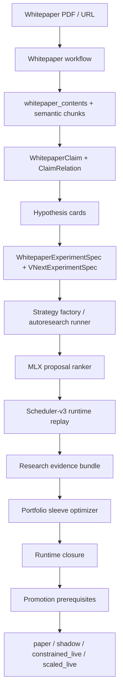

# 71. Torghut Whitepaper Autoresearch Profit-Target Strategy Factory (2026-04-21)

Status: Ready for implementation
Date: `2026-04-21`
Owner: Torghut research and runtime lane
Scope: Implement a production autoresearch system that reads whitepapers, extracts typed trading
hypotheses, generates families/sleeves/algorithms/configurations, prioritizes them with MLX, proves
them through runtime-native replay, and assembles a portfolio candidate targeting at least `$500`
post-cost net PnL per trading day.

Extends:

- `docs/torghut/design-system/v6/69-torghut-harness-v2-strategy-discovery-and-whitepaper-research-factory-2026-04-07.md`
- `docs/torghut/design-system/v6/70-torghut-mlx-autoresearch-and-apple-silicon-research-lane-2026-04-10.md`
- `docs/torghut/design-system/v6/68-torghut-strategy-factory-formal-validity-and-sequential-promotion-2026-04-04.md`
- `docs/torghut/design-system/v6/54-torghut-research-backed-sleeves-and-this-week-holdout-proof-2026-03-27.md`
- `docs/torghut/design-system/v6/51-torghut-promotion-certificate-and-segment-firebreak-handoff-2026-03-19.md`

## Executive Summary

The production target is not "find one magic strategy." The target is a repeatable research machine
that can discover and prove a portfolio of small, diverse sleeves whose combined post-cost evidence
meets the `$500/day` objective with bounded concentration, drawdown, slippage, and promotion risk.

The system has five hard responsibilities:

1. Turn whitepapers into typed, auditable hypotheses.
2. Compile hypotheses into bounded Torghut candidate specs, not arbitrary code.
3. Use MLX to rank and allocate research compute toward promising candidates.
4. Use scheduler-v3/runtime replay as the only source of performance truth.
5. Promote only portfolio candidates that satisfy the profit target and all runtime closure gates.

This document is the implementation contract. It names the current in-tree foundations, the missing
modules, the schemas, the scoring logic, the tests, and the rollout order.

## Current Codebase State

Torghut already has the right base pieces. The implementation should compose and harden them instead
of building a parallel system.

### Whitepaper Intake and Persistence

Current source paths:

- `services/torghut/app/whitepapers/workflow.py`
- `docs/torghut/whitepaper-research-workflow.md`
- `services/torghut/app/models/entities.py`
- migrations under `services/torghut/migrations/versions/`

Already present:

- Whitepaper workflow accepts GitHub issue payloads with a PDF URL, stores the PDF in Ceph, creates a
  DB run, dispatches an AgentRun, and finalizes persisted synthesis/verdict/artifacts.
- Whitepaper persistence includes documents, versions, contents, analysis runs, steps, AgentRuns,
  syntheses, viability verdicts, artifacts, engineering triggers, rollout transitions, semantic
  chunks, and embeddings.
- Structured whitepaper extraction models already exist:
  - `WhitepaperClaim`
  - `WhitepaperClaimRelation`
  - `WhitepaperStrategyTemplate`
  - `WhitepaperExperimentSpec`
  - `WhitepaperContradictionEvent`

Implementation decision:

- Reuse these tables as the source of truth for paper-derived claims and experiment specs.
- Add only the minimal new tables needed for autoresearch run state, portfolio assembly, and MLX
  model lineage.

### Strategy Factory

Current source paths:

- `services/torghut/scripts/run_strategy_factory_v2.py`
- `services/torghut/app/trading/discovery/validation.py`
- `services/torghut/app/trading/alpha/lane.py`
- `services/torghut/tests/test_run_strategy_factory_v2.py`

Already present:

- `run_strategy_factory_v2.py` loads `VNextExperimentSpec` rows, compiles sweep configs, executes
  `run_consistent_profitability_frontier`, writes artifacts, and persists `VNextExperimentRun`.
- Strategy factory validation emits formal validity, CSCV/PBO proxy, deflated-Sharpe proxy,
  selection-bias adjustment, execution reality, posterior edge, baseline comparison, economic
  validity, stress results, cost calibration, and sequential trial payloads.
- The current validation helper is still TSMOM-shaped. It needs to become family-agnostic.

Implementation decision:

- Keep `VNextExperimentSpec` as the bridge from paper-derived hypotheses to executable experiment
  sweeps.
- Generalize `build_strategy_factory_evaluation` from `tsmom` to a pluggable family evaluator.

### MLX Autoresearch

Current source paths:

- `services/torghut/app/trading/discovery/autoresearch.py`
- `services/torghut/app/trading/discovery/mlx_features.py`
- `services/torghut/app/trading/discovery/mlx_proposal_models.py`
- `services/torghut/app/trading/discovery/mlx_snapshot.py`
- `services/torghut/app/trading/discovery/mlx_notebook_exports.py`
- `services/torghut/scripts/run_strategy_autoresearch_loop.py`
- `services/torghut/tests/test_mlx_autoresearch.py`
- `services/torghut/tests/test_strategy_autoresearch.py`

Already present:

- Strategy autoresearch programs define objective, snapshot policy, forbidden mutations, proposal
  model policy, replay budget, runtime closure policy, parity requirements, and promotion policy.
- MLX snapshot manifests and signal bundles are emitted.
- Candidate descriptors are converted into numeric vectors.
- Proposal scoring supports `backend_preference: mlx` with NumPy fallback.
- The current proposal model is ranking-only and heuristic. It is the right v0 boundary, but not the
  final production ranker.

Implementation decision:

- Keep MLX as a proposal and portfolio-assembly accelerator.
- Do not let MLX approve candidates, bypass replay, or write live runtime config.
- Replace the heuristic ranker with a learned ranking model trained from the experiment ledger.

### Objective and Promotion Truth

Current source paths:

- `services/torghut/app/trading/discovery/objectives.py`
- `services/torghut/app/trading/discovery/runtime_closure.py`
- `services/torghut/app/trading/discovery/promotion_contract.py`
- `services/torghut/app/trading/autonomy/policy_checks.py`
- `services/torghut/app/trading/autonomy/evidence.py`

Already present:

- Objective vetoes include active-day ratio, daily notional, best-day share, worst-day loss,
  drawdown, regime-slice pass rate, and stale-tape rejection.
- Runtime closure writes replay, approval, promotion, rollback, and shadow-validation artifacts.
- Portfolio-aware runtime closure has microbar sleeve materialization hooks.
- Promotion checks already consume strategy-factory evidence and portfolio-promotion summaries.

Implementation decision:

- `$500/day` is a portfolio-level objective.
- Single sleeves can be below `$500/day` if they improve the portfolio objective after correlation,
  concentration, and risk penalties.
- A candidate is never called production-ready until runtime closure and shadow evidence pass.

## Target Architecture



The loop is continuous:

1. New whitepapers add claims.
2. Claims compile into hypothesis cards.
3. Hypothesis cards compile into candidate specs.
4. Candidate specs produce experiments.
5. Experiments produce replay evidence.
6. Replay evidence trains the next MLX proposal model.
7. Portfolio assembly picks the best sleeve set for the `$500/day` objective.
8. Runtime closure determines whether the portfolio can advance stages.

## Core Production Contracts

### 1. Hypothesis Card

Add `services/torghut/app/trading/discovery/hypothesis_cards.py`.

Every whitepaper-derived idea must compile to this structure before any experiment is run:

```python
@dataclass(frozen=True)
class HypothesisCard:
    schema_version: Literal['torghut.hypothesis-card.v1']
    hypothesis_id: str
    source_run_id: str
    source_claim_ids: tuple[str, ...]
    mechanism: str
    asset_scope: str
    horizon_scope: str
    expected_direction: str
    required_features: tuple[str, ...]
    entry_motifs: tuple[str, ...]
    exit_motifs: tuple[str, ...]
    risk_controls: tuple[str, ...]
    expected_regimes: tuple[str, ...]
    failure_modes: tuple[str, ...]
    implementation_constraints: Mapping[str, Any]
    confidence: Decimal
```

Rules:

- `source_claim_ids` must reference existing `WhitepaperClaim.claim_id` rows.
- `mechanism` must describe an economic or microstructure reason, not only a statistical pattern.
- `required_features` must map to existing feature contracts or generate a missing-feature blocker.
- `failure_modes` must be converted into replay/stress tests.
- Cards with confidence below the configured threshold are stored but not executed.

### 2. Candidate Spec

Add `services/torghut/app/trading/discovery/candidate_specs.py`.

Hypothesis cards compile into candidate specs:

```python
@dataclass(frozen=True)
class CandidateSpec:
    schema_version: Literal['torghut.candidate-spec.v1']
    candidate_spec_id: str
    hypothesis_id: str
    family_template_id: str
    candidate_kind: Literal['family', 'sleeve', 'portfolio', 'algorithm', 'configuration']
    runtime_family: str
    runtime_strategy_name: str
    feature_contract: Mapping[str, Any]
    parameter_space: Mapping[str, Any]
    strategy_overrides: Mapping[str, Any]
    objective: Mapping[str, Any]
    hard_vetoes: Mapping[str, Any]
    expected_failure_modes: tuple[str, ...]
    promotion_contract: Mapping[str, Any]
```

Rules:

- The compiler emits `WhitepaperExperimentSpec` for whitepaper lineage.
- The compiler mirrors executable rows into `VNextExperimentSpec` for `run_strategy_factory_v2.py`.
- `candidate_kind='algorithm'` is not executable until mapped to a runtime family or feature
  transform. Free-form generated strategy code stays out of the first production wave.
- Any missing feature, runtime family, strategy name, or seed sweep blocks execution.

### 3. Portfolio Candidate Spec

Add `services/torghut/app/trading/discovery/portfolio_candidates.py`.

Portfolio candidates are first-class. They are not summaries of the "best" single strategy.

```python
@dataclass(frozen=True)
class PortfolioCandidateSpec:
    schema_version: Literal['torghut.portfolio-candidate-spec.v1']
    portfolio_candidate_id: str
    source_candidate_ids: tuple[str, ...]
    target_net_pnl_per_day: Decimal
    sleeves: tuple[Mapping[str, Any], ...]
    capital_budget: Mapping[str, Any]
    correlation_budget: Mapping[str, Any]
    drawdown_budget: Mapping[str, Any]
    evidence_refs: tuple[str, ...]
```

Each sleeve includes:

- `candidate_id`
- `side`
- `family_template_id`
- `runtime_family`
- `runtime_strategy_name`
- `entry_window`
- `exit_policy`
- `symbol_policy`
- `weight`
- `max_notional_per_trade`
- `max_position_pct_equity`
- `expected_net_pnl_per_day`
- `risk_contribution`
- `correlation_cluster`

Rules:

- The portfolio target is `sum(weighted_post_cost_net_pnl_per_day) >= 500`.
- No single sleeve may contribute more than the configured concentration share unless explicitly
  approved by a promotion policy.
- Positive candidates that duplicate the same symbol/time/regime exposure are treated as one risk
  cluster.

### 4. Evidence Bundle

Add `services/torghut/app/trading/discovery/evidence_bundles.py`.

Every candidate and portfolio must produce a canonical evidence bundle:

```python
@dataclass(frozen=True)
class CandidateEvidenceBundle:
    schema_version: Literal['torghut.candidate-evidence-bundle.v1']
    candidate_id: str
    dataset_snapshot_id: str
    feature_spec_hash: str
    code_commit: str
    replay_artifact_refs: tuple[str, ...]
    objective_scorecard: Mapping[str, Any]
    fold_metrics: tuple[Mapping[str, Any], ...]
    stress_metrics: tuple[Mapping[str, Any], ...]
    cost_calibration: Mapping[str, Any]
    null_comparator: Mapping[str, Any]
    promotion_readiness: Mapping[str, Any]
```

Rules:

- Evidence bundles are hash-addressed.
- A bundle with stale tape, missing snapshot, or missing cost assumptions is invalid.
- The bundle is the training row for future MLX proposal ranking.

## Profit Target Contract

The production objective is:

```text
portfolio_post_cost_net_pnl_per_day >= 500
```

The candidate must also satisfy:

```text
active_day_ratio >= 0.90
positive_day_ratio >= 0.60
best_day_share <= 0.25
worst_day_loss <= 350
max_drawdown <= 900
avg_filled_notional_per_day >= 300000
regime_slice_pass_rate >= 0.45
posterior_edge_lower > 0
shadow_parity_status == within_budget
```

For a single sleeve:

```text
sleeve_score =
  post_cost_net_pnl_per_day
  + active_day_ratio * 300
  + positive_day_ratio * 150
  + regime_slice_pass_rate * 100
  + rolling_3d_lower_bound
  + rolling_5d_lower_bound
  - worst_day_loss * 0.50
  - max_drawdown * 0.10
  - best_day_share * 500
  - symbol_concentration_share * 100
  - entry_family_contribution_share * 25
```

For a portfolio:

```text
portfolio_score =
  sum(weighted_sleeve_post_cost_net_pnl_per_day)
  + diversification_bonus
  + regime_coverage_bonus
  - correlation_penalty
  - capital_concentration_penalty
  - drawdown_penalty
  - stale_evidence_penalty
  - promotion_missing_evidence_penalty
```

A sleeve can lose in isolation and still be admitted if it reduces portfolio drawdown or correlation
enough to improve the portfolio objective. A profitable sleeve is rejected if its edge comes from one
symbol, one day, stale data, or missing execution realism.

## Autoresearch Runner

Add `services/torghut/scripts/run_whitepaper_autoresearch_profit_target.py`.

This is the production orchestrator. It runs one complete research epoch:

1. Load eligible completed whitepaper analysis runs.
2. Compile or refresh `HypothesisCard` rows from claims and claim relations.
3. Compile eligible hypotheses into `WhitepaperExperimentSpec` and `VNextExperimentSpec`.
4. Build an immutable MLX snapshot manifest for the epoch.
5. Rank candidate specs with the MLX proposal model.
6. Execute a bounded top-K and exploration-slot replay budget through runtime-native replay.
7. Persist evidence bundles.
8. Assemble portfolio candidates from replayed sleeves.
9. Run runtime closure for the best portfolio candidate.
10. Write one epoch summary, notebooks, and promotion-readiness artifacts.

Inputs:

```text
--output-dir
--paper-run-id repeatable
--target-net-pnl-per-day default 500
--max-candidates default 64
--top-k default 16
--exploration-slots default 8
--portfolio-size-min default 2
--portfolio-size-max default 8
--train-days
--holdout-days
--full-window-start-date
--full-window-end-date
--strategy-configmap
--family-template-dir
--persist-results / --no-persist-results
```

Outputs:

```text
summary.json
epoch-manifest.json
hypothesis-cards.jsonl
candidate-specs.jsonl
mlx-proposal-scores.jsonl
candidate-evidence-bundles.jsonl
portfolio-candidates.jsonl
portfolio-optimizer-report.json
runtime-closure/
whitepaper-autoresearch-diagnostics.ipynb
```

Exit behavior:

- `0`: epoch completed and all artifacts are written.
- `1`: invalid invocation or failed required infrastructure.
- `2`: epoch completed but no candidate met execution eligibility.
- `3`: replay failed after artifacts captured error state.

No exit code should imply live-promotion approval. Promotion approval is a separate gate artifact.

## MLX Proposal Model

Upgrade `services/torghut/app/trading/discovery/mlx_proposal_models.py`.

### V1 Model

Implement a compact ranking model:

- descriptor encoder: dense numeric + categorical one-hot features
- paper encoder: claim type, mechanism type, horizon, asset scope, feature family ids
- outcome label: replay-adjusted target, not raw backtest score
- objective: pairwise ranking loss or pointwise regression to replay-adjusted score
- backend: `mlx` on Apple Silicon, `numpy-fallback` for tests and non-Darwin environments

Training rows come from:

- `history.jsonl`
- `mlx-candidate-descriptors.jsonl`
- `candidate-evidence-bundles.jsonl`
- `VNextExperimentRun`
- `ResearchCandidate`
- `ResearchValidationTest`
- `ResearchStressMetrics`

### Proposal Feature Vector

Add `services/torghut/app/trading/discovery/mlx_training_data.py`.

Feature groups:

1. candidate mechanics:
   - family template id
   - runtime family
   - side policy
   - entry window
   - max hold
   - rank count
   - required prior-day features
   - required cross-sectional features
   - quote quality gate
2. paper provenance:
   - claim type
   - mechanism type
   - paper confidence
   - number of supporting claims
   - contradiction count
3. replay priors:
   - historical family hit rate
   - median post-cost net PnL/day
   - false-positive rate
   - cost stress pass rate
   - shadow parity pass rate
4. portfolio fit:
   - correlation cluster id
   - overlap with current candidate pool
   - regime coverage
   - capital capacity estimate

The model emits:

```json
{
  "candidate_spec_id": "spec-...",
  "proposal_score": 12.31,
  "rank": 1,
  "backend": "mlx",
  "model_id": "mlx-ranker-v1-...",
  "selection_reason": "exploitation",
  "feature_hash": "..."
}
```

Rules:

- Low model confidence increases exploration slots; it does not block replay.
- Model drift is measured by rank-bucket lift against actual replay results.
- A model with negative lift is automatically demoted to heuristic ranking.

## Portfolio Sleeve Optimizer

Add `services/torghut/app/trading/discovery/portfolio_optimizer.py`.

V1 should be deterministic and auditable:

1. Filter sleeves by hard vetoes and promotion readiness.
2. Group sleeves by risk cluster:
   - symbol overlap
   - family template
   - entry window
   - side
   - regime envelope
3. Build daily net vectors from replay artifacts.
4. Estimate pairwise correlation on overlapping dates.
5. Greedily assemble a Pareto portfolio:
   - start with highest adjusted sleeve score
   - add sleeves with positive marginal portfolio score
   - cap cluster exposure
   - cap single-sleeve contribution
   - require post-cost target
6. Emit a portfolio candidate spec and optimizer report.

V2 can add a convex or MLX-accelerated optimizer, but V1 must be transparent.

Acceptance contract:

```text
portfolio_net_pnl_per_day >= 500
posterior_edge_lower > 0
max_cluster_contribution_share <= 0.40
max_single_day_contribution_share <= 0.25
max_single_symbol_contribution_share <= 0.35
portfolio_active_day_ratio >= 0.90
portfolio_positive_day_ratio >= 0.60
```

## Whitepaper Claim Compiler

Add `services/torghut/app/whitepapers/claim_compiler.py`.

The compiler consumes:

- `WhitepaperContent`
- `WhitepaperSynthesis`
- `WhitepaperViabilityVerdict`
- `WhitepaperClaim`
- `WhitepaperClaimRelation`

It produces or updates:

- `WhitepaperClaim`
- `WhitepaperClaimRelation`
- `WhitepaperStrategyTemplate`
- `WhitepaperExperimentSpec`

Compiler steps:

1. Normalize source claims into a stable JSON representation.
2. Classify each claim:
   - `signal_mechanism`
   - `feature_recipe`
   - `risk_constraint`
   - `market_regime`
   - `execution_assumption`
   - `validation_requirement`
3. Link relations:
   - `supports`
   - `contradicts`
   - `requires_feature`
   - `requires_regime`
   - `invalidates`
   - `extends`
4. Generate hypothesis cards only for claim subgraphs with:
   - at least one mechanism
   - at least one executable feature recipe or feature-missing blocker
   - at least one risk/validation constraint
5. Write deterministic ids based on claim ids and normalized payload hash.

## Family and Algorithm Search Grammar

The first production grammar should cover five executable lanes:

1. `breakout_reclaim_v2`
   - continuation after open-range reclaim
   - long-biased
   - useful for momentum/attention papers
2. `washout_rebound_v2`
   - intraday oversold rebound
   - long-biased
   - useful for liquidity shock/reversal papers
3. `momentum_pullback_v1`
   - trend continuation after controlled pullback
   - long-biased
   - useful for time-series momentum papers
4. `mean_reversion_rebound_v1`
   - cross-sectional rebound and mean reversion
   - long-biased
   - useful for overreaction and microstructure papers
5. `microbar_cross_sectional_pairs_v1`
   - long/short portfolio sleeves
   - portfolio-aware
   - useful for order-flow, short-horizon rank, and relative-strength papers

New family templates are allowed only through this process:

1. A whitepaper claim graph proposes a new `WhitepaperStrategyTemplate`.
2. The template compiler proves required runtime fields are complete.
3. A static fixture compiles the template into a valid sweep.
4. A unit test proves the family cannot bypass objective vetoes.
5. A runtime closure test proves promotion remains blocked without parity and shadow evidence.

## Runtime Closure Integration

Extend `services/torghut/app/trading/discovery/runtime_closure.py`.

Required changes:

1. Accept `PortfolioCandidateSpec`.
2. Materialize runtime strategies for every sleeve, not only the current microbar helper path.
3. Emit `portfolio_promotion_v2` with complete policy refs:
   - promotion policy ref
   - risk profile ref
   - sizing policy ref
   - execution policy ref
4. Include portfolio optimizer evidence in promotion prerequisites.
5. Require shadow validation for every materialized strategy.

Promotion states:

```text
research_candidate
pending_runtime_parity
pending_approval_replay
pending_shadow_validation
ready_for_promotion_review
paper
constrained_live
scaled_live
quarantine
retired
```

The runner may create `ready_for_promotion_review`. It must not create `constrained_live` or
`scaled_live`.

## Persistence Plan

Reuse existing tables first:

- `whitepaper_claims`
- `whitepaper_claim_relations`
- `whitepaper_strategy_templates`
- `whitepaper_experiment_specs`
- `vnext_experiment_specs`
- `vnext_experiment_runs`
- `research_runs`
- `research_candidates`
- `research_validation_tests`
- `research_stress_metrics`
- `research_cost_calibrations`
- `research_sequential_trials`
- `research_promotions`
- `vnext_promotion_decisions`
- `strategy_hypotheses`
- `strategy_hypothesis_metric_windows`

Add one migration with these tables:

### `autoresearch_epochs`

Top-level epoch record.

Columns:

- `epoch_id` unique
- `status`
- `target_net_pnl_per_day`
- `paper_run_ids_json`
- `snapshot_manifest_json`
- `runner_config_json`
- `summary_json`
- `started_at`
- `completed_at`
- `failure_reason`

### `autoresearch_candidate_specs`

Normalized candidate spec ledger.

Columns:

- `candidate_spec_id` unique
- `epoch_id`
- `hypothesis_id`
- `candidate_kind`
- `family_template_id`
- `payload_json`
- `payload_hash`
- `status`
- `blockers_json`

### `autoresearch_proposal_scores`

MLX/heuristic proposal score ledger.

Columns:

- `epoch_id`
- `candidate_spec_id`
- `model_id`
- `backend`
- `proposal_score`
- `rank`
- `selection_reason`
- `feature_hash`
- `payload_json`

### `autoresearch_portfolio_candidates`

Portfolio assembly ledger.

Columns:

- `portfolio_candidate_id` unique
- `epoch_id`
- `source_candidate_ids_json`
- `target_net_pnl_per_day`
- `objective_scorecard_json`
- `optimizer_report_json`
- `payload_json`
- `status`

## Observability

Add one epoch summary endpoint:

```text
GET /trading/autoresearch/epochs/{epoch_id}
```

Add one list endpoint:

```text
GET /trading/autoresearch/epochs?status=...
```

Dashboard fields:

- epoch status
- paper count
- claim count
- hypothesis count
- candidate spec count
- replayed candidate count
- portfolio candidate count
- best portfolio net PnL/day
- best portfolio active day ratio
- best portfolio positive day ratio
- blocked promotion reasons
- MLX rank-bucket lift
- false-positive table
- best false-negative table

## Implementation Workstreams

### Workstream 1: Typed Artifact Layer

Files:

- add `services/torghut/app/trading/discovery/hypothesis_cards.py`
- add `services/torghut/app/trading/discovery/candidate_specs.py`
- add `services/torghut/app/trading/discovery/evidence_bundles.py`
- add `services/torghut/tests/test_hypothesis_cards.py`
- add `services/torghut/tests/test_candidate_specs.py`

Definition of done:

- deterministic ids and hashes
- JSON round-trip tests
- invalid payload tests
- feature-missing blockers
- no live runtime config writes

### Workstream 2: Whitepaper Claim Compiler

Files:

- add `services/torghut/app/whitepapers/claim_compiler.py`
- add `services/torghut/scripts/compile_whitepaper_claims.py`
- update `services/torghut/app/whitepapers/workflow.py`
- add `services/torghut/tests/test_whitepaper_claim_compiler.py`

Definition of done:

- completed whitepaper runs compile into `WhitepaperClaim` and `WhitepaperClaimRelation`
- claim subgraphs compile into `HypothesisCard`
- contradiction events block dependent candidate specs
- deterministic idempotency tests pass

### Workstream 3: Candidate Spec Compiler

Files:

- add `services/torghut/app/trading/discovery/whitepaper_candidate_compiler.py`
- update `services/torghut/scripts/run_strategy_factory_v2.py`
- add `services/torghut/tests/test_whitepaper_candidate_compiler.py`

Definition of done:

- `WhitepaperExperimentSpec` rows mirror into executable `VNextExperimentSpec` rows
- family template ids and seed sweeps resolve
- missing runtime harness fields block execution
- compiled sweeps contain `$500/day` objective and hard vetoes

### Workstream 4: MLX Ranker V1

Files:

- add `services/torghut/app/trading/discovery/mlx_training_data.py`
- update `services/torghut/app/trading/discovery/mlx_proposal_models.py`
- add `services/torghut/scripts/train_mlx_autoresearch_ranker.py`
- add `services/torghut/tests/test_mlx_training_data.py`
- extend `services/torghut/tests/test_mlx_autoresearch.py`

Definition of done:

- training dataset builds from evidence bundles and history rows
- MLX and NumPy fallback produce deterministic ranks for fixed fixtures
- rank-bucket lift is computed after replay
- negative-lift model is demoted automatically

### Workstream 5: Portfolio Sleeve Optimizer

Files:

- add `services/torghut/app/trading/discovery/portfolio_optimizer.py`
- update `services/torghut/app/trading/discovery/runtime_closure.py`
- add `services/torghut/tests/test_portfolio_optimizer.py`
- extend `services/torghut/tests/test_runtime_closure.py`

Definition of done:

- optimizer assembles a portfolio candidate from replayed sleeves
- target `$500/day` is computed after costs
- correlation, concentration, and drawdown constraints are enforced
- runtime closure materializes all sleeve strategies
- promotion stays blocked without parity and shadow evidence

### Workstream 6: Production Runner

Files:

- add `services/torghut/scripts/run_whitepaper_autoresearch_profit_target.py`
- add `services/torghut/app/trading/discovery/whitepaper_autoresearch_notebooks.py`
- add `services/torghut/tests/test_run_whitepaper_autoresearch_profit_target.py`

Definition of done:

- one command runs the full epoch against fixtures
- all artifacts are written incrementally
- failures write error summaries and do not lose partial evidence
- results persist when `--persist-results` is enabled

### Workstream 7: API and UI Surface

Files:

- update `services/torghut/app/main.py`
- add `services/torghut/app/trading/autoresearch_routes.py`
- update Jangar Torghut quant routes as needed
- add API tests

Definition of done:

- epoch summary is queryable by id
- epoch list supports status filtering
- blocked promotion reasons are visible
- best portfolio candidate and sleeve composition are visible

## Test Plan

Targeted tests:

```bash
cd services/torghut
uv sync --frozen --extra dev
uv run --frozen pytest tests/test_hypothesis_cards.py
uv run --frozen pytest tests/test_candidate_specs.py
uv run --frozen pytest tests/test_whitepaper_claim_compiler.py
uv run --frozen pytest tests/test_whitepaper_candidate_compiler.py
uv run --frozen pytest tests/test_mlx_autoresearch.py
uv run --frozen pytest tests/test_mlx_training_data.py
uv run --frozen pytest tests/test_portfolio_optimizer.py
uv run --frozen pytest tests/test_runtime_closure.py
uv run --frozen pytest tests/test_run_strategy_factory_v2.py
uv run --frozen pytest tests/test_run_whitepaper_autoresearch_profit_target.py
```

Type checks:

```bash
cd services/torghut
uv run --frozen pyright --project pyrightconfig.json
uv run --frozen pyright --project pyrightconfig.alpha.json
uv run --frozen pyright --project pyrightconfig.scripts.json
```

Repo gate for a PR:

```bash
go test ./services/...
bun run format
bun run lint:argocd
```

Use narrower gates per touched path, then run the full required Torghut pyright trio before reporting
the implementation ready.

## PR Sequence

### PR 1: Artifact Contracts

Deliver:

- hypothesis card schema
- candidate spec schema
- evidence bundle schema
- JSON/hash tests

Merge condition:

- no database behavior change
- all contract tests green

### PR 2: Whitepaper Claim Compiler

Deliver:

- claim compiler
- claim relation compiler
- contradiction blocking
- idempotent script

Merge condition:

- fixture whitepaper run compiles claims and relations deterministically

### PR 3: Candidate Spec Compiler

Deliver:

- hypothesis-to-candidate compiler
- `WhitepaperExperimentSpec` to `VNextExperimentSpec` mirror
- strategy factory integration

Merge condition:

- fixture claims produce executable sweeps
- missing family/runtime fields block execution

### PR 4: MLX Ranker V1

Deliver:

- training data builder
- ranker model
- rank-bucket lift diagnostics
- model demotion behavior

Merge condition:

- deterministic NumPy fallback tests
- MLX path works on Apple Silicon

### PR 5: Portfolio Optimizer

Deliver:

- sleeve objective aggregation
- risk cluster model
- greedy Pareto portfolio assembly
- runtime closure portfolio candidate support

Merge condition:

- target `$500/day` fixture portfolio passes
- concentration and correlation rejection tests pass

### PR 6: End-to-End Runner

Deliver:

- `run_whitepaper_autoresearch_profit_target.py`
- epoch persistence
- notebooks
- summary artifacts

Merge condition:

- fixture whitepaper-to-portfolio epoch completes
- partial-failure artifact tests pass

### PR 7: API and Dashboard

Deliver:

- epoch list/detail endpoints
- Jangar visibility
- blocked-reason display

Merge condition:

- operators can inspect paper source, hypothesis, candidate specs, replay evidence, portfolio
  composition, and promotion blockers from one screen.

## Production Runbook

1. Ingest or select completed whitepaper runs.
2. Compile claims:

```bash
cd services/torghut
uv run --frozen python scripts/compile_whitepaper_claims.py --paper-run-id <run-id>
```

3. Run one autoresearch epoch:

```bash
uv run --frozen python scripts/run_whitepaper_autoresearch_profit_target.py \
  --paper-run-id <run-id> \
  --target-net-pnl-per-day 500 \
  --top-k 16 \
  --exploration-slots 8 \
  --portfolio-size-min 2 \
  --portfolio-size-max 8 \
  --output-dir /tmp/torghut-whitepaper-autoresearch/<epoch-id>
```

4. Inspect:

```bash
jq '.best_portfolio_candidate' /tmp/torghut-whitepaper-autoresearch/<epoch-id>/summary.json
jq '.promotion_readiness' /tmp/torghut-whitepaper-autoresearch/<epoch-id>/summary.json
```

5. If promotion prerequisites are blocked, attach the missing runtime parity, approval replay, or
   shadow validation evidence. Do not override the gate from the runner.

## Definition of Production Ready

The system is production ready when:

1. A completed whitepaper run can compile into typed claims, relations, hypotheses, candidate specs,
   and executable sweeps without manual editing.
2. MLX ranks candidate specs and reports rank-bucket lift against replay results.
3. Runtime-native replay evaluates a bounded top-K plus exploration set.
4. Evidence bundles persist all objective, cost, stress, and promotion-readiness data.
5. The portfolio optimizer can assemble a sleeve set that meets the `$500/day` objective under the
   configured risk constraints.
6. Runtime closure can materialize the portfolio candidate and keep promotion blocked until parity,
   approval, and shadow gates pass.
7. Operators can see the complete chain from paper claim to sleeve to replay to portfolio candidate
   to promotion blocker.
8. The pyright trio and targeted tests pass.

## Final Implementation Rule

The autoresearch system is allowed to be aggressive in hypothesis generation and compute allocation.
It is conservative everywhere capital, promotion, or runtime configuration is involved.

The strongest production behavior is this:

- read more papers;
- generate more bounded hypotheses;
- replay only the most promising and most informative candidates;
- assemble diversified sleeves;
- reject stale or concentrated evidence;
- promote only what runtime closure proves.
