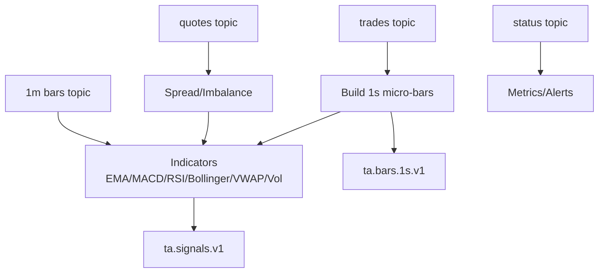

# Flink Technical Analysis Job

> Note: Canonical production-facing design docs live in `docs/torghut/design-system/README.md` (v1). This document is supporting material and may drift from the current deployed manifests.

## Objective

Produce near real-time TA outputs (≤300-500 ms p99 event-to-signal) from Alpaca-derived Kafka topics using Flink.

## Inputs

- Kafka topics (from forwarder): trades, quotes, 1m bars (`is_final` flag), status. Keyed by `symbol`, partitions=1.
- Event time: Alpaca `t`; ingest time: forwarder `ingest_ts`.

Recommended connector settings (Table API/SQL notation):

- `scan.topic-partition-discovery.interval` = 1 min (future multi-symbol)
- `scan.startup.mode` = latest (prod) or earliest (replay tests)
- `properties.group.id` = flink-ta
- `properties.isolation.level` = read_committed
- `value.format` = avro or json; `json.ignore-parse-errors` = false

## Outputs

- `ta.bars.1s.v1`: micro-bars (O/H/L/C/V, vwap1s, count); `is_final=true`.
- `ta.signals.v1`: EMA12/26, MACD+signal/hist, RSI14, Bollinger20/2, VWAP (session & rolling), spread/imbalance, realized vol.
- `ta.status.v1` (optional): heartbeat with watermark lag and last event time (set `TA_STATUS_TOPIC` to enable).

## Envelope / Schema

Common fields: `ingest_ts`, `event_ts`, `feed`, `channel`, `symbol`, `seq`, `payload`, `is_final?`, `source`, `window{size,step,start,end}`, `version`.
Use Avro or JSON with Karapace; backward-compatible evolution.

## Flink Job Design

- Runtime: Flink 2.0.1 (Java 21); Operator 1.13.x; Kafka connector 4.0.1-2.0 (FLIP-27/143).
- Source: `KafkaSource` with watermark `event_time - 2s` (tunable); idle timeout for idle partitions.
- Processing:
  - Trades -> hopping 1s/1s to micro-bars (O/H/L/C/V, vwap).
  - Bars (1s + upstream 1m) -> EMA12/26 -> MACD; RSI14; Bollinger20/2; VWAP (session & rolling window); realized vol (30-60s); join with quotes for spread/imbalance.
  - Dedup optional: drop duplicates by trade id and (event_ts, symbol) for quotes/bars before aggregation.
- Sinks: `KafkaSink` to TA topics with `delivery.guarantee=exactly-once`, idempotent/transactional; partitioner fixed (key=symbol).

### Window/indicator details

- Micro-bars: hopping size=1s, step=1s (tumbling 1s equivalent) keyed by symbol; include count & vwap.
- EMA: alpha = 2/(N+1) with N=12,26; seed with first bar close.
- MACD: ema12-ema26; signal EMA9; hist = macd - signal.
- RSI14: Wilder smoothing on 14-bar window using gains/losses.
- Bollinger: mid = SMA20; upper/lower = mid ± 2\*stddev20.
- VWAP: session accumulator (reset on session boundary) + rolling window (e.g., 5m configurable).
- Realized vol: stddev of log returns over 30-60s (configurable).
- Spread/imbalance: bid/ask spread, (bid_sz - ask_sz)/(bid_sz + ask_sz).

## State & Checkpointing

- Checkpoints every 10 s to MinIO/S3 (`s3a://flink-checkpoints/torghut/technical-analysis/checkpoints`); savepoints enabled under `/savepoints`.
- Transaction timeout aligned with checkpoint timeout + failover budget.
- Restart: fixed-delay 5x with 5 s backoff; backpressure monitoring on.

S3A properties (example):

- `fs.s3a.endpoint`: `http://minio.torghut.svc:9000`
- `fs.s3a.path.style.access`: true
- `fs.s3a.access.key` / `fs.s3a.secret.key`: from Secret
- `fs.s3a.connection.ssl.enabled`: true|false (per MinIO TLS)
- `fs.s3a.fast.upload`: true

## Kubernetes / Argo

- Kustomization under `argocd/applications/torghut/ta/` (FlinkDeployment `flinkdeployment.yaml`).
- FlinkDeployment (application mode) image includes the fat jar at `/opt/flink/usrlib/app.jar`.
- Secrets: Strimzi KafkaUser (SCRAM/TLS) in torghut namespace or reflected; MinIO creds via `observability-minio-creds` (reflected to torghut).
- Resources (initial): JM 1 CPU/2Gi; TM 1-2 CPU/3-4Gi; parallelism 1.
- ServiceAccount with least privilege; network policy to Kafka, MinIO, registry only.

## Build & Deploy

- Jar: `cd services/dorvud && ./gradlew :technical-analysis-flink:uberJar`
- Image (amd64): `docker buildx build --platform linux/amd64 -f services/dorvud/technical-analysis-flink/Dockerfile -t registry.ide-newton.ts.net/lab/torghut-ta:<tag> services/dorvud --push`
- Apply: `kubectl -n torghut apply -k argocd/applications/torghut/ta/` or run `bun packages/scripts/src/torghut/deploy-service.ts` to build, push, and wait for `flinkdeployment/torghut-ta` Ready.
- Checkpoint/Savepoint bucket: `s3a://flink-checkpoints/torghut/technical-analysis/`; provide MinIO creds via `TA_S3_ACCESS_KEY/TA_S3_SECRET_KEY` and `AWS_ACCESS_KEY_ID/AWS_SECRET_ACCESS_KEY` (S3A credential providers look for AWS env vars).

### Savepoint / upgrade / rollback

- Upgrade flow: trigger savepoint (or last-state), update image tag, redeploy; verify running and checkpointing.
- Rollback: redeploy previous image with last-state or restore from savepoint.
- On exactly-once sinks, prefer `--drain` or allow checkpoint to finish before shutdown to avoid in-flight txn aborts.

### Sink settings (KafkaSink)

- `deliveryGuarantee = EXACTLY_ONCE`
- `transaction.timeout.ms` > checkpoint timeout + failover (e.g., 120s)
- `linger.ms` 20-50; `compression.type` lz4; `enable.idempotence` true
- `acks=all`; `max.in.flight.requests.per.connection=5` (ok with idempotence)

### ClickHouse sink (TA visualization)

- Flink job writes microbars + signals to ClickHouse when `TA_CLICKHOUSE_URL` is set.
- Tables: `torghut.ta_microbars` and `torghut.ta_signals` (ReplacingMergeTree dedup on `(symbol,event_ts,seq)`, TTL 30d).
- Schema init runs inside the torghut-ta Flink job using the DDL at `services/dorvud/technical-analysis-flink/src/main/resources/ta-schema.sql`.
- Required env: `TA_CLICKHOUSE_URL`, `TA_CLICKHOUSE_USERNAME`, `TA_CLICKHOUSE_PASSWORD`, `TA_CLICKHOUSE_BATCH_SIZE`, `TA_CLICKHOUSE_FLUSH_MS`, `TA_CLICKHOUSE_MAX_RETRIES`, `TA_CLICKHOUSE_CONN_TIMEOUT_SECONDS`.

## Observability

- Expose Prometheus-format metrics for scrape into Mimir (existing observability stack). Key: watermark lag, checkpoint age/duration, sink txn failures, restarts.
- Logging to Loki: JSON; include symbol, channel, event_ts, watermark, lag_ms.

Status topic payload (flattened Avro/JSON):

- `watermark_lag_ms`: processing-time lag vs current watermark.
- `last_event_ts`: last observed event timestamp from micro-bars/bars1m.
- `status`: string (default `ok`).
- `heartbeat`: boolean (true when emitted).
- Emission interval: uses the checkpoint interval (override by adjusting `TA_CHECKPOINT_INTERVAL_MS`).

Alert suggestions (Mimir/Alertmanager):

- Checkpoint age > 2× interval
- p99 watermark lag > 1s (tune) or p99 end-to-end lag > 500 ms
- Sink transaction failures >0 in 5m
- JM/TM restart rate > threshold

## Testing & Validation

- Replay FAKEPACA or recorded NVDA slice into Kafka; verify micro-bars and TA signals content and ordering.
- Lag test: p99(now - event_ts) ≤500 ms.
- Failure test: kill JM/TM, confirm restore from last checkpoint, no duplicate outputs (read_committed consumer).
- Schema test: evolve additive field and confirm backward compatibility.
- Load test: sustained message rate near expected peak; observe checkpoint duration, backpressure.

## Schema Registry

- Karapace endpoint: configure in env/properties; auth if enabled.
- Use TopicNameStrategy (default: `<topic>-value`); compatibility: backward.
- Register subjects before deploying job to avoid startup failures.

## Consumer guidance (downstream)

- Use `isolation.level=read_committed` when TA sink runs in exactly-once mode; can switch to read_uncommitted if at-least-once profile is enabled.
- Expect envelope fields (`event_ts`, `ingest_ts`, `seq`, `is_final`, `window`); be tolerant to additive fields.

## Mermaid (processing graph)

