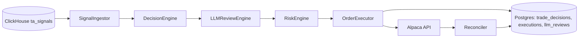

# Torghut LLM Intelligence Layer

## Summary
Introduce an LLM-driven intelligence layer that sits on top of deterministic TA signals and strategy decisions. The layer adds contextual reasoning, veto/approve decisions, and optional sizing adjustments while preserving safety and auditability. It should never bypass deterministic risk controls or trading gates.

## Goals
- Add LLM review on top of deterministic decisions (approve/veto/adjust).
- Provide explainability and traceability (prompt, model, response, rationale, token usage).
- Enforce strict safety: LLM cannot force an order when guards fail.
- Support paper trading by default; live trading requires explicit enablement.

## Non-goals
- Replace deterministic strategies with LLM-only trading.
- Provide news ingestion or full RAG in this phase.
- Execute trades without deterministic checks and idempotency.

## Architecture

Deterministic pipeline (existing):
SignalIngestor -> DecisionEngine -> RiskEngine -> OrderExecutor -> Reconciler

LLM overlay (new):
Deterministic Decision -> LLMReview -> (Approve/Veto/Adjust) -> RiskEngine -> Execution

## Data Flow
1) Deterministic strategy emits a StrategyDecision from TA signals.
2) LLMReviewEngine builds a prompt with signal context, strategy metadata, recent decisions, and optional portfolio snapshot.
3) LLM responds with a structured verdict: approve/veto/adjust, confidence, and rationale.
4) If approved, decision may be adjusted (size, order type). If vetoed, decision is recorded with rationale.
5) RiskEngine runs after LLM review (LLM cannot bypass risk).
6) OrderExecutor submits only when both LLM and risk approve.

## LLM Roles
- Review deterministic decision: is this signal strong enough to trade?
- Provide qualitative context when signals conflict (example: RSI oversold but macro risk).
- Size adjustment (optional): suggest scaling quantity within bounds.
- Explain rationale for audit and debugging.

## Required Schema Additions
Create a table to store LLM reviews (example names; exact schema in migration):
- llm_decision_reviews:
  - id (uuid)
  - trade_decision_id (uuid, FK)
  - model (string)
  - prompt_version (string)
  - input_json (jsonb)
  - response_json (jsonb)
  - verdict (enum: approve, veto, adjust)
  - confidence (float)
  - adjusted_qty (numeric, nullable)
  - rationale (text)
  - tokens_prompt (int, nullable)
  - tokens_completion (int, nullable)
  - created_at (timestamp)

Store a denormalized summary of the LLM verdict on trade_decisions.decision_json as well.

## LLM Interface
Add a new module in torghut:
- services/torghut/app/trading/llm.py
  - LLMReviewEngine
  - LLMClient wrapper (OpenAI)
  - Prompt template loader + versioning

## Prompting
- Use a stable, versioned prompt template (example: prompt_version = "llm-review-v1").
- Provide a strict JSON schema response with enum values only.
- Include a deterministic decision summary + portfolio snapshot + recent decisions.

Example expected LLM response schema:
{
  "verdict": "approve|veto|adjust",
  "confidence": 0.0-1.0,
  "adjusted_qty": number | null,
  "rationale": "short reasoning"
}

## Configuration
Add env vars in `services/torghut/app/config.py`:
- LLM_ENABLED (bool)
- LLM_MODEL (string)
- LLM_PROMPT_VERSION (string)
- LLM_MAX_TOKENS (int)
- LLM_TEMPERATURE (float)
- LLM_TIMEOUT_SECONDS (int)
- LLM_APPROVAL_REQUIRED (bool) # if true, veto on LLM failure
- LLM_ADJUSTMENT_ALLOWED (bool)

## Safety and Guardrails
- LLM cannot bypass TRADING_ENABLED or TRADING_MODE gating.
- LLM cannot override RiskEngine failures.
- For live trading, require LLM approval and a minimum confidence threshold.
- If LLM fails, either default to deterministic (paper) or veto (live).

## Observability
Emit structured logs:
- llm_verdict, confidence, model, prompt_version, decision_id, strategy_id, symbol

Add basic metrics:
- llm_requests_total
- llm_approvals_total
- llm_vetoes_total
- llm_failures_total

## Testing
- Unit tests for prompt formatting and response parsing.
- Unit tests for decision adjustment bounds.
- Integration test: deterministic decision -> LLM approve -> execution row
- Integration test: LLM veto -> no execution

## Rollout
- Default LLM_ENABLED=false in prod.
- Enable in paper first, then gated live with confidence threshold.
- Add a feature flag to disable adjustment and allow only approve/veto.

## Open Questions
- Which context is most valuable for LLM review (recent PnL, macro events)?
- Should LLM be mandatory for all decisions or only for certain strategies?
- Should LLM be used for dynamic sizing or just veto/approve?
