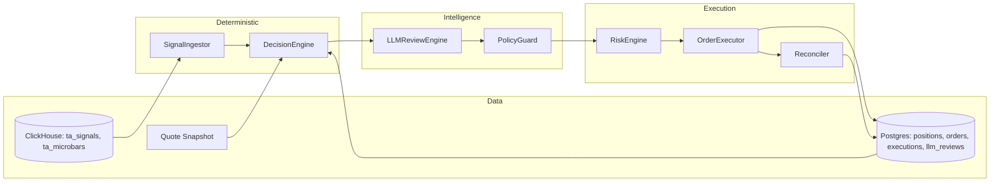
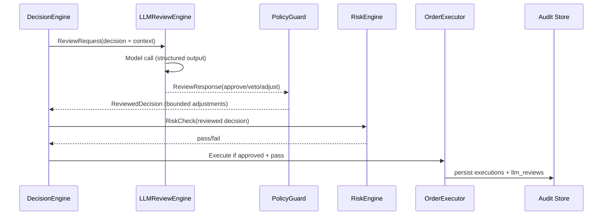

# Torghut LLM Intelligence Layer

## Status
Draft (target: paper trading first)

## Summary
Introduce a deterministic-first intelligence layer that reviews trade decisions using an LLM, adds context-aware veto/approve/adjust recommendations, and records full audit trails. The LLM layer must never bypass deterministic risk gates, and live trading remains fail-closed by default. The design aligns with AI risk management guidance and LLM app security best practices.

## Goals
- Add a policy-constrained LLM review step on top of deterministic decisions.
- Provide traceability: prompts, responses, model versions, and rationale.
- Preserve deterministic risk controls and idempotency guarantees.
- Enable paper trading and shadow evaluation before any live enablement.

## Non-goals
- Replacing deterministic strategies with LLM-only trading.
- Real-time news ingestion or external RAG as a dependency.
- Autonomous trade execution without deterministic risk checks.

## Design Principles
- Deterministic-first: LLM is advisory and cannot force execution.
- Fail-closed for live: any LLM error => veto (live) or fallback (paper).
- Minimal, curated context: no untrusted free text in prompts.
- Structured outputs only: JSON schema validation and strict parsing.
- Full auditability: every decision is reproducible and explainable.

## Architecture Overview

Deterministic pipeline (existing):
SignalIngestor -> DecisionEngine -> RiskEngine -> OrderExecutor -> Reconciler

LLM overlay (new):
DecisionEngine -> LLMReviewEngine -> PolicyGuard -> RiskEngine -> OrderExecutor





## Component Responsibilities
- SignalIngestor: reads TA features/signals from ClickHouse.
- DecisionEngine: creates StrategyDecision objects deterministically.
- LLMReviewEngine: builds prompt, calls LLM, validates JSON response.
- PolicyGuard: clamps adjustments to allowed bounds and enforces policy.
- RiskEngine: final deterministic risk checks (limits, notional, positions).
- OrderExecutor: submits to broker and persists execution state.
- Reconciler: syncs broker state, closes loops, updates positions.

## Intelligence Layer Behaviors
- Approve: LLM agrees with decision and passes through unchanged.
- Veto: decision is dropped and recorded with rationale.
- Adjust: LLM proposes size/urgency adjustments within strict bounds.

### Adjustment Policy (examples)
- max_qty_multiplier: 1.25 (LLM cannot increase size beyond 25%).
- min_qty_multiplier: 0.50 (LLM can reduce but not zero unless veto).
- order_type: may only switch between market/limit when explicitly allowed.
- price_band: limit price must be within risk-derived bands.

## Data Contracts
### StrategyDecision (input to LLM)
- decision_id (uuid)
- symbol (string)
- side (buy/sell)
- qty (numeric)
- signal_summary (jsonb)
- strategy_id (string)
- strategy_version (string)
- decision_ts (timestamp)
- deterministic_risk_snapshot (jsonb)
- recent_positions (jsonb)

### LLMReviewRequest
- decision: StrategyDecision
- portfolio: positions, exposure, cash/equity
- market: last price, spread (if available)
- recent_decisions: last N decisions for symbol/strategy
- policy: adjustment bounds, live/paper mode
- prompt_version

### LLMReviewResponse (validated JSON)
```
{
  "verdict": "approve|veto|adjust",
  "confidence": 0.0,
  "adjusted_qty": null,
  "adjusted_order_type": null,
  "rationale": "short reasoning",
  "risk_flags": ["string"]
}
```

## Prompting and Output Control
- Use a versioned system prompt with explicit schema contract (stored in `services/torghut/app/trading/llm/prompt_templates/`).
- Provide only numeric/structured context from trusted sources.
- Avoid free-form user input in prompt (prevents injection).
- Require concise rationale; disallow chain-of-thought in storage.
- Enforce strict JSON schema parsing and reject invalid responses.

## Governance and Change Management
- Maintain a model registry (provider, model ID, release date, limits).
- Require review/approval for prompt or model changes.
- Record a change log for prompt versions and evaluation results.
- Enforce least-privilege API keys and rotate on schedule.

## Failure Modes and Fallbacks
- Timeout or parse error: veto in live, deterministic pass-through in paper.
- Low confidence: veto or downgrade to hold, based on strategy policy.
- Missing context (quotes/positions): reject review and fall back.
- Circuit breaker: if error rate exceeds threshold in the sliding window, disable LLM temporarily.

Runtime integration note: the review runs in `TradingPipeline._handle_decision` after persisting the decision
row and before deterministic risk checks. Failures respect `LLM_FAIL_MODE`, with live trading always vetoing on
LLM error.

## Risk Management Alignment
### NIST AI RMF (Govern, Map, Measure, Manage)
- Govern: model inventory, access controls, and change approvals.
- Map: document intended use, data lineage, and decision boundaries.
- Measure: offline evaluation, stress testing, error taxonomies.
- Manage: controls, monitoring, and incident response for model drift.

### GenAI Profile
- Apply GenAI-specific risk guidance around prompt design, output handling,
  and runtime monitoring, using the profile as a checklist for gaps.

### Model Risk Management (SR 11-7)
- Require independent validation and effective challenge of the LLM review
  process, including documentation of limitations and assumptions.

## Security and Safety Controls
Map risks to OWASP LLM Top 10 classes and mitigations:
- LLM01 Prompt Injection: no untrusted text in prompt, strict schema.
- LLM02 Insecure Output Handling: JSON schema validation + bounded actions.
- LLM04 Model DoS: timeouts, rate limits, budget caps.
- LLM06 Sensitive Disclosure: redact or avoid PII in prompts/logs.
- LLM08 Excessive Agency: LLM cannot execute; deterministic gate required.
- LLM09 Overreliance: policy default is deterministic override.
- LLM10 Model Theft: restrict API keys, monitor usage, rotate credentials.

## Observability
- Structured logs: decision_id, model, prompt_version, verdict, confidence.
- Metrics: llm_requests_total, llm_veto_total, llm_adjust_total, llm_error_total.
- Cost tracking: tokens_prompt, tokens_completion, dollars_estimate.

## Storage Schema Additions
- llm_decision_reviews
  - id (uuid)
  - decision_id (uuid, FK)
  - model
  - prompt_version
  - input_json
  - response_json
  - verdict
  - confidence
  - adjusted_qty
  - adjusted_order_type
  - rationale
  - risk_flags
  - tokens_prompt
  - tokens_completion
  - created_at

Also store a denormalized summary on trade_decisions for quick audits.

## Evaluation Plan
- Shadow mode: run LLM review but do not execute its verdict.
- Offline replay: simulate LLM decisions on historical TA windows.
- Golden set: curated decisions with expected veto/approve labels.
- Stress tests: high volatility, low liquidity, and missing data scenarios.
- Human review: spot check rationale and false veto/approve rates.

## Deployment and Rollout
- Paper trading only (LLM_ENABLED=true, TRADING_MODE=paper).
- Shadow in live (LLM verdict logged, no effect on execution).
- Live gating with confidence threshold and fail-closed.
- Gradual expansion by strategy ID and symbol allowlist.

## Configuration
Add to `services/torghut/app/config.py`:
- LLM_ENABLED (bool)
- LLM_MODEL (string)
- LLM_PROMPT_VERSION (string)
- LLM_TEMPERATURE (float)
- LLM_MAX_TOKENS (int)
- LLM_TIMEOUT_SECONDS (int)
- LLM_FAIL_MODE (enum: veto|pass_through)
- LLM_MIN_CONFIDENCE (float)
- LLM_ADJUSTMENT_ALLOWED (bool)
- LLM_SHADOW_MODE (bool)
- LLM_RECENT_DECISIONS (int)
- LLM_CIRCUIT_MAX_ERRORS (int)
- LLM_CIRCUIT_WINDOW_SECONDS (int)
- LLM_CIRCUIT_COOLDOWN_SECONDS (int)

## Code Layout (proposed)
- services/torghut/app/trading/llm/
  - review_engine.py (LLMReviewEngine)
  - prompt_templates/ (versioned prompts)
  - schema.py (pydantic models for request/response)
  - client.py (provider abstraction)
- services/torghut/app/trading/decision_engine.py (hook LLM review)
- services/torghut/app/trading/risk_engine.py (enforce post-LLM checks)
- services/torghut/app/db/migrations/ (llm_decision_reviews)

## References
- NIST AI RMF 1.0: https://www.nist.gov/publications/artificial-intelligence-risk-management-framework-ai-rmf-10
- NIST AI RMF GenAI Profile: https://www.nist.gov/publications/artificial-intelligence-risk-management-framework-generative-artificial-intelligence
- OWASP Top 10 for LLM Applications: https://owasp.org/www-project-top-10-for-large-language-model-applications/
- Federal Reserve SR 11-7 (Model Risk Management): https://www.federalreserve.gov/frrs/guidance/supervisory-guidance-on-model-risk-management.htm
