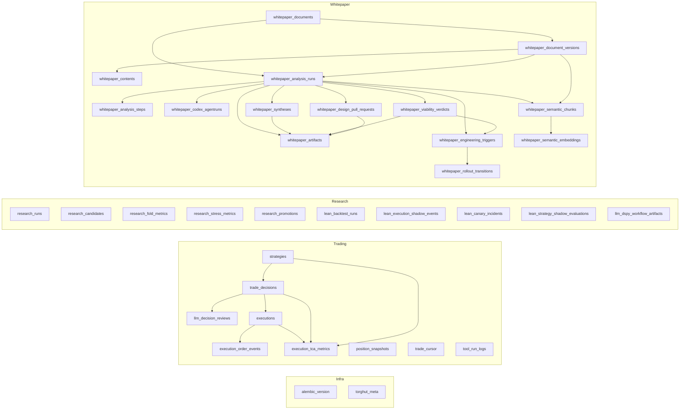
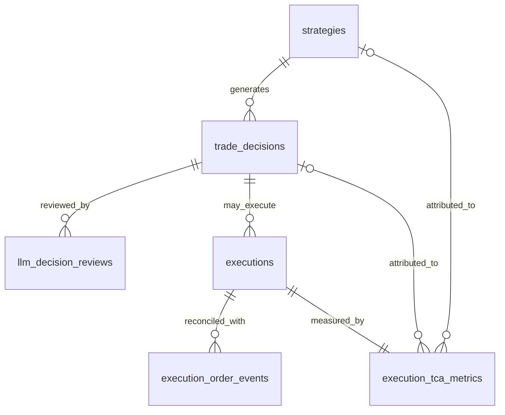
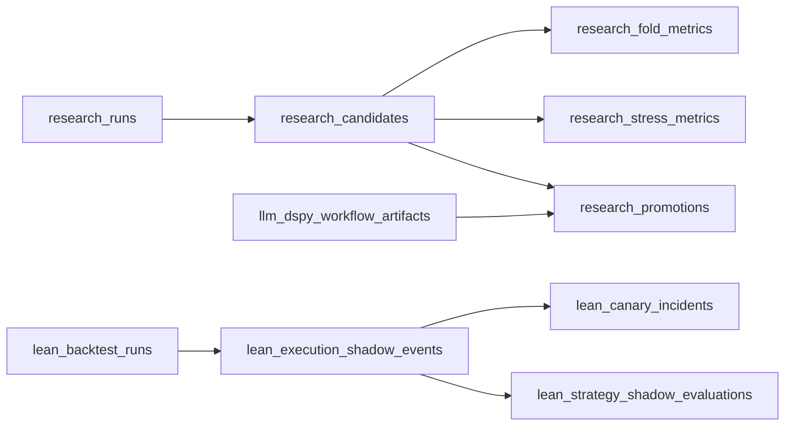
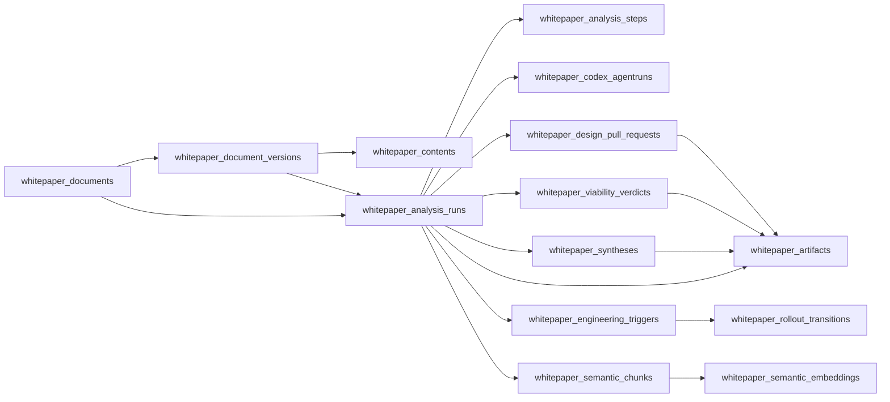

# Torghut Postgres Table Reference

## Status

- Last updated: **2026-02-27**
- Scope: Torghut tables visible in the database explorer screenshot (`Tables (35)`).
- Source of truth:
  - ORM models: `services/torghut/app/models/entities.py`
  - DB bootstrap metadata: `services/torghut/app/db.py`
  - Semantic indexing migration: `services/torghut/migrations/versions/0017_whitepaper_semantic_indexing.py`
  - Alembic behavior: `services/torghut/migrations/versions/0006_autonomy_ledger_and_execution_route.py`

## Purpose

Provide an in-depth, operator-friendly map of what every Torghut Postgres
table does, how tables relate, and how data moves through trading, research,
and whitepaper workflows.

## Domain Map

## Core Relationship Diagrams

### Trading and Execution Audit

### Research and LEAN Governance

### Whitepaper Lifecycle and Semantic Search

## Table Catalog

### Infrastructure and Migration Tables

#### `alembic_version`

- Role: Migration head pointer for Alembic.
- Why it exists: Lets Torghut know which schema revision is currently applied.
- Notes:
  - `0006_autonomy_ledger_and_execution_route` widens `version_num` to avoid
    truncation with long revision IDs.

#### `torghut_meta`

- Role: Minimal bootstrap key/value metadata table.
- Why it exists: Connectivity sanity and future migration/seed metadata.
- Important columns:
  - `key` unique identifier
  - `value` string payload

### Trading, Audit, and Ingestion

#### `strategies`

- Role: Strategy configuration registry.
- Important columns:
  - `enabled`, `base_timeframe`, `universe_type`, `universe_symbols`
  - risk guardrails like `max_position_pct_equity`, `max_notional_per_trade`
- Relationships:
  - one-to-many to `trade_decisions`
  - optional attribution in `execution_tca_metrics`

#### `trade_decisions`

- Role: Durable pre-trade intent ledger.
- Important columns:
  - strategy link: `strategy_id`
  - account partitioning: `alpaca_account_label`
  - `decision_json`, `rationale`, `status`, `executed_at`
  - dedupe: `decision_hash`
- Relationships:
  - many-to-one to `strategies`
  - one-to-many to `executions`
  - one-to-many to `llm_decision_reviews`
- Guardrails:
  - unique index on (`alpaca_account_label`, `decision_hash`)

#### `llm_decision_reviews`

- Role: LLM oversight trail for decisions.
- Important columns:
  - `model`, `prompt_version`, `verdict`, `confidence`
  - `input_json` and `response_json` for auditability
  - optional `adjusted_qty`, `adjusted_order_type`, `risk_flags`
- Relationships:
  - many-to-one to `trade_decisions`

#### `executions`

- Role: Broker order/execution state store.
- Important columns:
  - broker IDs: `alpaca_order_id`, `client_order_id`
  - fill state: `submitted_qty`, `filled_qty`, `avg_fill_price`, `status`
  - route provenance: `execution_expected_adapter`, `execution_actual_adapter`
  - fallback trail: `execution_fallback_reason`, `execution_fallback_count`
  - idempotency and traceability: `execution_correlation_id`,
    `execution_idempotency_key`, `execution_audit_json`
  - latest feed cursor: `order_feed_last_event_ts`, `order_feed_last_seq`
- Relationships:
  - optional many-to-one to `trade_decisions`
  - one-to-many to `execution_order_events`
  - one-to-one to `execution_tca_metrics` (via unique `execution_id`)
- Guardrails:
  - unique (`alpaca_account_label`, `alpaca_order_id`)
  - unique (`alpaca_account_label`, `client_order_id`)

#### `execution_order_events`

- Role: Normalized append-only event feed for order state reconciliation.
- Important columns:
  - source lineage: `source_topic`, `source_partition`, `source_offset`, `feed_seq`
  - event identity: `event_fingerprint` (unique)
  - payload: `raw_event`
  - optional links: `execution_id`, `trade_decision_id`
- Relationships:
  - optional many-to-one to `executions`
  - optional many-to-one to `trade_decisions`
- Guardrails:
  - unique source offset triple (`source_topic`, `source_partition`, `source_offset`)

#### `execution_tca_metrics`

- Role: Transaction cost analytics and slippage diagnostics per execution.
- Important columns:
  - prices/qty: `arrival_price`, `avg_fill_price`, `filled_qty`, `signed_qty`
  - cost stats: `slippage_bps`, `shortfall_notional`, `realized_shortfall_bps`
  - expected cost model: `expected_shortfall_bps_p50`, `expected_shortfall_bps_p95`
  - simulator parity: `divergence_bps`, `simulator_version`, `churn_qty`, `churn_ratio`
- Relationships:
  - required one-to-one with `executions` via unique `execution_id`
  - optional attribution to `trade_decisions` and `strategies`

#### `position_snapshots`

- Role: Periodic account state snapshots.
- Important columns:
  - account partitioning: `alpaca_account_label`
  - timing: `as_of`
  - balances: `equity`, `cash`, `buying_power`
  - open positions JSON: `positions`

#### `trade_cursor`

- Role: Cursor checkpoint for ingestion progress.
- Important columns:
  - partition keys: `source`, `account_label`
  - progress markers: `cursor_at`, `cursor_seq`, `cursor_symbol`
- Guardrails:
  - unique (`source`, `account_label`) to prevent duplicate cursors per lane/account

#### `tool_run_logs`

- Role: Codex tool invocation trace for observability.
- Important columns:
  - `codex_session_id`, `tool_name`
  - request/response JSON payloads
  - `success` outcome flag

### Research, Backtesting, and Promotion

#### `research_runs`

- Role: Top-level research execution metadata.
- Important columns:
  - immutable run key: `run_id` (unique)
  - lifecycle: `status`
  - provenance: strategy and code/data version fields (`strategy_version`,
    `code_commit`, `dataset_version`, `feature_spec_hash`)
  - traceability: `gate_report_trace_id`, `recommendation_trace_id`

#### `research_candidates`

- Role: Candidate strategy variants produced by research runs.
- Important columns:
  - keys: `run_id`, `candidate_id` (unique), `candidate_hash`
  - footprint: `parameter_set`, `symbols_covered`, `universe_definition`
  - lifecycle: `lifecycle_role`, `lifecycle_status`, `promotion_target`
  - summary counts: `decision_count`, `trade_count`

#### `research_fold_metrics`

- Role: Fold-level out-of-sample metrics.
- Important columns:
  - fold boundaries: `train_start`, `train_end`, `test_start`, `test_end`
  - outcomes: `gross_pnl`, `net_pnl`, `max_drawdown`, `turnover_ratio`, `cost_bps`
  - metadata: `cost_assumptions`, `regime_label`
- Join path:
  - linked by `candidate_id` to `research_candidates`

#### `research_stress_metrics`

- Role: Stress test outcomes per candidate.
- Important columns:
  - `stress_case`, `metric_bundle`, `pessimistic_pnl_delta`
- Join path:
  - linked by `candidate_id` to `research_candidates`

#### `research_promotions`

- Role: Promotion governance and audit decision history.
- Important columns:
  - request/decision: `requested_mode`, `approved_mode`, `decision_action`
  - approval metadata: `approver`, `approver_role`, `approve_reason`, `deny_reason`
  - rollback/succession fields: `successor_candidate_id`, `rollback_candidate_id`
  - evidence: `evidence_bundle`, `recommendation_trace_id`
- Join path:
  - linked by `candidate_id` to `research_candidates`

#### `lean_backtest_runs`

- Role: LEAN backtest run ledger with reproducibility signals.
- Important columns:
  - unique backtest key: `backtest_id`
  - lifecycle: `status`, `lane`, `completed_at`
  - payloads: `config_json`, `result_json`, `artifacts_json`
  - reproducibility: `reproducibility_hash`, `replay_hash`, `deterministic_replay_passed`
  - failure classification: `failure_taxonomy`

#### `lean_execution_shadow_events`

- Role: Parity telemetry comparing live intent vs LEAN shadow simulation.
- Important columns:
  - correlation: `correlation_id`
  - optional links: `trade_decision_id`, `execution_id`
  - parity outcomes: `simulated_fill_price`, `simulated_slippage_bps`,
    `parity_delta_bps`, `parity_status`
  - diagnostics: `failure_taxonomy`, `simulation_json`

#### `lean_canary_incidents`

- Role: Recorded canary gate breaches and rollback evidence.
- Important columns:
  - unique incident key: `incident_key`
  - incident type/severity: `breach_type`, `severity`
  - rollback action: `rollback_triggered`
  - payloads: `symbols`, `evidence_json`
  - closure: `resolved_at`

#### `lean_strategy_shadow_evaluations`

- Role: Strategy-level shadow-only parity evidence before promotion.
- Important columns:
  - unique run key: `run_id`
  - strategy scope: `strategy_id`, `symbol`
  - payloads: `intent_json`, `shadow_json`, `governance_json`
  - control flag: `disable_switch_active`
  - outcome: `parity_status`

#### `llm_dspy_workflow_artifacts`

- Role: DSPy compile/eval/promotion run artifact and status ledger.
- Important columns:
  - unique run key: `run_key`
  - lifecycle: `lane`, `status`
  - experiment metadata: `program_name`, `signature_version`, `optimizer`
  - reproducibility hashes: `artifact_hash`, `dataset_hash`,
    `compiled_prompt_hash`, `reproducibility_hash`
  - promotion outputs: `gate_compatibility`, `promotion_recommendation`, `promotion_target`
  - orchestration metadata: `agentrun_name`, `agentrun_uid`,
    request/response JSON payloads

### Whitepaper Analysis, Engineering Triggering, and Retrieval

#### `whitepaper_documents`

- Role: Logical whitepaper identity and lifecycle status.
- Important columns:
  - stable key: `document_key` (unique)
  - source identity: `source`, `source_identifier` (unique together)
  - metadata: `title`, `abstract`, `authors_json`, `published_at`,
    `tags_json`, `metadata_json`
  - process status: `status`, `last_processed_at`
- Relationships:
  - one-to-many to versions and analysis runs

#### `whitepaper_document_versions`

- Role: Versioned uploaded artifact record for each document.
- Important columns:
  - lineage: `document_id`, `version_number`
  - file/object identity: `ceph_bucket`, `ceph_object_key`, `checksum_sha256`
  - extraction lifecycle: `parse_status`, `parse_error`, `processed_at`
  - content metrics: `page_count`, `char_count`, `token_count`
- Relationships:
  - many-to-one to `whitepaper_documents`
  - one-to-one with `whitepaper_contents`
  - one-to-many to `whitepaper_analysis_runs`
- Guardrails:
  - unique (`document_id`, `version_number`)
  - unique (`ceph_bucket`, `ceph_object_key`)

#### `whitepaper_contents`

- Role: Canonical extracted full text plus structural extraction.
- Important columns:
  - unique link: `document_version_id`
  - text payload: `full_text`, `full_text_sha256`
  - structure: `section_index_json`, `references_json`, `tables_json`,
    `figures_json`, `chunk_manifest_json`
  - extraction quality: `extraction_warnings_json`, `quality_score`

#### `whitepaper_analysis_runs`

- Role: Top-level orchestration record for a whitepaper analysis execution.
- Important columns:
  - unique run key: `run_id`
  - scope: `document_id`, `document_version_id`
  - lifecycle: `status`, `started_at`, `completed_at`
  - trigger lineage: `trigger_source`, `trigger_actor`, `retry_of_run_id`
  - orchestration IDs: `inngest_event_id`, `inngest_function_id`, `inngest_run_id`
  - payloads: `request_payload_json`, `result_payload_json`, `analysis_profile_json`
  - failure fields: `failure_code`, `failure_reason`
- Relationships:
  - parent for steps, Codex AgentRuns, synthesis, verdicts, PRs, artifacts,
    engineering triggers

#### `whitepaper_analysis_steps`

- Role: Stage-level attempt tracking per analysis run.
- Important columns:
  - `step_name`, `step_order`, `attempt`, `status`
  - execution details: `executor`, `idempotency_key`, `trace_id`
  - timing: `started_at`, `completed_at`, `duration_ms`
  - payloads: `input_json`, `output_json`, `error_json`
- Guardrails:
  - unique (`analysis_run_id`, `step_name`, `attempt`)

#### `whitepaper_codex_agentruns`

- Role: Codex AgentRun execution context and VCS metadata for whitepaper jobs.
- Important columns:
  - unique run handle: `agentrun_name`
  - optional step link: `analysis_step_id`
  - VCS fields: `vcs_repository`, `vcs_base_branch`, `vcs_head_branch`, commit SHAs
  - prompt and context: `prompt_text`, `prompt_hash`, `input_context_json`, `output_context_json`
  - artifact refs: `patch_artifact_ref`, `log_artifact_ref`
  - lifecycle: `status`, `started_at`, `completed_at`, `failure_reason`

#### `whitepaper_syntheses`

- Role: Structured synthesis generated from whitepaper context.
- Important columns:
  - unique per run: `analysis_run_id`
  - synthesis descriptors: `synthesis_version`, `generated_by`, `model_name`, `prompt_version`
  - analysis content: `executive_summary`, `methodology_summary`,
    findings/claims/risk/citations JSON fields
  - plan and confidence: `implementation_plan_md`, `confidence`, `synthesis_json`

#### `whitepaper_viability_verdicts`

- Role: Final implementability decision and policy evidence.
- Important columns:
  - unique per run: `analysis_run_id`
  - decision core: `verdict`, `score`, `confidence`
  - evidence and policy: `decision_policy`, `gating_json`, `rationale`,
    `rejection_reasons_json`, `recommendations_json`
  - follow-up and approval: `requires_followup`, `approved_by`, `approved_at`

#### `whitepaper_design_pull_requests`

- Role: PR metadata for generated design docs/code proposals.
- Important columns:
  - run linkage and retries: `analysis_run_id`, `attempt` (unique per run)
  - repo context: `repository`, `base_branch`, `head_branch`
  - PR identity: `pr_number`, `pr_url`, `title`, `body`
  - CI and merge lifecycle: `checks_url`, `ci_status`, `is_merged`, `merged_at`
  - commit references: `commit_sha`, `merge_commit_sha`

#### `whitepaper_artifacts`

- Role: Unified object ledger across the whitepaper pipeline.
- Important columns:
  - polymorphic links: document/version/run/synthesis/verdict/PR foreign keys
  - object identity: `artifact_scope`, `artifact_type`, `artifact_role`
  - storage refs: `ceph_bucket`, `ceph_object_key`, `artifact_uri`
  - integrity and metadata: `checksum_sha256`, `size_bytes`, `content_type`, `metadata_json`
- Guardrails:
  - unique (`ceph_bucket`, `ceph_object_key`)

#### `whitepaper_engineering_triggers`

- Role: Deterministic trigger decision for implementation handoff.
- Important columns:
  - stable IDs: `trigger_id` (unique), `whitepaper_run_id` (unique),
    `analysis_run_id` (unique)
  - decision core: `implementation_grade`, `decision`, `reason_codes_json`
  - approval controls: `approval_token`, `approval_source`, `approved_by`,
    `approved_at`, `approval_reason`
  - rollout mode: `rollout_profile`
  - reproducibility: `policy_ref`, `gate_snapshot_hash`, `gate_snapshot_json`
  - orchestration handoff: `dispatched_agentrun_name`
- Relationships:
  - many-to-one (optional) to `whitepaper_viability_verdicts`
  - one-to-many to `whitepaper_rollout_transitions`

#### `whitepaper_rollout_transitions`

- Role: Append-only rollout transition audit log.
- Important columns:
  - stable key: `transition_id` (unique)
  - link to trigger: `trigger_id`
  - stage movement: `from_stage`, `to_stage`, `transition_type`, `status`
  - gate evidence: `gate_results_json`, `reason_codes_json`, `blocking_gate`, `evidence_hash`

#### `whitepaper_semantic_chunks`

- Role: Chunk-level semantic retrieval corpus.
- Origin:
  - Created by migration `0017_whitepaper_semantic_indexing`.
- Important columns:
  - scope links: `analysis_run_id`, `document_version_id`
  - retrieval segmentation: `source_scope` (`full_text` or `synthesis`),
    `section_key`, `chunk_index`
  - content: `content`, `content_sha256`, `token_count`
  - retrieval indexes: `text_tsvector` for lexical search
  - metadata: `metadata_json`
- Guardrails:
  - unique (`analysis_run_id`, `source_scope`, `chunk_index`)

#### `whitepaper_semantic_embeddings`

- Role: Vector store for semantic chunks (pgvector).
- Origin:
  - Created by migration `0017_whitepaper_semantic_indexing`.
- Important columns:
  - link: `semantic_chunk_id` to `whitepaper_semantic_chunks`
  - embedding identity: `model`, `dimension`, `embedding`
- Guardrails:
  - unique (`semantic_chunk_id`, `model`, `dimension`)
  - dimension consistency check (`dimension = vector_dims(embedding)`)
  - IVFFlat vector index for cosine similarity retrieval

## Practical Join Paths

### Trading Incident Debug

1. Start at `execution_order_events` by topic/offset or order id.
2. Join `executions` on `execution_id`.
3. Join `trade_decisions` on `trade_decision_id`.
4. Join `execution_tca_metrics` on `executions.id`.
5. Join `strategies` through `trade_decisions.strategy_id`.

### Research Promotion Trace

1. Start at `research_promotions` by `candidate_id` or `recommendation_trace_id`.
2. Join `research_candidates` on `candidate_id`.
3. Join `research_runs` on `research_candidates.run_id = research_runs.run_id`.
4. Join `research_fold_metrics` and `research_stress_metrics` by candidate.

### Whitepaper End-to-End Audit

1. Start at `whitepaper_analysis_runs` by `run_id`.
2. Join `whitepaper_analysis_steps`, `whitepaper_codex_agentruns`,
   `whitepaper_syntheses`, `whitepaper_viability_verdicts`.
3. Join `whitepaper_engineering_triggers` and `whitepaper_rollout_transitions`.
4. Join `whitepaper_artifacts` for generated objects.
5. For retrieval debugging, join `whitepaper_semantic_chunks` and `whitepaper_semantic_embeddings`.

## Notes and Constraints

- All tables are in the same Postgres DB and use UUID primary keys except
  infra tables (`alembic_version`, `torghut_meta`).
- Account-isolation is encoded in multiple trading tables through `alpaca_account_label`.
- Whitepaper semantic tables require `pgvector` extension
  (`CREATE EXTENSION IF NOT EXISTS vector`).
- Some whitepaper semantic tables are migration-defined and may not yet be
  mirrored in ORM classes.
