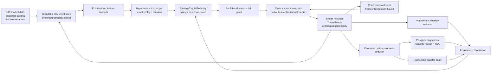

# Torghut Adversarial Profitability System Design

Status: Proposed normative design.

Source baseline: `9f6487ada0cf9222b65cbb1ee9b10d50a09b216e`.

Companion evidence: [current audit snapshot](current-audit-snapshot-2026-07-14.md).

Implementation handoff: [implementation roadmap](implementation-roadmap.md).

Research contract: [research validation and promotion design](research-validation-and-promotion-design.md).

## Decision Summary

Torghut must optimize independently verified, after-cost, risk-adjusted return at executable capacity. It must not
optimize the number of strategies, backtest point estimates, generated reports, fills, turnover, or green status
surfaces.

The design makes five changes to the system boundary:

1. broker economic events become the external accounting authority;
2. every candidate-evidence or real-capital risk-increasing mutation requires strategy-scoped capital authority and
   durable fencing before broker I/O;
3. one versioned economic policy and execution envelope follows a candidate through replay, shadow, paper, and live;
4. promotion requires independent recomputation and adversarial falsification, not self-attestation;
5. capital increases only through completed proof windows, with automatic demotion and reduce-only exits.

The system is not capital-ready while any of those contracts is absent. Platform availability and singleton scheduling
are prerequisites, not profitability evidence.

## Problem Statement

The current source contains many strong components: a singleton scheduler, advisory leadership, exact-ledger research,
runtime-ledger blockers, TCA rows, TigerBeetle journaling, replay stress, promotion contracts, and research orchestration.
The audit also found that component presence is not end-to-end economic proof:

- `services/torghut/tests/test_broker_mutation_receipts_unwired.py` requires broker-mutation receipt APIs to remain
  absent from production mutation paths;
- `StrategyConfig` in `services/torghut/app/strategies/catalog.py` persists `enabled` but no typed capital stage;
- `family_template_id_from_strategy_id` in
  `services/torghut/app/trading/runtime_strategy_resolution.py` removes the `@...` suffix used by GitOps to describe
  `paper` and `research` strategies;
- `run_strategy_autoresearch_loop.py` can set the run-level `objective_met` flag before checking whether the candidate
  was retained;
- current research and live GitOps use materially different economic envelopes, including roughly 1x research gross
  exposure versus 4x live gross exposure;
- internal execution, TCA, ledger, and TigerBeetle rows can agree with one another while broker exits, corrections,
  actual fees, cash movements, or position truth are incomplete.

The [Slice 12 economic-policy contract](economic-policy-parity.md) addresses the recorded 1x/4x configuration mismatch
with one pinned artifact and falsifiable stage parity. This historical finding remains valid for the source baseline;
the resolution is not production-proven until its merge, image, GitOps, and runtime evidence chain completes.

These are not documentation gaps. They allow false confidence even when individual components behave as implemented.

## Goals

- Reconstruct every broker economic event exactly once and preserve corrections and reversals.
- Reconcile orders, fills, positions, cash, equity, costs, and PnL to the broker with zero unexplained settled delta.
- Enforce strategy-scoped capital authority before all risk-increasing broker mutations.
- Keep cancellation, strictly risk-reducing replacement, and closeout available during capital, profitability, data,
  or accounting blocks.
- Use point-in-time data, deterministic execution semantics, complete trial lineage, and selection-adjusted statistics.
- Measure spread, fees, slippage, impact, borrow, opportunity cost, and capacity using live-calibrated evidence.
- Apply portfolio-level factor, sector, beta, cluster, liquidity, tail-risk, and concentration budgets.
- Produce an immutable proof bundle that a second implementation can reproduce from raw evidence.
- Fail closed when authority, freshness, lineage, policy, reconciliation, or evidence is missing or contradictory.

## Non-Goals

- Promise a fixed return or claim to be the best trading system in the market.
- Treat `$500/day`, Sharpe, win rate, gross PnL, or fill count as sufficient promotion evidence.
- Make an LLM, foundation model, synthetic generator, local artifact, or design document a capital authority.
- Rewrite Torghut around an external framework solely to match its branding or API.
- Combine the equities and Hyperliquid economic ledgers, promotion evidence, or capital authority.
- Block emergency risk reduction because a profitability or accounting dependency is unavailable.

## Design Principles

### External Facts Before Internal Claims

The broker is authoritative for externally accepted orders, fills, corrections, fees, cash movements, positions, and
equity. Torghut is authoritative for strategy intent, policy, attribution, expected costs, and its own control decisions.
An internal row is a claim until reconciled with the relevant external fact.

### One Economic Event, Many Projections

Postgres, TigerBeetle, TCA, strategy PnL, runtime status, and reports must project the same immutable event stream. A
projection may be rebuilt. It must not create a new economic fact or validate itself through another projection derived
from the same incomplete input.

### Authority Is Typed And Strategy-Scoped

`enabled`, a strategy name suffix, an operationally healthy route, and a global live-submit flag do not grant capital.
Every decision and mutation cites an unexpired strategy authority record, policy digest, evidence epoch, and maximum
notional.

### Evidence Must Be Able To Falsify The System

Known-bad strategies, duplicate events, corrections, future timestamps, cost shocks, leader deaths, database failover,
and contradictory readiness surfaces are required tests. A proof system that never rejects its own candidates is not a
proof system.

### Scaling Is A New Experiment

Execution cost and capacity are nonlinear. Every capital increase creates a new evidence window at the new size. A
previously approved point estimate cannot authorize indefinite scaling.

## Target Architecture



### Plane Responsibilities

| Plane          | Owns                                                          | Must not own                 |
| -------------- | ------------------------------------------------------------- | ---------------------------- |
| Raw data       | Immutable provider and broker payloads, clocks, identities    | Strategy conclusions         |
| Research       | Hypotheses, trials, frozen data, replay, selection statistics | Live capital                 |
| Authority      | Stage, policy, evidence epoch, notional and expiry            | Recomputed PnL               |
| Execution      | Exactly-once economic intent and recovery                     | Promotion decisions          |
| Accounting     | Inventory, cash, costs, NAV and PnL projections               | Alpha selection              |
| Reconciliation | Cross-source equality, freshness and unexplained deltas       | Creating missing facts       |
| Portfolio risk | Exposure and tail-risk budgets                                | Overriding missing authority |
| Operations     | Availability, rollout identity, SLOs and incidents            | Declaring profitability      |

## Strategy Capital Authority

Extend the existing promotion authority into one persisted strategy-scoped contract. Do not create a second permissive
authority beside it.

Canonical stages:

```text
disabled / quarantined
        -> research_only -> replay_verified -> shadow_allowed
        -> paper_probation -> paper_verified -> micro_live_allowed
        -> capital_allowed -> scaled
```

Only `capital_allowed` and `scaled` may increase real exposure. `micro_live_allowed` may increase exposure only within
the explicitly encoded experimental tranche. `paper_probation` grants bounded evidence collection in a paper account;
`paper_verified` records that the probation exit gate passed but grants no real capital by itself.

This enum replaces, rather than coexists with, existing permissive vocabularies. During migration,
`EvidenceEpochDecision` is an evidence input to `StrategyCapitalAuthority`, not a capital grant. Apply this conservative
mapping:

| Existing evidence decision | Canonical stage      | Migration rule                                                                                         |
| -------------------------- | -------------------- | ------------------------------------------------------------------------------------------------------ |
| `shadow_only`              | `shadow_allowed`     | No broker mutation                                                                                     |
| `research_allowed`         | `research_only`      | Research artifacts only                                                                                |
| `paper_allowed`            | `paper_probation`    | Paper evidence collection only                                                                         |
| `canary_allowed`           | `micro_live_allowed` | Reissue only with complete bounds, expiry, proof epoch, and explicit approval; otherwise `quarantined` |
| `live_allowed`             | `capital_allowed`    | Reissue only with the complete new contract; otherwise `quarantined`                                   |
| `scale_allowed`            | `scaled`             | Reissue only from a completed proof window at the current tranche; otherwise `quarantined`             |
| `quarantined` or unknown   | `quarantined`        | No risk-increasing broker mutation                                                                     |

Inventory and migrate every issuer and consumer of evidence epochs, promotion authority, proof-floor state, submission
council state, global live flags, and strategy-name stages before enabling the new enforcement path. At cutover, legacy
real-capital decisions fail closed until explicitly reissued; there is no compatibility fallback from a missing
strategy authority to an older global authority.

Minimum authority payload:

| Field                          | Contract                                                             |
| ------------------------------ | -------------------------------------------------------------------- |
| `authority_id`                 | Immutable unique identifier                                          |
| `strategy_id` / `candidate_id` | Exact strategy and candidate identity; suffixes are descriptive only |
| `stage`                        | Typed enum; unknown values reject                                    |
| `policy_digest`                | Versioned economic, statistical, risk, and data policy               |
| `evidence_epoch_id`            | Frozen proof bundle that produced the decision                       |
| `code_commit` / `image_digest` | Exact evaluated runtime implementation                               |
| `data_snapshot_digest`         | Exact causal input snapshot                                          |
| `execution_envelope_digest`    | Sizing, leverage, route, lifecycle, cost and fallback semantics      |
| `max_notional`                 | Maximum risk-increasing notional for this authority                  |
| `max_loss` / `risk_budget`     | Sleeve loss and tail-risk limits                                     |
| `issued_at` / `expires_at`     | Bounded validity; expiry fails closed                                |
| `blockers`                     | Typed current blockers; empty only after evaluation                  |
| `approver`                     | Independent policy actor; never the candidate model                  |

For a risk-increasing action, pre-I/O checks must atomically prove:

- the authority exists, is unexpired, and matches the exact strategy and candidate;
- the decision action is allowed for the stage;
- the mutation remains within notional, exposure, liquidity, and loss budgets;
- the policy, data, code, image, and execution digests match the active runtime;
- reconciliation, source freshness, and operational gates are current;
- a risk-increasing claim has not already been accepted.

The check produces a denial receipt on failure. It must never silently fall back from a missing strategy authority to a
global operational flag. Risk reduction uses the separate, non-capital permit below.

### Infrastructure Validation Permit

P0 must fault-test submit, cancel, recovery, activity ingestion, and ledger behavior before any candidate can enter
paper probation. Those tests use one typed `InfrastructureValidationPermit`, not a hidden bypass or candidate stage.
The permit is valid only when all of these are encoded and enforced:

- purpose is exactly `control_plane_validation`, with no strategy/candidate promotion identity;
- schema `torghut.infrastructure-validation-permit.v2` includes the asset class; v1 is rejected because adding that
  required field changed the authority contract;
- venue and account are a dedicated paper or exchange sandbox identity allowlisted as non-live at configuration and
  broker-adapter boundaries; for Alpaca, the configured label must equal the broker-returned `account_number`;
- the venue, asset, account, and session matrix is exact: Alpaca equity is paper/regular, Alpaca crypto is
  paper/continuous, and Hyperliquid perpetual is sandbox/continuous;
- symbols, sides, order types, maximum order/notional/loss, maximum outstanding intents, session, issuer, and a short
  expiry are explicit;
- a known-null test plan and expected terminal economic state are immutable inputs;
- every decision, order, activity, fill, ledger row, and report is tagged `non_promotable_validation` and excluded from
  candidate statistics, PnL targets, trial selection, and promotion evidence;
- the permit cannot be converted, inherited, or mapped to `paper_probation` or a real-capital stage.

The Slice 4 Alpaca submit exercise is narrower than the reusable permit: continuous-session crypto only, one buy limit
IOC, one outstanding intent, one order, and at most `$1` notional and loss. The client validates the exact paper
endpoint, broker account status, crypto status, asset class, and known-null account before I/O. The database rejects
widened or promotable canonical intents. Broker order events resolve their validation receipt before persistence,
receive an explicit non-promotable evidence marker, remain unlinked from executions and trade decisions, and are
excluded from TigerBeetle and repair relinking.

Issuance requires explicit infrastructure-owner approval. A research agent, candidate, global live flag, account name,
or healthy route cannot issue it. Any attempt to target a live account, omit the non-promotable tag, exceed a bound, or
use the resulting events in promotion fails closed and opens an incident.

## Broker Mutation Protocol

Every submit, cancel, replace, targeted unwind, pair leg, and emergency closeout uses the same durable claim, receipt,
idempotency, and recovery protocol. Capital authorization differs by action class:

- a **risk-increasing** action requires an active `StrategyCapitalAuthority` and all profitability, data,
  reconciliation, portfolio-risk, and operational gates;
- a **strictly risk-reducing** action requires a per-action `RiskReductionPermit`, not an active candidate capital
  grant. The permit is derived from a fresh broker order/position observation or broker-enforced reduction primitive,
  caps quantity to observed exposure, forbids a side flip or new symbol, and proves gross and net exposure cannot
  increase under conservative marks;
- a **control-plane validation** action requires an `InfrastructureValidationPermit`, can reach only a dedicated
  paper/sandbox account, and can never contribute candidate or promotion evidence;
- canceling a referenced open entry order may proceed without profitability evidence, but its ambiguous outcome remains
  fenced and must be recovered before replacement or new exposure.

Missing or expired candidate authority, stale TCA, stale profitability evidence, and ledger mismatch block entries but
must not block a provably monotonic reduction. If broker state is too stale or unavailable to prove reduction, cancel
known entry orders, persist the unresolved reduction intent, perform strict broker anti-entropy, and retry recovery; do
not guess a closeout quantity.

1. Persist the economic intent and deterministic broker client identity.
2. Classify the action and atomically acquire either strategy capital authority or a bounded risk-reduction permit.
3. Acquire the decision/mutation claim.
4. Create a broker-mutation receipt in `claimed` state before network I/O.
5. Persist `broker_io_started` with the fencing epoch.
6. Perform at most the authorized broker mutation.
7. Atomically settle receipt, claim, execution identity, and observed broker response.
8. Ingest asynchronous Trade Events and Activities as independent broker facts.
9. Reconcile the terminal broker state and release or retain the claim explicitly.

Unknown broker state is a durable state, not an exception to retry. Recovery acquires a lease, performs one strict
lookup by the exact broker identity, and records `accepted`, `rejected`, `not_found`, or `unknown`. `unknown` blocks new
exposure until anti-entropy resolves it.

### Crash Invariants

- Leader death before I/O produces no broker mutation.
- Leader death after broker acceptance produces one broker mutation and one recovered terminal receipt.
- Leader death after response but before local commit cannot produce a second economic intent.
- Competing writers cannot hold the same claim or settle conflicting terminal receipts.
- Duplicate broker events and Kafka offsets do not change inventory, cash, or PnL twice.
- Cancel or closeout uncertainty blocks entries but never disables continued risk-reduction recovery.

### Multi-Leg Execution

Pairs and other multi-leg strategies require a durable group record with reserved pending exposure, leg identities,
hedge deadline, partial-fill state, targeted unwind policy, and group terminal state. Account-wide flattening is a last
resort controlled by portfolio risk, not the default response to one failed leg.

## Broker Economic Event Store

Use the broker's financial Activity stream for new economic events and paginated REST retrieval for bounded
anti-entropy. Keep order lifecycle Trade Events separate and link them by immutable external identities. Alpaca's
[Account Activities](https://docs.alpaca.markets/us/docs/account-activities) include fills and non-order financial
activity, while its [Activity SSE](https://docs.alpaca.markets/us/docs/activity-sse) explicitly complements, rather
than replaces, the order Trade Events stream.

Canonical event fields:

- provider, account scope, environment, event type, external event ID, external order ID, client order ID;
- original and correction/reversal identities;
- event, effective, source, ingest, and first-observed timestamps;
- symbol/instrument, side, quantity, price, notional, currency, fee and fee type;
- cash amount, corporate-action type, borrow/interest/tax classification;
- raw payload digest, raw payload retention reference, schema version, and ingestion cursor;
- linked Torghut decision, execution, mutation receipt, candidate, strategy, and evidence epoch when known.

Provider IDs and correction semantics define idempotency. A missing Torghut link does not discard an economic event; it
creates reconciliation debt and blocks promotion.

## Canonical And Independent Ledgers

Build two reducers from the same raw broker events:

- the canonical reducer produces production inventory, cash, cost, NAV, strategy attribution, and TigerBeetle transfer
  plans;
- the independent reducer uses separate code and state, reads no canonical derived rows, and produces the equality
  check used by promotion and incident response.

Both reducers must support partial fills, buy/sell, short/cover, corrections, busts, dividends, interest, borrow and
regulatory fees, deposits, withdrawals, splits, mergers, symbol changes, overnight positions, and mark-to-market.

Required equations:

```text
cash ending
= cash starting
 + external cash flows
 + sell/short proceeds
 - buy/cover cost
 - fees, borrow, interest and taxes
 + corporate-action cash

NAV = cash + marked positions

strategy net PnL
= realized PnL
 + marked unrealized change
 - explicit costs
 - allocated borrow, interest and taxes
```

Deposits and withdrawals affect cash and NAV but are removed from trading return and drawdown calculations. Realized
strategy PnL, account NAV, and closed-round-trip PnL are separate measures and must not be substituted for one another.
TCA measures execution quality; it is never a PnL proxy.

### Reconciliation States

| State             | Meaning                                                    | Capital consequence           |
| ----------------- | ---------------------------------------------------------- | ----------------------------- |
| `current_exact`   | All mandatory settled events and balances agree            | May satisfy accounting gate   |
| `current_pending` | Only documented unsettled/provider-lag events remain       | Entries follow bounded policy |
| `stale`           | Reconciliation exceeded its freshness SLO                  | Block entries                 |
| `mismatch`        | Quantity, cash, fee, position, equity, or identity differs | Block entries; open incident  |
| `unknown`         | Source unavailable or ambiguous                            | Block entries                 |

TigerBeetle supplies durable transfer parity. Protocol health or a bounded sample cannot set profitability or capital
authority. Risk-increasing orders require the configured reconciliation freshness and coverage; risk-reducing orders do
not.

## Point-In-Time Market And Feature Data

US-equity research and live evidence must preserve the selected feed identity. Alpaca documents SIP as consolidated
exchange data and IEX as a single-exchange feed in its [market-data FAQ](https://docs.alpaca.markets/us/docs/market-data-faq).
Research/live parity therefore includes feed, subscription, symbol universe, corporate-action adjustment, calendar,
timezone, and clock semantics.

Every research and runtime feature batch emits an immutable receipt containing:

- source, event, exchange, ingest, availability, and decision timestamps;
- dataset, code, schema, calendar, universe, corporate-action, and adjustment digests;
- field x symbol x session coverage and null/stale/duplicate rates;
- fallback and proxy use by field and row;
- source cursor/offset windows and detected gaps;
- family-required feature contract and rejection reasons.

A family-required field missing or temporally unavailable invalidates the run. It cannot become a warning-only proxy.
Feature event time after decision time, unavailable future corporate-action knowledge, or negative feature age is a
hard causal failure.

## One Execution And Economic Envelope

The same envelope digest follows the candidate through every stage. It covers:

- code, candidate parameters, feature schema, universe, clock, and data snapshot;
- start equity, sizing, leverage, gross/net/symbol/cluster limits, cash reserve, and rounding;
- broker/environment, order types, time in force, repricing, retries, cancel and closeout behavior;
- spread, fee, slippage, impact, borrow, latency, fill-survival, queue, and missed-fill models;
- market calendar, session gates, shortability, corporate actions, and fallback behavior.

Any mismatch invalidates parity and blocks promotion. In particular, a candidate evaluated near 1x gross cannot inherit
a 4x live envelope without a separate capacity, drawdown, and micro-live proof.

## Portfolio Risk And Allocation

Pre-trade allocation must enforce both strategy authority and portfolio constraints:

- cash-flow-adjusted daily loss, drawdown, expected shortfall, and stress loss;
- gross, net, symbol, sector, factor, beta, volatility, cluster, and correlated-sleeve exposure;
- ADV/participation, spread, borrow, concentration, pending orders, and reserved pair-leg exposure;
- turnover, side flips, position age, liquidity deterioration, and market-session controls;
- current positions plus pending accepted/unknown mutations.

The current semiconductor universe must be treated as one correlated risk cluster until measured factor/correlation
evidence supports finer diversification. Fractional Kelly or other aggressive sizing may be a capped research
challenger only after outcome probabilities and costs are live-calibrated.

## Readiness And Observability

One typed state reducer supplies action-specific projections to every surface. `/readyz`, `/trading/status`, submission,
metrics, and alerting must not independently reinterpret the same facts, but they also must not collapse distinct
authorities into one boolean:

- `service_healthy`: the process can serve status and safely persist or continue recovery work;
- `entry_allowed`: every strategy-capital, source, economic, portfolio-risk, and operational entry gate passes;
- `reduce_only_allowed`: the broker state and mutation infrastructure can prove and fence a monotonic reduction;
- `recovery_degraded`: unresolved intents or unavailable dependencies require anti-entropy or operator action.

`entry_allowed=false` does not imply `service_healthy=false` or `reduce_only_allowed=false`. Kubernetes readiness follows
`service_healthy`, not capital authorization, so a stale ledger, closed market, expired candidate grant, or failed alpha
gate does not remove the singleton control/recovery endpoint from its Service. If a separate worker truly cannot serve
or persist safe recovery, its readiness may fail, but a read-only status/control surface must remain addressable.

Required public fields, without secrets or raw account identifiers:

- active source, code, image, policy, data, envelope, and evidence digests;
- process role, leadership epoch, broker route, market-session state, and stream ownership;
- strategy authority counts by stage and risk-increasing/reduce-only action;
- event, cursor, symbol, feature, order, fill, correction, and reconciliation freshness;
- mutation claim/receipt states and unresolved unknown economic intents;
- canonical versus independent ledger deltas;
- actual-cost, TCA prediction, markout, capacity, drawdown, expected-shortfall, and concentration coverage;
- exact typed blockers and the authority that emitted them.

API proxy status must expose scheduler unavailability rather than serving stale local state. Liveness, Kubernetes
service readiness, entry authorization, reduction authorization, and capital stage remain separately observable. Argo
Synced/Healthy remains deployment evidence only.

## Database Reliability

The economic truth plane cannot depend on an unbounded query or a single unrehearsed database instance.

- Use bounded statements and explicit transaction deadlines on scheduler/readiness paths.
- Keep counterfactual outcome labeling and quote I/O outside both database transactions and the
  strategy-to-risk-to-broker order path; use the immutable event-time quote captured with the decision before falling
  back to a historical lookup.
- Partition or index high-volume event and options data using measured PostgreSQL plans.
- Tune autovacuum/WAL behavior from observed table churn, not estimated tuple ratios alone.
- Run CNPG with tested recovery point/recovery time objectives, continuous backups, at least one replica where the
  infrastructure allows, and a documented failover/restore rehearsal.
- Prove claims, receipts, cursors, and ledgers survive primary failover without duplicate economic effects.

Schema-current does not mean query-current, available, or economically reconciled.

## Adversarial Proof Bundle

Every promotion or scaling decision consumes one immutable evidence epoch containing:

- raw source inventory and retention references;
- dataset, feature, code, image, policy, and execution-envelope digests;
- complete trial ledger, selection count, negative controls, and statistical outputs;
- exact replay, shadow, paper, broker activity, TCA, ledger, and reconciliation artifacts;
- regime, symbol, day, concentration, tail-risk, and capacity slices;
- mutation crash/fault results and database failover result;
- canonical and independent reducer equality result;
- current typed blockers, approver, decision, expiry, and capital tranche.

The bundle is reproducible offline from raw inputs. Derived summaries are conveniences, not authority.

## Adversarial Definition Of Done

Each material slice must prove all of the following:

1. **Reachability:** a production caller inventory shows the new path is used everywhere intended.
2. **Contract:** regression, property, and negative tests cover invariants and denial behavior.
3. **Fault tolerance:** timeout, duplicate, correction, crash, and failover tests pass.
4. **Artifact identity:** the built image cites the exact source commit and digest.
5. **Rollout identity:** Argo and live children run that image and configuration.
6. **Controlled behavior:** a bounded paper or zero-notional session moves the expected runtime counters and rows.
7. **Terminal proof:** broker/capital work reconciles independent economic state; research work reproduces immutable
   trial receipts; storage work restores preserved hashes; operational work demonstrates the declared fault/SLO
   recovery.
8. **Rollback:** injected blockers stop new exposure, preserve reduce-only exits, and demote authority.

A fixture-only test, an unwired API, a static status field, a self-generated proof payload, or an irrelevant economic
check cannot satisfy these requirements.

## Failure Modes And Required Responses

| Failure                             | Detection                                                 | Required response                                           |
| ----------------------------------- | --------------------------------------------------------- | ----------------------------------------------------------- |
| Market stream owner conflict        | Provider connection errors, duplicate owners, cursor gaps | Block entries; elect one owner; re-prove symbol coverage    |
| Broker mutation ambiguous           | Receipt `unknown`, timeout, malformed lookup              | Block entries; strict anti-entropy; do not resubmit blindly |
| Order/fill/cash mismatch            | Independent reducer delta                                 | Block entries; preserve raw events; reconcile or reverse    |
| Source or feature causality failure | Timestamp/coverage receipt invalid                        | Invalidate research/runtime window                          |
| Policy/envelope drift               | Digest mismatch                                           | Block promotion and submission                              |
| Ledger or TigerBeetle stale         | Freshness SLO breach                                      | Block entries; keep closeout                                |
| Database primary/query failure      | Readiness/query/failover SLO                              | Stop entries; use durable recovery after failover           |
| Tail-risk/concentration breach      | Portfolio risk reducer                                    | Cancel pending entries; targeted reduce-only unwind         |
| Candidate performance decay         | After-cost LCB, TCA, drift, regime gates                  | Demote one stage; require a new proof window                |
| Readiness contradiction             | Cross-surface parity check                                | Treat the strictest state as authoritative; open incident   |

## Security, Privacy, And Audit

- Never place broker credentials, tokens, raw account identifiers, or private activity payloads in status, metrics,
  design documents, proof bundles intended for broad access, or logs.
- Restrict raw broker activities and account projections by least privilege and environment.
- Make capital-authority issuance, override, expiry, denial, and demotion append-only and attributable.
- Require explicit operator approval for any emergency override; make it time-bounded, lower-notional, and visible.
- Preserve market-access risk controls independent of strategy code, consistent with the intent of
  [SEC Rule 15c3-5](https://www.sec.gov/rules-regulations/2011/06/risk-management-controls-brokers-or-dealers-market-access).
- Keep research, paper, live, and testnet account scopes cryptographically and operationally distinct.

## Alternatives Rejected

### Tune Strategies First

Rejected because missing exits, broker costs, event attribution, policy parity, or causal data can make the target label
wrong. More search would overfit an untrustworthy outcome.

### Treat TigerBeetle As Profitability Authority

Rejected because TigerBeetle proves transfer recording and parity, not that source economic facts or strategy
attribution are complete.

### Use One Internal Ledger As Its Own Verifier

Rejected because shared code and inputs create correlated failure. Promotion requires a second reducer that reads raw
broker evidence directly.

### Infer Capital Stage From Strategy Names

Rejected because string suffixes are descriptive, are currently stripped during family resolution, and cannot carry
policy, expiry, notional, evidence, or approval.

### Increase Leverage To Reach A Dollar Target

Rejected because it changes the economic envelope and magnifies model, execution, and tail error. Capacity and risk
proof must precede leverage.

### Let AI Grant Capital

Rejected. AI may propose hypotheses, rank candidates, summarize evidence, or generate stress scenarios. Deterministic
policy using independently reproducible evidence grants or denies capital.

## Acceptance Criteria For The Architecture

### Paper-Probation Entry

A candidate may receive bounded, expiring `paper_probation` evidence-collection authority only after:

- the canonical authority migration and caller inventory prove there is no legacy risk-increasing bypass;
- every mutation path uses claims, receipts, idempotency, and recovery in controlled paper/sandbox fault exercises under
  an `InfrastructureValidationPermit` whose events are excluded from promotion evidence;
- risk-increasing actions require strategy capital authority, while missing/expired capital evidence still permits a
  broker-state-proven risk-reduction permit;
- broker activity ingestion and both reducers reconcile a controlled lifecycle, including partial fills, fees,
  corrections, and closeout, with zero unexplained settled delta;
- replay and shadow cite the same policy and execution-envelope digest;
- point-in-time poison, known-bad strategy, duplicate-event, crash, and stale-evidence tests fail as designed;
- entry, reduce-only, recovery, service, and Kubernetes readiness surfaces remain consistent and distinct.

This entry gate authorizes paper evidence collection only. It does not assert profitability and does not require the
paper observations it is intended to collect.

### Paper-Verification Exit And Micro-Live Entry

After paper probation, `paper_verified` requires the preregistered minimum observation window and a controlled market
sample demonstrating:

- every risk-increasing mutation cites valid strategy authority, claim, receipt, policy, and evidence identities;
- duplicate writers and injected crash points produce exactly one broker economic intent;
- every broker order, fill, partial fill, correction, fee, cash movement, position, and equity change is ingested;
- canonical and independent ledgers match each other and the broker with zero unexplained settled delta;
- runtime-ledger and TCA rows use actual costs and complete closed-round-trip lineage;
- source, feature, cursor, order-feed, reconciliation, and database SLOs remain current;
- replay, shadow, and paper share the same envelope digest;
- injected accounting, freshness, risk, and performance failures automatically block or demote entries;
- reduce-only closeout remains available throughout.

Only a `paper_verified` candidate with explicit approval and a separately bounded loss/notional budget may receive
`micro_live_allowed`. Completing micro-live then supplies the evidence required for `capital_allowed`; no stage can use
evidence that only becomes observable after entering that same stage as its entry condition.
