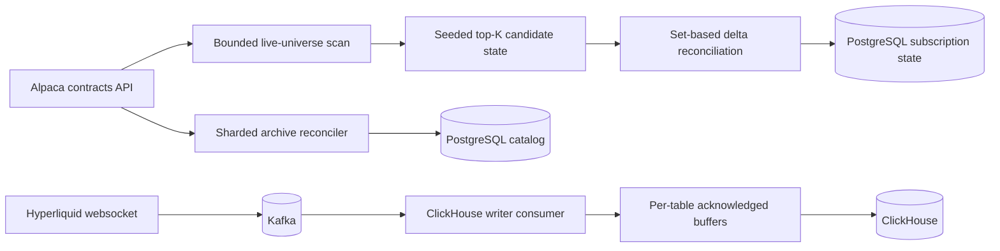

# Torghut and Ceph Write-Pressure Remediation Design

## Status

- Status: Accepted for implementation
- Date: 2026-07-13
- Source baseline: `67abf614db0da9404d2363eea0d2d5b17d13dafd`
- Owners: Torghut options lane, Dorvud Hyperliquid feed, Torghut data stores, Rook-Ceph
- Delivery model: small GitOps-backed pull requests with live validation after each rollout

## Executive decision

The immediate production fix is to remove avoidable write amplification before changing storage topology:

1. Make options subscription persistence delta-only and make contract discovery bounded.
2. Batch ClickHouse inserts by destination table and move ClickHouse persistence behind Kafka.
3. Tune PostgreSQL checkpoints and Ceph maintenance only after the application fixes establish a new baseline.
4. Remove the Kafka controller timeout overrides after the storage path is stable at normal timeout values.

Kafka controller-local storage is not part of the current rollout. Talos has sufficient local capacity, but the live
Strimzi 1.1.0 cluster uses an immutable controller `KafkaNodePool` and a static KRaft quorum. Manually copying the
metadata log, rebinding PVCs, or setting `kraft.version=1` underneath Strimzi is unsupported and unsafe.

The incoming network upgrade is a separate infrastructure change window. A third Ceph storage host is explicitly not
planned; the design accepts the resulting two-host durability ceiling.

## Problem statement

### Options catalog

The options catalog scans a 730-day active-contract universe using pages of 100 contracts. The live catalog contains
more than four million rows, and an observed discovery cycle remained incomplete after more than 21 hours.

After every provider page, `catalog_service.py` calls `write_subscription_state()`. That function:

- executes one unconditional upsert for every ranked hot/warm row; and
- updates every other subscription-state row to `tier = 'off'`, even if it is already off.

An observed 15.8-second production sample showed approximately:

- 53,397 updates to `torghut_options_subscription_state`;
- 3,373 updates per second; and
- 36.34 MiB of PostgreSQL WAL, or 2.29 MiB per second.

The configured five-minute discovery interval cannot be honored by a scan that takes many hours.

### ClickHouse

The Hyperliquid feed has one mixed-topic channel and one global `1,000`-record, `500`-millisecond batch. A global batch
is grouped by table only at flush time, so each table receives a much smaller insert. Production `system.part_log`
sampling showed roughly:

- 42-55 rows per new BBO part; and
- 2-4 rows per new candle part.

Both ClickHouse replicas continuously merge these tiny parts on Ceph RBD. The current sink also clears a failed batch
after logging the error, so ClickHouse persistence is not replay-safe even though the same event was sent to Kafka.

### Shared storage

Kafka controllers, brokers, Torghut PostgreSQL, ClickHouse, and other services share the same two-host Ceph cluster.
Kafka controller stalls have been traced to durable metadata-log writes blocked in `FileChannel.force(true)` on RBD.
Application-generated WAL and ClickHouse merge traffic increase the tail latency of that shared durable-write path.

## Scope

### In scope

- Delta-only options subscription reconciliation.
- Bounded live discovery and restartable archival reconciliation.
- Per-table ClickHouse batching, acknowledged retries, and backpressure.
- Kafka-backed ClickHouse ingestion with offset-after-ack semantics.
- Evidence-based PostgreSQL WAL/checkpoint settings.
- Evidence-based Ceph scrub concurrency and scheduling.
- Removal of Kafka timeout masking after the underlying pressure is fixed.
- Network-upgrade readiness and rollout gates.

### Out of scope

- Changing trading strategy semantics or risk authorization.
- Reducing durability settings such as PostgreSQL `fsync`, `full_page_writes`, or `synchronous_commit`.
- Manually migrating KRaft controller data.
- Replacing the Kafka cluster as part of this work.
- Adding a third Ceph storage host.
- Applying the not-yet-delivered network hardware.

## Safety invariants

1. Partial or failed catalog scans cannot deactivate previously valid subscriptions.
2. An unchanged provider page must cause zero physical subscription-state updates.
3. A ClickHouse failure cannot be reported as persisted or silently discarded.
4. Kafka offsets are committed only after ClickHouse acknowledges the corresponding rows.
5. PostgreSQL and ClickHouse durability settings remain enabled.
6. Ceph maintenance cannot create scrub debt indefinitely.
7. Kafka quorum, ISR, and controller membership are preserved throughout the application rollout.
8. All production changes flow through Git, CI, image publication, and Argo CD.

## Target architecture

## Design 1: options subscription reconciliation

### Seeded provisional state

At cycle start, load only the current `hot` and `warm` subscription rows and freeze their symbols as the protected seed
for the entire incomplete scan. A provisional flush must not deactivate a protected symbol or change its tier. This
preserves the last known-good live set even when the scanned provider prefix contains candidates that would otherwise
displace it.

Provisional candidates may use only the unfilled capacity remaining in each effective tier after the protected seed is
counted. Candidates first introduced by the current incomplete cycle may replace or deactivate one another as ranking
improves; provisional cleanup is limited to that cycle-owned set. If the protected seed already fills a tier, membership
changes for that tier wait for the final successful scan. On bootstrap the protected set is empty, so provisional
reconciliation may fill the full bounded capacity.

`cold` rows created by snapshot enrichment are neither candidates nor provisional deactivation targets. A separate
final-cleanup read includes every non-off tier, including `cold`, so a complete successful scan preserves the existing
stale-row cleanup semantics without admitting archival rows into live ranking. Only a cycle-owned candidate that enters,
leaves, or materially changes the provisional top-K produces a mutation; the final reconciliation may replace protected
rows after the full universe has been scanned successfully.

The candidate limit continues to come from `_tier_limits()`. With the current provider cap of 200, the effective limits
are 160 hot and 800 warm contracts.

### Mutation contract

The repository boundary accepts one reconciliation batch containing:

- the current desired ranked rows;
- the explicitly displaced symbols;
- the cycle identifier and observation timestamp; and
- whether the batch is provisional or final.

The repository executes one transaction:

1. Decode desired rows with `jsonb_to_recordset` or an equivalent set-based `VALUES` relation.
2. Insert missing rows.
3. Update existing rows only when the material tuple is distinct:
   - `ranking_score`
   - `ranking_inputs`
   - `tier`
   - `desired_channels`
   - `provider_cap_generation`
4. Set explicitly displaced rows to off only when their current tier is not already off.
5. Update the catalog-cycle watermark.

The existing blanket `contract_symbol <> ALL(:symbols)` update is removed from provisional reconciliation.

### Coalescing

Ranking scores are normalized by the maximum observed open interest, which may change during a scan. Candidate changes
are therefore coalesced and flushed at the first of:

- ten provider pages;
- 30 seconds; or
- a completed scan.

This keeps provisional readiness below the existing 300-second SLO while bounding score-only database churn.

### Final reconciliation

Only a complete, successful scan may perform final deactivation. Its explicit displacement set is computed from all
currently non-off rows, including `cold`; the final statement remains conditional and touches only rows whose tier
actually changes. Provider errors, shutdown, an invalid cursor, or a partial shard preserve the last completed state.

### Freshness semantics

Cycle freshness belongs to a component watermark, not every subscription row. `last_ranked_ts` records the last
material assignment change. Before rollout, repository-wide and dashboard searches must confirm that no external
consumer treats `last_ranked_ts` as a cycle heartbeat.

## Design 1B: bounded discovery

The live trading universe and the archival catalog are separate workloads:

### Live universe

- Source underlyings from the same versioned configuration that authorizes strategies to trade them.
- Derive maximum expiration from the maximum strategy DTE plus a documented safety margin.
- Preserve explicit long-dated/LEAPS strategy symbols where required.
- Reject an unintentionally empty live-universe configuration instead of interpreting it as all underlyings.
- Use provider-side underlying and expiration filters.

### Archival universe

- Retain the complete 730-day inventory outside the live readiness path.
- Partition work by bounded expiration windows.
- Store query fingerprint, shard, cursor, counts, status, and last success in `torghut_options_watermarks`.
- Mark missing contracts only within a completely scanned shard.
- Finalize a complete shard with a durable keyset cursor over
  `(expiration_date, contract_symbol)`, scanning and committing no more than 1,000 catalog rows per transaction. A
  candidate batch advances the cursor even when every candidate is present in the exact membership set; only an empty
  candidate batch marks the shard complete and removes staging membership. Pace committed batches at no more than four
  per second initially so bounded transactions do not become an fsync burst.
- Persist the cumulative transition count with that cursor so a restart resumes after the last committed batch instead
  of repeating the weekly shard. Serve the worker only after the matching partial index on active
  `(expiration_date, contract_symbol)` rows is valid.
- Use a database lease or advisory lock to prevent overlapping reconcilers.
- Retry the current shard without restarting the entire 730-day range.
- Treat statement and lock timeouts as secondary safety bounds, not as the remediation. Shutdown explicitly cancels an
  in-flight archive statement and each committed batch remains independently replay-safe.

### Low-WAL archive status overlay

Live validation of the initial finalizer showed that pacing alone was insufficient. Even ten catalog status updates per
transaction rewrote a roughly 3.1 GiB heap and four status-dependent indexes in a roughly 3.2 GiB index set, pushing
PostgreSQL WAL above the discovery budget. Archive finalization therefore must not update or row-lock the wide catalog.

Missing archive contracts are recorded in the logged, narrow
`torghut_options_contract_archive_status` table. `torghut_options_active_contract_catalog` exposes the effective active
set by excluding those overrides, and every active-catalog read uses that view. A provider page conditionally deletes
matching overrides and publishes the effective reactivation even when the wide catalog row itself is unchanged.

The finalizer writes one compact row keyed by contract symbol, updates it only when status, shard, or query fingerprint
materially changes, and protects every non-off subscription from archival deactivation. A transaction-scoped advisory
lock serializes status-overlay insertion with provider-page reactivation without dirtying catalog heap pages. The
existing physical catalog status remains the bounded live-discovery state and is the rollback source if the overlay is
disabled.

## Design 2: ClickHouse ingestion

### Per-table buffering

Replace the global buffer with independent table buffers. Initial policies are:

| Table class                | Size threshold | Maximum age |
| -------------------------- | -------------: | ----------: |
| BBO                        |     1,000 rows |  30 seconds |
| Candles                    |       100 rows |  30 seconds |
| Asset contexts and funding |       100 rows |  30 seconds |
| Market catalog and status  |       100 rows |  30 seconds |

The BBO policy is anchored to the observed roughly 34-40-row-per-second input rate: it should normally reach the
1,000-row size threshold while the age limit bounds persistence latency at 30 seconds.

Thresholds are typed configuration with validation. Each flush records table, rows, bytes, duration, attempt, and
flush reason. Shutdown drains all acknowledged buffers within a bounded grace period.

### Failure behavior

- A failed insert retains the table batch.
- Retry uses bounded exponential backoff with jitter.
- Per-table queues are bounded and expose backpressure; no unbounded memory growth is permitted.
- Readiness becomes false while required tables cannot persist.
- Sparse tables may use ClickHouse asynchronous inserts only with `wait_for_async_insert=1`.

### Durable Kafka writer

The final ingestion boundary is a dedicated Kafka consumer:

1. Consume normalized topics with partition ordering.
2. Buffer and flush by `(destination table, Kafka topic, Kafka partition)`; one insert never mixes partitions.
3. Add nullable `kafka_topic`, `kafka_partition`, and `kafka_offset` lineage columns to every writer-owned destination
   table; existing direct-sink rows remain null during migration.
4. Populate those columns on every consumed row and insert with a deterministic partition-scoped deduplication token
   derived from topic, partition, and the exact offset range. Retries within a writer process reuse the immutable batch
   body and token.
5. Commit offsets only after the insert is acknowledged.
6. Retry an uncommitted range without changing its token.
7. Make `(kafka_topic, kafka_partition, kafka_offset)` the logical uniqueness key of the writer-owned tables. On restart,
   compare an uncommitted range with persisted row lineage before inserting missing offsets, so a crash cannot create a
   second logical row merely because the new process chose a different batch boundary.
8. Confirm table engines and materialized views preserve that lineage-based uniqueness; an insert token alone is not
   accepted as durable deduplication or lineage evidence.
9. At the cutover high watermark, capture the source record-set manifest per partition. Delete-only topics require
   contiguous retained offsets. For `compact,delete` topics, require every offset still present in the captured Kafka
   record set to exist exactly once in ClickHouse while allowing numeric offsets removed by compaction.

The direct-sink thresholds above apply only before the Kafka-writer cutover because that sink aggregates all records for
a table. The writer shards every buffer by Kafka partition, so it uses partition-scoped policies sized from the observed
post-shard rate:

| Writer table class         | Size threshold | Maximum age |
| -------------------------- | -------------: | ----------: |
| BBO per topic partition    |     1,000 rows |   5 minutes |
| Sparse per topic partition |       100 rows |   5 minutes |

At the observed aggregate BBO rate of roughly 34-40 rows per second across 12 partitions, each partition receives only
about 2.8-3.3 rows per second. Reusing the direct sink's 30-second age would therefore recreate roughly 85-100-row parts.
The writer flushes on size during catch-up and on size or age in steady state. Its ClickHouse freshness budget is at
least 360 seconds so the five-minute age bound does not falsely fail readiness. Kubernetes readiness proves that the
writer is assigned, polling, committing acknowledged ClickHouse writes, fresh, and free of unresolved errors. Initial
consumer lag is reported separately through the `caughtUp` status field and
`torghut_hyperliquid_clickhouse_writer_caught_up` metric, so a healthy retained-history replay does not make the
Deployment or Argo CD falsely degrade. Size-triggered and age-triggered part sizes are measured separately.

The writer first runs against staging tables. Cutover disables direct feed-to-ClickHouse writes while the writer catches
up from Kafka, so a deployment gap is replayed rather than lost.

## PostgreSQL and Ceph tuning

Application changes land before infrastructure tuning.

### PostgreSQL

After a new 24-hour baseline, and only with sufficient PVC/archive headroom:

- enable `wal_compression = lz4` when supported, otherwise `pglz`;
- set `max_wal_size = 4GB` initially;
- set `checkpoint_timeout = 15min`; and
- keep `checkpoint_completion_target = 0.9`.

Do not weaken `fsync`, `full_page_writes`, or `synchronous_commit`. Do not lower `wal_level` without proving logical
replication and decoding are unused.

### Ceph

- Record seven days of hourly client latency and maintenance activity.
- Reduce `osd_max_scrubs` from 3 to 1 per OSD.
- Define a low-traffic scrub window from measured traffic, not an assumed clock window.
- Keep the current `high_client_ops` mClock profile initially.
- Alert on scrub and deep-scrub debt so maintenance cannot be deferred indefinitely.

RBD client caps are not used; they did not affect already-mounted clients during the prior incident.

## Kafka timeout cleanup

The current 60-second controller election and 180-second fetch timeout values mask storage stalls. After the application
and maintenance changes meet their live gates, remove both explicit fields and allow Kafka defaults. No timeout increase
is an accepted remediation for a failed validation gate.

## Post-implementation Jangar addendum

A clean-observation attempt after the original application slices found another independent shared-pool writer. Jangar
generated 18.204 MiB of PostgreSQL WAL in 30.182 seconds while its primary and asynchronous replica were the largest
sustained RBD images. The same capture showed roughly 50-400 ms RBD write latency and recurring Kafka controller fsync
stalls. Jangar quant persistence must therefore switch from append-only pipeline-health history to primary-keyed latest
state, suppress no-op latest-metric updates, and reduce one-minute analytical-series sampling from five seconds to one
minute before the storage-stability observation can start. Compute, alerting, and trading semantics remain unchanged.

## Post-implementation registry addendum

A later clean-observation attempt isolated another shared-pool writer. Analysis ARC scratch had already moved from an
RBD PVC to a bounded node-local `emptyDir`, but its image publication still drove the single Distribution registry.
That registry stores its filesystem on `rook-ceph-block`; during the push Kafka controller 2 recorded twelve controller
events above two seconds, with a 3.288-second maximum. The DinD daemon was configured for eight concurrent uploads,
above Docker's default of five, but the observed workflow used the `docker-container` BuildKit driver. Its exporter runs
inside the BuildKit container and does not inherit the Docker daemon's upload limit.

The Analysis workflow now removes its duplicate `mode=max` registry-cache export, keeps only inline cache metadata, and
sets BuildKit's OCI worker `max-parallelism` to one. This removes publication of every intermediate build layer while
preserving final-image cache reuse. All ARC DinD daemons also use `--max-concurrent-uploads=1` as a secondary boundary
for direct Docker daemon pushes; that per-daemon flag is not treated as a global limit and does not govern direct
`skopeo` publication.

The definitive boundary is therefore attached to the singleton registry itself. Its Service terminates at an HAProxy
sidecar that routes `POST`, `PUT`, `PATCH`, and `DELETE` requests through one backend connection while preserving a
separate concurrent path for `GET` and `HEAD` image pulls. The write backend closes its server connection after each
response so the single slot cannot remain captured by an idle publisher, and queues at most 128 write requests for up
to two hours. A generated ConfigMap name forces a pod rollout on proxy-policy changes, and `Recreate` prevents two
registry pods from competing for the RWO filesystem during that rollout. This covers Docker, BuildKit, and direct OCI
publishers at the same shared choke point without reducing pull concurrency.

The cancelled analysis image workflow must be rerun through build and push after this boundary rolls out, and a new
30-minute storage gate must show no controller event above two seconds. If the real BuildKit workload still fails that
gate, stop the rollout and design a retained local-registry migration with explicit copy, outage, recovery, and
digest-inventory proof rather than masking the failure with Kafka timeouts.

## Talos local-storage feasibility and boundary

Talos user volumes already expose sufficient local capacity:

| Node  | Candidate path                    | Approximate free space | Constraint                                                  |
| ----- | --------------------------------- | ---------------------: | ----------------------------------------------------------- |
| Ryzen | `/var/mnt/local-path-provisioner` |                1.80 TB | Shares the physical OS NVMe                                 |
| Altra | `/var/mnt/local-path-provisioner` |                3.62 TB | Must not use its Ceph DB/WAL NVMe                           |
| Turin | `/var/mnt/turin-nvme-intel`       |                 250 GB | Current class is `Delete` and prohibits Kafka durable state |

Capacity does not make the migration safe. The current controller pool uses `rook-ceph-block`, static
`controller.quorum.voters`, and `kraft.version=0`; Strimzi 1.1.0 does not manage a static-to-dynamic quorum conversion.

When a future Strimzi release supports that conversion, the target is one static `Retain` local PV per node with hard
node affinity, required controller anti-affinity, and a sequential add/catch-up/remove workflow. Until then, local
controller migration remains deferred rather than implemented through manual metadata surgery.

## Network upgrade plan

The new network is delivered independently from these application changes:

1. Inventory NIC, switch, transceiver, and cable speeds.
2. Bring up a storage subnet while preserving the current 1 Gb path for rollback.
3. Verify negotiated speed, bidirectional throughput, MTU, loss, and errors.
4. Keep MTU 1500 unless jumbo frames pass end-to-end validation.
5. Ensure every RBD client node can reach the Ceph public network.
6. Use a separate cluster/replication network only when both storage hosts have the fast path.
7. Restart or migrate one Ceph daemon at a time, requiring `active+clean` between steps.

With only two storage hosts, every size-two durable write still crosses both failure domains. Faster networking reduces
queueing and replication time but does not remove HDD flush latency or provide a third durable copy.

## Delivery plan

1. **PR 0 - design:** this document and the Torghut source map.
2. **PR 1 - options delta reconciliation:** repository transaction, provisional state, metrics, and regression tests.
3. **PR 2 - bounded discovery:** live-universe policy, archival shards, checkpointing, and partial-scan safety.
4. **PR 3 - ClickHouse batching:** per-table buffers, acknowledged retries, metrics, and tests.
5. **PR 4 - durable writer:** Kafka consumer, staging parity, deduplication, and cutover.
6. **PR 5 - measured database/storage tuning:** CNPG and Ceph settings after rebaselining.
7. **PR 6 - timeout cleanup:** remove Kafka timeout overrides and prove stability at defaults.

Each PR starts from fresh `main`, contains only its declared scope, passes automatic Codex review and CI, uses squash
merge, and is followed through image publication, Argo reconciliation, and live proof before the next dependent PR.

## Validation

### Static

- Torghut: Ruff, targeted pytest, and all three Pyright profiles.
- Dorvud: `services/dorvud/gradlew :hyperliquid-feed:test`.
- GitOps: render affected Kustomize paths, server-side dry-run, and `bun run lint:argocd`.
- No unexpected resource deletion or namespace ownership change.

### Live gates

- Before activating either contained write workload, keep both workloads at zero replicas and capture the observation
  anchor with
  `bun run gate:torghut-storage-stability --capture-smart-baseline <new local path>`. Use the emitted capture timestamp
  as `--observation-start`, wait at least 30 minutes, then run
  `bun run gate:torghut-storage-stability --observation-start <capture timestamp> --smart-baseline <same path> --output json`.
  Capture mode writes a new local evidence file but does not mutate the cluster; the live gate is read-only. It requires
  complete Talos and Kafka log coverage for the window, `HEALTH_OK`, all six OSDs
  up and in, only clean placement groups, no unacknowledged crashes, and no new SCSI device-reset/recovery, cache-flush,
  or I/O-error record. Every expected disk must match its baseline serial and pass SMART overall health both at the
  observation start and at evaluation. Reallocated, pending, and offline-uncorrectable sectors must remain absolutely
  zero; the lifetime interface-CRC counter may retain historical events but must be unchanged from the observation
  baseline. Historical SMART self-tests are retained as diagnostic context but
  are not treated as proof of a physical repair or as an activation prerequisite. The gate also requires no KRaft
  request timeout or
  controller event above two seconds, exactly three KRaft voters with follower lag below 1,000 records and five seconds,
  no under-replicated or offline partitions, Torghut and Jangar PostgreSQL durability and WAL-budget compliance, and
  healthy Argo applications. Jangar must remain at or below 0.3015 MiB/s, a 50% reduction from its measured 0.603 MiB/s
  pre-change baseline. Direct endpoint checks must also prove the Hyperliquid feed ready with WebSocket, Kafka, and
  ClickHouse true; the scheduler running with fresh trading/reconcile cycles and healthy leadership; and the current
  Knative API revision ready. Both write workloads must still be at zero replicas. A warning that the temporary Kafka
  controller timeout overrides remain present is expected at this stage; passing this gate does not authorize their
  removal.
- An unchanged catalog page causes zero subscription updates.
- Subscription updates fall at least 95%; steady target is below 10 per second outside actual membership changes.
- Torghut PostgreSQL WAL falls below 0.25 MiB per second during discovery.
- Jangar PostgreSQL WAL remains at or below 0.3015 MiB per second after its persistence fix.
- Hot/warm membership remains within provider limits and snapshot freshness remains healthy.
- During direct-sink batching, BBO median part size is at least 1,000 rows. After partition-scoped writer cutover,
  size-triggered BBO parts contain 1,000 rows, age-triggered parts are reported separately, and the aggregate `NewPart`
  reduction remains at least 80%.
- ClickHouse `NewPart` and `MergeParts` rates fall at least 80%.
- ClickHouse and Kafka row/offset reconciliation reports no unexplained gaps under the delete-only or compacted-topic
  contract above.
- Kafka has three stable voters, full ISR, zero offline partitions, and no fencing.
- Ceph is `HEALTH_OK` before archive or Kafka-writer activation; bounded maintenance warnings are acceptable only while
  the write workloads remain contained.
- Torghut feed `/readyz` returns 200 with Kafka and ClickHouse true; trading runtime remains ready.

## Rollback and containment

- Options reconciliation: revert the service image; preserve the last valid subscription rows and compare the saved
  hot/warm snapshot.
- Discovery: stop the archival reconciler without affecting the last completed live-universe watermark.
- Direct-sink batching: stop the rollout and keep the current feed pod running until every per-table pending-record gauge
  reaches zero, then revert the feed image. This path owns only in-memory retry batches; it must not claim Kafka consumer
  offset replay. If the pod is lost before draining, mark the affected ClickHouse interval incomplete and backfill the
  corresponding retained Kafka record set with a validated replay consumer before restoring parity.
- Kafka writer before cutover: stop the writer; its uncommitted consumer offsets remain replayable.
- Writer cutover: re-enable the direct sink only at a recorded Kafka offset boundary.
- PostgreSQL/Ceph settings: revert one parameter at a time through GitOps.
- Kafka timeout cleanup: restore the previous values only as temporary containment while reopening the storage incident;
  do not call that restoration a fix.
- Network: retain the previous route/subnet until the new path completes the full live proof.

## Completion criteria

The program is complete when all application and GitOps PRs are merged and live, the observed write and merge reductions
meet the gates above, Kafka is stable at default controller timeout behavior, and the evidence is recorded in a rollout
document. Local-controller migration and physical network installation are tracked as separately gated work because the
current operator support and hardware availability are external constraints.

## Primary references

- Talos user volumes: <https://docs.siderolabs.com/talos/v1.13/configure-your-talos-cluster/storage-and-disk-management/disk-management/user>
- Kafka 4.3 KRaft operations: <https://kafka.apache.org/43/operations/kraft/>
- Strimzi 1.1 KRaft mode: <https://github.com/strimzi/strimzi-kafka-operator/blob/1.1.0/documentation/assemblies/deploying/assembly-kraft-mode.adoc>
- ClickHouse insert strategy: <https://clickhouse.com/docs/best-practices/selecting-an-insert-strategy>
- ClickHouse asynchronous inserts: <https://clickhouse.com/docs/optimize/asynchronous-inserts>
- PostgreSQL WAL configuration: <https://www.postgresql.org/docs/17/wal-configuration.html>
- Rook network providers: <https://rook.io/docs/rook/latest-release/CRDs/Cluster/network-providers/>
