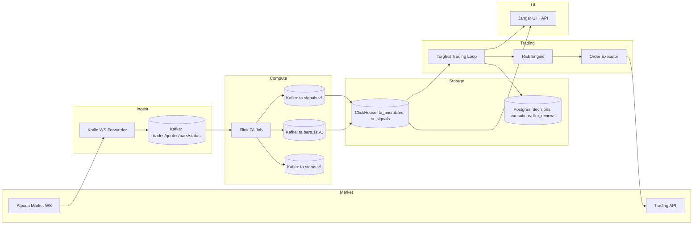

# Torghut System Design (Consolidated)

## Status
Legacy snapshot. Canonical production-facing design docs are `docs/torghut/design-system/README.md` (v1).

## Scope
Torghut is a streaming market-data and technical-analysis (TA) system with a trading loop on top of ClickHouse-backed signals. It includes:
- Alpaca WS ingestion and TA computation.
- Persistent storage in ClickHouse.
- Optional automated trading (paper by default, live gated).
- Observability and operational runbooks.
- Jangar visualization UI and APIs.

The torghut main service does **not** consume TA topics directly; it reads TA data from ClickHouse.

## Goals
- Low-latency TA signals with stable correctness guarantees.
- Repeatable, auditable trading decisions and executions.
- Safe-by-default controls for trading (paper first, live gated).
- Operationally clear recovery paths for all critical components.
- A future-proof design that can expand to multi-venue and LLM oversight.

## Non-goals
- Multi-broker execution in the initial build.
- LLM-only trading decisions without deterministic controls.
- Unbounded data retention for signals and logs.

## High-Level Architecture

The trading loop runs inside the torghut Knative service when `TRADING_ENABLED=true`. It is configured
for paper mode by default and uses trading-specific environment variables.



## Core Data Flow
1) **Alpaca WS** provides trades/quotes/bars. Alpaca limits most subscriptions to **one** WS connection per account and returns 406 on a second connection; the forwarder must be single-replica or otherwise enforce a single active connection. (Alpaca WS docs)
2) **WS Forwarder** deduplicates and publishes to Kafka with idempotent producer settings.
3) **Flink TA** consumes Kafka, computes microbars/signals, and emits TA topics plus status.
4) **ClickHouse** stores TA outputs and is the authoritative source for trading signals and visualization.
5) **Torghut Trading** polls ClickHouse, makes deterministic decisions, optionally applies LLM review, then executes via Alpaca Trading API.
6) **Reconciler** compares Alpaca state and persists to Postgres.
7) **Jangar** reads ClickHouse to visualize TA indicators and streams.

## Reliability and Consistency Guarantees
### Flink Checkpointing
Flink checkpoints provide exactly-once semantics when configured with durable storage and connectors that support transactional semantics. Production guidance:
- Enable checkpointing and store checkpoints in durable storage (S3/MinIO). (Flink docs)
- Use exactly-once checkpoints for TA pipelines. (Flink docs)
- Savepoints are the primary tool for upgrades and migrations. (Flink docs)

### Kafka Retention and Compaction
Kafka topics should use retention policies that match data semantics:
- `cleanup.policy=delete` for time-series events (trades/quotes/bars). (Kafka topic configs)
- `cleanup.policy=compact,delete` for status topics to retain latest status while limiting growth. (Kafka configs + compaction docs)
- `retention.ms` defines the max time data is kept before deletion. (Kafka configs)
Schema evolution should follow compatibility rules (backward/forward/full) enforced in CI via schema registry checks. (Schema Registry compatibility)

### ClickHouse Retention
Use TTLs to control growth and avoid full-disk incidents:
- Table-level TTLs remove data during merges; TTLs are not immediate and are applied on merge schedules. (ClickHouse TTL docs)
- Prefer `ttl_only_drop_parts=1` and partition by the TTL unit to avoid costly row-level mutations. (ClickHouse TTL docs)
- Avoid overly granular partitions; ClickHouse recommends partitioning no more granular than month in most cases. (ClickHouse MergeTree docs)

### Replica Recovery
If replication metadata is lost, ClickHouse replicas can be restored using `SYSTEM RESTORE REPLICA`. (Altinity guidance)

## Failure Scenarios and Recovery (Operational)
### Alpaca WS Forwarder
- **Symptom:** 401/403 auth failures or 406 connection limit.
- **Detection:** readiness fails; logs show auth or 406.
- **Recovery:** verify one replica, rotate keys, restart forwarder, confirm status topic emits `healthy`.

### Kafka Produce/Consume
- **Symptom:** produce errors, consumer lag spikes.
- **Detection:** readiness false on forwarder, Flink lag metrics, broker errors in logs.
- **Recovery:** verify KafkaUser/SASL secrets, broker health, restart clients after fix.

### Flink Checkpoint Stall
- **Symptom:** checkpoint age increases; job still running but lag grows.
- **Detection:** watermark/lag dashboards, checkpoint age alert.
- **Recovery:** verify MinIO/S3 access, restart FlinkDeployment with last-state or savepoint.

### ClickHouse Disk/Replica Issues
- **Symptom:** inserts fail, replicas read-only, increasing queue.
- **Detection:** ClickHouse logs, `SYSTEM REPLICA STATUS`, disk alerts.
- **Recovery:** free space (TTL/retention), restore replicas, ensure keeper metadata present.

### Trading Loop Failures
- **Symptom:** no decisions/executions, reconcile lag.
- **Detection:** `/trading/health` and decision lag metrics.
- **Recovery:** validate ClickHouse connectivity, Alpaca API keys, and restart torghut service.

### Jangar Visualization
- **Symptom:** empty charts or errors for TA endpoints.
- **Detection:** `/api/torghut/ta/latest` returns error or stale data.
- **Recovery:** verify ClickHouse DB config and API query errors; ensure `CH_DATABASE=torghut`.

## Trading Loop Design (ClickHouse-first)
- **Signal source:** ClickHouse `ta_signals`.
- **Decision pipeline:** deterministic decision -> optional LLM review -> risk checks -> order execution -> reconciliation.
- **Idempotency:** decision hash (strategy_id + symbol + event_ts + action + params) stored as unique key.
- **Execution gating:** paper by default; live requires explicit enablement flags.

## LLM Intelligence Layer (Optional)
The intelligence layer evaluates deterministic decisions and can veto or adjust within strict bounds. It is advisory and cannot bypass risk gates. The design aligns to:
- NIST AI RMF (govern/map/measure/manage). (NIST AI RMF)
- NIST AI RMF Playbook for actionable operationalization. (NIST AI RMF Playbook)
- OWASP LLM Top 10 for app security risks (prompt injection, output handling, overreliance). (OWASP LLM Top 10)
- Federal Reserve SR 11-7 model risk management principles (inventory, validation, effective challenge). (SR 11-7)

## Observability and Tracing
- Use structured logs and OpenTelemetry semantic conventions for Kafka messaging (producer/consumer spans, messaging attributes). (OpenTelemetry Kafka semconv)
- Avoid high-cardinality labels in Loki; keep labels bounded and store dynamic fields as log content or structured metadata. (Loki label cardinality best practices)

## Interfaces and APIs (Proposed)
### Torghut Trading API
- `GET /trading/status` -> current mode, enabled flags, last decision timestamp.
- `GET /trading/health` -> dependency readiness (Alpaca, ClickHouse, Postgres).
- `GET /trading/decisions?symbol=&since=` -> decisions audit trail.
- `GET /trading/executions?symbol=&since=` -> executions and reconciliation state.

### Example Trading API Shapes
`GET /trading/status`:
```json
{
  "enabled": false,
  "mode": "paper",
  "last_decision_at": "2026-01-02T00:00:00Z",
  "llm_enabled": false
}
```

`GET /trading/health`:
```json
{
  "clickhouse": "ok",
  "alpaca": "ok",
  "postgres": "ok",
  "last_reconcile_at": "2026-01-02T00:00:00Z"
}
```

### Jangar TA API (Current)
- `GET /api/torghut/ta/bars?symbol=&from=&to=` -> microbars.
- `GET /api/torghut/ta/signals?symbol=&from=&to=` -> indicators/signals.
- `GET /api/torghut/ta/latest?symbol=` -> last signal timestamp + lag.

## Kubernetes Readiness/Liveness
- Readiness probes remove pods from service endpoints without killing them, enabling safe backpressure and dependency warm-up. (Kubernetes probes docs)
- Startup probes prevent premature restarts for slow-starting services. (Kubernetes probes docs)

## Autoscaling Considerations
- Knative concurrency settings control per-revision request limits. Hard limits use `containerConcurrency`; soft limits use autoscaler metrics/targets. (Knative concurrency docs)
- Autoscaling must be constrained for the Alpaca WS forwarder to enforce single-connection rules.

## Network Policy
- NetworkPolicy supports ingress/egress isolation with `podSelector`, `policyTypes`, and explicit `ingress`/`egress` rules. (Kubernetes NetworkPolicy docs)

## Security and Secrets
- Kafka auth via SASL/SCRAM; prefer TLS when feasible.
- Secrets stored in Kubernetes Secrets or SealedSecrets; rotation documented in runbooks.
- Avoid logging credentials; ensure log redaction.

## Data Models (Summary)
### ClickHouse
- `ta_microbars`: computed bars keyed by `(symbol, event_ts, seq)` with `DateTime64(3, 'UTC')` timestamps.
- `ta_signals`: indicators and strategy outputs keyed by `(symbol, event_ts, seq)` with `DateTime64(3, 'UTC')`.

Trading ingestion queries ClickHouse based on `TRADING_SIGNAL_SCHEMA`:
- `auto` (default): inspect columns and choose envelope (`event_ts`) or flat (`ts`).
- `envelope`: select only envelope columns (`event_ts`, `ingest_ts`, `symbol`, `payload`, `window`, `seq`, `source`).
- `flat`: select only flat columns (`ts`, `symbol`, `macd`, `macd_signal`, `signal`, `rsi`, `rsi14`, `ema`, `vwap`,
  `signal_json`, `timeframe`, `price`, `close`, `spread`).

### Postgres
- `trade_decisions`: decision_hash unique, decision metadata, timestamps.
- `executions`: Alpaca order ids, state transitions, reconciliation timestamps.
- `llm_decision_reviews`: model/prompt metadata and verdicts.

### Example DDL (ClickHouse)
```sql
CREATE TABLE torghut.ta_microbars (
  symbol LowCardinality(String),
  event_ts DateTime64(3, 'UTC'),
  seq UInt64,
  ingest_ts DateTime64(3, 'UTC'),
  is_final UInt8,
  source LowCardinality(String),
  window_size LowCardinality(String),
  window_step Nullable(String),
  window_start Nullable(DateTime64(3, 'UTC')),
  window_end Nullable(DateTime64(3, 'UTC')),
  version UInt32,
  o Float64,
  h Float64,
  l Float64,
  c Float64,
  v Float64,
  vwap Nullable(Float64),
  count UInt64
)
ENGINE = ReplicatedReplacingMergeTree('/clickhouse/tables/{cluster}/{shard}/ta_microbars', '{replica}', ingest_ts)
PARTITION BY toDate(event_ts)
ORDER BY (symbol, event_ts, seq)
TTL toDateTime(event_ts) + INTERVAL 30 DAY
SETTINGS index_granularity = 8192;

CREATE TABLE torghut.ta_signals (
  symbol LowCardinality(String),
  event_ts DateTime64(3, 'UTC'),
  seq UInt64,
  ingest_ts DateTime64(3, 'UTC'),
  is_final UInt8,
  source LowCardinality(String),
  window_size LowCardinality(String),
  window_step Nullable(String),
  window_start Nullable(DateTime64(3, 'UTC')),
  window_end Nullable(DateTime64(3, 'UTC')),
  version UInt32,
  macd Nullable(Float64),
  macd_signal Nullable(Float64),
  macd_hist Nullable(Float64),
  ema12 Nullable(Float64),
  ema26 Nullable(Float64),
  rsi14 Nullable(Float64),
  boll_mid Nullable(Float64),
  boll_upper Nullable(Float64),
  boll_lower Nullable(Float64),
  vwap_session Nullable(Float64),
  vwap_w5m Nullable(Float64),
  imbalance_spread Nullable(Float64),
  imbalance_bid_px Nullable(Float64),
  imbalance_ask_px Nullable(Float64),
  imbalance_bid_sz Nullable(UInt64),
  imbalance_ask_sz Nullable(UInt64),
  vol_realized_w60s Nullable(Float64)
)
ENGINE = ReplicatedReplacingMergeTree('/clickhouse/tables/{cluster}/{shard}/ta_signals', '{replica}', ingest_ts)
PARTITION BY toDate(event_ts)
ORDER BY (symbol, event_ts, seq)
TTL toDateTime(event_ts) + INTERVAL 14 DAY
SETTINGS index_granularity = 8192;
```

### Backward-compatible flat view (optional)
If you must preserve a flat consumer (ts/macd/rsi/etc), create a view that projects
the envelope payload into columns and alias `event_ts` to `ts`.

```sql
CREATE VIEW torghut.ta_signals_flat AS
SELECT
  event_ts AS ts,
  symbol,
  JSONExtractFloat(payload, 'rsi14') AS rsi,
  JSONExtractFloat(payload, 'macd.macd') AS macd,
  JSONExtractFloat(payload, 'macd.signal') AS macd_signal,
  payload AS signal_json
FROM torghut.ta_signals;
```

### Example DDL (Postgres)
```sql
CREATE TABLE trade_decisions (
  id uuid PRIMARY KEY,
  decision_hash text UNIQUE NOT NULL,
  symbol text NOT NULL,
  side text NOT NULL,
  qty numeric NOT NULL,
  decision_json jsonb NOT NULL,
  created_at timestamptz NOT NULL DEFAULT now(),
  executed_at timestamptz
);

CREATE TABLE executions (
  id uuid PRIMARY KEY,
  decision_id uuid REFERENCES trade_decisions(id),
  alpaca_order_id text NOT NULL,
  status text NOT NULL,
  last_update_at timestamptz NOT NULL DEFAULT now()
);

CREATE INDEX trade_decisions_symbol_created_at_idx
  ON trade_decisions (symbol, created_at DESC);
```

## Backtesting and Promotion Gates
- Maintain a reproducible backtest harness that replays ClickHouse data windows.
- Require strategy changes to pass a baseline of metrics before paper enablement.
- Shadow mode: log LLM decisions without affecting execution and compare against deterministic outcomes.
- Promotion gates for live trading should require:
  - stable veto/approve rates,
  - bounded drawdown in paper,
  - no increase in reconciliation errors,
  - human review sign-off for model/prompt changes.

## SLOs and SLIs (Proposed)
- **TA end-to-end latency p95:** 500ms target (WS -> CH).
- **Flink checkpoint age:** <2x checkpoint interval.
- **Trading decision lag:** <2x poll interval.
- **Jangar API latency p95:** <200ms for cached TA queries.

## Known Gaps / Future Work
- Full disaster recovery runbook for Kafka + ClickHouse + Flink.
- CI checks that validate schema compatibility rules for TA schemas.
- Backtesting harness implementation with data replay automation and report generation.
- Live trading promotion checklist and formal change approval process.
- Multi-venue execution, split routing, and smart order routing (future phase).
- LLM shadow evaluation dashboards and automated veto-precision metrics.

## Roadmap (Future)
- Finalize ClickHouse TTLs, add schema validation in CI, define explicit DDL migrations, and tighten runbooks for ClickHouse and Flink recovery.
- Complete trading loop, add shadow-mode evaluation, and introduce decision review dashboards with policy-driven overrides.
- Multi-broker execution, portfolio-level risk, advanced anomaly detection on signals, and LLM co-pilot for strategy maintenance.

## Related Docs
- Streaming architecture: `docs/torghut/architecture.md`
- Automated trading (one-shot execution): `docs/torghut/automated-trading.md`
- LLM intelligence layer: `docs/torghut/llm-intelligence-layer.md`
- Flink TA job: `docs/torghut/flink-ta.md`
- Topics & schemas: `docs/torghut/topics-and-schemas.md`
- Runbooks: `docs/torghut/operations-legacy.md`
- Ops recovery note: `docs/torghut/ops-2026-01-01-ta-recovery.md`

## References (research)
- Alpaca WS connection limits: https://docs.alpaca.markets/docs/streaming-market-data
- Kafka topic configs (cleanup.policy, retention.ms): https://kafka.apache.org/41/configuration/topic-configs/
- Kafka retention.ms details: https://kafka.apache.org/41/configuration/topic-configs/
- Kafka log compaction design: https://kafka.apache.org/41/design/design/
- Flink checkpointing overview: https://nightlies.apache.org/flink/flink-docs-master/docs/dev/datastream/fault-tolerance/checkpointing/
- Flink savepoints: https://nightlies.apache.org/flink/flink-docs-master/docs/ops/state/savepoints/
- ClickHouse TTL: https://clickhouse.com/docs/guides/developer/ttl
- ClickHouse TTL and ttl_only_drop_parts: https://clickhouse.com/docs/use-cases/observability/clickstack/ttl
- ClickHouse MergeTree partitioning: https://clickhouse.com/docs/en/engines/table-engines/mergetree-family/mergetree/
- ClickHouse replica restore: https://altinity.com/blog/a-new-way-to-restore-clickhouse-after-zookeeper-metadata-is-lost
- NIST AI RMF 1.0: https://www.nist.gov/publications/artificial-intelligence-risk-management-framework-ai-rmf-10
- NIST AI RMF Playbook: https://www.nist.gov/itl/ai-risk-management-framework/nist-ai-rmf-playbook
- OWASP LLM Top 10: https://owasp.org/www-project-top-10-for-large-language-model-applications/
- Federal Reserve SR 11-7: https://www.federalreserve.gov/supervisionreg/srletters/sr1107.htm
- OpenTelemetry Kafka semantic conventions: https://opentelemetry.io/docs/specs/semconv/messaging/kafka/
- Loki label cardinality: https://grafana.com/docs/loki/latest/get-started/labels/cardinality/
- Kubernetes probes: https://kubernetes.io/docs/concepts/configuration/liveness-readiness-startup-probes
- Kubernetes NetworkPolicy: https://v1-34.docs.kubernetes.io/docs/concepts/services-networking/network-policies/
- Knative concurrency: https://knative.dev/docs/serving/autoscaling/concurrency/
- Knative autoscaling overview: https://knative.dev/docs/serving/autoscaling/
- Schema Registry compatibility: https://docs.confluent.io/platform/current/schema-registry/fundamentals/schema-evolution.html
