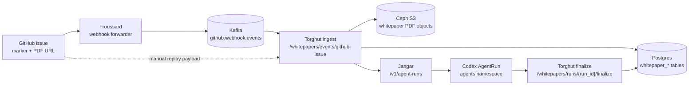
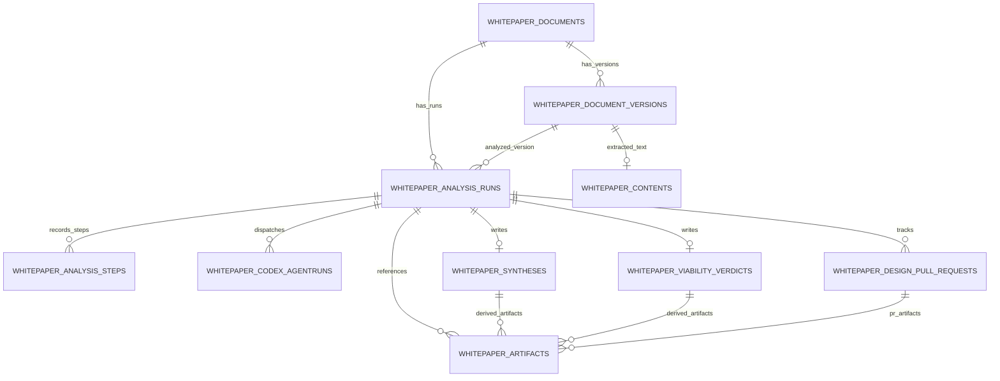

# Whitepaper Research Workflow Triggering (Torghut)

This runbook documents how to trigger Torghut's whitepaper analysis workflow and verify end-to-end progress.

Source implementation:
- `services/torghut/app/main.py`
- `services/torghut/app/whitepapers/workflow.py`

## What this workflow does

1. Accepts a GitHub issue payload with a whitepaper kickoff marker and PDF URL.
2. Downloads the PDF and uploads it to Ceph (`s3://<bucket>/<key>`).
3. Creates a whitepaper analysis run in Torghut DB.
4. Dispatches a Codex AgentRun directly via Jangar (`/v1/agent-runs`) when auto-dispatch is enabled.

## Data flow diagram (trigger to completion)



## Required kickoff contract in issue body

Include this block in the GitHub issue body:

```md
<!-- TORGHUT_WHITEPAPER:START -->
workflow: whitepaper-analysis-v1
base_branch: main
<!-- TORGHUT_WHITEPAPER:END -->
```

Also include at least one `.pdf` URL in the issue body (markdown link or plain URL).  
Optional marker keys:
- `attachment_url`: explicit PDF URL override
- `head_branch`: explicit AgentRun head branch (defaults to `codex/whitepaper-<suffix>`)

## Required runtime configuration

Minimum:
- `WHITEPAPER_WORKFLOW_ENABLED=true`
- Ceph/S3 config:
  - `WHITEPAPER_CEPH_ENDPOINT` (or `WHITEPAPER_CEPH_BUCKET_HOST` + `WHITEPAPER_CEPH_BUCKET_PORT`)
  - `WHITEPAPER_CEPH_ACCESS_KEY` (or `AWS_ACCESS_KEY_ID`)
  - `WHITEPAPER_CEPH_SECRET_KEY` (or `AWS_SECRET_ACCESS_KEY`)
  - optional `WHITEPAPER_CEPH_BUCKET` (default: `torghut-whitepapers`)

For Kafka ingestion path:
- `WHITEPAPER_KAFKA_BOOTSTRAP_SERVERS`
- optional `WHITEPAPER_KAFKA_TOPIC` (default: `github.webhook.events`)

For AgentRun submission:
- `WHITEPAPER_AGENTRUN_SUBMIT_URL` or `JANGAR_BASE_URL` (default fallback: `http://agents.agents.svc.cluster.local`)
- optional `JANGAR_API_KEY`

For comment-based requeue:
- optional `WHITEPAPER_REQUEUE_COMMENT_KEYWORD` (default: `research whitepaper`)

For manual control endpoint auth:
- optional `WHITEPAPER_WORKFLOW_API_TOKEN` (if unset, Torghut falls back to `JANGAR_API_KEY`)
- when either token is set, send `Authorization: Bearer <token>` or `x-whitepaper-token`

## Trigger path A (normal): GitHub issue -> Kafka -> Torghut

1. Open or edit a GitHub issue with the kickoff marker + PDF URL.
2. Froussard publishes the GitHub webhook event into Kafka (`WHITEPAPER_KAFKA_TOPIC`).
3. Torghut whitepaper worker consumes and ingests the event.
4. Torghut creates deterministic `run_id` (`wp-...`) and dispatches a Codex AgentRun (if auto-dispatch is enabled).
5. If the run failed and must be retried, add an issue comment with `research whitepaper` to requeue dispatch for the same run.

## Trigger path B (manual replay/debug): call Torghut API directly

Use this when validating locally or replaying a webhook event.

```bash
curl -sS -X POST "http://localhost:8181/whitepapers/events/github-issue" \
  -H "Authorization: Bearer <WHITEPAPER_WORKFLOW_API_TOKEN>" \
  -H "Content-Type: application/json" \
  -d '{
    "event": "issues",
    "action": "opened",
    "repository": { "full_name": "proompteng/lab" },
    "issue": {
      "number": 42,
      "title": "Analyze whitepaper: QuantAgent",
      "body": "<!-- TORGHUT_WHITEPAPER:START -->\nworkflow: whitepaper-analysis-v1\nbase_branch: main\n<!-- TORGHUT_WHITEPAPER:END -->\n\nAttachment: https://arxiv.org/pdf/2402.03755.pdf",
      "html_url": "https://github.com/proompteng/lab/issues/42"
    },
    "sender": { "login": "alice" }
  }'
```

Expected response:
- `202` with `{"accepted": true, "run_id": "wp-...", ...}` when queued
- `200` with `{"accepted": false, "reason": "..."}` when ignored/rejected

## Verify workflow status

Check service-level status:

```bash
curl -sS "http://localhost:8181/whitepapers/status" | jq
```

Key fields:
- `workflow_enabled`
- `worker_running`
- `requeue_comment_keyword`
- `control_auth_enabled`

Check run-level status:

```bash
curl -sS "http://localhost:8181/whitepapers/runs/<run_id>" | jq
```

This includes:
- run status and failure reason
- document/document_version metadata
- latest dispatched AgentRun metadata
- design PR metadata (if finalized)

## Manual AgentRun dispatch (if auto dispatch is off or failed)

If `WHITEPAPER_AGENTRUN_AUTO_DISPATCH=false` (or dispatch failed), dispatch explicitly:

```bash
curl -sS -X POST "http://localhost:8181/whitepapers/runs/<run_id>/dispatch-agentrun" \
  -H "Authorization: Bearer <WHITEPAPER_WORKFLOW_API_TOKEN>" | jq
```

## Finalize run from orchestration outputs

When synthesis/verdict/PR outputs are ready:

```bash
curl -sS -X POST "http://localhost:8181/whitepapers/runs/<run_id>/finalize" \
  -H "Authorization: Bearer <WHITEPAPER_WORKFLOW_API_TOKEN>" \
  -H "Content-Type: application/json" \
  -d '{
    "status": "completed",
    "synthesis": {
      "executive_summary": "Summary...",
      "key_findings": ["f1", "f2"],
      "confidence": "0.87"
    },
    "verdict": {
      "verdict": "implement",
      "score": "0.81",
      "confidence": "0.84",
      "requires_followup": false
    },
    "design_pull_request": {
      "attempt": 1,
      "status": "opened",
      "repository": "proompteng/lab",
      "base_branch": "main",
      "head_branch": "codex/whitepaper-42",
      "pr_number": 1234,
      "pr_url": "https://github.com/proompteng/lab/pull/1234"
    }
  }' | jq
```

## Data stored in DB after workflow completion

When run finalization is called (`POST /whitepapers/runs/{run_id}/finalize`) and status is `completed`, Torghut persists:

- `whitepaper_documents`
  - `document_key`, `source`, `source_identifier`, `title`, `status=analyzed`, `metadata_json`, `last_processed_at`
- `whitepaper_document_versions`
  - version lineage (`document_id`, `version_number`), PDF object location (`ceph_bucket`, `ceph_object_key`), checksum, parse status/error, upload metadata
- `whitepaper_analysis_runs`
  - `run_id`, linkage to document/version, final `status`, trigger/source fields, `result_payload_json`, `completed_at`, `failure_reason` (if failed)
- `whitepaper_analysis_steps`
  - per-step audit rows (`step_name`, `attempt`, `status`, executor, input/output/error JSON, timing)
- `whitepaper_codex_agentruns`
  - AgentRun identity/status, repo/base/head branches, prompt hash/text, workspace/input/output context, start/complete timestamps
- `whitepaper_syntheses` (when `synthesis` payload is provided)
  - executive summary, methodology, key findings, novelty claims, risks, citations, implementation plan, confidence, raw synthesis JSON
- `whitepaper_viability_verdicts` (when `verdict` payload is provided)
  - verdict, score/confidence, policy/gating evidence, rationale, rejection reasons, recommendations, follow-up/approval fields
- `whitepaper_design_pull_requests` (when `design_pull_request` payload is provided)
  - repo, base/head branch, PR number/URL/title/body, CI status, merge status/timestamps, metadata JSON
- `whitepaper_artifacts` (when `artifacts` payload is provided)
  - artifact type/scope, Ceph object refs, URI/checksum/size/content type, metadata, and links back to run/synthesis/verdict/PR

`whitepaper_contents` is optional and only exists when a text extraction stage writes normalized paper text; finalization itself does not create this row.

## Persistence diagram (whitepaper workflow tables)



## Common reject/failure reasons

From ingestion responses and persisted run failures:
- `workflow_disabled`
- `ignored_event`
- `marker_missing`
- `unsupported_workflow_marker`
- `pdf_attachment_missing`
- `comment_without_requeue_keyword`
- `requeue_not_ready`
- `download_failed:*`
- `ceph_upload_failed:*`
- `agentrun_dispatch_failed:*`
- `requeue_failed`

## Notes on idempotency

- `run_id` is deterministic for `(repository#issue_number, attachment_url)`.
- Duplicate replay returns `accepted=true` with reason `idempotent_replay` and does not create a second run.
