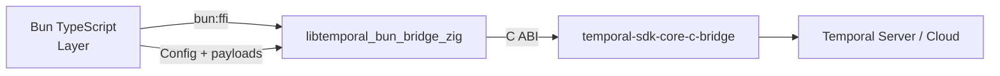

# Temporal Bun SDK — Native FFI Surface Blueprint

**Audience:** Platform Runtime & Codex implementers  
**Status:** Living document (25 Oct 2025)  
**Goal:** Capture the Zig-based Bun ↔ Temporal Core surface so we can finish replacing all `@temporalio/*` dependencies with a Bun-native SDK while keeping the unsafe layer constrained and well-tested.

---

## 1. Scope & Principles

| Principle | Description |
|-----------|-------------|
| Parity-first | Deliver client and worker capabilities that match the upstream TypeScript SDK before adding bespoke features. |
| Bun-native ergonomics | Keep the TypeScript layer declarative and typed (`zod` schemas, helpers); confine unsafe memory work to `src/internal/core-bridge/native.ts` and Zig. |
| Crash resilience | All exports guard null pointers, return deterministic errors via `temporal_bun_error_message`, and never panic. |
| Testability | Every export ships with Bun unit coverage and, where practical, integration tests against the Temporal CLI dev server. |
| Observability | Prefer returning structured gRPC status codes so Bun callers can translate directly into actionable errors. |

Mermaid sketch of the flow:

---

## 2. Current State (25 Oct 2025)

### Runtime (`runtime.zig`)
- ✅ `temporal_bun_runtime_new/free` create and dispose Temporal core runtimes, tracking in-flight client connects.
- ⚠️ Telemetry (`temporal_bun_runtime_update_telemetry`) and logger (`temporal_bun_runtime_set_logger`) return `UNIMPLEMENTED`. Hooks remain TODO pending upstream signal.

### Client (`client.zig`)
- ✅ Async connect (`temporal_bun_client_connect_async`) with pending handles and thread pool.
- ✅ DescribeNamespace, QueryWorkflow, StartWorkflow, and SignalWithStart marshal protobuf payloads directly in Zig and decode responses for Bun.
- ⚠️ SignalWorkflow validates payloads and uses pending handles, but the underlying Temporal RPC is still stubbed in `core.zig` (`zig-wf-05`).
- ❌ TerminateWorkflow, CancelWorkflow, and UpdateHeaders return `UNIMPLEMENTED` placeholders—TypeScript callers receive `NativeBridgeError` with `code: grpc.unimplemented`.
- ⚠️ Byte-array helpers allocate buffers via `byte_array.zig`; free path is wired, but we still need `temporal_bun_byte_array_new` once upstream expects Bun to allocate memory for large payloads.

### Worker (`worker.zig`)
- ⚠️ Workflow completion uses stub callbacks for unit tests.
- ❌ Worker creation, task polling, activity completion, heartbeats, and shutdown exports are placeholders (tagged `zig-worker-0x`).

### Support crates
- ✅ `pending.zig` implements reference-counted pending handles for clients and byte arrays.
- ✅ `errors.zig` stores the last error as JSON (`{ code, message, details }`) for Bun to consume.
- ✅ `core.zig` installs real Temporal core API pointers at runtime; fallback stubs keep tests running without bundled libs.
- ✅ `byte_array.zig` allocates/frees buffers that Bun can copy into `Uint8Array`.

---

## 3. Function Matrix

| Area | Export | Status | Notes |
|------|--------|--------|-------|
| Runtime | `temporal_bun_runtime_new` / `free` | ✅ | Allocates runtime handle, copies JSON config, releases pending connects before shutdown. |
| Runtime | `temporal_bun_runtime_update_telemetry` | ⚠️ TODO | Returns `grpc.unimplemented`; wire Prom/OTLP exporters once upstream APIs are exposed (tracked as `zig-runtime-02`). |
| Runtime | `temporal_bun_runtime_set_logger` | ⚠️ TODO | Stub that records `grpc.unimplemented`; needs callback trampoline when Temporal core supports custom log sinks. |
| Client | `temporal_bun_client_connect_async` | ✅ | Spawns thread, honors runtime destroy semantics, returns pending handle. |
| Client | `temporal_bun_client_describe_namespace_async` | ✅ | Encodes protobuf request (`DescribeNamespaceRequest`), resolves pending byte array. |
| Client | `temporal_bun_client_start_workflow` | ✅ | Builds `StartWorkflowExecutionRequest`, invokes `temporal_core_client_rpc_call`, returns JSON `{ runId, workflowId, namespace }`. |
| Client | `temporal_bun_client_signal_with_start` | ✅ | Shares start encoders, adds signal payload, reuses start result parsing. |
| Client | `temporal_bun_client_query_workflow` | ✅ | Threaded pending handle; decodes `QueryWorkflowResponse`, surfaces gRPC rejection codes. |
| Client | `temporal_bun_client_signal` | ⚠️ Stub | Validates JSON and spins worker thread, but `core.signalWorkflow` currently short-circuits; implement RPC call via `temporal_core_client_rpc_call`. |
| Client | `temporal_bun_client_terminate_workflow` | ✅ | Calls Temporal core terminate RPC and surfaces gRPC status codes. |
| Client | `temporal_bun_client_cancel_workflow` | ❌ | Placeholder returning `grpc.unimplemented`; should reuse pending handle infrastructure. |
| Client | `temporal_bun_client_update_headers` | ❌ | Stub; require conversion of headers map into `TemporalCoreMetadataRef`. |
| Byte transport | `temporal_bun_pending_*`, `temporal_bun_byte_array_free` | ✅ | Shared infrastructure used by connect/query/signal flows. |
| Worker | `temporal_bun_worker_*` family | ❌ | All stubs except `complete_workflow_task`; primary focus for Bun-native worker delivery. |

Legend: ✅ shipped · ⚠️ partial/stub · ❌ not implemented yet.

---

## 4. Pending Handles & Threading Model

- Pending handles (`pending.zig`) wrap tasks executed on detached Zig threads. Each handle maintains a tiny state machine (`PendingState`) with atomic transitions.
- Runtime connects increment a counter on `RuntimeHandle`; destruction waits for outstanding connects before freeing Temporal core runtime pointers.
- Byte-array pending handles own both the Zig buffer and the eventual result pointer consumed by Bun. Callers **must** invoke `temporal_bun_pending_*_free` to avoid leaks.
- For long-running RPCs (signal/query), we spawn a thread per request today; TODO (`zig-runtime-04`) is to pool threads or reuse an async executor once benchmarks confirm the need.

---

## 5. Error Handling & Diagnostics

- `errors.zig` exposes `setStructuredError({ code, message, details })`; TypeScript transforms failures into `NativeBridgeError` with the same payload.
- Native errors fallback to JSON when possible; otherwise raw strings are wrapped with `code = UNKNOWN`.
- Zig stubs prefix messages with `temporal-bun-bridge-zig:` so Bun callers can detect unimplemented paths quickly.
- Ensure every new export sets a success message (`errors.setLastError(""))` on success and uses `grpc_status` codes defined in `pending.zig`.

---

## 6. Payload Encoding Notes

- Requests are constructed manually to avoid bundling generated protobufs:
  - `DescribeNamespace` builds the varint-encoded request payload.
  - `StartWorkflowExecution` and `SignalWithStart` use helper functions in `client.zig` (`appendString`, `appendLengthDelimited`, etc.).
  - Memo, search attributes, headers leverage `encodePayloadMap`, producing `Payloads` structures compatible with Temporal core.
- Responses from Temporal core are either JSON strings (for metadata) or raw protobuf bytes. When returning JSON to Bun, duplicate slices before freeing Temporal core buffers.
- TLS config values are accepted as base64 strings; `client.ts` handles conversion from Buffers.

---

## 7. Worker Surface (TODO Breakdown)

| Tag | Task | Summary |
|-----|------|---------|
| `zig-worker-01` | Worker creation | Translate Bun worker config into `TemporalCoreWorkerOptions`, create worker via Temporal core API. |
| `zig-worker-02` | Worker shutdown | Ensure inflight polls drain; free worker handle safely. |
| `zig-worker-03` | Poll workflow tasks | Pending-handle wrapper around `temporal_core_worker_poll_workflow_activation`. |
| `zig-worker-04` | Complete workflow tasks | Already partially implemented; finish integration with real Temporal core callbacks. |
| `zig-worker-05` | Poll activity tasks | Mirror workflow polling for activities. |
| `zig-worker-06` | Complete activity tasks | Forward completion payload to Temporal core; surface failure payloads. |
| `zig-worker-07` | Heartbeats | Forward payloads and handle cancellation. |
| `zig-worker-08` | Initiate shutdown | Signal no new polls; allow graceful drain. |
| `zig-worker-09` | Finalize shutdown | Await outstanding completions, release handles. |

Delivering these tasks unblocks swapping out `@temporalio/worker` with the Bun-native worker runtime.

---

## 8. Testing Expectations

- **Bun tests** (`bun test`):
  - `tests/native.integration.test.ts` — end-to-end workflow (start/query) against Temporal CLI server.
  - `tests/zig-signal.test.ts` — exercises signal pending handles (stubs today; update once RPC wired).
  - `tests/core-bridge.test.ts` — covers error propagation and pending handle lifecycle.
  - `tests/client.test.ts` — validates TypeScript serialization/validation using mocked native bridge.
- **Zig tests** (`zig build test`):
  - Validate JSON parsing helpers, retry policy encoding, pending-handle transitions, and workflow completion callbacks.
- TODO: add coverage for signal encoders once implemented.
- **Integration**: `bun test tests/native.integration.test.ts` with `TEMPORAL_TEST_SERVER=1` orchestrates Temporal CLI server start/stop via scripts in `scripts/` directory.
- **CI gating**: run Bun tests + Zig tests in release and debug modes; fail fast if `NativeBridgeError` messages change to catch regressions.

---

## 9. Roadmap (FFI-Focused)

1. **Finish client parity** (target: late Oct 2025)
   - Implement `update_headers`, `cancel`, and real `signal` RPC.
   - Add Bun tests covering each RPC against Temporal CLI server.
2. **Telemetry & logging** (depends on upstream API availability)
   - Expose telemetry config struct; support Prometheus + OTLP exporters.
   - Bridge log forwarding callbacks into Bun.
3. **Worker parity** (multi-week effort)
   - Implement tasks outlined in §7; ship Bun `WorkerRuntime` consuming new exports.
   - Provide integration test running hello-world workflow entirely via Zig worker.
4. **Performance tuning**
   - Benchmark thread-per-request vs. pooled executor for pending handles.
   - Investigate zero-copy payload hand-off using `temporal_bun_byte_array_new` or shared memory.
5. **Packaging**
   - Automate `zig build -Doptimize=ReleaseFast` for darwin/linux (arm64/x64) and upload artifacts to GitHub Releases.
   - Document `TEMPORAL_BUN_SDK_NATIVE_PATH` override for custom builds.

---

## 10. Reference Materials

- Zig bridge source: `packages/temporal-bun-sdk/native/temporal-bun-bridge-zig/`
- Bun FFI wrapper: `packages/temporal-bun-sdk/src/internal/core-bridge/native.ts`
- Temporal core C headers: downloaded via `scripts/download-temporal-libs.ts`
- Upstream repos: `temporalio/sdk-core` (Rust), `temporalio/sdk-typescript`
- Temporal docs: [docs.temporal.io](https://docs.temporal.io)

---

## 11. Open Questions

1. Should we generate Zig bindings from the upstream C header at build time to ensure parity, or continue hand-authoring signatures?
2. How do we expose long-lived metadata changes? (Option A: `update_headers` RPC; Option B: recreate client.)
3. Do we need a shared thread pool for pending handles, or is one thread per request acceptable given expected QPS?
4. When worker exports land, do we mirror the Node worker activity/workflow sandbox model or design a Bun-specific isolate strategy?
5. Should we gate unimplemented RPCs behind feature flags in TypeScript to make failures clearer to early adopters?

---

Document updates should continue to append implementation notes so future Codex agents can pick up the remaining work without re-auditing the entire bridge.
