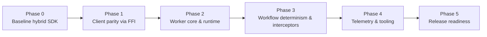

# Migration Phases & Milestones

**Purpose:** Track the staged rollout from the current hybrid SDK to a fully Bun-native Temporal SDK.

---

## Phase 0 — Baseline (Complete ✅)

- Bun FFI bootstrap in place (`native.createRuntime`, `native.createClient`).
- TypeScript client initially re-exported upstream packages while plans were drafted.
- CLI scaffolding established; worker continued to rely on `@temporalio/worker`.
- Documentation set created (this folder).

**Outcome:** Completed 11 Oct 2025. Serves as historical reference only.

---

## Phase 1 — Client Parity (In Progress)

- ✅ Implemented: start, signal, signal-with-start, query, describe namespace, terminate (via Zig bridge).  
- ✅ `src/client.ts` now uses the Bun-native bridge; no dependency on `@temporalio/client`.  
- ✅ Integration tests (`tests/native.integration.test.ts`, `tests/zig-signal.test.ts`) cover the happy paths.  
- ⚠️ Outstanding: workflow cancellation and header updates (Zig bridge still returns `UNIMPLEMENTED`).  
- ⚠️ Outstanding: optional telemetry/logger passthroughs once Zig runtime hooks exist.  
- ⚠️ Outstanding: payload converter/codec modularisation.

**Deliverables:**
- Passing client tests and integration suites.  
- README/docs call out limitations (cancellation/header updates).  
- Example project relies on Bun client for workflow start/query.  

**Target exit:** After cancellation + headers land and documentation/README updated (ETA Nov 2025).

---

## Phase 2 — Worker Core (Not Started)

- FFI todos: worker poll/complete/heartbeat/shutdown (`zig-worker-06`…`zig-worker-09`).  
- Implement Bun-native worker runtime loops (see `docs/worker-runtime.md`).  
- Introduce workflow runtime sandbox (coordinated with Phase 3).  
- Replace `@temporalio/worker` dependency once parity achieved.  
- Ensure CLI worker runs against Temporal CLI server using Zig bridge.

**Milestones:**
- Unit tests for worker loops.
- Integration tests for simple workflow execution.
- Document limitations (no local activities, etc. if deferred).

---

## Phase 3 — Workflow Runtime Parity (Not Started)

- Deliver Bun-native workflow sandbox with determinism, timers, signals, patch markers.  
- Implement interceptors and payload codec integration.  
- Add determinism replay harness before rolling out to production workflows.

**Success Metrics:**
- Replay tests green.
- Sample workflows from upstream examples run without code changes.

---

## Phase 4 — Ecosystem Integration (Not Started)

- Telemetry exports (Prometheus, OTLP) once runtime hooks exist.  
- Structured logging callbacks forwarded from Zig runtime.  
- CLI + Docker templates updated for Bun-native worker.  
- Documentation/tutorials refreshed; release notes include migration steps.  
- Optional: ship prebuilt Zig libraries for macOS/Linux/Windows.

---

## Phase 5 — Release Readiness (Not Started)

- CI lanes stable on macOS/Linux (unit + integration + Zig).  
- Publish RC build (`0.1.0-rc.1`) after native bridge compiles on all platforms.  
- Manual QA: local Temporal, Temporal Cloud with TLS/API key.  
- Gather feedback, triage bugs, cut stable release.

---

## Tracking & Ownership

- Maintain a checklist in GitHub Projects (one column per phase).
- Each phase should have an owner, deadlines, and link to PRs.
- Update `design-e2e.md` summary as phases complete.

## References

- [Temporal TypeScript developer docs](https://docs.temporal.io/develop/typescript)
- [Temporal workflow versioning guidance](https://docs.temporal.io/develop/typescript/workflows#versioning)
- [Temporal observability best practices](https://docs.temporal.io/production-readiness/observability)
- [Temporal TypeScript sample workflows](https://github.com/temporalio/samples-typescript)
- [Zig getting started guide](https://ziglang.org/learn/getting-started/)
