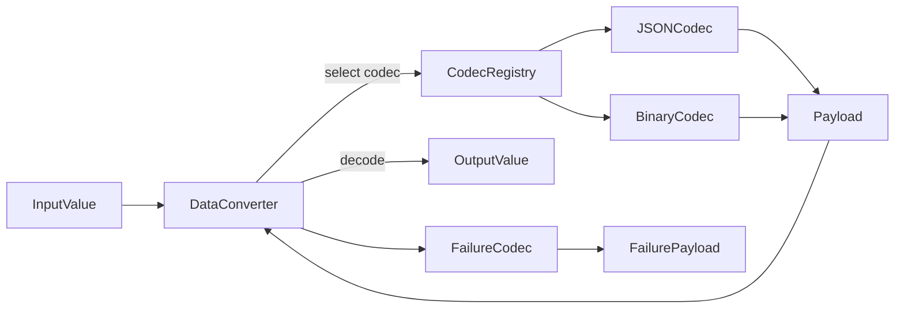

# Payloads Codec & Data Conversion Guide

**Purpose:** Define how the Bun SDK encodes/decodes Temporal payloads without relying on upstream Node packages, while following the Temporal TypeScript data converter contract.<br>
[Data converter overview](https://docs.temporal.io/visibility-and-data-conversion/data-conversion)

---

## 1. Requirements

- Support Temporal payload metadata (encoding, message type, encoding-envelope).
- Provide JSON + binary (protobuf) codecs with extensibility for custom converters (match the behaviour of the upstream `DefaultDataConverter`).<br>
  [TypeScript data converter API](https://typescript.temporal.io/api/interfaces/worker.DataConverter)
- Expose API similar to upstream `DataConverter` (`toPayloads`, `fromPayloads`).
- Handle failure serialization (stack traces, application-specific data) consistent with Temporal’s failure types.<br>
  [Failures guide](https://docs.temporal.io/develop/typescript/failures)

---

## 2. Module Layout

```
src/common/payloads/
  index.ts              // public exports
  codec.ts              // base codec interface + registry
  json-codec.ts         // default JSON codec
  binary-codec.ts       // optional binary codec (uses protobuf definitions)
  failure.ts            // convert errors to payloads and back
```



---

## 3. Codec Interface

```ts
export interface PayloadCodec {
  encoding: string               // e.g., 'json/plain', 'binary/protobuf'
  toPayload(value: unknown): Promise<Payload>
  fromPayload(payload: Payload): Promise<unknown>
}

export interface DataConverter {
  toPayloads(values: unknown[]): Promise<Payloads>
  fromPayloads<T = unknown>(payloads: Payloads, target?: TypeHint<T>): Promise<T[]>
  toFailure(error: unknown): Promise<Failure>
  fromFailure(failure: Failure): Promise<unknown>
}
```

`Payload` mirrors the Temporal protobuf structure defined in `temporal/api/common/v1/message.proto`. The metadata keys should include `encoding`, `messageType`, and any converter-specific markers.<br>
[Temporal payload reference](https://github.com/temporalio/api/blob/main/temporal/api/common/v1/message.proto)

```ts
interface Payload {
  metadata: Record<string, Uint8Array>
  data: Uint8Array
}
```

---

## 4. Default Behavior

- `json/plain` codec serializes using `JSON.stringify`, stores encoding + content type (`application/json`).
- `binary/protobuf` relies on vendored `@temporalio/proto` TypeScript definitions to encode payloads (optional initial implementation).
- `DataConverter` composes an array of codecs: try each until one returns payload.
- Allow user-supplied codecs via options on `createTemporalClient` / `createWorker`.

---

## 5. Failure Handling

- On `toFailure`, include:
  - `message`
  - `stack` (string)
  - optional `applicationFailureType`
  - `nonRetryable` flag
- For `fromFailure`, reconstruct Error subclass (default `ApplicationFailure`).
- Ensure heartbeats and activity completions propagate failure payloads correctly.

---

## 6. Testing

- Codec unit tests: round-trip JS primitives, buffers, complex objects.
- Failure serialization tests: error with cause chain, non-retryable flag.
- Integration: workflow returning JSON, signal passing binary, activity throwing error (see Temporal’s TypeScript samples for reference workflows).

---

## 7. Migration Considerations

- Document that initial release supports JSON only (if binary deferred).
- Provide extension hook so adopters can supply their own codecs without forking.

Maintain this document whenever payload handling evolves.
