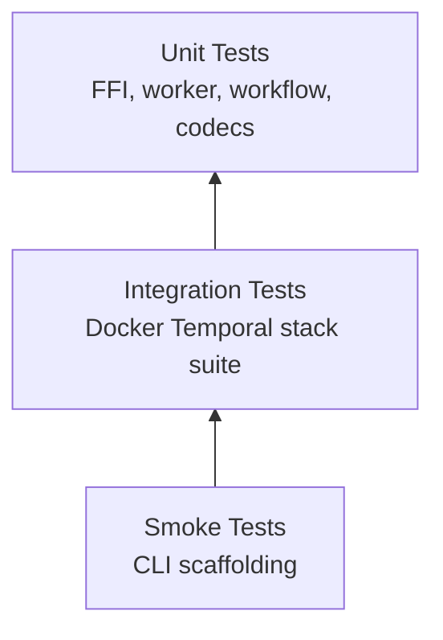

# Testing & Validation Plan

**Goal:** Guarantee the Bun-native Temporal SDK behaves like the upstream Node SDK across unit, integration, and regression tests.

---

## 1. Test Pyramid

| Layer | Purpose | Tools |
|-------|---------|-------|
| Unit (Bun test) | Validate FFI bindings, serialization, workflow runtime helpers | `bun test`, dependency injection |
| Integration (Temporal CLI) | Exercise real Temporal server with Bun worker/client | `temporal server start-dev`, `bun test` integration suites |
| Replay/Determinism | Ensure workflow histories replay identically | Custom replay harness |
| Smoke (CLI) | Validate scaffolding CLI and example project | `bun run`, `temporal-bun init` scenarios |



---

## 2. Unit Test Suites

1. **FFI Bindings**
   - Mock native library (using Bun FFI ability to inject).
   - Ensure null pointer handling, error propagation.
   - Tests: `native-runtime.test.ts`, `native-client.test.ts`, `native-worker.test.ts`.

2. **Payload Codec**
   - Round-trip serialization, failure conversion.
   - Edge cases: big payloads, undefined/null, binary data.

3. **Workflow Runtime**
   - Activation application, timer scheduling, patch markers, signals.
   - Deterministic random/time shims.

4. **Worker Task Loops**
   - Poll restart after transient error.
   - Shutdown handshake.
   - Activity timeout enforcement.

---

## 3. Integration Tests

### Setup
- Install the [Temporal CLI](https://github.com/temporalio/cli).
- Start the embedded dev server via the helper script:
  ```bash
  pnpm --filter @proompteng/temporal-bun-sdk run temporal:start
  ```
- In another terminal, execute the Bun integration tests:
  ```bash
  cd packages/temporal-bun-sdk
  TEMPORAL_TEST_SERVER=1 bun test tests/native.integration.test.ts
  ```
- Stop the CLI server with `pnpm --filter @proompteng/temporal-bun-sdk run temporal:stop` when finished.

> CI uses the same helper scripts to run `TEMPORAL_TEST_SERVER=1 bun test ...` against a CLI-backed server.

### Lane Ownership

The [`parallel-implementation-plan`](./parallel-implementation-plan.md) document maps each Zig module to a lane. When running
lane-specific work, use the following targeted commands in addition to the global suites:

| Lane | Command |
|------|---------|
| 1 | `bun test tests/client.test.ts` and `bun test tests/native.integration.test.ts` |
| 2 | `bun test tests/native.integration.test.ts --filter describeNamespace` |
| 3 | `bun test tests/zig-signal.test.ts` |
| 6 & 7 | `bun test tests/worker` |
| 9 | `pnpm --filter @proompteng/temporal-bun-sdk run ci:native:zig` |

Document any additional lane-specific commands inside the plan as new modules are carved out.

### Test Cases
1. **Happy path workflow**
   - Start `helloTemporal`, ensure activity runs, verify result.
2. **Signal & Query**
   - Signal workflow mid-flight, query result.
3. **Failures**
   - Activity failure -> workflow retry -> success.
   - Workflow throwing error -> verify failure payload.
4. **Heartbeats**
   - Long-running activity heartbeats then completes.
5. **Continue-as-new**
   - Workflow loops via continue-as-new; ensure history trimmed.
6. **Shutdown**
   - Send SIGTERM to worker container, ensure graceful exit recorded.

Integration suite should run in CI pipeline (GitHub Actions) on macOS + Linux.

---

## 4. Replay Harness

- Capture history from running workflow (via Temporal client).
- Feed into workflow runtime offline, ensure command sequence matches.
- Useful for regression tests and to guard determinism before publishing.

---

## 5. CLI / Scaffolding Tests

- Existing `cli.test.ts` ensures template generation does not overlap.
- Add E2E test: run `temporal-bun init` in temp dir, run `bun install --production` (with local workspace), ensure scripts exist.
- Optionally run `bun run dev` for short duration (spawn worker, ensure no crashes).

---

## 6. CI Recommendations

- **Job 1:** Lint + typecheck (Biome, `bunx tsc` without emit).
- **Job 2:** Build native bridge (macOS + Linux).
- **Job 3:** Run unit tests (`bun test`).
- **Job 4:** Run integration tests (docker-compose) — mark as optional / nightly if heavy.
- Publish coverage to help track progress (use `c8` with Bun once available).

---

## 7. Manual QA Checklist (pre-release)

1. Scaffold new project via CLI, run worker locally.
2. Build Docker image (`bun run docker:build`), run worker inside container.
3. Connect to Temporal Cloud with TLS/API key, run smoke workflow.
4. Validate telemetry emitted to Prometheus endpoint if feature implemented.

Keep this plan evolving as the SDK matures; update the table whenever new subsystems (e.g., Nexus, search attributes) arrive.
