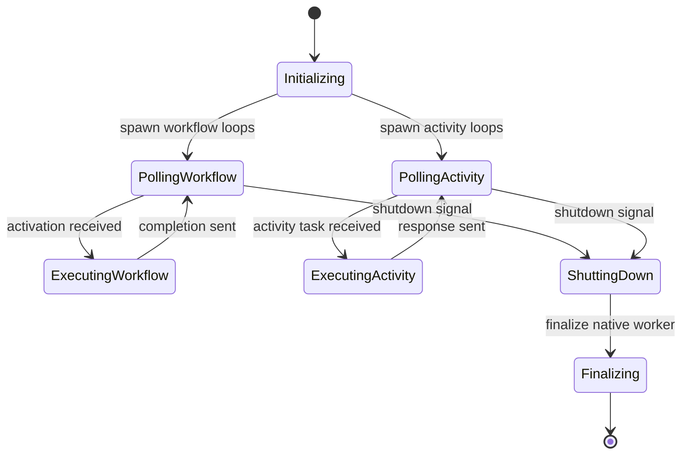

# Worker Runtime Implementation Guide

**Status Snapshot (27 Oct 2025)**  
- ✅ Shipping worker experience still relies on the upstream `@temporalio/worker`. `src/worker.ts` wraps `Worker.create`, and `src/bin/start-worker.ts` simply starts the vendor worker with our default config.  
- ✅ The Zig bridge exposes worker handles (`temporal_bun_worker_new/free/...`), but only creation and test scaffolding are wired; poll/completion/heartbeat/shutdown exports return `UNIMPLEMENTED`.  
- ⚠️ `src/worker/runtime.ts` contains a placeholder `WorkerRuntime` class and guard helpers (`maybeCreateNativeWorker`, `destroyNativeWorker`) used for future Zig integration. Methods such as `run()` and `shutdown()` currently throw.  
- ⚠️ `TEMPORAL_BUN_SDK_USE_ZIG=1` enables native worker handle creation, but practical polling loops do not exist yet, so this flag should not be flipped outside tests.  
- ❌ No Bun-native workflow runtime exists; workflows still execute inside the Node SDK sandbox. See `docs/workflow-runtime.md` for the roadmap.

This document captures the current wiring and, in the sections tagged **Target Architecture**, the envisioned Bun-native worker once the Zig bridge supports full task handling.

---

## 1. Current Architecture (Today)

```
createWorker(options)
  ├─ NativeConnection.connect (Temporal Node SDK)
  ├─ Worker.create (from @temporalio/worker)
  └─ runWorker() -> worker.run()
```

- Configuration comes from `loadTemporalConfig`, identical to the client flow.  
- Activities default to `src/activities/index.ts`.  
- Sample workflows in `src/workflows/index.ts` use upstream helpers (`proxyActivities`) and execute in the Node SDK runtime.  
- The CLI entry point (`src/bin/start-worker.ts`) installs SIGINT/SIGTERM handlers and relies on `worker.shutdown()` from the Node SDK.

---

## 2. Zig Bridge Hooks (Experimental)

`src/worker/runtime.ts` and `src/internal/core-bridge/native.ts` expose helpers that will eventually back the Bun-native worker:

- `isZigWorkerBridgeEnabled()` — checks both `TEMPORAL_BUN_SDK_USE_ZIG` and the loaded bridge variant.  
- `maybeCreateNativeWorker({ runtime, client, namespace, taskQueue, identity })` — validates inputs and calls `native.createWorker`. Throws `NativeBridgeError` when prerequisites are missing.  
- `destroyNativeWorker(worker)` — frees the worker handle if it exists.

All higher-level orchestration (`WorkerRuntime.create`, `run`, `shutdown`) is left as TODOs with doc references (`docs/worker-runtime.md`, `docs/ffi-surface.md`).

On the Zig side (`bruke/src/worker.zig`):

- Creation validates config, saves copies of namespace/task queue/identity, and stores the Temporal core worker pointer.  
- Polling (`pollWorkflowTask`, `pollActivityTask`) spawns threads and returns pending handles, but the completion/heartbeat/shutdown paths still return `grpc.unimplemented`.  
- Unit tests cover permit bookkeeping and pending-handle lifecycle, yet no end-to-end workflow execution occurs today.

---

## 3. Target Bun-Native Runtime (Future Work)

> **Target Architecture:** The diagrams and responsibilities in this section describe the desired end state once Bun-native worker loops replace the current Node SDK dependency. They are not implemented yet.

```
createWorker(options)
  ├─ WorkerRuntime (manages lifecycle)
  │   ├─ WorkflowTaskLoop (poll/dispatch)
  │   ├─ ActivityTaskLoop (poll/dispatch)
  │   ├─ ShutdownController
  │   └─ MetricsEmitter / Logger hooks
  └─ Workflow Isolate Manager (per-workflow execution context)
```



`WorkerRuntime` responsibilities once implemented:

| Component | Duties |
|-----------|--------|
| Native worker lifecycle | Own Zig handles; ensure `destroyNativeWorker` runs during shutdown or GC finalization. |
| Poll loops | Call `native.worker.pollWorkflowTask` / `pollActivityTask`, translate pending handles into promises, and dispatch to workflow/activity executors. |
| Workflow runtime integration | Load workflow bundles via Bun (see `docs/workflow-runtime.md` once implemented). |
| Activity execution | Invoke registered activities with cancellation/timeouts, send results via `native.worker.completeActivityTask`. |
| Heartbeats & metrics | Stream heartbeats (`recordActivityHeartbeat`) and surface counters for task throughput/latency. |
| Shutdown semantics | Implement two-phase shutdown (initiate → finalize) mirroring the Node SDK to keep determinism guarantees.

---

## 4. Implementation Roadmap

1. **Finish Zig worker exports** (lanes 7 & 5 in `parallel-implementation-plan.md`): complete/heartbeat/shutdown RPCs, ensure errors bubble up via `NativeBridgeError`.  
2. **Add Bun worker runtime loops**: implement `WorkerRuntime.create/run/shutdown`, integrate with `maybeCreateNativeWorker`, and gate behind an opt-in environment flag until stable.  
3. **Workflow runtime**: replace Node sandbox with Bun-native implementation (see companion doc).  
4. **Remove Node fallback**: once Bun worker reaches parity, drop the dependency on `@temporalio/worker` and update the CLI scaffolding + README.  
5. **Testing**: extend `tests/worker/**` with end-to-end cases (workflow activation, activity success/failure, shutdown) and run them under `TEMPORAL_BUN_SDK_USE_ZIG=1` in CI.

---

## 5. References

- TypeScript sources: `src/worker.ts`, `src/worker/runtime.ts`, `src/internal/core-bridge/native.ts`.  
- Zig worker implementation: `bruke/src/worker.zig`, `bruke/src/test_helpers.zig`.  
- Documentation links: `docs/ffi-surface.md` (§7 Worker exports), `docs/workflow-runtime.md` for execution sandbox plans.  
- Tests: `tests/worker/**` (currently placeholders) and `tests/zig-worker-completion.test.ts` for the existing stubs.

Keep this guide synchronized as features land so engineers always know which codepaths are live versus aspirational.
