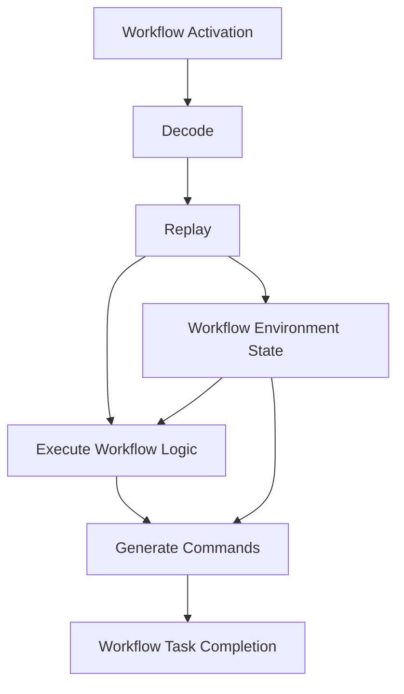

# Workflow Runtime Plan

**Status Snapshot (28 Oct 2025):** The Bun-native workflow runtime is live. `WorkflowEngine` and `WorkflowEnvironment` execute activations inside Bun and integrate with the Zig worker polling loops. Determinism tooling (history replay harness, patch marker coverage, richer interceptor DX) remains in flight, so keep the plan updated as those pieces land.  

**Goal:** Provide a deterministic workflow execution environment compatible with Temporal’s expectations, implemented purely with Bun primitives while matching the behaviour described in the Temporal TypeScript workflow documentation. 
[Workflows overview](https://docs.temporal.io/develop/typescript/workflows)

---

## 1. Key Responsibilities

| Area | Requirements |
|------|--------------|
| Activation handling | Consume workflow activations from worker loop, apply commands (timer, activity, signal, child workflow). |
| Determinism | Same code + history => same commands. Ensure timers, random, and external world access behave deterministically, following the Temporal replay contract. |
| Workflow sandboxing | Prevent workflows from accessing ambient state; maintain per-run context (sandbox semantics documented in the TypeScript SDK). |
| Interceptors | Support inbound/outbound workflow interceptors for logging/tracing. [Interceptors guide](https://docs.temporal.io/develop/typescript/interceptors) |
| Patch markers | Respect versioning via `patched` / `deprecatePatch` helpers. [Workflow versioning](https://docs.temporal.io/develop/typescript/workflows#versioning) |

---

## 2. Execution Model

1. Maintain a `WorkflowEnvironment` object per workflow run:
   - State machine (history events, pending commands).
   - Activity completion promises.
   - Timer scheduler.
   - Signal/Query handlers.

2. Workflow activation pipeline:
   - Decode activation (proto) into JS structure.
   - Replay events in order.
   - Drive workflow generator/async function until next yield (`await` boundary).
   - Collect commands and serialize as workflow task completion.

3. Isolation strategy:
   - Use Bun’s `import()` to load workflow modules fresh per run (works with ESM and Bun-transpiled TS).
   - Wrap built-ins (`Date`, `Math.random`, UUID generators) with deterministic shims to preserve replay guarantees.
   - Provide workflow `Context` (activities via `proxyActivities`, condition utilities, `continueAsNew`, child workflow helpers) identical to the upstream API. 
     [Workflow APIs](https://docs.temporal.io/develop/typescript/workflows#write-workflows)

---

## 3. Modules to Implement

`src/workflow/runtime/engine.ts`, `environment.ts`, `bootstrap.ts`, and `info.ts` already back the live runtime. The table below tracks the remaining follow-on modules needed to round out determinism tooling and developer ergonomics.

| Module | Description |
|--------|-------------|
| `src/workflow/runtime/context.ts` | Builds the `workflow` namespace exports (activities proxy, condition, sleep). |
| `src/workflow/runtime/activator.ts` | Applies activations, manages pending commands. |
| `src/workflow/runtime/history.ts` | Lightweight history/event parser (can reuse proto definitions). |
| `src/workflow/runtime/determinism.ts` | Shims for deterministic random/timer. |
| `src/workflow/runtime/interceptors.ts` | Register & execute interceptors chain. |
| `src/workflow/runtime/encoder.ts` | Convert JS results/errors into completion payloads. |

---

## 4. Payload Handling

Leverage the `payloads-codec` module (see separate doc) for serialization:

- Store payload codec instance per workflow run (handles custom data-converters).
- Ensure queries and signals share same codec configuration as the workflow.

---

## 5. Testing Matrix

1. **Unit Tests**
   - Activation replay vs live execution produce identical commands.
   - Patching semantics: ensure old/new paths behave depending on patch marker.
   - Timers + cancel: schedule, fire, cancel, continue-as-new.
   - Signals + queries: ensure handlers invoked deterministically.

2. **Integration Tests**
   - Run sample workflows via worker to verify end-to-end completions.
   - Determinism test: run workflow, capture history, replay in isolation, assert commands equal.

3. **Failure injection**
   - Activity failure propagation.
   - Workflow panic -> failure command.

---

## 6. Open Considerations

- **Workflow bundling:** For now rely on Bun to execute TS modules directly. Later evaluate bundling to JS for deployable artifact.
- **Node compatibility:** Intentionally Bun-only; document this and ensure errors clearly state unsupported platform.
- **Resource cleanup:** Use `FinalizationRegistry` to dispose workflow environments if worker shuts down mid-execution.

Keep this plan in sync with actual runtime capabilities; append change logs as features land.
