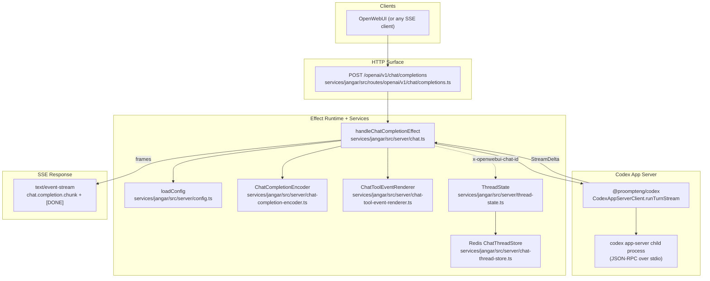

Jangar

OpenAI-compatible (streaming) chat completions endpoint backed by the Codex app-server.

## Architecture

More detailed write-up: `docs/jangar/current-state.md`.



## Development

```bash
bun --cwd services/jangar run dev
```

## Scripts

```bash
bun --cwd services/jangar run build
bun --cwd services/jangar run preview
bun --cwd services/jangar run test
bun --cwd services/jangar run lint
bun --cwd services/jangar run tsc
```

## API Notes

- `/openai/v1/chat/completions` is **streaming-only**; requests must set `stream: true`. Non-streaming responses are not implemented.
- Authentication and rate limiting are intentionally disabled because this endpoint is for internal use only; place it behind your own network guardrails when exposing it.
- Usage totals are emitted only when the request includes `stream_options: { include_usage: true }`. The final SSE chunk (empty `choices` array) carries the normalized OpenAI-style `usage`, even when a turn ends with an upstream error or client abort.
- Server-side Effect services follow `Context.Tag + Layer` patterns; see `src/server/effect-services.md`.

## MCP (memories)

The memories MCP endpoint is available at `POST /mcp` (see `services/jangar/src/routes/mcp.ts`). The Codex app-server is configured to use it via `threadConfig.mcp_servers.memories` (see `services/jangar/src/server/codex-client.ts`).

The MCP server provides:

- `persist_memory`: stores `{ namespace, content, summary?, tags? }` plus an OpenAI embedding in Postgres (pgvector).
- `retrieve_memory`: semantic search over stored memories (cosine distance) for a namespace.

Storage details:

- Table is `memories.entries` (auto-created on first use; see `schemas/embeddings/memories.sql`) and requires `pgvector` + `pgcrypto` extensions.
- No table migrations are performed; the store expects the current schema only. If `OPENAI_EMBEDDING_DIMENSION` does not match the existing `memories.entries.embedding` column dimension, MCP calls will fail with a schema mismatch error.

## Environment

- `JANGAR_MODELS` (comma-separated list; optional)
- `JANGAR_DEFAULT_MODEL` (optional)
- `JANGAR_REDIS_URL` (required only when using `x-openwebui-chat-id` thread persistence)
- `JANGAR_CHAT_KEY_PREFIX` (optional; defaults to `openwebui:chat`)
- `JANGAR_WORKTREE_KEY_PREFIX` (optional; defaults to `openwebui:worktree`)
- `JANGAR_MCP_URL` (optional; defaults to `http://127.0.0.1:$PORT/mcp`)
- `DATABASE_URL` (required to use MCP memories tools)
- `PGSSLMODE` (optional; defaults to `require`; Jangar does not support `sslrootcert` URL params for Bun’s Postgres client)
- `OPENAI_API_KEY` (API key used for embedding calls; required for hosted OpenAI, optional for self-hosted OpenAI-compatible endpoints like Ollama)
- `OPENAI_API_BASE_URL` / `OPENAI_API_BASE` (optional; defaults to `https://api.openai.com/v1`)
- `OPENAI_EMBEDDING_MODEL` (optional; defaults to `text-embedding-3-small` on OpenAI, or `qwen3-embedding:0.6b` for self-hosted bases)
- `OPENAI_EMBEDDING_DIMENSION` (optional; defaults to `1536` on OpenAI, or `1024` for the self-hosted model)
- `OPENAI_EMBEDDING_TIMEOUT_MS` (optional; defaults to `15000`)
- `OPENAI_EMBEDDING_MAX_INPUT_CHARS` (optional; defaults to `60000`)

### Ollama embeddings (docker-host)

To use the self-hosted embeddings model on `docker-host`:

```bash
export OPENAI_API_BASE_URL='http://192.168.1.190:11434/v1'
export OPENAI_EMBEDDING_MODEL='qwen3-embedding:0.6b'
export OPENAI_EMBEDDING_DIMENSION='1024'
# OPENAI_API_KEY is optional for Ollama
```
