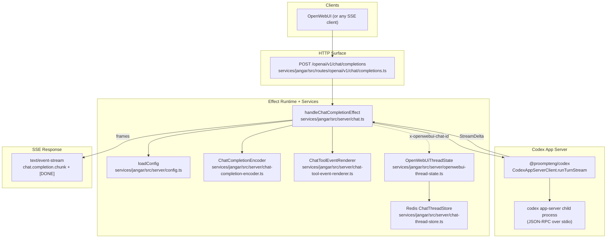

Jangar

OpenAI-compatible (streaming) chat completions endpoint backed by the Codex app-server.

## Architecture

More detailed write-up: `docs/jangar/current-state.md`.



## Development

```bash
bun --cwd services/jangar run dev
```

## Scripts

```bash
bun --cwd services/jangar run build
bun --cwd services/jangar run preview
bun --cwd services/jangar run test
bun --cwd services/jangar run lint
bun --cwd services/jangar run tsc
```

## API Notes

- `/openai/v1/chat/completions` is **streaming-only**; requests must set `stream: true`. Non-streaming responses are not implemented.
- Authentication and rate limiting are intentionally disabled because this endpoint is for internal use only; place it behind your own network guardrails when exposing it.
- Usage totals are emitted only when the request includes `stream_options: { include_usage: true }`. The final SSE chunk (empty `choices` array) carries the normalized OpenAI-style `usage`, even when a turn ends with an upstream error or client abort.
- Server-side Effect services follow `Context.Tag + Layer` patterns; see `src/server/effect-services.md`.

## Environment

- `JANGAR_MODELS` (comma-separated list; optional)
- `JANGAR_DEFAULT_MODEL` (optional)
- `JANGAR_REDIS_URL` (required only when using `x-openwebui-chat-id` thread persistence)
- `JANGAR_CHAT_KEY_PREFIX` (optional; defaults to `openwebui:chat`)
