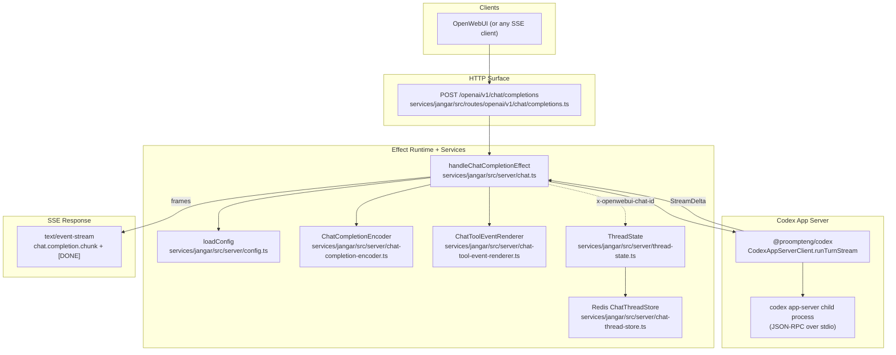

Jangar

OpenAI-compatible chat completions endpoint, operator UI, and control-plane surface backed by the Codex app-server.

## Architecture

Authoritative architecture index: `docs/jangar/application-architecture.md`.
Operational build/release contract: `docs/jangar/build-contract.md`.

Runtime boot is now explicit: `src/server/app.ts` only builds the HTTP surface, while `src/server/index.ts` and
`src/server/dev.ts` opt into startup behavior through `src/server/runtime-profile.ts`. The tech-debt program source of
truth lives in `docs/agents/designs/jangar-application-tech-debt-cleanup-plan-2026-04-08.md`.
The generated architecture inventory lives in `docs/jangar/architecture-inventory.md`.
The older `docs/jangar/current-state.md` note is historical context for the original chat-completions audit only.


```mermaid
flowchart TD
  subgraph Client["Clients"]
    OWU["OpenWebUI (or any SSE client)"]
  end

  subgraph HTTP["HTTP Surface"]
    Route["POST /openai/v1/chat/completions\nservices/jangar/src/routes/openai/v1/chat/completions.ts"]
  end

  subgraph Runtime["Effect Runtime + Services"]
    Handler["handleChatCompletionEffect\nservices/jangar/src/server/chat.ts"]
    Config["loadConfig\nservices/jangar/src/server/config.ts"]
    Encoder["ChatCompletionEncoder\nservices/jangar/src/server/chat-completion-encoder.ts"]
    ToolRenderer["ChatToolEventRenderer\nservices/jangar/src/server/chat-tool-event-renderer.ts"]
    ThreadState["ThreadState\nservices/jangar/src/server/thread-state.ts"]
    ThreadStore["Redis ChatThreadStore\nservices/jangar/src/server/chat-thread-store.ts"]
  end

  subgraph Codex["Codex App Server"]
    ClientLib["@proompteng/codex\nCodexAppServerClient.runTurnStream"]
    Child["codex app-server child process\n(JSON-RPC over stdio)"]
  end

  subgraph Stream["SSE Response"]
    SSE["text/event-stream\nchat.completion.chunk + [DONE]"]
  end

  OWU --> Route
  Route --> Handler
  Handler --> Config
  Handler --> ClientLib
  Handler --> Encoder
  Handler --> ToolRenderer
  Handler -. "x-openwebui-chat-id" .-> ThreadState
  ThreadState --> ThreadStore
  ClientLib --> Child
  ClientLib -->|StreamDelta| Handler
  Handler -->|frames| SSE
```

## Development

```bash
bun --cwd services/jangar run dev
```

### Local Jangar + remote cluster deps (Tilt)

From the repo root, run:

```bash
tilt up
```

This runs Jangar locally (Bun) and keeps `kubectl port-forward` sessions open to the remote cluster for:

- Postgres (CNPG `jangar-db`)
- Redis (OpenWebUI thread/worktree persistence)
- NATS (agent comms)
- ClickHouse (Torghut visuals)

Tilt uses your default kubeconfig/current context. If you need to change ports or disable optional deps:

```bash
# run Jangar on a different port
tilt up -- --jangar_port 3001

# avoid conflicts with a local Postgres
tilt up -- --db_local_port 15433

# disable optional forwards
tilt up -- --enable_redis=false --enable_nats=false --enable_clickhouse=false

# self-hosted embeddings (recommended if your DB schema uses vector(4096))
tilt up -- --openai_api_base_url http://127.0.0.1:11434/v1 --openai_embedding_api_base_url http://127.0.0.1:11434/v1 --openai_embedding_model qwen3-embedding-saigak:8b --openai_embedding_dimension 4096
```

Troubleshooting:

- If a port-forward fails with "address already in use", change the corresponding `*_local_port`.
- If you see "lost connection to pod" on a port-forward, Tilt will automatically retry.
- If a secret lookup fails, confirm your kube context has access to the `jangar` namespace.

### Local OpenWebUI end-to-end regression

Run the OpenWebUI browser regression against local Jangar:

```bash
bun --cwd services/jangar run test:e2e:openwebui
```

If you already have OpenWebUI running locally and want to reuse it instead of booting the disposable Docker stack:

```bash
bun --cwd services/jangar run test:e2e:openwebui:existing
```

What it does:

- starts disposable local `postgres` and `openwebui` containers via `services/jangar/docker-compose.yml`
- runs Jangar locally from the production build output (`bun .output/server/index.mjs`) instead of a dev server
- defaults to the deterministic mock Codex client (`OPENWEBUI_E2E_USE_MOCK_CODEX=1`) so the browser regression covers rich activity rendering without needing a real local Codex process
- uses an in-memory chat state backend inside the local Jangar Playwright web server so the regression does not depend on host Redis
- validates both the OpenAI-compatible streaming endpoint and the browser chat flow in OpenWebUI across multiple turns, including rich activity summaries, signed detail pages, and assistant error rendering

If you need to exercise the real local Codex CLI instead of the mock harness:

- set `OPENWEBUI_E2E_USE_MOCK_CODEX=0`
- point `JANGAR_CODEX_BINARY` at the host `codex` binary if it is not already on `PATH`
- optionally stage an isolated `CODEX_HOME` with `CODEX_AUTH_JSON` or `OPENWEBUI_E2E_CODEX_HOME` to avoid inheriting unrelated workstation MCP servers

## OpenWebUI rich detail links

For `chatClientKind === 'openwebui'`, Jangar can enrich the normal streaming transcript with signed markdown links to staged detail pages. This is the production no-fork path: OpenWebUI keeps consuming standard `delta.content` and `delta.reasoning_content`, and Jangar does not rely on OpenAI `tool_calls` for rich activity rendering.

Assistant prose stays inline. Larger activity payloads such as reasoning, plans, rate limits, tool output, usage, errors, and image previews are summarized in the transcript and can link to `/api/openwebui/rich-ui/render/$renderId`.

Enable the production detail-link path with:

- `JANGAR_OPENWEBUI_RICH_RENDER_ENABLED=true`
- `JANGAR_OPENWEBUI_EXTERNAL_BASE_URL=<browser-reachable Jangar origin>`
- `JANGAR_OPENWEBUI_RENDER_SIGNING_SECRET=<shared secret>`

`JANGAR_OPENWEBUI_EXTERNAL_BASE_URL` must resolve from the user's browser, not only from inside the cluster, because OpenWebUI renders those signed links directly. Signed detail URLs and staged render blobs use the same 7-day retention window, matching the current OpenWebUI chat/thread continuity horizon.

If the external base URL, signing secret, or render store is unavailable, Jangar falls back to text-only streaming for OpenWebUI without failing the turn.

The request header `x-jangar-openwebui-render-mode: rich-ui-v1` is experimental. It only enables `delta.jangar_event` emission and is not required for the production text-plus-links UX.

Optional overrides:

- `OPENWEBUI_PORT` (default `38080`)
- `OPENWEBUI_IMAGE` (defaults to `ghcr.io/open-webui/open-webui:v0.9.2` for the local E2E script; override to exercise another tag)
- `OPENWEBUI_BASE_URL` (used by `test:e2e:openwebui:existing`; defaults to `http://127.0.0.1:8080`)
- `OPENWEBUI_E2E_USE_MOCK_CODEX` (default `1`; set to `0` to run the browser regression against the real local Codex CLI)
- `JANGAR_MOCK_CODEX_SCENARIO` (defaults to `openwebui-e2e`)
- `JANGAR_CODEX_BINARY` (defaults to `codex`)
- `CODEX_AUTH_JSON` (defaults to `~/.codex/auth.json` when staging the isolated `CODEX_HOME`)
- `OPENWEBUI_E2E_CODEX_HOME` (defaults to `services/jangar/output/playwright/codex-home`)
- `JANGAR_MODELS` / `JANGAR_DEFAULT_MODEL` / `OPENWEBUI_E2E_MODEL` (default `gpt-5.5`)

Requirements for the default mock-Codex path:

- Docker available for the disposable OpenWebUI and Postgres stack
- Bun dependencies installed for `services/jangar`

Additional requirements for the optional real-Codex path:

- host `codex` CLI installed and authenticated
- working OpenAI/Codex access for the configured model

## Scripts

```bash
bun --cwd services/jangar run build
bun --cwd services/jangar run preview
bun --cwd services/jangar run test
bun --cwd services/jangar run lint
bun --cwd services/jangar run tsc
bun --cwd services/jangar run dev:worker
bun --cwd services/jangar run start:worker
```

## Temporal worker notes

- API enqueue path: `JANGAR_BUMBA_TASK_QUEUE` (falls back to `TEMPORAL_TASK_QUEUE`, then `bumba`).
- Worker consume path: `JANGAR_WORKER_TEMPORAL_TASK_QUEUE` (falls back to `TEMPORAL_TASK_QUEUE`, then `jangar`).
- Production GitOps no longer deploys a separate `jangar-worker` Kubernetes Deployment or workspace PVC. Keep post-deploy checks scoped to `deployment/jangar`.
- Do not pin `TEMPORAL_WORKER_BUILD_ID` in manifests. Let the runtime derive `workflow-code@<digest>` from workflow code and then sync deployment routing after rollout.
- Post-rollout routing command:
  `bun run packages/scripts/src/jangar/sync-temporal-routing.ts --task-queue jangar --deployment-name jangar-deployment --migrate-stale-running`
- Incident recovery command (includes unversioned running workflows):
  `bun run packages/scripts/src/jangar/sync-temporal-routing.ts --task-queue jangar --deployment-name jangar-deployment --migrate-stale-running --migrate-unversioned-running`

## Swarm runtime admission

The supporting-primitives controller enforces stage admission passports before it creates launch-capable swarm work.
With `JANGAR_SWARM_RUNTIME_ADMISSION_ENFORCEMENT=true` (the production default), discover/plan schedules use the
`swarm_plan` passport, implement schedules and cross-swarm requirements use `swarm_implement`, and verify schedules use
`swarm_verify`. A blocked or held passport deletes the matching schedule and prevents requirement dispatch instead of
allowing repeated opaque job retries.

Schedule reconciliation also re-checks the current stage passport before it writes runner ConfigMaps or CronJobs.
This keeps pre-existing schedules from launching with stale allowed passport annotations after the collaboration runtime
kit moves to `hold` or `block`.
If the admission snapshot cannot be compiled, launch admission fails closed as `RuntimeAdmissionUnavailable`, deletes the
matching runner resources, and records the unavailable passport state in swarm status instead of leaving stale CronJobs
armed.

Binary runtime-kit components must be executable, not just present on disk. The source Codex NATS helpers and the
installed `/usr/local/bin/codex-nats-*` wrappers both satisfy that command-path contract; a non-executable helper keeps
the collaboration kit blocked with `runtime_kit_component_missing:*` evidence.

Degraded authority or degraded runtime-kit evidence keeps the serving passport non-blocking (`degrade`) but moves
launch-capable swarm passports to `hold`. Missing required runtime-kit evidence still moves launch-capable passports to
`block`. The supporting-primitives controller treats both `hold` and `block` as non-admitted decisions for discover,
plan, implement, verify, and cross-swarm requirement launches.

Admitted schedules and requirement runs carry these trace fields in annotations and run parameters:

- `swarmAdmissionPassportId`
- `swarmAdmissionDecision`
- `swarmRecoveryCaseSetDigest`
- `swarmRuntimeKitSetDigest`
- `swarmRequiredRuntimeKits`
- `swarmAdmissionProducerRevision`

The runtime-admission compiler also emits Phase 0 recovery-warrant evidence from the same passport snapshot.
`/ready` and `/api/agents/control-plane/status` include shadow `recovery_warrants`, `runtime_proof_cells`, and
`projection_watermarks`. A missing required helper or config value becomes a broken warrant with a missing proof cell,
while the existing passport launcher gate remains the enforcement path. This is write-only rollout evidence for the
runtime proof-cell contract; rollback is to stop consuming the new fields while keeping `runtime_kits` and
`admission_passports` intact.

Deploy verification also consumes the runtime-admission projection. After Argo, rollout, and image digest checks pass,
`packages/scripts/src/jangar/verify-deployment.ts` reads
`/api/agents/control-plane/status?namespace=agents` through the Kubernetes service proxy and requires the configured
passport consumers (`serving`, `swarm_plan`, and `swarm_implement` by default) to be `allow`, fresh, backed by present
runtime kits, and running on the same image digest as the promoted deployment. The deployment manifest sets
`JANGAR_RUNTIME_IMAGE` to the promoted tag and digest so runtime-kit `image_ref` can be compared directly. Emergency
rollback for the verifier gate is `--skip-admission-passport-verification` or
`JANGAR_VERIFY_ADMISSION_PASSPORTS=false`; keep the status projection enabled for forensics.

Rollback: set `JANGAR_SWARM_RUNTIME_ADMISSION_ENFORCEMENT=false` on the control-plane runtime to return launch behavior
to the previous advisory-only passport mode while keeping status and `/ready` passport projection visible for forensics.

## Lease reconciliation action clocks

Control-plane status projects shadow `reconciled_action_clocks` from the contract in
`docs/agents/designs/100-jangar-lease-reconciliation-clock-and-dispatch-expiry-contract-2026-05-06.md`. The reducer
consumes failure-domain leases, database health, rollout health, workflow reliability, watch reliability, and Torghut
empirical-service evidence, then emits one current clock per action class.

The first rollout is projection-only. It keeps `serve_readonly`, `dispatch_repair`, and `torghut_observe` independent
from material-action holds where possible, while `dispatch_normal`, `deploy_widen`, `merge_ready`, and
`torghut_capital` carry explicit `blocking_reason_codes`, `conflict_class`, `fresh_until`, repair actions, and rollback
targets when source-schema, rollout, workflow, or consumer proof evidence disagrees.

Rollback: revert the status projection or ignore `reconciled_action_clocks` consumers. The reducer does not change
schedule admission, requirement dispatch, or existing failure-domain lease enforcement in this release.

## Negative evidence router

Control-plane status exposes the `docs/agents/designs/111-jangar-negative-evidence-router-and-action-slo-budgets-2026-05-06.md`
router in observe mode. The `negative_evidence_router` field records the evidence epoch, positive and negative evidence
refs, and the source lease/status inputs. `action_slo_budgets` then scopes that evidence by action class:
`serve_readonly`, `dispatch_repair`, `dispatch_normal`, `deploy_widen`, `merge_ready`, `torghut_observe`,
`paper_canary`, `live_micro_canary`, and `live_scale`.

The router is not an enforcement switch yet. It keeps read-only serving independent from retained audit failures,
leaves bounded repair dispatch open where possible, downgrades normal dispatch during current runtime failure windows,
and holds or blocks Torghut capital budgets when market, quant, readiness, or rollout ambiguity evidence is negative.
Torghut consumers can read the filtered `torghut_action_slo_budgets` field without parsing deployer or engineer budgets.

Rollback: keep the router in observe mode and continue relying on failure-domain leases plus dependency quorum for
enforcement. If a budget is wrong, preserve the emitted evidence refs for audit and fix the reducer before enabling any
action-class enforcement.

## Controller witness receipts

Control-plane status exposes the
`docs/agents/designs/116-jangar-controller-witness-quorum-and-capital-activation-receipts-2026-05-06.md` witness
contract in shadow mode. The `control_plane_controller_witness` field separates serving-process controller state,
controller-process heartbeats, `agents-controllers` rollout evidence, watch epochs, and AgentRun ingestion freshness.

When the serving process is not the controller, a healthy controller heartbeat can satisfy controller self-report. If
only the controller deployment and watch epoch are current, Jangar records `controller_witness_split`, keeps bounded
repair dispatch available, and downgrades normal dispatch to `repair_only` until a controller-process ingestion
witness is current. A true AgentRun ingestion stall records `controller_ingestion_stalled` and holds normal dispatch.

`material_action_activation_receipts` mirror each action SLO budget with controller witness refs, negative evidence
refs, max dispatch/runtime/notional limits, expiry, and rollback target. Rollback: keep the witness contract in shadow
mode and fall back to the existing dependency-quorum, failure-domain lease, and negative-evidence budget fields while
continuing to emit receipts for comparison.

## Material action verdict arbiter

Control-plane status also exposes the shadow verdict arbiter from
`docs/agents/designs/120-jangar-material-action-verdict-arbiter-and-clock-budget-parity-2026-05-06.md`.
`material_action_verdict_epoch` joins dependency quorum, negative-evidence SLO budgets, reconciled action clocks,
rollout health, controller witness, watch reliability, database projection, and empirical service state into one final
decision per material action. A green `reconciled_action_clock` cannot upgrade a held or blocked action SLO budget; a
disagreement keeps the stricter decision and records a contradiction ref. Paper and live Torghut capital actions use the
`torghut_capital` clock as diagnostic input, but their final verdicts stay held or blocked when the budget or dependency
quorum is stricter.

`material_action_activation_receipts` now cite the verdict epoch in transport refs and derive decisions, caps, repair
actions, and rollback targets from the final verdict when one is present. The first rollout remains shadow-only;
existing launcher, merge, deploy, and capital enforcement paths do not consume the verdict yet.

Rollback: ignore `material_action_verdict_epoch` and continue reading the existing dependency-quorum,
failure-domain-lease, action-SLO-budget, and controller-witness fields. If verdicts are too conservative or too
permissive, revert the status/receipt wiring while preserving the diagnostic inputs for incident review.

## Workspace storage proof

The supporting-primitives controller reconciles `Workspace` CRs by creating and reading the backing
`PersistentVolumeClaim` through the shared Kubernetes client resource map. This keeps workspace storage proof on the
same least-privilege typed path as schedules, swarms, and AgentRuns: a bound PVC sets the workspace phase to `Ready`,
a pending PVC keeps it `Pending`, and an expired workspace deletes the same PVC alias.

Validation: create or inspect a `Workspace` CR and confirm the controller can read the PVC without an
`unsupported kubernetes resource: persistentvolumeclaim` error. Rollback is to revert the workspace/PVC proof change or
temporarily disable the supporting controller; no CRD or data migration is involved.

## Deployment

```bash
bun run packages/scripts/src/jangar/build-image.ts
bun run packages/scripts/src/jangar/deploy-service.ts
```

The CI/CD source of truth is `docs/jangar/build-contract.md`. The runtime contract requires both `.output/public` and
`.output/server/index.mjs`, and manifest verification now reads image/digest expectations through the shared typed YAML
manifest contract in `packages/scripts/src/jangar/manifest-contract.ts`.

## API Notes

- `/openai/v1/chat/completions` supports both streaming SSE responses (`stream: true`) and OpenAI-style non-stream responses (`stream: false` or omitted).
- For OpenWebUI, the production rich-activity UX still rides on normal SSE text streaming: Jangar emits signed detail links inside standard `delta.content` and `delta.reasoning_content` frames, with no OpenWebUI patch and no OpenAI `tool_calls`.
- `x-jangar-openwebui-render-mode: rich-ui-v1` is optional and experimental; it only requests `delta.jangar_event` frames when OpenWebUI rich rendering is already enabled on the server.
- Authentication and rate limiting are intentionally disabled because this endpoint is for internal use only; place it behind your own network guardrails when exposing it.
- Usage totals are emitted only when the request includes `stream_options: { include_usage: true }`. The final SSE chunk (empty `choices` array) carries the normalized OpenAI-style `usage`, even when a turn ends with an upstream error or client abort.
- Server-side Effect services follow `Context.Tag + Layer` patterns; see `src/server/effect-services.md`.

## agentctl gRPC

`agentctl` talks to Jangar over gRPC (`AgentctlService`). The gRPC server is disabled by default.

Enable locally:

```bash
export JANGAR_GRPC_ENABLED=1
export JANGAR_GRPC_HOST=127.0.0.1
export JANGAR_GRPC_PORT=50051
```

Port-forward a deployed Jangar instance (gRPC service is cluster-only):

```bash
kubectl -n <namespace> port-forward svc/<release-name>-grpc 50051:50051
```

Optional auth (shared token):

```bash
export JANGAR_GRPC_TOKEN=... # server-side
export AGENTCTL_TOKEN=...    # client-side
```

Control-plane status:

```bash
agentctl status
agentctl status --output json
```

Environment variables:

- `JANGAR_GRPC_ENABLED` (default: off)
- `JANGAR_GRPC_HOST` (default: `127.0.0.1`)
- `JANGAR_GRPC_PORT` (default: `50051`)
- `JANGAR_GRPC_ADDRESS` (optional override for `host:port`)
- `JANGAR_GRPC_TOKEN` (optional shared token)

Control-plane status endpoint behavior (`/api/control-plane/status`) is deliberate:

- `JANGAR_GRPC_ENABLED` uses a strict boolean parser (`true/false`, `1/0`, `yes/no`, `on/off`, case-insensitive, no whitespace).
- invalid `JANGAR_GRPC_ENABLED`, `JANGAR_GRPC_PORT`, or malformed `JANGAR_GRPC_ADDRESS` values return `grpc.status = degraded` with explanatory messages.
- an empty/unset `JANGAR_GRPC_ENABLED` disables gRPC (`disabled` status) and does not perform socket checks.

## Terminal backend

Jangar terminals are intended to run against a dedicated terminal backend deployment (`jangar-terminal` in GitOps). The main Jangar service proxies session APIs to that backend.

- Main Jangar: set `JANGAR_TERMINAL_BACKEND_URL` to the backend service URL so session APIs are proxied.
- Terminal backend: set `JANGAR_TERMINAL_PUBLIC_URL` to the browser-accessible origin for terminal WebSockets.
- Terminal backend: set `JANGAR_TERMINAL_BACKEND_ID` (unique per pod) for session metadata and routing diagnostics.
- Optional: tune `JANGAR_TERMINAL_BUFFER_BYTES` (output replay buffer) and `JANGAR_TERMINAL_IDLE_TIMEOUT_MS` (auto-terminate idle sessions).

## MCP (memories)

The memories MCP endpoint is available at `POST /mcp` (see `services/jangar/src/routes/mcp.ts`). The Codex app-server is configured to use it via `threadConfig.mcp_servers.memories` (see `services/jangar/src/server/codex-client.ts`).

The MCP server provides:

- `persist_memory`: stores `{ namespace, content, summary?, tags? }` plus an OpenAI embedding in Postgres (pgvector).
- `retrieve_memory`: semantic search over stored memories (cosine distance) for a namespace.

Storage details:

- Table is `memories.entries` (auto-created on first use; see `schemas/embeddings/memories.sql`) and requires `pgvector` + `pgcrypto` extensions.
- No table migrations are performed; the store expects the current schema only. If `OPENAI_EMBEDDING_DIMENSION` does not match the existing `memories.entries.embedding` column dimension, MCP calls will fail with a schema mismatch error.

## REST (memories)

Jangar also exposes JSON endpoints that mirror the MCP memory inputs:

- `POST /api/memories` with `{ namespace?, content, summary?, tags? }` to persist a memory.
- `GET /api/memories?query=...&namespace=...&limit=...` to retrieve matches.

## Environment

- `JANGAR_MODELS` (comma-separated list; optional)
- `JANGAR_DEFAULT_MODEL` (optional)
- `JANGAR_REDIS_URL` (required only when using `x-openwebui-chat-id` thread persistence)
- `JANGAR_STATEFUL_CHAT_MODE` (optional; defaults to additive OpenWebUI transcript handling + reset-on-edit; set to `0` to disable it)
- `JANGAR_CHAT_KEY_PREFIX` (optional; defaults to `openwebui:chat`)
- `JANGAR_WORKTREE_KEY_PREFIX` (optional; defaults to `openwebui:worktree`)
- `JANGAR_TRANSCRIPT_KEY_PREFIX` (optional; defaults to `openwebui:transcript`)
- `JANGAR_OPENWEBUI_RICH_RENDER_ENABLED` (optional; enables OpenWebUI text-plus-links detail rendering in the standard SSE transcript)
- `JANGAR_OPENWEBUI_EXTERNAL_BASE_URL` (optional; browser-reachable Jangar origin used to build signed `/api/openwebui/rich-ui/render/$renderId` links)
- `JANGAR_OPENWEBUI_RENDER_SIGNING_SECRET` (optional; required with the external base URL to sign OpenWebUI detail links)
- `JANGAR_MCP_URL` (optional; defaults to `http://127.0.0.1:$PORT/mcp`)
- `DATABASE_URL` (required to use MCP memories tools)
- `PGSSLMODE` (optional; defaults to `require`; Jangar does not support `sslrootcert` URL params for Bun’s Postgres client)

Control-plane cache freshness (API read path):

- `JANGAR_CONTROL_PLANE_CACHE_STALE_SECONDS` (optional; default: `120`)
  - Number of seconds a cached row is considered fresh.
- `JANGAR_CONTROL_PLANE_CACHE_ALLOW_STALE` (optional; default: `true`)
  - Set to `false`/`0` to force live Kubernetes reads when cache rows exceed the freshness window.

Agents controller AgentRun ingestion:

- `JANGAR_AGENTS_CONTROLLER_RESYNC_INTERVAL_SECONDS` (optional; default: `60`)
  - Periodic relist interval used to adopt new or drifted `AgentRun` resources even if a live watch event is missed.
- `JANGAR_AGENTS_CONTROLLER_UNTOUCHED_WARN_AFTER_SECONDS` (optional; default: `120`)
  - Age threshold for marking `agentrun_ingestion` degraded when untouched runs are accumulating.
- `JANGAR_AGENTS_CONTROLLER_DEBUG_LOGS` (optional; default: `false`)
  - Enables queue/watch/adoption debug logs in the agents controller; default logging remains decision-focused.

Control-plane status now includes an additive `agentrun_ingestion` block in
`/api/agents/control-plane/status?namespace=<ns>` with:

- `status` / `message`
- `last_watch_event_at`
- `last_resync_at`
- `untouched_run_count`
- `oldest_untouched_age_seconds`

Execution trust is now a mandatory part of `/api/agents/control-plane/status` and `/ready`.
Tracked swarm selection and response fan-out remain configurable via:

- `JANGAR_CONTROL_PLANE_EXECUTION_TRUST_SWARMS` (optional comma list; default: `jangar-control-plane,torghut-quant`)
- `JANGAR_CONTROL_PLANE_EXECUTION_TRUST_SUMMARY_LIMIT` (optional; default: `20`)

Rollout safety now also uses gate thresholds for watch stability and empirical jobs:

- `JANGAR_TORGHUT_STATUS_TIMEOUT_MS` (optional; default: `15000`, max: `30000`)
  - Timeout for the Torghut `/trading/status` request used to populate `empirical_services`.
- `JANGAR_CONTROL_PLANE_WATCH_RELIABILITY_BLOCK_ERRORS` (optional; default: `6`)
  - Blocks dependency quorum when watch stream errors cross this threshold in the latest reliability window.
- `JANGAR_CONTROL_PLANE_WATCH_RELIABILITY_BLOCK_RESTARTS` (optional; default: `3`)
  - Blocks dependency quorum when any observed watch stream restarts cross this threshold in the latest reliability window.
- `empirical_jobs` hard gate:
  - `status` is now a hard block when `/api/agents/control-plane/status` reports `empirical_services.jobs.status === degraded`.
  - Forecast and LEAN degradation remain observable but do not block rollout.

Failure-domain lease shadow synthesis is exposed on `/api/agents/control-plane/status` as
`failure_domain_leases`:

- `mode` is `shadow`; the lease set is advisory and does not block AgentRun admission by itself.
- `lease_set_digest` gives deployers one compact proof handle for the current database, route, rollout,
  registry, storage, workflow artifact, NATS, and source-schema evidence.
- `holdbacks[]` maps the leases to action classes such as `dispatch_normal`, `dispatch_repair`,
  `deploy_widen`, `merge_ready`, `torghut_observe`, and `torghut_capital`.
- Optional route probing can be enabled with `JANGAR_CONTROL_PLANE_ROUTE_PROBE_ENABLED=true` or an explicit
  `JANGAR_CONTROL_PLANE_ROUTE_HEALTH_URL`; without that, the route lease records the current status response
  path as its shadow evidence.
- `JANGAR_FAILURE_DOMAIN_EVIDENCE_NAMESPACES` can add comma-separated namespaces to the read-only pod/event
  evidence collector. The default evidence namespaces are the requested control-plane namespace and `jangar`.

The status payload always includes:

- `execution_trust`
- `swarms`
- `stages`

`execution_trust.status` will be one of `healthy`, `degraded`, `blocked`, or `unknown`.
If a swarm remains `Frozen` after `freeze.until` has passed, execution trust now reports
`freeze expiry unreconciled` as a degraded repair state instead of an active hard stop.
`/ready` returns `503` only when execution trust is `blocked` or `unknown`;
degraded execution trust remains visible in the response body while the pod stays ready to serve.

## Control-plane cache freshness behavior

When cache reads are enabled for `/api/agents/control-plane/resource` and `/api/agents/control-plane/resources`, responses may include a `cache` object:

- `source: "control-plane-cache"`
- `stale`: `true` when row age is above `JANGAR_CONTROL_PLANE_CACHE_STALE_SECONDS`
- `fresh`: negation of `stale` in list and per-item metadata
- `age_seconds`: age in seconds (or `null` when cache timestamp unavailable)
- `max_age_seconds`: configured stale window
- `checked_at`: server-side cache-check timestamp
- `as_of`: original cache row timestamp when present
- `OPENAI_API_KEY` (API key used for embedding calls; required for hosted OpenAI, optional for self-hosted OpenAI-compatible endpoints like Ollama)
- `OPENAI_API_BASE_URL` / `OPENAI_API_BASE` (optional; defaults to `https://api.openai.com/v1`)
- `OPENAI_EMBEDDING_API_BASE_URL` (optional; override specifically for embeddings. Use the Saigak `/v1` proxy for deployed self-hosted embeddings with `qwen3-embedding-saigak:8b`.)
- `OPENAI_EMBEDDING_MODEL` (optional; defaults to `text-embedding-3-small` on OpenAI, or `qwen3-embedding-saigak:8b` for self-hosted bases)
- `OPENAI_EMBEDDING_DIMENSION` (optional; defaults to `1536` on OpenAI, or `4096` for the self-hosted model)
- `OPENAI_EMBEDDING_TIMEOUT_MS` (optional; defaults to `15000`)
- `OPENAI_EMBEDDING_MAX_INPUT_CHARS` (optional; defaults to `60000`)
- With pgvector `0.8.0`, ANN indexes (`ivfflat` / `hnsw`) cannot be created above `2000` dimensions. The 4096d self-hosted path uses plain `vector(4096)` columns without ANN indexes.
- `JANGAR_BUMBA_TASK_QUEUE` (optional; API queue for enqueued Bumba workflows)

### Ollama embeddings (saigak)

To use the self-hosted embeddings model on `saigak`:

```bash
export OPENAI_API_BASE_URL='http://saigak.saigak.svc.cluster.local:11434/v1'
export OPENAI_EMBEDDING_API_BASE_URL='http://saigak.saigak.svc.cluster.local:11434/v1'
export OPENAI_EMBEDDING_MODEL='qwen3-embedding-saigak:8b'
export OPENAI_EMBEDDING_DIMENSION='4096'
# OPENAI_API_KEY is optional for Ollama
```
