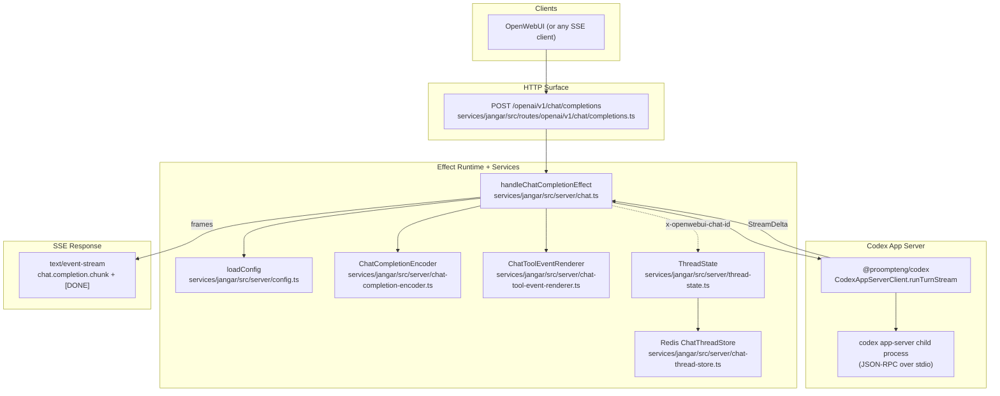

Jangar

OpenAI-compatible chat completions endpoint, operator UI, and control-plane surface backed by the Codex app-server.

## Architecture

Authoritative architecture index: `docs/jangar/application-architecture.md`.
Operational build/release contract: `docs/jangar/build-contract.md`.

Runtime boot is now explicit: `src/server/app.ts` only builds the HTTP surface, while `src/server/index.ts` and
`src/server/dev.ts` opt into startup behavior through `src/server/runtime-profile.ts`. The tech-debt program source of
truth lives in `docs/agents/designs/jangar-application-tech-debt-cleanup-plan-2026-04-08.md`.
The generated architecture inventory lives in `docs/jangar/architecture-inventory.md`.
The older `docs/jangar/current-state.md` note is historical context for the original chat-completions audit only.


```mermaid
flowchart TD
  subgraph Client["Clients"]
    OWU["OpenWebUI (or any SSE client)"]
  end

  subgraph HTTP["HTTP Surface"]
    Route["POST /openai/v1/chat/completions\nservices/jangar/src/routes/openai/v1/chat/completions.ts"]
  end

  subgraph Runtime["Effect Runtime + Services"]
    Handler["handleChatCompletionEffect\nservices/jangar/src/server/chat.ts"]
    Config["loadConfig\nservices/jangar/src/server/config.ts"]
    Encoder["ChatCompletionEncoder\nservices/jangar/src/server/chat-completion-encoder.ts"]
    ToolRenderer["ChatToolEventRenderer\nservices/jangar/src/server/chat-tool-event-renderer.ts"]
    ThreadState["ThreadState\nservices/jangar/src/server/thread-state.ts"]
    ThreadStore["Redis ChatThreadStore\nservices/jangar/src/server/chat-thread-store.ts"]
  end

  subgraph Codex["Codex App Server"]
    ClientLib["@proompteng/codex\nCodexAppServerClient.runTurnStream"]
    Child["codex app-server child process\n(JSON-RPC over stdio)"]
  end

  subgraph Stream["SSE Response"]
    SSE["text/event-stream\nchat.completion.chunk + [DONE]"]
  end

  OWU --> Route
  Route --> Handler
  Handler --> Config
  Handler --> ClientLib
  Handler --> Encoder
  Handler --> ToolRenderer
  Handler -. "x-openwebui-chat-id" .-> ThreadState
  ThreadState --> ThreadStore
  ClientLib --> Child
  ClientLib -->|StreamDelta| Handler
  Handler -->|frames| SSE
```

## Development

```bash
bun --cwd services/jangar run dev
```

### Local Jangar + remote cluster deps (Tilt)

From the repo root, run:

```bash
tilt up
```

This runs Jangar locally (Bun) and keeps `kubectl port-forward` sessions open to the remote cluster for:

- Postgres (CNPG `jangar-db`)
- Redis (OpenWebUI thread/worktree persistence)
- NATS (agent comms)
- ClickHouse (Torghut visuals)

Tilt uses your default kubeconfig/current context. If you need to change ports or disable optional deps:

```bash
# run Jangar on a different port
tilt up -- --jangar_port 3001

# avoid conflicts with a local Postgres
tilt up -- --db_local_port 15433

# disable optional forwards
tilt up -- --enable_redis=false --enable_nats=false --enable_clickhouse=false

# self-hosted embeddings (recommended if your DB schema uses vector(4096))
tilt up -- --openai_api_base_url http://127.0.0.1:11434/v1 --openai_embedding_api_base_url http://127.0.0.1:11434/v1 --openai_embedding_model qwen3-embedding-saigak:8b --openai_embedding_dimension 4096
```

Troubleshooting:

- If a port-forward fails with "address already in use", change the corresponding `*_local_port`.
- If you see "lost connection to pod" on a port-forward, Tilt will automatically retry.
- If a secret lookup fails, confirm your kube context has access to the `jangar` namespace.

### Local OpenWebUI end-to-end regression

Run the OpenWebUI browser regression against local Jangar:

```bash
bun --cwd services/jangar run test:e2e:openwebui
```

If you already have OpenWebUI running locally and want to reuse it instead of booting the disposable Docker stack:

```bash
bun --cwd services/jangar run test:e2e:openwebui:existing
```

What it does:

- starts disposable local `postgres` and `openwebui` containers via `services/jangar/docker-compose.yml`
- runs Jangar locally from the production build output (`bun .output/server/index.mjs`) instead of a dev server
- defaults to the deterministic mock Codex client (`OPENWEBUI_E2E_USE_MOCK_CODEX=1`) so the browser regression covers rich activity rendering without needing a real local Codex process
- uses an in-memory chat state backend inside the local Jangar Playwright web server so the regression does not depend on host Redis
- validates both the OpenAI-compatible streaming endpoint and the browser chat flow in OpenWebUI across multiple turns, including rich activity summaries, signed detail pages, and assistant error rendering

If you need to exercise the real local Codex CLI instead of the mock harness:

- set `OPENWEBUI_E2E_USE_MOCK_CODEX=0`
- point `JANGAR_CODEX_BINARY` at the host `codex` binary if it is not already on `PATH`
- optionally stage an isolated `CODEX_HOME` with `CODEX_AUTH_JSON` or `OPENWEBUI_E2E_CODEX_HOME` to avoid inheriting unrelated workstation MCP servers

## OpenWebUI rich detail links

For `chatClientKind === 'openwebui'`, Jangar can enrich the normal streaming transcript with signed markdown links to staged detail pages. This is the production no-fork path: OpenWebUI keeps consuming standard `delta.content` and `delta.reasoning_content`, and Jangar does not rely on OpenAI `tool_calls` for rich activity rendering.

Assistant prose stays inline. Larger activity payloads such as reasoning, plans, rate limits, tool output, usage, errors, and image previews are summarized in the transcript and can link to `/api/openwebui/rich-ui/render/$renderId`.

Enable the production detail-link path with:

- `JANGAR_OPENWEBUI_RICH_RENDER_ENABLED=true`
- `JANGAR_OPENWEBUI_EXTERNAL_BASE_URL=<browser-reachable Jangar origin>`
- `JANGAR_OPENWEBUI_RENDER_SIGNING_SECRET=<shared secret>`

`JANGAR_OPENWEBUI_EXTERNAL_BASE_URL` must resolve from the user's browser, not only from inside the cluster, because OpenWebUI renders those signed links directly. Signed detail URLs and staged render blobs use the same 7-day retention window, matching the current OpenWebUI chat/thread continuity horizon.

If the external base URL, signing secret, or render store is unavailable, Jangar falls back to text-only streaming for OpenWebUI without failing the turn.

The request header `x-jangar-openwebui-render-mode: rich-ui-v1` is experimental. It only enables `delta.jangar_event` emission and is not required for the production text-plus-links UX.

Optional overrides:

- `OPENWEBUI_PORT` (default `38080`)
- `OPENWEBUI_IMAGE` (defaults to `ghcr.io/open-webui/open-webui:v0.9.2` for the local E2E script; override to exercise another tag)
- `OPENWEBUI_BASE_URL` (used by `test:e2e:openwebui:existing`; defaults to `http://127.0.0.1:8080`)
- `OPENWEBUI_E2E_USE_MOCK_CODEX` (default `1`; set to `0` to run the browser regression against the real local Codex CLI)
- `JANGAR_MOCK_CODEX_SCENARIO` (defaults to `openwebui-e2e`)
- `JANGAR_CODEX_BINARY` (defaults to `codex`)
- `CODEX_AUTH_JSON` (defaults to `~/.codex/auth.json` when staging the isolated `CODEX_HOME`)
- `OPENWEBUI_E2E_CODEX_HOME` (defaults to `services/jangar/output/playwright/codex-home`)
- `JANGAR_MODELS` / `JANGAR_DEFAULT_MODEL` / `OPENWEBUI_E2E_MODEL` (default `gpt-5.6-sol`)

Requirements for the default mock-Codex path:

- Docker available for the disposable OpenWebUI and Postgres stack
- Bun dependencies installed for `services/jangar`

Additional requirements for the optional real-Codex path:

- host `codex` CLI installed and authenticated
- working OpenAI/Codex access for the configured model

## Scripts

```bash
bun --cwd services/jangar run build
bun --cwd services/jangar run preview
bun --cwd services/jangar run test
bun --cwd services/jangar run lint
bun --cwd services/jangar run tsc
bun --cwd services/jangar run dev:worker
bun --cwd services/jangar run start:worker
```

## Temporal worker notes

- API enqueue path: `JANGAR_BUMBA_TASK_QUEUE` (falls back to `TEMPORAL_TASK_QUEUE`, then `bumba`).
- Worker consume path: `JANGAR_WORKER_TEMPORAL_TASK_QUEUE` (falls back to `TEMPORAL_TASK_QUEUE`, then `jangar`).
- Production GitOps no longer deploys a separate `jangar-worker` Kubernetes Deployment or workspace PVC. Keep post-deploy checks scoped to `deployment/jangar`.
- Do not pin `TEMPORAL_WORKER_BUILD_ID` in manifests. Let the runtime derive `workflow-code@<digest>` from workflow code and then sync deployment routing after rollout.
- Post-rollout routing command:
  `bun run packages/scripts/src/jangar/sync-temporal-routing.ts --task-queue jangar --deployment-name jangar-deployment --migrate-stale-running`
- Incident recovery command (includes unversioned running workflows):
  `bun run packages/scripts/src/jangar/sync-temporal-routing.ts --task-queue jangar --deployment-name jangar-deployment --migrate-stale-running --migrate-unversioned-running`

## Agents-owned runtime admission

Agents now owns schedule reconciliation, AgentRun creation, runtime admission, runner status, and the
`/v1/control-plane/status` projection. Jangar should consume that Agents API for domain decisions; it no longer starts a
supporting-primitives scheduler/controller path, validates scheduler admission env, or injects launch-capable
Schedule/ConfigMap/CronJob resources.

Historical stage-clearance, passport, and proof-surface design notes remain under `docs/agents/designs/` for audit
context. Active rollout and verifier behavior must be changed in `services/agents`, `charts/agents`, or the Agents
GitOps app, then consumed from Jangar through the typed Agents clients.

## Account-scoped quant witness

Jangar exposes `/api/torghut/trading/control-plane/quant/account-witness` from
`docs/agents/designs/189-jangar-account-scoped-quant-witness-custody-and-route-reentry-2026-05-13.md`. The route
returns `jangar.quant-account-witness.v1` for a required `account` and `window`, with optional `strategy_id` and
account aliases. It separates aggregate latest-store health from the account/window latest store, classifies required
pipeline stages, and emits explicit `current`, `empty`, `stale`, or `timeout` route-warrant usability.

The route uses cached latest-store and pipeline-health rows only; it does not trigger on-demand materialization or start
the quant runtime. A slow account/window read returns a timeout witness inside the service budget so repair dispatch can
act on `quant_account_witness_timeout` without mistaking aggregate freshness for routeable account proof. The witness is
zero-notional evidence only: `capital_safety.max_notional` remains `0`, and Torghut must still clear proof floor, TCA,
source-serving, routeability, and live submission gates before capital can widen. Rollback is to stop consuming the
witness route and retain existing `/quant/health` diagnostics.

## Source rollout truth exchange

Control-plane status includes a `source_rollout_truth_exchange` projection from
`docs/agents/designs/148-jangar-source-rollout-truth-exchange-and-proof-floor-settlement-2026-05-07.md`. The reducer is
pure and uses evidence the status route has already collected: runtime-kit desired images, live pod image evidence,
controller witness quorum, route probe, database projection, watch cache, rollout health, and Torghut action-budget
proof-floor state. It does not call Argo, Torghut, GitHub, or Kubernetes again while building receipts.

Set `JANGAR_SOURCE_HEAD_SHA` (or `JANGAR_COMMIT`, `SOURCE_HEAD_SHA`, `GIT_COMMIT`, `COMMIT_SHA`) and
`JANGAR_GITOPS_REVISION` (or `ARGOCD_APP_REVISION`, `ARGOCD_REVISION`, `GITOPS_REVISION`) when the runtime has explicit
source and GitOps revision evidence. If those values are missing, `dispatch_normal`, `deploy_widen`, and `merge_ready`
receipts stay conservative instead of inferring rollout convergence from healthy pods alone. `serve_readonly` can remain
allowed on healthy route/database evidence, and `dispatch_repair` can remain allowed only when the controller heartbeat
is fresh enough to observe bounded repair work.

Material-action verdicts consume the matching truth-settlement receipt as an additional conservative signal. Source or
image lag downgrades normal dispatch to `repair_only` and holds deploy widening/merge readiness. A controller heartbeat
split holds material dispatch as `heartbeat_projection_split`. A Torghut proof floor that is `repair_only` or missing
keeps paper/live capital actions held or blocked while observation can remain open. Rollback is to ignore the status
section and remove it from material-action verdict input; no database schema or Kubernetes resource rollback is
required.

Control-plane status also exposes the observe-mode `repair_warrant_exchange` from
`docs/agents/designs/146-jangar-repair-warrant-exchange-and-schedule-debt-firebreak-2026-05-07.md`. The reducer turns
Torghut proof-floor blockers into bounded zero-notional repair warrants with `max_notional=0`, explicit validation
refs, closure requirements, expiry, and rollback target. Open warrant ids are included in material-action verdict
evidence refs, so a warrant can authorize repair evidence without widening paper or live capital by itself.

The exchange includes a four-hour `schedule_debt_window`. A later successful schedule job only supersedes earlier
errors when lane, source ref, image ref, and objective ref all match; unmatched or incomplete signatures remain open
debt. If open errors outnumber successes by more than two, or if schedule job collection fails, new repair warrants are
downgraded to `observe_only`. If watch reliability degrades, active non-critical warrants expire and read-only serving
remains governed by the existing route, database, dependency-quorum, and passport gates.

Rollback: keep the exchange in observe mode or ignore `repair_warrant_exchange` in material-action verdict consumers.
Existing dependency quorum, negative-evidence budgets, runtime admission passports, and action clocks remain the
fallback authority; no database, Kubernetes, or broker mutation is required.

Control-plane status also exposes the shadow `clearance_market_ledger` from
`docs/agents/designs/185-jangar-clearance-market-and-rollout-truth-settlement-2026-05-12.md`. The ledger is a compact
operator and deployer read model over existing status inputs. It names authority splits, retained failure debt windows
(`15m`, `6h`, and `7d`), rollout truth settlement, action-class clearance, zero-notional repair lots, and stage
admission posture without changing scheduler behavior.

The first rollout is projection-only. `dispatch_normal`, `deploy_widen`, and `merge_ready` stay held when execution
trust, rollout truth, AgentRun ingestion, Torghut proof, or controller authority disagree. `dispatch_repair` can remain
repair-only when the selected repair lot is zero-notional and cites a live warrant. The ledger gives implement, verify,
and deployer handoffs one `ledger_id` plus evidence refs instead of requiring operators to reconcile status sections by
hand.

Agents-owned schedule reconciliation consumes `clearance_market_ledger.stage_admission` when it evaluates runtime
admission. A non-`allow` stage admission blocks the launch in Agents before an AgentRun is created and reports the
clearance ledger id plus selected repair lot through Agents status/events. Launched AgentRuns are stamped with
`swarmClearanceMarketLedgerId`, `swarmClearanceMarketStageAdmissionId`, `swarmClearanceMarketStageDecision`, and
`swarmClearanceMarketSelectedRepairLotRef` so deployer handoffs can trace the exact market admission used.

Rollback: set `JANGAR_CLEARANCE_MARKET_ENABLED=false` to remove the ledger from the status payload. Existing
stage-clearance packets, material-action verdicts, runtime-admission passports, repair warrants, and source-rollout
truth remain the fallback authority. Scheduler admission rollback lives in the Agents controller/runtime admission
configuration, not in the Jangar deployment.

Control-plane status also emits `stage_credit_ledger` from
`docs/agents/designs/187-jangar-stage-credit-ledger-and-runner-slot-futures-2026-05-13.md`. The ledger is an
observe-mode account over stage-clearance packets and the clearance market: each stage/action pair receives an account,
a decision, reason codes, and any open `runner_slot_futures` proving the next runner slot is spendable. Runner capacity
debt from recent workflow failure reasons such as `FailedScheduling`, image-pull failures, mount failures, and
`WorkflowStepTimedOut` is priced into each material account through `runner_capacity_tax`, so normal launch stays held
until the capacity reason is cleared or a bounded repair path is selected.

Fire-time schedule runners refresh the same status payload before they create an AgentRun. When a current stage-credit
account and open runner-slot future exist, the runner stamps `swarmStageCreditLedgerId`,
`swarmStageCreditAccountId`, `swarmRunnerSlotFutureId`, and `swarmStageCreditDecision` onto the launch. In
`observe` or `shadow` mode, missing credit is recorded as warning evidence only. If `JANGAR_STAGE_CREDIT_LEDGER_MODE`
is set to `hold` or `enforce`, stale ledgers, held accounts, or missing open futures fail closed before AgentRun
creation. Rollback: set `JANGAR_STAGE_CREDIT_LEDGER_MODE=observe`; if status generation itself regresses, set
`JANGAR_STAGE_CREDIT_LEDGER_ENABLED=false`.

Control-plane status also emits `ready_truth_arbiter` from
`docs/agents/designs/188-jangar-ready-truth-arbiter-and-stage-credit-cutover-2026-05-13.md`. The arbiter is a
shadow read model over serving readiness, controller witnesses, workflow/job runtime adapters, execution trust,
stage credit, source-serving verdicts, repair-bid admission, and retained failure debt. It intentionally keeps
`/ready` as a serving probe: `serving_readiness=ok` can coexist with `material_readiness=hold` when Jangar can serve
read-only evidence but normal dispatch, deploy widening, or merge-ready claims lack current material authority.

The first rollout is projection-only. The arbiter emits one verdict id, action-class buckets, merge/deployer receipts,
and reason codes for the status surface; schedule runners and deploy gates do not consume it yet. Use
`ready_truth_arbiter.material_readiness` and the `merge_gate_receipt`/`deployer_receipt` reason codes when explaining
why a green PR or healthy pod is not yet materially safe to widen. Rollback is
`JANGAR_READY_TRUTH_ARBITER_MODE=observe`; if the read model itself is wrong, ignore the field and continue relying on
stage credit, clearance market, source-serving verdicts, runtime-admission passports, and repair-bid admission.

Control-plane status also emits `material_reentry_clearinghouse` from
`docs/agents/designs/192-jangar-material-readiness-reentry-clearinghouse-and-source-rollout-receipts-2026-05-13.md`.
The clearinghouse is an observe-mode read model over ready truth, source-serving verdicts, stage credit, repair-bid
admission, watch reliability, database health, and Torghut consumer evidence. It keeps `/ready` serving semantics
separate from material authority, but compresses each held or blocked action class into one primary
`material_reentry_receipt` with a required output receipt, validation commands, value gates, evidence refs, and rollback
target. This lets implement, verify, and deployer handoffs cite the next bounded receipt instead of replaying a long
reason-code list from multiple status sections. The Torghut alpha-readiness path is preserved as zero-notional repair:
when the revenue-repair queue ranks `routeable_candidate_count` first and repair-bid admission exposes a
promotion-custody dispatch ticket, the clearinghouse names that repair receipt while paper and live capital remain
blocked by existing material gates. Rollback is to ignore `material_reentry_clearinghouse`; scheduler admission,
runtime passports, stage credit, ready truth, and repair-bid admission continue to enforce the current safety posture.
The `/ready` response also projects the same revenue-repair business evidence at the top level as `business_state`,
`revenue_ready`, `repair_queue`, `top_repair_queue_item`, and `affected_value_gate` so mission ledgers and deployer
handoffs do not have to rehydrate the nested Torghut payload before naming the active repair-only blocker. These fields
are evidence only; they do not change HTTP readiness or enable paper/live capital.

Control-plane status also emits `authority_provenance_settlement` from
`docs/agents/designs/189-jangar-authority-provenance-settlement-and-rollout-reentry-windows-2026-05-13.md`. The
settlement journal is a shadow read model over controller heartbeat authority, AgentRun ingestion, watch health,
source/GitOps/image truth, database/schema health, workflow runtime evidence, stage credit, and Torghut capital
receipts. It names the winning authority, the current settlement state, action-class decisions, and any bounded
`dispatch_normal` reentry windows without changing scheduler admission in this PR.

Deploy verification requires the field to be present and well-formed by default, then prints the settlement id, state,
winner, deploy-widen decision, merge-ready decision, and reentry-window count. Held deploy decisions are reported but
only fail the verifier when `JANGAR_VERIFY_AUTHORITY_PROVENANCE_ENFORCED=true` or the settlement itself runs in
`evidence_mode=enforce`. Use the printed settlement summary in PR, NATS, and mission-ledger handoffs so deployers do
not have to rejoin controller, source, image, and Torghut evidence manually. Emergency verifier rollback is
`--skip-authority-provenance-verification` or
`JANGAR_VERIFY_AUTHORITY_PROVENANCE_SETTLEMENT=false`. Projection rollback is
`JANGAR_AUTHORITY_PROVENANCE_SETTLEMENT_MODE=observe`; if the payload itself regresses status generation, remove the
field and continue relying on ready truth, stage credit, source rollout truth, runtime-admission passports, and existing
material-action verdicts.

Control-plane status and `/ready` also emit `evidence_pressure_ledger` from
`docs/agents/designs/188-jangar-evidence-pressure-ledger-and-watch-backoff-governor-2026-05-13.md`. The ledger is an
observe-mode proof-transport budget below stage credit: Kubernetes watch 429s, controller replica splits, metrics-sink
failures, GitHub review-ingest missing refs, database evidence authority, and Torghut freshness debt become typed
pressure sources with TTLs, reason codes, and action-class decisions. Fire-time schedule runners refresh the same
status payload before creating scheduled AgentRuns and stamp `swarmEvidencePressureLedgerId`,
`swarmEvidencePressureDecision`, `swarmEvidencePressureReasonCodes`, and the watch backoff state on the launch. In
`observe` or `shadow` mode the runner records pressure as handoff evidence only; when
`JANGAR_EVIDENCE_PRESSURE_LEDGER_MODE=hold` or `enforce`, stale ledgers or held `dispatch_normal` budgets fail closed
before AgentRun creation while read-only status serving remains separate. Torghut freshness debt is priced from
`freshness_carry_ledger.jangar_pressure_refs` when present, so a fresh consumer-evidence receipt can still hold normal
dispatch if a current zero-notional freshness repair SLO names stale TCA, TA, empirical, market-context, quant, or
source-serving proof. Rollback is
`JANGAR_EVIDENCE_PRESSURE_LEDGER_MODE=observe`; if the payload itself regresses status generation, set
`JANGAR_EVIDENCE_PRESSURE_LEDGER_ENABLED=false` and continue relying on stage credit, ready-truth, clearance market,
source-serving verdicts, and runtime-admission passports.

Control-plane status also emits `terminal_debt_compaction_ledger` from
`docs/agents/designs/189-jangar-terminal-debt-compaction-and-repair-outcome-escrow-2026-05-13.md`. The first rollout is
observe-only: failed AgentRuns, Jobs, and Pods are grouped into active debt cohorts or retained audit cohorts using the
current workflow window. A clean 15 minute workflow window keeps old failed objects visible for handoff evidence without
letting them block deploy widening or merge-ready claims by themselves; fresh failures or collection errors remain
active debt and would hold `dispatch_normal`, `deploy_widen`, and `merge_ready`.

Rollback is `JANGAR_TERMINAL_DEBT_COMPACTION_MODE=observe`; if the payload itself regresses status generation, set
`JANGAR_TERMINAL_DEBT_COMPACTION_ENABLED=false`. The reducer does not mutate Kubernetes objects, database rows, or
schedule admission in this milestone.

## Lease reconciliation action clocks

Control-plane status projects shadow `reconciled_action_clocks` from the contract in
`docs/agents/designs/100-jangar-lease-reconciliation-clock-and-dispatch-expiry-contract-2026-05-06.md`. The reducer
consumes failure-domain leases, database health, rollout health, workflow reliability, watch reliability, and Torghut
empirical-service evidence, then emits one current clock per action class.

The first rollout is projection-only. It keeps `serve_readonly`, `dispatch_repair`, and `torghut_observe` independent
from material-action holds where possible, while `dispatch_normal`, `deploy_widen`, `merge_ready`, and
`torghut_capital` carry explicit `blocking_reason_codes`, `conflict_class`, `fresh_until`, repair actions, and rollback
targets when source-schema, rollout, workflow, or consumer proof evidence disagrees.

Rollback: revert the status projection or ignore `reconciled_action_clocks` consumers. The reducer does not change
schedule admission, requirement dispatch, or existing failure-domain lease enforcement in this release.

## Negative evidence router

Control-plane status exposes the `docs/agents/designs/111-jangar-negative-evidence-router-and-action-slo-budgets-2026-05-06.md`
router in observe mode. The `negative_evidence_router` field records the evidence epoch, positive and negative evidence
refs, and the source lease/status inputs. `action_slo_budgets` then scopes that evidence by action class:
`serve_readonly`, `dispatch_repair`, `dispatch_normal`, `deploy_widen`, `merge_ready`, `torghut_observe`,
`paper_canary`, `live_micro_canary`, and `live_scale`.

The router is not an enforcement switch yet. It keeps read-only serving independent from retained audit failures,
leaves bounded repair dispatch open where possible, downgrades normal dispatch during current runtime failure windows,
and holds or blocks Torghut capital budgets when market, quant, readiness, or rollout ambiguity evidence is negative.
Torghut consumers can read the filtered `torghut_action_slo_budgets` field without parsing deployer or engineer budgets.

Rollback: keep the router in observe mode and continue relying on failure-domain leases plus dependency quorum for
enforcement. If a budget is wrong, preserve the emitted evidence refs for audit and fix the reducer before enabling any
action-class enforcement.

## Controller witness receipts

Control-plane status exposes the
`docs/agents/designs/116-jangar-controller-witness-quorum-and-capital-activation-receipts-2026-05-06.md` witness
contract in shadow mode. The `control_plane_controller_witness` field separates serving-process controller state,
controller-process heartbeats, `agents-controllers` rollout evidence, watch epochs, and AgentRun ingestion freshness.

When the serving process is not the controller, a healthy controller heartbeat can satisfy controller self-report. If
only the controller deployment and watch epoch are current, Jangar records `controller_witness_split`, keeps bounded
repair dispatch available, and downgrades normal dispatch to `repair_only` until a controller-process ingestion
witness is current. Disabled component state from a non-authoritative process is not written as a heartbeat row, so it
cannot overwrite a current controller-process witness for the same component. A true AgentRun ingestion stall records
`controller_ingestion_stalled` and holds normal dispatch.

`material_action_activation_receipts` mirror each action SLO budget with controller witness refs, negative evidence
refs, max dispatch/runtime/notional limits, expiry, and rollback target. Rollback: keep the witness contract in shadow
mode and fall back to the existing dependency-quorum, failure-domain lease, and negative-evidence budget fields while
continuing to emit receipts for comparison.

## Material action verdict arbiter

Control-plane status also exposes the shadow verdict arbiter from
`docs/agents/designs/120-jangar-material-action-verdict-arbiter-and-clock-budget-parity-2026-05-06.md`.
`material_action_verdict_epoch` joins dependency quorum, negative-evidence SLO budgets, reconciled action clocks,
rollout health, controller witness, watch reliability, database projection, and empirical service state into one final
decision per material action. A green `reconciled_action_clock` cannot upgrade a held or blocked action SLO budget; a
disagreement keeps the stricter decision and records a contradiction ref. Paper and live Torghut capital actions use the
`torghut_capital` clock as diagnostic input, but their final verdicts stay held or blocked when the budget or dependency
quorum is stricter.

`material_action_activation_receipts` now cite the verdict epoch in transport refs and derive decisions, caps, repair
actions, and rollback targets from the final verdict when one is present. The first rollout remains shadow-only;
existing launcher, merge, deploy, and capital enforcement paths do not consume the verdict yet.

Rollback: ignore `material_action_verdict_epoch` and continue reading the existing dependency-quorum,
failure-domain-lease, action-SLO-budget, and controller-witness fields. If verdicts are too conservative or too
permissive, revert the status/receipt wiring while preserving the diagnostic inputs for incident review.

## Route-stable status snapshot escrow

Control-plane status emits the shadow route-stability escrow from
`docs/agents/designs/143-jangar-route-stable-status-snapshot-escrow-and-repair-actuation-windows-2026-05-07.md`.
`route_stability_escrow` binds the current status snapshot hash, live route probe attempt, controller witness,
database projection, watch reliability, and material-action verdicts into one short-lived repair authority object.

The first implementation is projection-only. A refused live status-route attempt leaves `serve_readonly`,
`dispatch_repair`, and `torghut_observe` available only when the snapshot is fresh, downgrades `dispatch_normal` to
`repair_only`, and holds or blocks deploy, merge, paper, and live capital actions. A stale snapshot removes fallback
authority for all non-serving actions. Rollout-derived controller authority can keep repair open, but it cannot
graduate normal dispatch without a live route and fresh controller-process witness authority.

`material_action_activation_receipts` cite the escrow id in both `route_stability_escrow_ref` and transport refs so
deployer and Torghut consumers can compare shadow route-stability authority with the existing material-action receipts.
Rollback: ignore `route_stability_escrow` consumers and continue relying on material-action receipts while keeping the
shadow snapshot evidence for incident analysis.

## Action custody receipts

Control-plane status emits observe-mode action custody receipts from
`docs/agents/designs/183-jangar-attested-action-custody-and-profit-window-admission-2026-05-08.md`. The
`action_custody_receipts` list wraps the strongest current evidence for each action class: material-action verdict,
controller witness, source-rollout truth, route-stability contract, retained workflow failure debt, and Torghut
consumer/profit-window evidence. The companion `ready_action_exchange` is the compact operator/deployer index over
those receipts.

The projection is intentionally not a new enforcement switch yet. It makes the custody decision explicit so serving
can stay open while unsafe material actions remain held. For example, `serve_readonly=allow` can coexist with
`dispatch_normal=hold`, `deploy_widen=hold`, `merge_ready=hold`, `paper_canary=hold`, and `live_scale=block` when the
controller self-report is missing or Torghut evidence is repair-only with `max_notional=0`.

Validation:

```bash
curl -fsS http://agents.agents.svc.cluster.local/v1/control-plane/status?namespace=agents | jq '.ready_action_exchange'
curl -fsS http://agents.agents.svc.cluster.local/v1/control-plane/status?namespace=agents | jq '.action_custody_receipts[] | {action_class,decision,blocking_debt_classes,receipt_id}'
```

Rollback: ignore `ready_action_exchange` and `action_custody_receipts` consumers, or remove the projection. Existing
material-action verdicts, route-stability escrow, repair-warrant exchange, runtime-admission passports, and Torghut
proof-floor/notional gates remain the fallback safety boundary.

## Material gate digest

`/ready` and `/v1/control-plane/status` emit the observe-mode `material_gate_digest` from
`docs/agents/designs/198-jangar-material-gate-digest-and-alpha-closure-carry-2026-05-14.md`. The digest is the bounded
material-readiness proof for launchers and deployers: serving readiness can remain `ok`, while material actions carry
their own `allow`, `hold`, `deny`, or `block` decision.

The digest carries `alpha_closure_carry` from Torghut's compact `alpha_repair_closure_board` consumer-evidence ref,
including board id, settlement market, selected hypothesis, active dedupe key, no-delta budget state, no-delta debt,
max notional, capital rule, release conditions, and validation refs. A consumed no-delta budget denies
`dispatch_repair` before another runner pod is created. `dispatch_normal`, deploy, merge, paper, and live action
classes remain held or blocked while Torghut reports `business_state=repair_only`, `revenue_ready=false`, or
`max_notional=0`.

Validation:

```bash
curl -fsS http://localhost:8080/ready | jq '.material_gate_digest'
curl -fsS http://agents.agents.svc.cluster.local/v1/control-plane/status?namespace=agents | jq '.material_gate_digest'
curl -fsS http://torghut.torghut.svc.cluster.local/trading/consumer-evidence | jq '.alpha_repair_closure_board'
```

Rollback: ignore `material_gate_digest` consumers and keep existing ready truth, stage clearance, repair-bid admission,
and material-action verdict consumers in control. Do not enable paper or live submission while Torghut remains
repair-only or the repair queue is non-empty.

## Verify trust foreclosure board

`/ready` and `/v1/control-plane/status` emit the observe-mode `verify_trust_foreclosure_board` from
`docs/agents/designs/201-jangar-verify-trust-foreclosure-and-alpha-repair-reentry-2026-05-14.md`. The board keeps
serving readiness separate from material authority: serving can be `ok` while plan, verify, source rollout, or Torghut
no-delta debt holds or denies material actions.

When Torghut publishes `alpha_repair_closure_board`, Jangar treats that compact closure ref as the alpha-repair reentry
source of truth before falling back to the older alpha-readiness conveyor or dividend refs. The foreclosure board uses
the closure board id, selected hypothesis, required settlement receipt, active dedupe key, no-delta budget state,
validation command, and rollback target so it matches `material_gate_digest.alpha_closure_carry` and denies duplicate
closure launches before another runner pod is created.

When Torghut publishes the newer `no_delta_repair_reentry_auction` ref, the verify-trust board uses that auction as the
first alpha-repair reentry authority. The auction carries the active no-delta release key, selected hypothesis, selected
value gate, selected ticket if a release condition changed, and the compact denial reason set from
`docs/agents/designs/201-jangar-verify-trust-foreclosure-and-alpha-repair-reentry-2026-05-14.md`. This keeps `/ready`
serving semantics unchanged while making material dispatch and handoff evidence name the same Torghut auction that
`/trading/revenue-repair` exposes.

Validation:

```bash
curl -fsS http://localhost:8080/ready | jq '.verify_trust_foreclosure_board'
curl -fsS http://agents.agents.svc.cluster.local/v1/control-plane/status?namespace=agents | jq '.verify_trust_foreclosure_board.alpha_repair_reentry_admission'
curl -fsS http://torghut.torghut.svc.cluster.local/trading/consumer-evidence | jq '.no_delta_repair_reentry_auction'
curl -fsS http://torghut.torghut.svc.cluster.local/trading/consumer-evidence | jq '.alpha_repair_closure_board'
```

Rollback: set `JANGAR_VERIFY_TRUST_FORECLOSURE_MODE=observe` or ignore `verify_trust_foreclosure_board` consumers.
Keep ready truth, revenue-repair settlement custody, material gate digest, and Torghut `max_notional=0` as the active
safety authorities.

## Controller-ingestion settlement

`/v1/control-plane/status` emits the observe-mode `controller_ingestion_settlement` from
`docs/agents/designs/205-jangar-controller-ingestion-settlement-and-verification-carry-cutover-2026-05-14.md`. The
settlement joins controller witness quorum, AgentRun ingestion, database and rollout health, execution trust,
source-serving verdicts, verify-trust foreclosure, repair-slot escrow, and Torghut no-delta carry evidence into one
material action decision. It keeps `/ready` as serving truth while full status names whether broad dispatch is allowed,
one controller-ingestion repair is admissible, or source-to-live carry must hold.

The first rollout is read-model only. `decision=repair_only` selects at most one zero-notional
`controller_ingestion` ticket when the controller witness is the only missing proof. Source-serving lag, missing
verify-carry fields, or Torghut `jangar_verification_carry_unavailable` stay `hold`; contradictory carry evidence or
nonzero notional stays `block`.

Validation:

```bash
curl -fsS 'http://agents.agents.svc.cluster.local/v1/control-plane/status?namespace=agents' | jq '.controller_ingestion_settlement'
curl -fsS http://torghut.torghut.svc.cluster.local/trading/revenue-repair | jq '.no_delta_repair_reentry_auction'
```

Rollback: ignore `controller_ingestion_settlement` consumers and keep ready truth, stage credit,
source-serving verdicts, verify-trust foreclosure, and Torghut no-delta/max-notional guards as the active safety
boundary. No database migration or scheduler enforcement is introduced by this projection.

## Material evidence settlement spine

`/ready` and `/v1/control-plane/status` should next emit the observe-mode
`material_evidence_settlement_spine` from
`docs/agents/designs/206-jangar-material-evidence-settlement-spine-and-repair-dispatch-budget-2026-05-14.md`. The
spine is the compact settlement layer over serving readiness, material readiness, Torghut revenue-repair topline
evidence, database witnesses, source-to-serving rollout facts, controller-ingestion settlement, and active versus
retained failure debt. It exists to distinguish transport gaps from business repair-only truth, then budget at most one
zero-notional repair lane while broad dispatch, deploy widening, merge-ready claims, and live capital remain held.

Validation:

```bash
curl -fsS http://localhost:8080/ready | jq '.material_evidence_settlement_spine'
curl -fsS 'http://agents.agents.svc.cluster.local/v1/control-plane/status?namespace=agents' | jq '.material_evidence_settlement_spine'
curl -fsS http://torghut.torghut.svc.cluster.local/trading/revenue-repair | jq '{business_state,top_repair_queue_item,repair_queue}'
```

Rollback: set `JANGAR_MATERIAL_EVIDENCE_SETTLEMENT_MODE=observe` or ignore
`material_evidence_settlement_spine` consumers and continue using ready truth, stage credit,
controller-ingestion settlement, terminal debt compaction, and Torghut max_notional=0 as authorities.

## Torghut stage-custody evidence

Design doc `docs/agents/designs/188-jangar-typed-torghut-evidence-admission-and-repair-dispatch-2026-05-13.md`
requires Jangar to expose typed Torghut custody evidence from the non-recursive `/trading/consumer-evidence` route.
Jangar requests `/trading/consumer-evidence?view=summary` when the configured Torghut status URL points at the
consumer-evidence route, so readiness gets the compact status, receipt, route-profit, and canary fields without
pulling the full operator ledger payload through the control-plane hot path.
When Torghut imports Jangar carry for that route, it calls `/v1/control-plane/status` with
`x-torghut-consumer-evidence-mode: omit`; Jangar then computes the local control-plane status without fetching Torghut
consumer evidence, which prevents a Torghut -> Jangar -> Torghut status loop.
When Torghut reports an evidence-clock arbiter but does not publish a `required_jangar_custody_ref`, control-plane
status attaches Jangar's current local `stage_clearance_packets[]` entry for the Torghut paper-capital lane to
`torghut_consumer_evidence.evidence_clock_custody_*`. A fresh held packet is reported as blocked custody with the
packet id; only absence of a local packet stays `missing`.

This is a status normalization, not a capital override. Paper and live Torghut actions still use material verdicts,
stage-clearance packets, repair warrants, and `max_notional=0` as their safety boundary. Rollback is to ignore the
normalized `evidence_clock_custody_*` fields or revert the attachment helper; the existing Torghut proof-floor and
notional gates continue to hold unsafe capital actions.

## Workspace storage proof

The supporting-primitives controller reconciles `Workspace` CRs by creating and reading the backing
`PersistentVolumeClaim` through the shared Kubernetes client resource map. This keeps workspace storage proof on the
same least-privilege typed path as schedules, swarms, and AgentRuns: a bound PVC sets the workspace phase to `Ready`,
a pending PVC keeps it `Pending`, and an expired workspace deletes the same PVC alias.

Validation: create or inspect a `Workspace` CR and confirm the controller can read the PVC without an
`unsupported kubernetes resource: persistentvolumeclaim` error. Rollback is to revert the workspace/PVC proof change or
temporarily disable the supporting controller; no CRD or data migration is involved.

## Deployment

```bash
bun run packages/scripts/src/jangar/build-image.ts
bun run packages/scripts/src/jangar/deploy-service.ts
```

The CI/CD source of truth is `docs/jangar/build-contract.md`. The runtime contract requires both `.output/public` and
`.output/server/index.mjs`, and manifest verification now reads image/digest expectations through the shared typed YAML
manifest contract in `packages/scripts/src/jangar/manifest-contract.ts`.

## API Notes

- `/openai/v1/chat/completions` supports both streaming SSE responses (`stream: true`) and OpenAI-style non-stream responses (`stream: false` or omitted).
- For OpenWebUI, the production rich-activity UX still rides on normal SSE text streaming: Jangar emits signed detail links inside standard `delta.content` and `delta.reasoning_content` frames, with no OpenWebUI patch and no OpenAI `tool_calls`.
- `x-jangar-openwebui-render-mode: rich-ui-v1` is optional and experimental; it only requests `delta.jangar_event` frames when OpenWebUI rich rendering is already enabled on the server.
- Authentication and rate limiting are intentionally disabled because this endpoint is for internal use only; place it behind your own network guardrails when exposing it.
- Usage totals are emitted only when the request includes `stream_options: { include_usage: true }`. The final SSE chunk (empty `choices` array) carries the normalized OpenAI-style `usage`, even when a turn ends with an upstream error or client abort.
- Server-side Effect services follow `Context.Tag + Layer` patterns; see `src/server/effect-services.md`.

## agentctl

`agentctl` is owned by the Agents service and targets the Agents API. Jangar no longer starts the CLI transport server
or embeds the Agents protobuf bundle in its application build. Use `docs/agents/agentctl.md` for operator commands and
Agents service connection settings.

## Terminal backend

Jangar terminals are intended to run against a dedicated terminal backend deployment (`jangar-terminal` in GitOps). The main Jangar service proxies session APIs to that backend.

- Main Jangar: set `JANGAR_TERMINAL_BACKEND_URL` to the backend service URL so session APIs are proxied.
- Terminal backend: set `JANGAR_TERMINAL_PUBLIC_URL` to the browser-accessible origin for terminal WebSockets.
- Terminal backend: set `JANGAR_TERMINAL_BACKEND_ID` (unique per pod) for session metadata and routing diagnostics.
- Optional: tune `JANGAR_TERMINAL_BUFFER_BYTES` (output replay buffer) and `JANGAR_TERMINAL_IDLE_TIMEOUT_MS` (auto-terminate idle sessions).

## MCP

Jangar exposes the Atlas MCP endpoint at `POST /mcp` (see `services/jangar/src/routes/mcp.ts`). The Codex app-server registers this endpoint as `threadConfig.mcp_servers.atlas` and registers Agents-owned memory tools through `threadConfig.mcp_servers.memories` (see `services/jangar/src/server/codex-client.ts`).

The Jangar MCP server provides Atlas indexing/search tools only:

- `atlas_index`: records repository file-version metadata for Atlas enrichment.
- `atlas_search`: searches Atlas enrichments.
- `atlas_code_search`: searches code chunks with file and line pointers.
- `atlas_stats`: returns Atlas table counts and ingestion stats.

Generic memory note persistence, retrieval, count, stats, and MCP tools are owned by the Agents service at `/v1/memory-notes*` and `/mcp`.

## Environment

- `JANGAR_MODELS` (comma-separated list; optional)
- `JANGAR_DEFAULT_MODEL` (optional)
- `JANGAR_REDIS_URL` (required only when using `x-openwebui-chat-id` thread persistence)
- `JANGAR_STATEFUL_CHAT_MODE` (optional; defaults to additive OpenWebUI transcript handling + reset-on-edit; set to `0` to disable it)
- `JANGAR_CHAT_KEY_PREFIX` (optional; defaults to `openwebui:chat`)
- `JANGAR_WORKTREE_KEY_PREFIX` (optional; defaults to `openwebui:worktree`)
- `JANGAR_TRANSCRIPT_KEY_PREFIX` (optional; defaults to `openwebui:transcript`)
- `JANGAR_OPENWEBUI_RICH_RENDER_ENABLED` (optional; enables OpenWebUI text-plus-links detail rendering in the standard SSE transcript)
- `JANGAR_OPENWEBUI_EXTERNAL_BASE_URL` (optional; browser-reachable Jangar origin used to build signed `/api/openwebui/rich-ui/render/$renderId` links)
- `JANGAR_OPENWEBUI_RENDER_SIGNING_SECRET` (optional; required with the external base URL to sign OpenWebUI detail links)
- `AGENTS_MCP_URL` (optional; defaults to `http://agents.agents.svc.cluster.local/mcp`)
- `JANGAR_ATLAS_MCP_URL` (optional; defaults to `http://127.0.0.1:$PORT/mcp`)
- `JANGAR_MCP_URL` (deprecated alias for `JANGAR_ATLAS_MCP_URL`)
- `DATABASE_URL` (required for Atlas storage)
- `PGSSLMODE` (optional; defaults to `require`; Jangar does not support `sslrootcert` URL params for Bun’s Postgres client)

Control-plane cache freshness (API read path):

- `JANGAR_CONTROL_PLANE_CACHE_STALE_SECONDS` (optional; default: `120`)
  - Number of seconds a cached row is considered fresh.
- `JANGAR_CONTROL_PLANE_CACHE_ALLOW_STALE` (optional; default: `true`)
  - Set to `false`/`0` to force live Kubernetes reads when cache rows exceed the freshness window.

AgentRun ingestion and controller reconciliation are owned by `services/agents`.
Jangar reads the Agents service status surface and does not configure controller
resync, adoption, or debug loops directly.

Execution trust is now a mandatory part of `/v1/control-plane/status` and `/ready`.
Tracked swarm selection and response fan-out remain configurable via:

- `JANGAR_CONTROL_PLANE_EXECUTION_TRUST_SWARMS` (optional comma list; default: `jangar-control-plane,torghut-quant`)
- `JANGAR_CONTROL_PLANE_EXECUTION_TRUST_SUMMARY_LIMIT` (optional; default: `20`)

Rollout safety now also uses gate thresholds for watch stability and empirical jobs:

- `JANGAR_TORGHUT_STATUS_TIMEOUT_MS` (optional; default: `15000`, max: `30000`)
  - Timeout for the Torghut `/trading/status` request used to populate `empirical_services`.
- `JANGAR_CONTROL_PLANE_WATCH_RELIABILITY_BLOCK_ERRORS` (optional; default: `6`)
  - Blocks dependency quorum when watch stream errors cross this threshold in the latest reliability window.
- `JANGAR_CONTROL_PLANE_WATCH_RELIABILITY_BLOCK_RESTARTS` (optional; default: `3`)
  - Blocks dependency quorum when any observed watch stream restarts cross this threshold in the latest reliability window.
- `empirical_jobs` hard gate:
  - `status` is now a hard block when `/v1/control-plane/status` reports `empirical_services.jobs.status === degraded`.
  - Forecast and LEAN degradation remain observable but do not block rollout.

Failure-domain lease shadow synthesis is exposed on `/v1/control-plane/status` as
`failure_domain_leases`:

- `mode` is `shadow`; the lease set is advisory and does not block AgentRun admission by itself.
- `lease_set_digest` gives deployers one compact proof handle for the current database, route, rollout,
  registry, storage, workflow artifact, NATS, and source-schema evidence.
- `holdbacks[]` maps the leases to action classes such as `dispatch_normal`, `dispatch_repair`,
  `deploy_widen`, `merge_ready`, `torghut_observe`, and `torghut_capital`.
- Optional route probing can be enabled with `JANGAR_CONTROL_PLANE_ROUTE_PROBE_ENABLED=true` or an explicit
  `JANGAR_CONTROL_PLANE_ROUTE_HEALTH_URL`; without that, the route lease records the current status response
  path as its shadow evidence.
- `JANGAR_FAILURE_DOMAIN_EVIDENCE_NAMESPACES` can add comma-separated namespaces to the read-only pod/event
  evidence collector. The default evidence namespaces are the requested control-plane namespace and `jangar`.

The status payload always includes:

- `execution_trust`
- `swarms`
- `stages`

`execution_trust.status` will be one of `healthy`, `degraded`, `blocked`, or `unknown`.
If a swarm remains `Frozen` after `freeze.until` has passed, execution trust now reports
`freeze expiry unreconciled` as a degraded repair state instead of an active hard stop.
`/ready` returns `503` only when execution trust is `blocked` or `unknown`;
degraded execution trust remains visible in the response body while the pod stays ready to serve.

## Control-plane cache freshness behavior

When cache reads are enabled for typed Agents `/v1/<resource>/resources` endpoints, responses may include a `cache`
object:

- `source: "control-plane-cache"`
- `stale`: `true` when row age is above `JANGAR_CONTROL_PLANE_CACHE_STALE_SECONDS`
- `fresh`: negation of `stale` in list and per-item metadata
- `age_seconds`: age in seconds (or `null` when cache timestamp unavailable)
- `max_age_seconds`: configured stale window
- `checked_at`: server-side cache-check timestamp
- `as_of`: original cache row timestamp when present
- `OPENAI_API_KEY` (API key used for embedding calls; required for hosted OpenAI, optional for self-hosted OpenAI-compatible endpoints like Ollama)
- `OPENAI_API_BASE_URL` / `OPENAI_API_BASE` (optional; defaults to `https://api.openai.com/v1`)
- `OPENAI_EMBEDDING_API_BASE_URL` (optional; override specifically for embeddings. Use the Saigak `/v1` proxy for deployed self-hosted embeddings with `qwen3-embedding-saigak:8b`.)
- `OPENAI_EMBEDDING_MODEL` (optional; defaults to `text-embedding-3-small` on OpenAI, or `qwen3-embedding-saigak:8b` for self-hosted bases)
- `OPENAI_EMBEDDING_DIMENSION` (optional; defaults to `1536` on OpenAI, or `4096` for the self-hosted model)
- `OPENAI_EMBEDDING_TIMEOUT_MS` (optional; defaults to `15000`)
- `OPENAI_EMBEDDING_MAX_INPUT_CHARS` (optional; defaults to `60000`)
- With pgvector `0.8.0`, ANN indexes (`ivfflat` / `hnsw`) cannot be created above `2000` dimensions. The 4096d self-hosted path uses plain `vector(4096)` columns without ANN indexes.
- `JANGAR_BUMBA_TASK_QUEUE` (optional; API queue for enqueued Bumba workflows)

### Flamingo completions with Saigak embeddings

To use Flamingo for completions and the self-hosted embeddings model on `saigak`:

```bash
export OPENAI_API_BASE_URL='http://flamingo.flamingo.svc.cluster.local/v1'
export OPENAI_EMBEDDING_API_BASE_URL='http://saigak.saigak.svc.cluster.local:11434/v1'
export OPENAI_EMBEDDING_MODEL='qwen3-embedding-saigak:8b'
export OPENAI_EMBEDDING_DIMENSION='4096'
# OPENAI_API_KEY is optional for these in-cluster OpenAI-compatible endpoints
```
